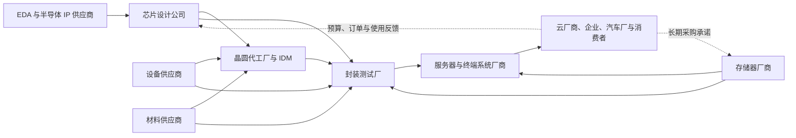

# 半导体行业供需周期分析

分析日期：2026-07-17 12:47:29 +08:00

地理范围：全球产业链，重点观察美国、中国大陆、中国台湾、韩国、欧洲与日本

数据时效：经营数据截至 2026 年 5 月或各公司 2026 年第二季度最新披露；资本市场数据截至 2026-07-16

行业边界：覆盖 EDA/IP、芯片设计、晶圆制造、存储、半导体设备与材料、封装测试，以及直接购买芯片的系统与云计算客户；服务器整机、PCB、电力与液冷仅作为需求载体，不计入半导体行业收入

> **阅读路线**
>
> - 第一次看半导体：先读第 0、1、4、5、9、10 节，先弄清行业怎么赚钱、哪里紧、如何验证。
> - 熟悉产业与市场：重点读每节的“进阶视角”、第 5 节的历史周期对照、第 6—8 节及附录 A—C。

## 0. 一页看懂

### 这个行业是做什么的

半导体行业把软件功能和计算需求变成可量产的芯片。芯片设计公司定义功能，EDA/IP 供应商提供设计工具和可复用模块，晶圆厂把电路制造在硅片上，封装测试厂完成互连、保护和筛选，最终由云厂商、服务器厂、汽车厂和消费电子厂付款。行业利润并不平均分布：当先进制程、HBM 和先进封装同时受限时，掌握稀缺工艺与合格产能的一端议价更强；标准化成熟产品即使销量回升，也可能因库存和同质化产能而难以提价。[E17][E3][E6]

### 三个最重要的数字

| 数字 | 截止期间 | 它回答什么问题 | 结论 |
|---|---|---|---|
| 全球半导体销售额 **1,206 亿美元** | 2026 年 5 月，三个月移动平均 | 总需求是否仍在扩大 | 同比增长 104.1%，环比增长 9.2%，行业总额仍强，但该口径会平滑月度拐点 [E1] |
| 台积电二季度收入 **402.0 亿美元**、毛利率 **67.7%** | 2026 年第二季度 | 先进制造是否把订单兑现为利润 | 收入环比增长 12%，高性能计算占收入 66%，先进制造的利润兑现仍强 [E2][E3] |
| 英伟达数据中心收入 **752 亿美元** | 截至 2026-04-26 的财季 | AI 需求是否仍由真实采购支撑 | 同比增长 92%、环比增长 21%，云端计算采购仍是本轮最强需求源 [E5] |

### 当前判断

- **周期位置**：结构性短缺与扩产并行。AI 计算相关的先进逻辑、HBM 和先进封装处于利润兑现及供给追赶阶段；成熟制程呈工业复苏、汽车温和、消费分化，不能概括为全行业短缺。[E3][E4][E6][E10][E11]
- **最紧约束**：已通过客户认证的先进封装与先进制程产能，而不是厂房面积本身。台积电明确表示封装产能限制客户增长，同时先进工艺从开发到量产需要多年。[E4]
- **利润流向**：短期集中在高端计算芯片、HBM、先进晶圆制造及关键设备；成熟产品厂商受益于收入恢复，但库存天数仍高，利润弹性弱于先进链。[E3][E6][E7][E11]
- **最大风险**：客户为争抢产能重复下单，或终端算力投资回报不及预期，使当前订单强度高估最终消耗。台积电管理层已提示会对客户汇总需求做折减和自下而上核验。[E4]
结论状态：暂定。产业经营证据较强，但行业估值历史分位、ETF 份额时间序列和跨市场统一资金流口径仍有缺口。
- **置信度**：中等偏高。对先进链供需偏紧判断较有把握；对持续时长和市场已定价程度仅给中等把握。

## 1. 产业链地图

图中实线表示技术、晶圆或封装后芯片的交付方向，虚线表示预算和订单反馈。设备、材料是制造与封装的平行输入，不能被画成制造之后的连续产品环节。[E17]

### 1.1 钱、订单与产品怎么流

谁最终付款取决于应用：云厂商和企业为 AI 服务器及云服务付款，汽车厂为车规芯片付款，消费者通过手机、电脑和家电间接付款。系统厂把整机预算拆成加速器、CPU、存储和网络芯片订单；设计公司再向晶圆厂和封装厂购买合格产能。设备与材料商拿到的是制造商资本开支和耗材预算，通常领先于新增晶圆产出，但不等于这些产能已经通过客户认证。[E4][E5][E8]

### 1.2 各环节详解

#### 1.2.1 EDA 与半导体 IP

**它是干什么的**：出售芯片设计、验证软件和可复用处理器或接口IP，是设计进入制造前的工具层，不直接生产芯片。

**向谁采购**：向云计算、软件开发、验证平台和专业人才市场采购计算资源、工具组件与研发能力。

**卖给谁**：向无晶圆厂设计公司、IDM、系统厂和自研芯片团队销售许可、订阅及项目服务。

**怎么赚钱、议价能力**：收入主要来自许可、订阅和按项目计费；先进节点复杂度与高转换成本使头部工具商议价较强。

**为什么会卡住**：客户研发预算、项目数量、工具链兼容和先进工艺验证能力会限制需求兑现。
这个环节出售设计软件、验证工具和可复用的处理器、接口等知识产权。收入多来自许可、订阅和按项目计费，受芯片设计项目数量、先进节点复杂度和客户研发预算驱动。它是设计进入制造前的工具层，不生产芯片。[E18]

| 代表企业 | 上市地/代码 | 角色 | 观察意义 | 证据 |
|---|---|---|---|---|
| Synopsys | 纳斯达克 / SNPS | EDA、半导体 IP 与仿真 | 先进节点设计复杂度与研发投入的代理指标 | E18 |
| Cadence | 纳斯达克 / CDNS | EDA 与系统设计软件 | 设计活动和验证需求的代理指标 | E18 |
| Arm | 纳斯达克 / ARM | 处理器架构与 IP 授权 | 终端与数据中心架构迁移的观察点 | E18 |

**进阶视角**：EDA收入领先芯片出货且受合同节奏影响，本报告将其作为设计复杂度的结构指标而非短周期同步指标（E18）。

**进阶论证**
- **口径陷阱**：EDA 公司收入增长不能直接等同于当期芯片出货增长，许可合同、续费节奏和研发项目前置期会造成错位。
- **当前最尖锐的争议**：AI 芯片自研会扩大第三方设计工具需求，还是大型客户内部工具与定制流程会削弱外部工具商增量。
- **本报告站哪边**：偏向前者，但不把 EDA 增速当作短周期同步指标。
- **依据**：先进节点验证复杂度上升是确定方向，Synopsys 对自身业务的定位支持工具层不可缺失；尚缺同口径项目数数据，因此只用于结构判断。[E18]

#### 1.2.2 芯片设计公司

**它是干什么的**：把算力、连接和模拟控制需求转成可制造版图，并承担架构、软件生态与客户导入。

**向谁采购**：向EDA和IP厂商采购设计工具

**卖给谁**：向晶圆代工、存储和封装厂采购制造与交付能力。

**卖给谁**：向云厂商、服务器厂、汽车电子、消费终端和工业客户销售芯片、板卡或计算平台。

**怎么赚钱、议价能力**：通过芯片与平台销售获得产品毛利，性能、软件生态和稀缺产能决定议价；晶圆及封装成本形成约束。

**为什么会卡住**：先进晶圆、HBM、封装、功耗和客户实际变现任何一项不足，都会限制订单转成可持续收入。
设计公司把算力、连接、模拟控制等需求变成可制造的版图，并承担架构、软件生态和客户导入。无晶圆厂公司把制造与封装外包，其毛利取决于产品性能、软件锁定、晶圆成本和供货能力。当前 AI 加速器订单是最强拉动项，英伟达数据中心收入提供了真实采购证据。[E5]

| 代表企业 | 上市地/代码 | 角色 | 观察意义 | 证据 |
|---|---|---|---|---|
| NVIDIA | 纳斯达克 / NVDA | AI 加速器与计算平台 | 云端 AI 资本开支转成芯片收入的核心样本 | E5 |
| AMD | 纳斯达克 / AMD | CPU、GPU 与自适应计算 | 第二供应源与平台竞争强度 | E5 |
| Broadcom | 纳斯达克 / AVGO | 定制计算、网络与连接芯片 | 定制 ASIC 和数据中心网络需求 | E5 |

**进阶视角**：当前AI采购已由收入验证，但重复预订和客户折旧压力仍需跟踪，因此不能把高增速线性外推（E5、E4）。

**进阶论证**
- **口径陷阱**：芯片公司“数据中心收入”可能包含网络、软件或系统，不能全部视作晶圆需求；订单也可能包含客户争抢产能形成的重复预订。
- **当前最尖锐的争议**：AI 训练与推理收入增长能否覆盖持续上升的基础设施折旧和电力成本。
- **本报告站哪边**：确认当前采购仍强，但不外推为无限期线性增长。
- **依据**：英伟达数据中心收入同比和环比均显著增长；台积电同时提示会折减客户汇总需求，说明供应链自身也防范需求重算。[E5][E4]

#### 1.2.3 晶圆代工与 IDM

**它是干什么的**：把设计版图制造成晶圆电路，并通过工艺、良率和客户认证形成可销售的有效产能。

**向谁采购**：向设备、硅片、光刻胶、电子气体、掩膜和厂务工程供应商采购制造投入。

**卖给谁**：向无晶圆厂设计公司、系统厂和自有产品部门交付不同工艺节点的合格晶圆。

**怎么赚钱、议价能力**：按晶圆和工艺服务收费；领先节点、稳定良率和认证产能具有溢价，爬坡与折旧会压缩新增厂利润。

**为什么会卡住**：设备装机、工艺成熟、良率、光罩、客户认证和封装配套必须共同到位，公告投资不能直接成为供给。
晶圆制造把设计版图转成硅片上的电路。有效供给不仅是设备数量，还包括工艺成熟度、良率、客户认证、光罩和封装配套。代工厂按晶圆与工艺服务收费；IDM 同时设计并制造自有产品。台积电二季度 7 纳米及更先进节点占晶圆收入 77%，高性能计算占 66%，显示利润集中在先进制造。[E3]

| 代表企业 | 上市地/代码 | 角色 | 观察意义 | 证据 |
|---|---|---|---|---|
| TSMC | 台湾证券交易所 / 2330；纽约证券交易所 / TSM | 全球晶圆代工 | 先进制程价格、产能与客户组合 | E4 |
| Samsung Electronics | 韩国交易所 / 005930 | 存储、逻辑与晶圆代工 IDM | 先进代工利用率与存储协同 | E4 |
| Intel | 纳斯达克 / INTC | 处理器 IDM 与外部代工 | 新增先进制造供给的兑现程度 | E4 |
| Texas Instruments | 纳斯达克 / TXN | 模拟与嵌入式 IDM | 成熟制程工业、汽车需求和库存周期 | E4 |

**进阶视角**：资本开支到量产至少经过装机、投片、良率爬坡和认证，2026年先进产能紧张不能用公告产能直接反驳（E4）。

**进阶论证**
- **口径陷阱**：宣布资本开支、装机、投片、良率爬坡和客户量产是五个不同阶段，不能把投资额直接换算成当期可销售晶圆。
- **当前最尖锐的争议**：高额扩产会快速缓解短缺，还是先进工艺与海外厂爬坡使供给释放慢于需求。
- **本报告站哪边**：未来供给会增加，但 2026 年内已认证先进产能仍偏紧。
- **依据**：台积电将 2026 年资本开支上调至 600—640 亿美元，同时说明领先工艺从开发到量产需要五年以上，海外厂和 2 纳米爬坡还会稀释毛利。[E4]

#### 1.2.4 存储器

**它是干什么的**：制造DRAM、NAND和HBM，为处理器与系统提供工作内存、长期存储及高带宽数据供给。

**向谁采购**：向半导体设备、晶圆材料、化学品、封装基板和测试设备商采购制造及堆叠投入。

**卖给谁**：向云与服务器厂、手机和PC品牌、汽车电子及芯片平台商销售标准存储和HBM。

**怎么赚钱、议价能力**：标准存储依靠位元成本与价格周期获利，HBM另有堆叠、良率和认证溢价；供给纪律决定议价。

**为什么会卡住**：DRAM晶圆、堆叠设备、先进封装良率和客户认证共同约束HBM，任一环节扩产都不能单独形成有效供给。
存储厂制造 DRAM、NAND 和高带宽内存。普通存储更接近大宗周期品，价格受供给纪律和库存影响；HBM 还叠加先进封装、堆叠良率与客户认证。美光第三财季收入和毛利率大幅上升，并已出货 HBM4，说明 AI 相关存储进入强利润兑现期。[E6]

| 代表企业 | 上市地/代码 | 角色 | 观察意义 | 证据 |
|---|---|---|---|---|
| Micron | 纳斯达克 / MU | DRAM、NAND、HBM | 美元口径存储价格、利润与资本开支 | E6 |
| SK hynix | 韩国交易所 / 000660 | DRAM、NAND、HBM | HBM 供给和客户认证 | E6 |
| Samsung Electronics | 韩国交易所 / 005930 | DRAM、NAND、HBM | 行业最大供给方之一的产能纪律 | E6 |

**进阶视角**：2026年HBM仍受认证和封装约束，但设备投入已加速，2027年后必须用价格与库存检验过剩风险（E6、E8）。

**进阶论证**
- **口径陷阱**：收入增长可能由价格而非位元出货驱动；HBM 收入也不能直接换算为独立晶圆产能，因为它占用 DRAM 晶圆、堆叠和封装多重资源。
- **当前最尖锐的争议**：HBM 高利润会不会诱发与 2022 年相似的过度扩产。
- **本报告站哪边**：2026 年供给仍受认证与封装约束，但 2027 年后过剩风险上升。
- **依据**：美光已进入 HBM4 量产且计划 2027 年放量 HBM4E；SEMI 预计 2026 年 DRAM 设备销售增长 39%，供给投入正在加速。[E6][E8]

#### 1.2.5 封装测试

**它是干什么的**：把晶圆切割、互连、封装并筛选成可交付芯片，先进封装还承担多芯粒与HBM协同。

**向谁采购**：向封装设备、基板、中介层、键合材料、测试机和散热材料厂采购关键投入。

**卖给谁**：向芯片设计公司、IDM、服务器和系统厂交付通过良率与可靠性认证的成品芯片。

**怎么赚钱、议价能力**：传统封装赚加工费，先进封装依靠复杂互连、良率和客户认证获得更高单价与议价能力。

**为什么会卡住**：设备理论产出还需扣除产品组合、良率、基板和客户认证损耗，面积增长不等于合格封装增长。
封装测试把晶圆切割、互连、封装并筛选成可交付芯片。传统封装较标准化，先进封装则需要高密度互连、硅中介层和多芯粒协同，客户认证与良率决定其有效产能。台积电称封装能力已经限制客户增长，是当前产业链最明确的瓶颈信号。[E4]

| 代表企业 | 上市地/代码 | 角色 | 观察意义 | 证据 |
|---|---|---|---|---|
| ASE Technology | 台湾证券交易所 / 3711；纽约证券交易所 / ASX | 封装与测试 | OSAT 利用率和先进封装投入 | E4、E19 |
| Amkor Technology | 纳斯达克 / AMKR | 封装与测试 | 先进封装利用率与外包需求 | E4、E19 |
| TSMC | 台湾证券交易所 / 2330；纽约证券交易所 / TSM | CoWoS 等先进封装 | AI 加速器与 HBM 的关键互连能力 | E4、E19 |

**进阶视角**：封装已被客户披露为增长约束，瓶颈更接近复杂度与协同能力而非单纯设备数量，只能逐步缓解（E4、E19）。

**进阶论证**
- **口径陷阱**：厂商公布的封装“产能”可能是设备理论产出，真正可交付量还要扣除产品组合、良率和认证损耗。
- **当前最尖锐的争议**：封装瓶颈是短期设备不足，还是客户产品复杂度提升导致的持续结构约束。
- **本报告站哪边**：偏向结构约束，设备扩张只能逐步缓解。
- **依据**：台积电把封装列为客户增长约束；Amkor 一季度先进封装利用率改善，说明订单正在向可用产能集中。[E4][E19]

#### 1.2.6 设备与材料

**它是干什么的**：提供光刻、沉积、刻蚀、检测、测试与封装设备，以及硅片、光刻胶、气体和掩膜等材料。

**向谁采购**：向精密光学、真空、运动控制、特种化学品、电子元件和工程服务商采购关键部件。

**卖给谁**：向晶圆代工、IDM、存储厂和封测厂销售设备、材料、安装升级与维护服务。

**怎么赚钱、议价能力**：通过设备销售、耗材和装机服务获利；技术认证和高转换成本增强议价，但收入确认滞后于接单与出货。

**为什么会卡住**：关键零部件、客户安装验收、出口许可和材料纯度会限制交付，设备预测不能直接换算成晶圆产能。
设备商提供光刻、沉积、刻蚀、检测、测试和封装设备；材料商提供硅片、光刻胶、电子气体、掩膜等平行投入。它们主要从制造商资本开支获利，订单通常领先于晶圆产出。SEMI 预计 2026 年全球半导体设备销售额 1,659 亿美元，但这是预测，不是已确认收入。[E8]

| 代表企业 | 上市地/代码 | 角色 | 观察意义 | 证据 |
|---|---|---|---|---|
| ASML | 阿姆斯特丹泛欧交易所 / ASML；纳斯达克 / ASML | EUV 与 DUV 光刻设备 | 先进与成熟节点扩产的关键设备约束 | E8 |
| Applied Materials | 纳斯达克 / AMAT | 沉积、材料工程与封装设备 | 晶圆厂资本开支广度 | E8 |
| Lam Research | 纳斯达克 / LRCX | 刻蚀与沉积设备 | 存储和先进逻辑扩产强度 | E8 |
| Shin-Etsu Chemical | 东京证券交易所 / 4063 | 硅片与半导体材料 | 材料利用率和晶圆投片趋势 | E8 |

**进阶视角**：先进设备属于短期补缺，存储设备扩张则可能放大后续供给，需用2027年价格和库存检验（E7、E8）。

**进阶论证**
- **口径陷阱**：设备厂接单、出货、安装、客户验收和收入确认存在时间差，设备销售预测也不能直接当作制造产能增量。
- **当前最尖锐的争议**：2026—2028 年设备扩产是健康补缺，还是在需求被高估时放大未来过剩。
- **本报告站哪边**：先进设备短期补缺，存储设备增速则需要用 2027 年价格和库存检验。
- **依据**：ASML 计划 2027 年提高 EUV 与浸没式 DUV 能力，SEMI 同时预计 DRAM 和 NAND 设备高增长，供给反应已从订单转入设备能力扩张。[E7][E8]

### 1.3 钱怎么流：利益传导

| 问题 | 回答（必须点名具体环节和企业，禁止通用套话） | 证据 | 缺口 |
|---|---|---|---|
| 谁最终付款？ | AI 场景由云厂商、互联网平台和企业客户付款；汽车芯片由车厂付款；手机、电脑和家电芯片最终由消费者间接付款。 | [E5][E11] | 不同应用场景的最终付款方不能合并成单一买家。 |
| 利润当前集中在哪个环节，为什么？ | 短期主要集中在高端计算芯片、HBM、先进晶圆制造和关键设备；这些环节的认证、良率和合格产能更稀缺。 | [E3][E4][E6][E7] | 不同公司的毛利率口径不可直接横比。 |
| 谁承担资本开支和库存风险？ | 台积电等晶圆厂、美光等存储器厂以及封装厂承担扩产、爬坡和库存风险；设备商则承担客户资本开支周期反转导致的订单风险。 | [E3][E4][E6][E7] | 先进封装单项库存和利用率披露有限。 |
| 谁有定价权，凭什么？ | 当前高端计算芯片、HBM 与已认证的先进制造和封装产能定价权更强，因为客户切换、工艺验证和良率爬坡都需要时间；标准化成熟产品因库存和同质化产能议价较弱。 | [E3][E4][E6][E11] | 需继续跟踪交期、合同价和客户认证进度。 |

订单与预算流：终端真实需求 -> 云厂商、企业、车厂与消费者预算 -> 服务器与终端系统订单 -> 芯片和存储订单 -> 晶圆与封装产能订单 -> 设备与材料订单。

## 2. 需求

### 2.1 需求来源与付款人

| 需求场景 | 谁最终付款 | 采购对象 | 最新信号 | 判断 |
|---|---|---|---|---|
| AI 训练与推理 | 云厂商、互联网平台、企业客户 | 加速器、CPU、HBM、网络芯片 | 英伟达数据中心季度收入 752 亿美元，环比增长 21% [E5] | 强，且已兑现为收入 |
| 通用云与企业服务器 | 云厂商、企业 IT 部门 | CPU、DRAM、NAND、连接芯片 | 美光云存储和核心数据中心业务毛利率均超过 80% [E6] | 强，但价格贡献较大 |
| 工业自动化 | 工业设备厂与终端企业 | 模拟、MCU、功率和连接芯片 | 德州仪器工业收入同比约增 30%、环比约增 20% [E11] | 从低位恢复 |
| 汽车电子 | 汽车厂与消费者 | MCU、模拟、功率、存储 | 德州仪器汽车收入同比中个位数增长、环比持平 [E11] | 温和，不是本轮最强项 |
| 手机与个人电脑 | 消费者和企业 | 应用处理器、存储、射频与电源芯片 | 台积电智能手机收入环比下降 3%，消费电子环比上升 22% [E3] | 产品间分化 |

需求不能只看终端出货量。AI 服务器的单机芯片价值量、HBM 容量和先进封装面积上升，会让半导体收入增速显著快于服务器台数；反过来，存储价格上涨也会在位元出货不变时推高行业销售额。[E5][E6][E9]

**进阶视角**

- **口径陷阱**：SIA 月度销售额是三个月移动平均，并同时受数量、价格和产品组合影响；WSTS 的高增长预测尤其受存储价格假设影响。[E1][E9]
- **当前最尖锐的争议**：AI 采购是可持续的计算需求，还是大型客户为竞争地位提前锁单形成的资本开支泡沫。
- **本报告站哪边**：当前需求真实，但增速不能线性外推。
- **依据**：英伟达、台积电和美光均已把需求转成收入与利润；台积电对客户汇总需求主动折减，说明重复下单风险存在但尚未压倒实际出货。[E3][E4][E5][E6]

## 3. 供给

### 3.1 从公告产能到有效产能

| 供给动作 | 公告或计划 | 已安装/已投产 | 已通过量产与客户认证 | 当前有效性 |
|---|---|---|---|---|
| 台积电先进制程扩产 | 2026 年资本开支指引 600—640 亿美元，约 70%—80%投向先进制程 [E4] | 二季度资本开支 157 亿美元，上半年 268 亿美元 [E3] | 2 纳米二季度已贡献 3%晶圆收入；A14 计划 2028 年量产 [E3][E4] | 2 纳米开始兑现，A14 尚不构成当前供给 |
| 台积电先进封装扩产 | 资本开支中约 10%—20%用于先进封装、测试、光罩等 [E4] | 未披露可比的单项已安装数量 | 管理层仍称封装限制客户增长 [E4] | 供给增加但缺口未闭合 |
| ASML 光刻设备能力 | 2026 年低数值孔径 EUV 能力约 65 台、浸没式 DUV 约 130 台；计划 2027 年各提高约 30% [E7] | 2026 年二季度销售 86 台新光刻系统，未把全部能力拆分为已安装客户产能 [E7] | 设备需经晶圆厂安装验收后才能产出 | 领先指标，不能当作即时晶圆供给 |
| 美光 HBM 扩产 | 第三财季资本开支 71 亿美元；2027 年计划扩大 HBM4E [E6] | HBM4 已开始大批量出货给主要客户 [E6] | 已向更多终端客户送样，认证范围仍在扩大 [E6] | 当前供给已兑现，但新客户增量仍受认证约束 |
| 三星先进逻辑与存储 | 计划提高 HBM4 及先进节点供应 [E12] | 一季度已开始 HBM4 与 SOCAMM2 大规模销售 [E12] | 先进节点利用率改善，细分客户认证量未披露 | 高端供给增加，成熟节点不能据此推断满载 |

### 3.2 供给弹性排序

1. **标准化成熟产品**：既有设备与库存可较快响应，弹性相对高，但不同电压、车规等级和认证仍会造成局部紧张。
2. **先进晶圆制造**：厂房和设备投入巨大，工艺良率及客户量产验证拉长释放时间。
3. **HBM 与先进封装**：同时受 DRAM 晶圆、堆叠良率、封装设备、基板和客户认证限制，短期弹性最低。

**进阶视角**

- **口径陷阱**：资本开支是现金投入，设备销售是供应商收入，二者都不是合格产出；必须继续追踪晶圆出货、良率、利用率和客户量产。
- **当前最尖锐的争议**：巨额资本开支会先形成规模优势，还是先形成折旧与毛利压力。
- **本报告站哪边**：2026 年先进链先体现供给追赶，2027 年起折旧和新增产出的压力更值得警惕。
- **依据**：台积电已提示 2 纳米与海外厂爬坡会分别稀释下半年毛利，ASML 和 SEMI 的设备数据则表明扩产正在加速。[E4][E7][E8]

## 4. 供需矛盾与高频信号

| 矛盾 | 高频信号 | 截止期间 | 目前读数 | 含义 |
|---|---|---|---|---|
| AI 订单增长快于先进封装供给 | 台积电管理层对封装约束的表述 | 2026 年第二季度 | 封装仍限制客户增长 [E4] | 瓶颈尚未解除 |
| 先进制造利润强，但新增节点爬坡增加成本 | 台积电毛利率和库存天数 | 2026 年第二季度 | 毛利率 67.7%，库存 87 天 [E3] | 利润强，2 纳米爬坡已抬升在制品库存 |
| HBM 高利润刺激供给投入 | 美光毛利与资本开支 | 截至 2026-05-28 的财季 | 合并 GAAP 毛利率 84.6%，资本开支 71 亿美元 [E6] | 短缺和强定价已带来扩产反应 |
| 成熟制程需求恢复但库存仍高 | 德州仪器收入与库存天数 | 2026 年第一季度 | 收入环比增长 9%，库存 209 天 [E10][E11] | 去库存并未完全结束 |
| 设备景气领先实际产出 | ASML 销售与 SEMI 预测 | 2026 年第二季度及 2026 年全年预测 | ASML 销售 93.26 亿欧元；SEMI 预测设备销售增长 23.2% [E7][E8] | 扩产确定性提高，过剩风险也在累积 |

当前最关键的供需矛盾不是“有没有芯片”，而是“能否在规定时间内交付通过认证的高性能芯片”。普通成熟产品可由库存和既有产线调节，先进链则要跨越工艺、封装和客户验证三道门槛。[E4][E11]

**进阶视角**

- **口径陷阱**：高毛利可能来自短缺定价，也可能来自产品组合升级；只有同时观察出货、库存、资本开支和客户认证，才能区分健康增长与价格泡沫。
- **当前最尖锐的争议**：台积电库存天数上升是需求转弱，还是 2 纳米量产前的正常在制品累积。
- **本报告站哪边**：目前偏向后者，但把连续两个季度继续上升且收入指引转弱设为反证。
- **依据**：公司明确将库存上升归因于 2 纳米爬坡，且三季度收入指引继续增长。[E2][E3]

## 5. 周期位置与传导

### 5.1 当前处于哪一段

| 时间 | 需求 | 供给 | 价格/利润 | 周期解释 |
|---|---|---|---|---|
| 2025 年下半年—2026 年第一季度 | AI 服务器采购扩大，工业需求从低位恢复 | HBM、先进封装和先进制程供给追赶 | 高端产品提价与组合升级 | 从订单扩张进入利润兑现 |
| 2026 年第二季度 | 英伟达、台积电、美光收入继续上升 | 台积电封装仍紧，HBM4 开始量产 | 台积电毛利率 67.7%，美光合并 GAAP 毛利率 84.6% | 先进链处于利润兑现高位 [E3][E5][E6] |
| 2026 年下半年 | 需求由云厂商资本开支和企业采用共同决定 | 2 纳米、HBM4、先进封装继续爬坡 | 爬坡成本与短缺定价并存 | 供给追赶，利润率可能先于收入见顶 [E4][E6] |
| 2027 年及以后 | 取决于 AI 投资回报和非 AI 需求扩散 | 设备能力与新厂逐步转成合格产出 | 若供给增速超过终端消耗，价格回落 | 进入是否过剩的验证阶段 [E7][E8][E9] |

### 5.2 与上一轮周期对照

上一轮可用 2021—2023 年存储周期作压力测试。2022 财年美光收入 307.58 亿美元、毛利率 45.2%；到 2023 财年收入降至 155.40 亿美元、毛利率转为 -9.1%。若以 2022 财年第四季度仍有 39.5%毛利率为“利润已兑现”锚点，到 2023 财年第二季度毛利率转负，约用了 **2 个季度**；库存清理则延续到财年末，库存天数达到 170 天。[E16]

本轮不同之处有三点：

1. HBM 需要堆叠、先进封装和逐客户认证，供给扩张比普通 DRAM 更慢。
2. AI 加速器和先进制造由少数平台、代工与设备商主导，利润集中度高于上一轮通用存储上行。
3. 扩产金额和设备增长同样更大，一旦云端投资回报不及预期，客户重复下单会把结构性短缺迅速转成局部过剩。[E4][E6][E8]

### 5.3 传导顺序

云厂商预算增加，先表现为加速器和网络芯片订单；设计公司锁定晶圆与封装能力，先进晶圆厂、HBM 厂和先进封装厂先提高收入与利润；设备和材料商随后从资本开支获益；当新增设备完成安装、工艺爬坡和客户认证后，供给增加才会压低交期和价格。利润率通常会在收入见顶之前，先被产品降价、新节点爬坡和折旧拖累。[E4][E6][E7]

**进阶视角**

- **口径陷阱**：用存储上一轮的两季度转折机械套用先进逻辑会高估供给速度；用整个半导体销售额又会掩盖不同产品的周期错位。
- **当前最尖锐的争议**：本轮是更长的算力基础设施周期，还是被供应约束拉长的传统库存周期。
- **本报告站哪边**：需求来源更结构化，但供给和库存规律没有消失；2027 年是过剩风险明显上升的检验窗口。
- **依据**：当前收入、毛利和客户采购均已兑现，设备与资本开支也同步加速；上一轮显示利润可在数个季度内快速反转。[E3][E5][E6][E7][E8][E16]
- **什么会证明这个判断错了**：若 2026 年下半年先进封装交期明显缩短、台积电高性能计算收入连续两个季度下降，且美光库存天数上升并伴随 HBM 售价下调，则“结构性紧缺延续到 2027 年”的判断失效。

## 6. 资金动向

### 6.1 规定动作与检索结果

| 检索项目 | 尝试的来源类型 | 实际来源与访问日 | 结果 | 能否支持结论 |
|---|---|---|---|---|
| 行业指数估值分位 | ETF 官方页面、基金事实表 | iShares SOXX 官方页，2026-07-17 [E14] | 获得 2026-07-15 市盈率 71.21 倍、市净率 12.26 倍；未获得同口径历史估值序列 | 只能判断当前绝对估值高，不能计算历史分位 |
| ETF 份额与资金流 | ETF 官方份额和净资产页面 | iShares SOXX 官方页，2026-07-17 [E14] | 2026-07-16 份额 8,385 万份、净资产 444.56 亿美元；未找到可复核的历史份额序列 | 单点不能证明净流入或净流出 |
| 北向与两融 | 交易所融资融券页面、标的名单 | 上海证券交易所页面，2026-07-17 [E20] | 可查市场与证券级数据，但没有全球半导体行业统一聚合口径 | 不用于全球行业资金方向判断 |
| 龙头股价与盈利剪刀差 | 公司投资者关系、ETF 官方收益页 | 英伟达财报与 SOXX 官方页，2026-07-17 [E5][E14] | 拿到盈利增速和行业 ETF 年内回报，缺少同日、同频、可复核的龙头历史价格序列 | 只作方向参照，不计算剪刀差 |
| 叙事密度 | 官方新闻检索、搜索结果标题计数 | 公司与协会发布页，2026-07-17 | AI、HBM、先进封装叙事密集，但检索窗口和去重方法不稳定 | 仅作定性背景，不当作证据主轴 |

### 6.2 已定价与未定价

**已定价**：SOXX 截至 2026-07-15 的年内净值总回报为 84.54%，同期市盈率 71.21 倍；SMH 截至 2026-06-30 的年内净值回报为 82.30%。这表明市场已经显著交易 AI 芯片、高端制造与设备的盈利上行，不能把“AI 需求强”本身视作尚未被发现的信息。[E14][E15]

**可能未完全定价**：市场可能低估三个分化。第一，先进封装认证与交期使有效供给释放慢于资本开支；第二，2 纳米和海外厂爬坡会在收入仍增长时压低代工毛利；第三，成熟制程的工业复苏并不等于汽车和消费同步复苏。这里的判断来自交期、认证、库存和产能弹性，不由股价涨跌反推。[E4][E11]

**暂不能判断**：缺少 SOXX 同口径历史估值分位、ETF 份额时间序列和跨市场行业资金流，因而无法确认资金是否仍在加速流入。资本市场预期结论维持暂定。

**进阶视角**

- **口径陷阱**：ETF 净资产同时受价格和份额变化影响，不能把净资产增加直接当成净申购；高市盈率也可能受成分股利润口径和极端权重影响。
- **当前最尖锐的争议**：高估值是对稀缺盈利持续性的合理折现，还是把短缺期毛利当成长期常态。
- **本报告站哪边**：AI 盈利上行已被充分关注，未来超额变化更依赖供给释放速度和利润率，而不是收入是否继续增长。
- **依据**：ETF 年内回报显著，台积电同时给出强收入指引和明确的爬坡毛利稀释，二者构成“增长仍强、边际风险转向利润率”的组合。[E2][E4][E14][E15]

## 7. 未来资金可能流向

### 基准情景：约束缓慢缓解

若云端采购保持增长、先进封装交期仅缓慢缩短，资金更可能从纯粹追逐设计龙头，扩散到有客户认证的先进封装、测试设备、材料和第二供应源。依据是订单已经超过部分封装能力，而新增设备还需安装、爬坡和认证。[E4][E7]

### 上行情景：需求扩散快于供给

若工业、汽车和消费电子同步改善，同时 AI 采购维持高位，资金可能由高端计算链扩散至成熟模拟、MCU、晶圆代工和通用设备。确认信号应是德州仪器库存天数下降、工业与汽车收入同时环比增长，而不是仅看相关股票上涨。[E10][E11]

### 下行情景：利润先于收入见顶

若新增 HBM、先进晶圆和封装能力集中释放，而云厂商回报不及预期，资金可能从高估值设计与存储环节转向现金流稳定、资本开支受控的工具和服务环节，或整体降低行业暴露。反证信号包括交期缩短、库存天数上升、毛利率下滑和客户削减长期采购承诺。[E4][E6][E16]

以上是产业与预期阶段推演，**不构成任何证券买卖建议**。

## 8. 分歧与反证

| 主流叙事 | 本报告判断 | 分歧在哪 | 谁的证据更硬 | 后续反证 |
|---|---|---|---|---|
| AI 会带来整个半导体行业同步超级周期 | AI 先进链强，成熟链仅局部恢复 | 是否能从高端计算外推到所有产品 | 本报告更硬：台积电产品结构、德州仪器分市场收入和库存直接显示分化 [E3][E11] | 工业、汽车、消费连续两个季度同步加速可推翻分化判断 |
| 巨额资本开支会很快解决短缺 | 投资先于合格产出，认证与良率延迟供给 | 把投入还是客户可用产出视为供给 | 本报告更硬：公司明确披露开发、量产和封装约束 [E4] | 若交期快速恢复且封装不再限制客户，供给延迟判断失效 |
| HBM 高毛利可以长期维持 | 2026 年仍强，2027 年后供给风险上升 | 是否忽略设备投资和上一轮存储反转 | 短期主流叙事更硬，长期尚待验证；当前利润是实绩，过剩只是情景 [E6][E8] | HBM 价格、库存和客户认证进度决定胜负 |
| 成熟制程已经完成去库存 | 工业恢复，但总库存仍偏高 | 收入回升是否等于库存健康 | 本报告更硬：德州仪器库存仍为 209 天 [E11] | 库存天数持续下降且汽车、工业同步增长可确认复苏 |
| 股价上涨说明资金仍持续流入 | 高回报说明已交易，单点份额不能证明流入 | 价格变化与资金申购是否混同 | 本报告口径更严：官方页只有单点份额，证据不足就保留缺口 [E14][E15] | 补齐 ETF 历史份额和基金流数据后再判断 |

### 核心反证清单

1. 台积电高性能计算收入占比或绝对收入连续两个季度下降。
2. 台积电不再把先进封装描述为客户增长约束，且交付周期明显缩短。
3. 美光库存天数持续上升、HBM 售价下调，同时资本开支不降。
4. 德州仪器工业收入再次环比下滑，库存天数重新上升。
5. 云厂商削减 AI 服务器采购承诺，设计公司收入指引同步下修。

## 9. 观察哨与跟踪

| 观察指标 | 基线 | 来源 | 频率 | 正向触发 | 反证触发 |
|---|---|---|---|---|---|
| 全球半导体月销售额 | 1,206 亿美元（2026 年 5 月，三个月移动平均） | SIA [E1] | 月度 | 连续三个月同比增速保持正值且环比不转负 | 连续三个月环比为负 |
| 台积电高性能计算收入占比 | 66%（2026 年第二季度） | 台积电管理报告 [E3] | 季度 | 占比稳定且绝对收入继续增长 | 绝对收入连续两个季度下降 |
| 台积电库存天数 | 87 天（2026 年第二季度） | 台积电管理报告 [E3] | 季度 | 2 纳米放量后回落且收入指引不降 | 连续两个季度上升并伴随收入指引下修 |
| 美光合并 GAAP 毛利率 | 84.6%（截至 2026-05-28 的财季） | 美光财报 [E6] | 季度 | HBM 放量同时毛利率保持 70%以上 | 毛利率跌破 60%且库存上升 |
| 德州仪器库存天数 | 209 天（2026 年第一季度） | 德州仪器电话会 [E11] | 季度 | 降至 180 天以下且工业、汽车均环比增长 | 回升至 220 天以上且收入环比下降 |
| SOXX 市盈率与基金份额 | 71.21 倍；8,385 万份（2026-07-15/16） | iShares [E14] | 周度 | 份额增长且盈利预期同步上调 | 份额下降且盈利指引下修 |

触发阈值是本报告为后续跟踪预先设定的判别线，不是公司指引。触发后仍需回到原始披露核验原因，避免把季节性或会计口径变化误判为周期反转。

### 9.1 可比时间序列

| 指标 | 期间 | 数值 | 单位 | 口径 | 来源 |
|---|---|---:|---|---|---|
| 台积电季度收入 | 2025 年第二季度 | 300.7 | 亿美元 | 公司季度口径 | [E3] |
| 台积电季度收入 | 2026 年第一季度 | 359.0 | 亿美元 | 公司季度口径 | [E3] |
| 台积电季度收入 | 2026 年第二季度 | 402.0 | 亿美元 | 公司季度口径 | [E3] |
| 台积电毛利率 | 2025 年第二季度 | 58.6 | % | 公司合并口径 | [E3] |
| 台积电毛利率 | 2026 年第一季度 | 65.9 | % | 公司合并口径 | [E3] |
| 台积电毛利率 | 2026 年第二季度 | 67.7 | % | 公司合并口径 | [E3] |
| 台积电库存天数 | 2025 年第二季度 | 76 | 天 | 公司口径 | [E3] |
| 台积电库存天数 | 2026 年第一季度 | 80 | 天 | 公司口径 | [E3] |
| 台积电库存天数 | 2026 年第二季度 | 87 | 天 | 公司口径 | [E3] |

### 9.2 跟踪数据库与下一次更新动作

| 时间或事件 | 更新内容 | 决策作用 |
|---|---|---|
| 2026-08-03 WSTS 下一次发布 | 核对第二季度全球销售与 2026/2027 预测 | 验证总需求是否继续上修 [E9] |
| 台积电 2026 年第三季度业绩 | 更新收入、毛利、库存、先进节点和封装约束 | 判断利润是否先于收入见顶 |
| 美光下一财季业绩 | 更新 HBM 出货、毛利、库存和资本开支 | 判断存储供给反应是否加速 |
| 德州仪器 2026 年第二季度业绩 | 更新工业、汽车收入和库存天数 | 判断成熟链是否由局部恢复转向广泛复苏 |
| SOXX 官方份额更新 | 建立同口径周度份额序列 | 区分价格上涨与净申购 |

## 10. 术语表

| 术语 | 小白解释 | 为什么重要 |
|---|---|---|
| 半导体 | 导电能力可被控制的材料及其制成的电子器件 | 芯片的物理基础 |
| EDA | 用于设计和验证芯片的软件工具 | 节点越先进，设计与验证越复杂 |
| 半导体 IP | 可复用的处理器、接口等设计模块 | 缩短芯片开发时间 |
| Fabless | 只设计芯片、把制造外包的公司 | 资产较轻，但依赖代工与封装能力 |
| Foundry | 为其他公司制造晶圆的代工厂 | 连接设计订单与实际晶圆供给 |
| IDM | 同时设计并制造自有芯片的公司 | 供需调整会同时影响产品和工厂 |
| 晶圆 | 在圆形硅片上批量制造芯片的载体 | 晶圆出货比厂房面积更接近实际供给 |
| 良率 | 一批晶圆中符合规格的芯片比例 | 决定理论产能能转成多少可售产品 |
| EUV | 极紫外光刻技术 | 先进制程的关键设备能力 |
| DUV | 深紫外光刻技术 | 广泛用于成熟和部分先进工艺 |
| HBM | 多层堆叠、带宽很高的存储器 | AI 加速器的关键配套，供给约束多 |
| OSAT | 第三方半导体封装与测试服务商 | 承接设计公司和 IDM 的外包需求 |
| CoWoS | 台积电的一类先进封装技术 | 连接 AI 芯片与 HBM 的重要能力 |
| HVM | 大批量制造 | 表示工艺从试产转入稳定商业供货 |
| ASP | 平均销售价格 | 区分收入增长来自涨价还是销量 |
| Capex | 资本开支 | 用于建厂和买设备，但不等于即时产能 |
| HPC | 高性能计算 | 当前先进制程最大收入来源之一 |

## 附录A 证据台账

| 证据ID | 发布方 | 发布日期 | 访问日期 | 已打开 | 时效 | 原文链接与定位 | 支持的事实 | 局限 |
|---|---|---|---|---|---|---|---|---|
| E1 | Semiconductor Industry Association | 2026-07-06 | 2026-07-17 | 是 | 最新月度实际值 | [Global Semiconductor Sales Increase 9.2% Month-to-Month in May](https://www.semiconductors.org/global-semiconductor-sales-increase-9-2-month-to-month-in-may/)，正文第 1—3 段 | 2026 年 5 月全球销售额、同比与环比 | 三个月移动平均会平滑短期变化 |
| E2 | TSMC | 2026-07-16 | 2026-07-17 | 是 | 最新季度实际值及下季指引 | [2026 Q2 Quarterly Results](https://investor.tsmc.com/english/quarterly-results/2026/q2)，Highlights 与 Guidance | 二季度美元收入、毛利率、三季度指引 | 汇总页未展开产品细分 |
| E3 | TSMC | 2026-07-16 | 2026-07-17 | 是 | 最新季度实际值 | [2Q26 Management Report PDF](https://investor.tsmc.com/english/encrypt/files/encrypt_file/reports/2026-07/6f49632674bd2d0fd48cb65aaf89ec6ab510b559/2Q26%20ManagementReport.pdf)，第 1—3 页 | 收入、晶圆出货、节点与平台结构、库存、资本开支 | 公司口径，产品收入不等于终端消耗 |
| E4 | TSMC | 2026-07-16 | 2026-07-17 | 是 | 最新管理层表述 | [2Q26 Earnings Transcript PDF](https://investor.tsmc.com/english/encrypt/files/encrypt_file/reports/2026-07/57b65edbfe6e480e74abe202be983ecbde79e934/TSMC%202Q26%20Transcript.pdf)，资本开支、封装能力、需求核验与毛利问答 | 封装约束、资本开支结构、工艺周期与风险 | 前瞻表述可能变化 |
| E5 | NVIDIA | 2026-05-20 | 2026-07-17 | 是 | 最新已披露季度实际值 | [NVIDIA Announces Financial Results for First Quarter Fiscal 2027](https://investor.nvidia.com/news/press-release-details/2026/NVIDIA-Announces-Financial-Results-for-First-Quarter-Fiscal-2027/default.aspx)，Financial Highlights 与 Outlook | 总收入、数据中心收入和下一季指引 | 数据中心口径不只包含芯片 |
| E6 | Micron | 2026-06-24 | 2026-07-17 | 是 | 最新已披露季度实际值 | [Micron Fiscal Q3 2026 Results](https://investors.micron.com/node/50671)，Quarterly Financial Results、Consolidated Statements of Operations、Business Unit 与 Technology Highlights | 合并 GAAP 毛利率 84.6%、非 GAAP 毛利率 84.9%、资本开支及 HBM4 进度 | 极高毛利同时受存储价格和产品组合影响，不能直接外推为长期常态 |
| E7 | ASML | 2026-07-15 | 2026-07-17 | 是 | 最新季度实际值与产能计划 | [Q2 2026 Financial Results](https://www.asml.com/en/news/press-releases/2026/q2-2026-financial-results)，Q2 Results、Outlook 与 Capacity | 销售、系统数量和 EUV/DUV 能力计划 | 设备能力不是客户已认证晶圆产能 |
| E8 | SEMI | 2026-07-14 | 2026-07-17 | 是 | 最新行业预测 | [Global Semiconductor Equipment Sales Forecast](https://www.semi.org/en/semi-press-release/global-semiconductor-equipment-sales-forecast-to-reach-a-record-229-billion-dollars-in-2028-semi-reports)，2026 Forecast 表格 | 设备总额及晶圆、测试、封装和存储设备预测 | 预测值，不是已实现销售 |
| E9 | WSTS | 2026-06-24 | 2026-07-17 | 是 | 最新春季预测 | [Recent News Release](https://www.wsts.org/76/Recent-News-Release?_hsmi=114348918)，Spring 2026 Forecast；[Forecast Schedule](https://www.wsts.org/61/Forecasts)，下一次发布时间 | 2026—2027 市场预测与更新日程 | 价格和产品组合假设敏感 |
| E10 | Texas Instruments | 2026-04-22 | 2026-07-17 | 是 | 最新已披露季度实际值 | [TI Reports First Quarter 2026 Results](https://investor.ti.com/news-releases/news-release-details/ti-reports-first-quarter-2026-financial-results-and-shareholder)，Results 与 Outlook | 收入、同比环比和下季指引 | 未拆出各终端绝对收入 |
| E11 | Texas Instruments | 2026-04-22 | 2026-07-17 | 是 | 最新管理层分市场口径 | [Q1 2026 Earnings Call Transcript PDF](https://investor.ti.com/static-files/9d0b308f-8b7e-4e0c-9377-5fa5877243fe)，市场同比环比与库存问答 | 工业、汽车、数据中心增速及库存天数 | 管理层口述的近似增速 |
| E12 | Samsung Electronics | 2026-06-05 | 2026-07-17 | 是 | 2026 年第一季度实际值 | [Samsung Electronics Announces First Quarter 2026 Results](https://news.samsung.com/ca/samsung-electronics-announces-first-quarter-2026-results)，Device Solutions 段落 | 存储利润、HBM4 销售与先进节点利用率 | 公司合并披露，细分产能有限 |
| E13 | Samsung Electronics | 2026-07-07 | 2026-07-17 | 是 | 最新季度业绩指引 | [Second Quarter 2026 Earnings Guidance](https://news.samsung.com/global/samsung-electronics-announces-earnings-guidance-for-second-quarter-2026)，Guidance 表格 | 二季度合并收入与营业利润指引 | 未拆分半导体业务，不用于细分供需判断 |
| E14 | iShares | 2026-07-16 | 2026-07-17 | 是 | 最新市场单点 | [iShares Semiconductor ETF Official Data](https://www.ishares.com/us/products/overview-v3-ishares-fund-data?portfolioId=239705&seoSlug=ishares-semiconductor-etf)，Key Facts、Performance 与 Valuation | SOXX 回报、估值、净资产和份额 | 缺同口径历史估值与份额序列 |
| E15 | VanEck | 2026-06-30 | 2026-07-17 | 是 | 最新月末收益 | [SMH Performance](https://www.vaneck.com/us/en/investments/semiconductor-etf-smh/performance/)，Month End 表格 | SMH 年内净值回报 | 不能单独识别资金申购 |
| E16 | Micron | 2023-09-27 | 2026-07-17 | 是 | 历史周期对照 | [Micron Fiscal 2023 Results](https://investors.micron.com/news-releases/news-release-details/micron-technology-inc-reports-results-fourth-quarter-and-full-6)，年度对比表；[Prepared Remarks PDF](https://investors.micron.com/static-files/d2608011-fd73-4d3c-b048-98976d31b827)，库存段落 | 2022—2023 收入、毛利和库存反转 | 单一存储公司不能代表全部半导体产品 |
| E17 | Semiconductor Industry Association | 未标注 | 2026-07-17 | 是 | 常青知识页 | [How Are Semiconductors Made?](https://www.semiconductors.org/semiconductors-101/how-are-semiconductors-made/)，Process Steps | 设计、制造、封装测试的产业流程 | 不提供周期数据 |
| E18 | Synopsys | 未标注 | 2026-07-17 | 是 | 当前公司介绍 | [Synopsys Company](https://www.synopsys.com/company.html)，Company Overview | EDA 与 IP 的业务定位 | 公司自述，不用于份额判断 |
| E19 | Amkor Technology | 2026-04-27 | 2026-07-17 | 是 | 最新已披露季度实际值 | [Amkor First Quarter 2026 Results](https://ir.amkor.com/news-releases/news-release-details/amkor-technology-reports-financial-results-first-quarter-2026)，Results 与 utilization 表述 | 收入与先进封装利用率改善 | 未披露统一的先进封装产能数字 |
| E20 | Shanghai Stock Exchange | 2026-07-10 | 2026-07-17 | 是 | 最新可得交易所页面 | [Margin Trading Service](https://www.sse.com.cn/services/tradingservice/margin/)，数据入口；[2026 Q2 Eligible List](https://www.sse.com.cn/lawandrules/sselawsrules2025/trade/specific/margin/c/c_20260710_10825136.shtml)，标的名单 | 两融数据可得性与口径边界 | 不能形成全球半导体行业聚合资金流 |

## 附录B 数据时效与证据覆盖

| 模块 | 最新数据期间 | 最新发布日 | 是否覆盖当前判断 | 下一次更新 | 说明 |
|---|---|---|---|---|---|
| 全球销售 | 2026 年 5 月 | 2026-07-06 | 是 | SIA 下一次月报 | 三个月移动平均 [E1] |
| 先进晶圆制造 | 2026 年第二季度 | 2026-07-16 | 是 | 2026 年第三季度业绩 | 已含收入、节点、库存、资本开支与指引 [E2][E3][E4] |
| AI 芯片需求 | 截至 2026-04-26 的财季 | 2026-05-20 | 是 | 英伟达下一财季业绩 | 已含实际收入和下季指引 [E5] |
| 存储与 HBM | 截至 2026-05-28 的财季 | 2026-06-24 | 是 | 美光下一财季业绩 | 已含毛利、资本开支和 HBM4 进度 [E6] |
| 半导体设备 | 2026 年第二季度；2026 年预测 | 2026-07-14/15 | 是 | ASML 下一季、SEMI 下一次预测 | 实绩与预测已分开 [E7][E8] |
| 成熟制程需求 | 2026 年第一季度 | 2026-04-22 | 基本覆盖 | 德州仪器第二季度业绩 | 数据较先进链慢一个季度 [E10][E11] |
| 资本市场预期 | 2026-07-15/16 | 2026-07-16 | 部分覆盖 | 周度建立份额序列 | 缺历史估值分位与净申购序列 [E14][E15] |

## 附录C 证据就绪度与研究执行记录

### C.1 就绪度

| 研究通道 | 状态 | 已打开证据数 | 最低要求 | 判断 |
|---|---:|---:|---:|---|
| 产业链 | 就绪 | 6 | 3 | 产业流程、关键公司与封装瓶颈均有原文 [E4][E7][E17][E18][E19][E20] |
| 需求 | 就绪 | 6 | 3 | 全球销售、AI、工业、汽车和消费均有信号 [E1][E3][E5][E6][E10][E11] |
| 供给与有效产能 | 就绪 | 7 | 3 | 资本开支、装机、量产与认证已分层 [E3][E4][E6][E7][E8][E12][E19] |
| 价格/订单/库存/利润 | 就绪 | 7 | 3 | 代工、存储、模拟和设备利润与库存已覆盖 [E2][E3][E4][E6][E7][E10][E11] |
| 资本市场预期 | 缺口 | 2 | 3 | 有 ETF 回报与单点估值，缺历史分位和资金流时间序列 [E14][E15] |

### C.2 研究执行记录

| 动作 | 执行结果 | 采用证据 | 未采用或保留原因 |
|---|---|---|---|
| 协会与市场总量检索 | 完成，打开 SIA 实际值与 WSTS 预测 | [E1][E9] | 将预测与实际分开，未用搜索摘要替代原文 |
| 公司经营数据检索 | 完成，打开台积电、英伟达、美光、德州仪器、三星原文 | [E2][E3][E4][E5][E6][E10][E11][E12][E13] | 三星二季度仅为合并指引，不用于半导体细分结论 |
| 设备与产能检索 | 完成，打开 ASML 与 SEMI | [E7][E8] | SEMI 数据标记为预测，不写成已实现产能 |
| 历史周期检索 | 完成，打开美光 2023 财年结果与讲稿 | [E16] | 仅作存储压力测试，不外推为全行业固定时长 |
| 产业链角色核验 | 完成，打开 SIA、Synopsys 与 Amkor 页面 | [E17][E18][E19] | 公司介绍只支持角色，不支持市场份额 |
| 资本市场规定动作 | 部分完成，打开 SOXX、SMH 与上交所页面 | [E14][E15][E20] | 历史估值、ETF 历史份额和全球统一资金流无可复核免费同口径序列 |

### C.3 研究限制

1. HBM、先进封装的公开产能常混用理论设备能力与客户合格产出，本报告只在公司明确披露时写量产状态。
2. 全球销售额受存储涨价影响较大，不能据此推断所有产品数量都翻倍增长。
3. 资本市场免费来源只能形成当前估值和收益快照，无法严谨计算估值历史分位或 ETF 净申购。
4. 中国大陆两融与北向口径不能覆盖全球半导体产业，因此没有把本地交易数据外推为全球资金方向。
5. WSTS 与 SEMI 的 2026—2028 数字均为预测，后续需用季度实际值滚动替换。

---

**使用边界**：本报告用于产业供需、周期与预期阶段研究，不构成投资建议、目标价判断或短线交易依据。

**更新原则**：出现第 9 节触发条件后，应打开原始披露重新核验，并同步更新证据台账、数据时效表和结论状态。
