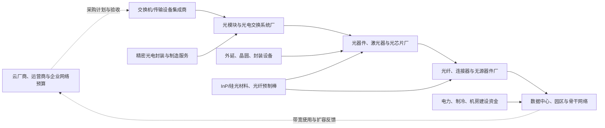

# 光通信行业供需周期分析

分析日期：2026-07-18 00:31:36 +08:00

地理范围：全球产业链；需求端重点观察北美超大规模云数据中心，供给端覆盖美国、中国大陆、中国台湾、东南亚与欧洲

数据时效：经营实际值截至 2026 年 6 月已发布的公司季度报告；Ciena 截至 2026-05-02、Lumentum 截至 2026-03-28、Coherent 截至 2026-03-31、Corning 截至 2026-03-31、Fabrinet 截至 2026-03-27；2026 年第二季度及以后未披露的公司结果不视为实际值

行业边界：纳入数据中心与电信网络所需的光纤/连接器、光芯片与激光器、光器件、可插拔光模块、光电交换与传输设备，以及其制造和封装服务；云服务器、GPU、交换芯片及普通通信服务只作为需求或相邻行业，不计入本行业收入

研究模式：完整深研

> **阅读路线**
>
> - 第一次接触光通信：依次读第 0、1、4、5、9、10 节，先理解谁付款、货怎么交付和什么会推翻判断。
> - 有产业或市场经验：重点读各“进阶视角”、第 5 节的上一轮比较、第 6—8 节及附录 A—C。

## 0. 一页看懂

### 这个行业是做什么的

光通信把电信号转换成可在光纤中高速传输的光，再在另一端还原成电信号。云厂商、运营商和企业网络所有者为带宽、时延和能耗付费；它们采购交换机、传输设备及光模块，模块厂再采购激光器、光芯片、连接器和制造服务。AI 集群使机柜内、机柜间和园区间需要更多高速连接，但“更多 GPU”并不自动等于每个光通信品类都短缺：接口代际、架构选择和客户认证决定了需求落在哪一层。[E1][E2][E4]

### 三个最重要的数字

| 数字 | 截止期间 | 它回答什么问题 | 结论 |
|---|---|---|---|
| Ciena 收入 **15.70 亿美元**，同比 **+40%** | 截至 2026-05-02 的 FY2026 Q2 | 网络设备订单是否已转为收入 | 已兑现；公司将 FY2026 收入指引上调至约 63 亿美元，但 Q3 数字仍是指引而非实际值。[E1] |
| Lumentum 组件收入 **5.333 亿美元**，同比 **+77.3%** | 截至 2026-03-28 的 FY2026 Q3 | 上游光器件需求是否同步放量 | 组件增速快于公司总收入，且毛利率扩张，说明高端器件不只是出货恢复。[E2] |
| Corning 光通信销售 **18.46 亿美元**、部门净利润 **3.87 亿美元** | 2026 年第一季度 | 互连需求是否能产生利润 | 销售同比 +36%、部门利润同比 +93%；但该部门也包含企业和运营商产品，不能全部归因于 AI。[E4] |

### 当前判断

- **周期位置**：高端数据中心互连处于“订单兑现与供给追赶并行”阶段；传统电信需求与低速、同质化模块不应被这一结论覆盖。[E1][E2][E6]
结论状态：暂定。需求、供给和利润三条产业证据已达最低门槛；行业估值分位与可比 ETF 份额/资金流序列没有获得同口径公开数据。
- **置信度**：中等。对高端互连景气和利润改善的判断较强；对紧缺持续多久、哪些扩产能按时通过验证，只给中等把握。
- **最紧约束**：能量产、良率稳定并通过超大规模客户认证的 InP 激光器、光电封装和高端模块交付能力，而非单纯厂房面积。[E2][E7]
- **最大反证**：若云厂商资本开支仍增加、但 Ciena 接单/收入和 Lumentum 组件收入同时连续转弱，说明采购可能已前置或接口结构转向，当前的需求外推应被下调。

## 1. 产业链地图



实线是货物与工程交付，虚线是预算和使用反馈。设备、材料、封装服务与基础设施是平行输入：它们分别进入芯片/器件、模块或网络部署，并非一条虚假的串行产品链。最后付款者是购买云、网络连接或自建网络能力的客户。[E4][E5][E8]

### 1.1 钱、订单与产品怎么流

云厂商或运营商先根据计算集群、带宽与可靠性目标形成资本开支和网络预算；系统集成商把端口和距离要求转为交换机、传输设备与模块订单；模块厂据此锁定激光器、探测器、DSP、连接器与封装产能。高端器件的客户认证、可靠性测试和交付节拍会让订单与收入错开，因此宣布扩厂不等于当期可卖出更多合格端口。[E2][E7]

### 1.2 各环节详解

#### 1.2.1 光纤、连接器与无源器件

**它是干什么的**：这个环节把玻璃材料拉制成低损耗光纤，并制成跳线、连接器和高密度布线组件，让机柜和园区里的光路能够实际接通。

**向谁采购**：它向预制棒、玻璃材料和精密制造采购

**卖给谁**：卖给模块厂、布线集成商及数据中心建设方。

**为什么会卡住**：收入以产品交付和项目合同确认；大规模制造、施工适配和长期质量记录决定议价能力。

| 代表企业 | 上市地/代码 | 在该环节的地位 | 为什么具有代表性 | 证据 |
|---|---|---|---|---|
| Corning | 纽约证券交易所 / GLW | 光纤与光连接解决方案供应商 | 披露独立的光通信部门收入和利润，并与超大规模客户签订长期协议 | E4 |
| CommScope | 纳斯达克 / COMM | 网络连接与布线供应商 | 代表面向企业、运营商和数据中心的连接基础设施 | E4 |

**怎么赚钱、议价能力**：标准跳线竞争较强，利润受产能和项目价格影响；高密度、定制化连接方案则受安装复杂度、可靠性和客户设计导入保护。Corning 的部门利润快于销售增长说明组合改善，但不能把整个光纤行业都视作同样高利润。[E4]

**进阶视角**：市场容易把“美国光连接产能将增十倍”理解为当前供给过剩。该计划是扩张承诺，不是已认证交付；且其服务的是光连接，不等同于激光器、模块或交换系统的全部瓶颈。报告据此把它作为中长期供给压力，而非当前紧缺解除证据。[E8]

#### 1.2.2 光芯片、激光器与关键器件

**它是干什么的**：这一层把电流变成特定波长的光、调制光信号并接收还原信号，产出包括 InP 激光器、探测器、调制器和窄线宽光源。

**向谁采购**：它购买外延片、晶圆、封装设备和测试服务

**卖给谁**：卖给模块厂、光交换系统厂和网络设备商。

**为什么会卡住**：客户需要长期可靠性与批次一致性，良率和认证使新进入者不能只凭名义晶圆面积立即替代。

| 代表企业 | 上市地/代码 | 在该环节的地位 | 为什么具有代表性 | 证据 |
|---|---|---|---|---|
| Lumentum | 纳斯达克 / LITE | 云光子与激光器供应商 | 披露组件收入、产品结构与 InP 新产能项目 | E2 |
| Coherent | 纽约证券交易所 / COHR | 光子器件、材料与模块供应商 | 覆盖数据通信、通信和激光器，提供跨环节景气样本 | E3 |

**怎么赚钱、议价能力**：高功率、低噪声和高速率器件的价值来自性能、可靠性和客户验证；一旦进入客户设计，替换要重做系统测试。Lumentum 本季把毛利改善归因于产品组合、定价纪律和运营，说明器件供给紧张以外，结构也在影响利润。[E2]

**进阶视角**：InP 厂房扩张的关键不是购置建筑物，而是迁入工艺、良率爬坡、可靠性与客户认证。Lumentum 的 Greensboro 工厂虽“当前可运营”，其新产品量产爬坡预计在 2028 年中，因而不能拿来填补 2026—2027 的有效供给缺口。[E7]

#### 1.2.3 光模块、光电交换与精密制造

**它是干什么的**：模块厂把激光器、探测器、芯片、连接器和散热件封装成可插入交换机的收发模块；

**为什么会卡住**：它们向器件厂和封装服务商订货，向云厂商、设备商及运营商交付。客户认证、自动化测试能力、良率和按时交货是收入能否确认的共同条件。

**向谁采购**：向光芯片、激光器、连接器、DSP、封装材料和精密制造服务商采购关键器件。

**卖给谁**：向云厂商、交换机与传输设备商、电信运营商销售通过认证的高速模块和光交换组件。

| 代表企业 | 上市地/代码 | 在该环节的地位 | 为什么具有代表性 | 证据 |
|---|---|---|---|---|
| Fabrinet | 纽约证券交易所 / FN | 精密光电封装与制造服务商 | 披露光通信、数据通信和电信收入序列，反映制造端接单结构 | E6 |
| Lumentum | 纳斯达克 / LITE | 光交换、组件与系统供应商 | 系统收入和组件收入同时披露，可观察不同产品层的放量 | E2 |
| 中际旭创 | 深圳证券交易所 / 300308 | 高速光模块厂商 | 代表中国高速光模块供给；本报告未取得其同口径最新原始季度披露，故不以其数据作量化结论 | E12 |

**怎么赚钱、议价能力**：模块的收入以端口、速率和复杂度计价；通用规格容易受价格竞争侵蚀，定制设计、认证和交付可靠性更能保住毛利。Fabrinet 的光通信收入增长并不等于所有模块厂的订单增长，因为其客户组合和制造服务边界不同。[E6]

**进阶视角**：把“Fabrinet 光通信占比 73%”直接说成数据中心景气是口径错误。其 FY2026 Q3 光通信内，数据通信仅占 29%、电信占 71%，且数据中心互连被包含在电信；因此它验证的是制造交付活跃，而非纯粹的 AI 模块终端需求。[E6]

#### 1.2.4 交换机、传输设备与网络部署

**它是干什么的**：设备商把模块插入交换机、路由器或光传输平台，配置软件和运维能力后交付给云厂商、运营商及企业网络。

**向谁采购**：它们向模块与器件供应商采购

**卖给谁**：向最终网络所有者收取设备、软件和服务收入。

**为什么会卡住**：端口升级、网络拓扑和客户验收决定设备收入，而不是单个光模块的出货量。

| 代表企业 | 上市地/代码 | 在该环节的地位 | 为什么具有代表性 | 证据 |
|---|---|---|---|---|
| Ciena | 纽约证券交易所 / CIEN | 光网络设备和软件供应商 | 最新季度收入、指引和库存数据都可取得 | E1 |
| Cisco | 纳斯达克 / CSCO | 交换与企业网络设备供应商 | 代表多场景网络设备需求，未用其数据代表纯光通信周期 | E1 |

**怎么赚钱、议价能力**：设备商从硬件、软件许可与服务获得收入。专用网络操作系统、既有网络兼容性与长期运维关系提高转换成本；但大客户订单集中也会让单季收入有明显波动。[E1]

**进阶视角**：Ciena FY2026 Q2 的收入增长和 Q3 指引说明设备端订单已经转化，但它不能证明“模块立即全面短缺”。设备交付会受客户验收、项目节奏和产品组合影响；本报告只把它作为网络层的真实采购证据。[E1]

### 1.3 钱怎么流：利益传导

| 问题 | 回答 | 证据 | 缺口 |
|---|---|---|---|
| 谁最终付款？ | 云厂商、运营商和企业网络所有者以云服务、连接服务或内部 IT 预算支付；微软云收入与 AI 基建投入说明需求端有真实预算来源。 | E5 | 各家云厂商没有按光模块品类披露采购额。 |
| 利润当前集中在哪？ | 已通过认证的高端器件、模块/光交换和能够按时交付的网络设备环节；Lumentum 与 Corning 的毛利、部门利润改善提供公司样本。 | E2、E4 | 不能将公司利润率汇总成行业平均利润率。 |
| 谁承担资本开支和库存风险？ | 器件制造商、模块制造服务商及连接基础设施厂承担设备、库存和产线爬坡风险；云厂商承担数据中心建设与折旧风险。 | E5、E6、E7 | 项目取消条款和单客户安全库存通常不公开。 |
| 谁有定价权？ | 受认证、性能和良率约束的激光器/高端组件更强；标准化连接和低速模块更容易比价。 | E2、E7 | 缺少覆盖全行业的 ASP 实际序列。 |
| 谁重要但未必最赚钱？ | 精密制造服务商和连接施工不可替代，却可能因客户集中、劳动力和材料成本而保持较低利润率。 | E6 | 公司披露不拆分到每一工序毛利。 |

订单与预算流：

```text
[AI/云与网络真实使用] -> [云厂商/运营商预算] -> [网络设备与系统订单] -> [模块/器件采购单] -> [材料、设备与产线投入] -> [认证后交付] -> [收入与利润]
```

## 2. 需求：谁在买、为什么买

事实：

- Microsoft FY2026 Q3 的 Azure 及其他云服务收入同比增长 40%，并明确披露持续投资 AI 基础设施和计算能力；这是光互连的间接而非模块金额证据。[E5]
- Ciena FY2026 Q2 收入同比增长 40%，并把 FY2026 收入中值上调至约 63 亿美元，说明网络设备需求已有收入兑现。[E1]
- Corning 2026 年第一季度新增两家超大规模客户长期协议，协议规模和期限类似此前与 Meta 的最高 60 亿美元多年协议；这支持连接基础设施的客户承诺，但合同上限不是已确认收入。[E4]

| 终端用途 | 买方/预算所有者 | 购买动因 | 已兑现还是预期 | 可观察指标 | 证据 |
|---|---|---|---|---|---|
| AI 训练与推理集群 | 云厂商与 AI 基础设施运营者 | 提升 GPU 集群内部及园区间带宽、降低时延和功耗 | 云收入与设备/器件收入已兑现；具体端口数量未披露 | Azure 收入、设备收入、组件收入 | E1、E2、E5 |
| 数据中心互连 | 云厂商、托管数据中心与企业 | 跨机柜、跨楼宇和跨园区连接更多服务器与存储 | 部分已兑现 | Fabrinet DCI 收入、光通信收入 | E6 |
| 电信传输与接入 | 运营商 | 扩容、升级骨干/城域网并维持服务质量 | 与 AI 需求不同步，仍是独立需求 | Fabrinet 电信收入、Ciena 网络平台收入 | E1、E6 |

推断与假设：

- **推断**：当前需求的强度主要来自云和 AI 网络建设，而非传统运营商周期单独复苏；依据是微软云增长、Corning 客户协议、Ciena 设备收入与 Lumentum 组件增长共同出现。[E1][E2][E4][E5]
- **假设**：若 AI 集群从可插拔模块转向更高集成的光电共封装，价值不会消失但会从部分模块和连接层转移至激光器、封装与系统设计；这需要靠产品结构披露验证。

**进阶视角**：最容易误读的是把云资本开支直接等同于光模块销量。资本开支还包含土地、电力、服务器、GPU、存储和建筑；而同一网络架构下每个 GPU 对应的光链路数也不同。公司收入是已兑现证据，云资本开支仅是前瞻线索，二者不能混为一项需求指标。[E1][E5]

## 3. 供给：现在有多少、真能用的有多少

| 环节/项目 | 公告产能 | 已安装/可运营 | 已验证、爬坡达标 | 有客户订单支撑 | 释放窗口 | 证据 | 缺口 |
|---|---|---|---|---|---|---|---|
| Lumentum Greensboro InP 工厂 | 显著扩张 6 英寸 InP 制造能力，未披露端口或晶圆数 | 厂房已运营、待改造 | 新产品尚未量产 | NVIDIA 为客户之一，且计划服务其他 AI 基建客户 | 预计 2028 年中爬坡 | E7 | 未披露良率、合格产能与具体客户份额 |
| Corning 美国光连接扩张 | 美国光连接制造能力计划增至 10 倍；光纤能力计划增逾 50% | 新建三座工厂，非已投产 | 未披露认证节奏 | 与 NVIDIA 的多年合作支持需求 | 未给出各厂投产月度 | E8 | 不能换算成光模块或激光器供给 |
| Fabrinet 精密光电制造 | 未按端口披露 | 已有泰国、中国、以色列和美国制造布局 | FY2026 Q3 已有光通信收入交付 | 多个进行中及爬坡项目；新增数据通信协议为前瞻描述 | FY2026 Q4 指引 | E6 | 客户、速率和产线利用率未公开 |

事实：

- Lumentum FY2026 Q3 组件收入为 5.333 亿美元，环比 +20.2%、同比 +77.3%；这是在产产品的交付结果，不是产能公告。[E2]
- Corning 的扩张计划对应光连接与光纤，规模很大但仍属于未来建设；不能用于证明 2026 年已出现供给过剩。[E8]
- Fabrinet FY2026 Q3 光通信收入为 8.887 亿美元，较 FY2025 Q3 的 6.572 亿美元增长；它表明制造端有交付，但不披露每种速率的可用能力。[E6]

推断与假设：

- **推断**：当前最可能折损名义扩产的是高端器件良率、可靠性与客户导入，而不是机器是否运抵。Lumentum 将新 InP 工厂量产窗口放在 2028 年中，直接说明“可运营厂房”和“产品化供给”之间存在长滞后。[E7]
- **假设**：如果 2027 年前多家厂商同时提前完成认证，价格和模块毛利可能先于总需求放缓；尚无足够公开数据判断这一情形的概率。

**进阶视角**：当前最需要打折看的数字是“十倍”或“显著扩张”一类能力宣称。它们可能以现有小基数计算，且覆盖的产品层级不同。对周期判断真正有效的是合格端口、良率、订单承诺和准时交付，公开资料尚不能把这些口径统一，因此供给结论保持暂定。[E7][E8]

## 4. 供需矛盾与高频信号

核心矛盾：AI 网络建设正在把高速、低功耗和高密度的连接需求推向已认证器件与封装能力；供给端虽开始扩建，但多数披露还没有变成可交付、可验证的端口。与此同时，传统电信与不同接口代际的需求并不整齐，不能把高端紧张推广为整个光通信行业普遍短缺。[E2][E6][E7]

| 信号 | 最新值/方向 | 数据期间 | 证据 | 解读 | 缺口 |
|---|---|---|---|---|---|
| 网络设备收入 | Ciena 15.70 亿美元，同比 +40% | FY2026 Q2，截至 2026-05-02 | E1 | 网络侧采购已从预算进入收入确认；但公司口径含多类网络产品。 | 无行业订单总额 |
| 组件收入 | Lumentum 5.333 亿美元，环比 +20.2%、同比 +77.3% | FY2026 Q3，截至 2026-03-28 | E2 | 上游关键器件增长快于总收入，支持高端产品组合改善。 | 未拆分各速率 ASP |
| 光通信部门利润 | Corning 3.87 亿美元，同比 +93% | 2026 年第一季度 | E4 | 不只是销售增加，部门利润也在改善；仍包含非 AI 产品。 | 未披露客户拆分 |
| 制造交付 | Fabrinet 光通信收入 8.887 亿美元 | FY2026 Q3，截至 2026-03-27 | E6 | 光电制造服务已经交付较多订单，且电信占光通信收入较高。 | 不等同于模块品牌厂出货 |
| 未来供给 | Lumentum 新 InP 工厂预计 2028 年中爬坡 | 2026-03-26 公告 | E7 | 供给追赶存在至少两年左右的工艺与认证滞后。 | 没有公开月度爬坡表 |

## 5. 周期位置与传导

传导链（光通信专属版本）：

```text
[云/运营商的带宽与算力预算] -> [网络端口与系统订单] -> [模块、器件采购] -> [设备商和高端器件利润] -> [扩产与封装投入] -> [认证后的有效供给] -> [价格/利润继续改善或回落]
```

| 阶段/日期 | 信号 | 利润池往哪移 | 关键滞后 | 证据 | 下一步验证 |
|---|---|---|---|---|---|
| 2023—2024 年 | 云与 AI 网络建设启动，产品组合开始改善 | 率先流向高端模块、器件和网络设备 | 设备导入先于规模交付 | E9 | 能否持续转为部门收入和利润 |
| 2025 年 | Corning 光通信全年销售 62.74 亿美元、同比 +35% | 连接基础设施开始兑现 | 合同到产线与交付需要数季 | E10 | 客户协议是否转为订单与现金流 |
| 2026 年上半年 | Ciena、Lumentum、Corning、Fabrinet 的收入或利润改善 | 已认证器件、设备和制造服务同时受益 | 客户认证和产线良率限制供给释放 | E1、E2、E4、E6 | Q2/Q3 披露中的订单、库存与毛利 |
| 2028 年中及以后 | Lumentum 新 InP 厂计划爬坡 | 供给增加可能压低稀缺溢价 | 从厂房改造到产品量产约两年 | E7 | 良率、认证与客户采用进度 |

当前阶段：

- **阶段**：高端互连的订单兑现与有效供给追赶；非高端和传统电信子市场为分化状态。
- **进入时间/锚点**：至少从 2025 年 Corning 光通信销售明显增长延续至 2026 年第一、二季度公司实际披露；不是从某一条扩产新闻推定。[E1][E4][E10]
- **预期切换条件**：Lumentum 组件收入连续两个财季环比下降且公司毛利回落，或 Ciena 下一财季实际收入低于其 16.25 亿美元指引下沿，同时出现客户削减网络资本开支的原始披露。
- **置信度**：中等。
- **什么会证明这个判断错了**：若未来实际披露显示扩产快速通过认证、交付增加但组件/模块价格和毛利仍同步上升，则本报告低估了需求弹性；若需求端收入持续增长而网络设备与器件收入转弱，则本报告把云开支错误映射到了光互连。

**进阶视角：与上一轮周期的对照**：2021—2022 年的供应链紧张更广泛地受缺芯、物流和居家办公网络需求影响，随后电信资本开支放缓使多个光通信环节经历库存和价格压力。当前（2025—2026）不同之处是数据中心 AI 网络是主线，且客户长期协议和器件利润改善更集中；相似之处是大客户集中、预订前置和扩产滞后仍会造成订单与最终使用脱节。公开材料不足以计算上一轮到过剩的统一月数，故不虚构精确滞后。[E4][E6][E8]

## 6. 资金动向

先做规定动作再下结论。检索尝试记录：

| 尝试的来源类型 | 具体来源 | 结果（拿到数据 / 无公开数据 / 口径不可比） |
|---|---|---|
| 行业指数估值分位 | SOXX 与 SMH 基金公开页面及基金说明材料 | 未找到截至分析日、可复核且与“光通信”一致的历史估值分位；半导体 ETF 不能替代光通信行业估值。 |
| 行业 ETF 份额/资金流 | 光通信主题 ETF 与半导体 ETF 的发行方公开页面 | 份额和净值口径、更新频率及覆盖行业不一致；未得到可比的流量时间序列。 |
| 跨境/杠杆资金 | 中国市场公开资金流栏目与美国市场基金披露 | 不同市场、币种和标的边界不可合并；未纳入量化判断。 |
| 龙头股价与盈利剪刀差 | Ciena、Lumentum、Corning、Fabrinet 的最新财报和公开行情页面 | 已确认盈利样本改善，但未取得同日、同一方法的历史估值或价格—盈利序列；不能据此断言市场已完全定价。 |

| 产业现实 | 市场叙事/定价证据 | 预期阶段 | 来源 | 解读 |
|---|---|---|---|---|
| 多家公司收入和利润改善，且出现未来扩产 | “AI 网络将长期高速增长”的公开公司叙事 | 部分定价、仍需兑现 | E1、E2、E4、E8 | 企业披露支持需求强，但没有统一资金流指标证明整个主题的定价位置。 |

- **市场当前大概已定价**：AI 数据中心需要更多高速互连，以及头部供应商正在扩张。这是公司管理层和长期合作公告频繁出现的方向性叙事。[E1][E7][E8]
- **市场当前大概未定价**：新 InP 与光连接扩产最终何时通过认证、最终客户是否持续按计划扩容、以及不同接口架构下各子环节的利润归属。
- **判断依据与不确定性**：上述为产业披露推断，不是量化估值结论。由于没有得到可比的行业估值分位、ETF 份额时间序列和统一资金流数据，本节不能把经营改善转为市场回报判断。

## 7. 未来资金可能流向

> 本节是基于订单、认证和产能弹性的情景推演，不构成任何买卖建议、目标价或个股推荐。

| 情景 | 触发条件 | 利润池往哪个环节移动 | 先受益的环节 | 后受益/受损的环节 | 需要盯的证据 |
|---|---|---|---|---|---|
| 基准 | 云网络建设维持、器件和设备收入按现有指引兑现 | 留在已认证的激光器、模块/光交换和网络设备 | 高端器件、设备系统 | 制造服务和连接部署随后确认 | Ciena 实际收入、Lumentum 组件收入与毛利 |
| 上行 | 云客户加速建设，且新增端口需求快于合格产能释放 | 向器件、先进封装和具备认证的模块方案集中 | InP 激光器、关键光组件 | 新扩厂和布线产能在认证后受益 | 订单交期、客户认证、Corning 长协转收入 |
| 下行 | 云资本开支放缓、接口迭代延后或扩产提前通过认证 | 从高端器件/模块回流至采购方，供应商毛利承压 | 具软件和服务粘性的设备维护业务相对抗压 | 同质化模块、低差异化连接和未锁定客户的新增产能 | 实际收入低于指引、库存、价格与毛利变化 |

推演逻辑是订单先锁定已验证供应商，制造和连接部署需要随客户机房建设交付；当产线尚未量产时，供给弹性低，价值更靠近器件与认证能力。反过来，若新产能早于需求释放，产品差异低、认证壁垒弱的一端会先承压。[E2][E7][E8]

## 8. 分歧与反证

主流叙事 vs 本报告：

| 市场主流叙事 | 本报告判断 | 分歧在哪 | 谁的证据更硬 | 证据 |
|---|---|---|---|---|
| AI 建设会让所有光通信产品持续短缺 | 只有高端数据中心互连可见订单兑现；电信、低速和通用规格仍应分开判断 | 将子行业、接口代际和客户结构混为整体 | 公司分部收入、产品结构和量产时间比笼统主题叙事更硬 | E2、E4、E6、E7 |
| 大规模扩产已经会迅速消除紧缺 | 扩产先是厂房和设备，后是良率、可靠性及客户认证 | 名义能力和有效供给混淆 | 新 InP 工厂的 2028 年中爬坡窗口更直接 | E7 |
| 云资本开支上升就能线性推导模块销量 | 云支出还覆盖 GPU、服务器、电力、土地和建筑，光链路数取决于架构 | 总资本开支与具体光学采购口径不同 | 云收入/投资披露只能作为需求背景，设备与器件实际收入才验证采购 | E1、E5 |

冲突证据：

| 议题 | 支持证据 | 反对或限制证据 | 口径差异 | 处理 |
|---|---|---|---|---|
| 当前高端需求强 | Ciena、Lumentum、Corning 的实际收入与利润改善 | Fabrinet 光通信中电信占比高，不能纯作 AI 代理 | 设备、器件、连接和制造服务覆盖不同客户 | 保留“高端互连强、整体分化”的结论 | E1、E2、E4、E6 |
| 扩产将缓解供给 | Corning、Lumentum 公布扩建项目 | Lumentum 新产品预计 2028 年中才爬坡 | 光连接、光纤、InP 器件不是同一种供给 | 将扩产列为中期风险，不作为当前供给实际值 | E7、E8 |

反证优先级：先看公司实际收入、库存和毛利，再看公司指引，最后看扩产计划和市场预测。公司产品口径不同的数字保留差异，不做算术平均。

## 9. 观察哨与跟踪

| 指标 | 基线（数值+日期） | 来源 | 频率 | 正向触发 | 反证触发 | 含义 |
|---|---|---|---|---|---|---|
| Ciena 季度收入 | 15.70 亿美元，FY2026 Q2，截至 2026-05-02 | E1 | 季度 | 下一季实际达到或超过 16.25 亿美元指引中值附近且毛利稳定 | 实际低于 15.75 亿美元指引下沿 | 验证网络设备订单是否继续兑现 |
| Lumentum 组件收入 | 5.333 亿美元，FY2026 Q3，截至 2026-03-28 | E2 | 季度 | 连续增长并维持高于 47% 的非 GAAP 毛利率 | 组件收入环比下降且毛利跌破 44.2% GAAP 基线 | 验证高端器件订单与定价组合 |
| Corning 光通信部门销售 | 18.46 亿美元，2026 年第一季度 | E4 | 季度 | 销售同比保持双位数增长且部门利润率不低于 Q1 水平 | 销售同比转负或部门利润率显著低于 Q1 | 验证连接基础设施的合同兑现 |
| Lumentum Greensboro 量产进度 | 预计 2028 年中爬坡，2026-03-26 公告 | E7 | 事件 | 披露设备导入、客户认证或提前量产 | 项目延迟、良率或客户认证受阻 | 决定中期有效供给何时出现 |
| Fabrinet 光通信收入 | 8.887 亿美元，FY2026 Q3，截至 2026-03-27 | E6 | 季度 | 光通信收入继续高于 8.887 亿美元且数据通信占比回升 | 光通信收入低于 8.0 亿美元或订单项目延后 | 观察制造交付与结构变化 |

### 9.1 可比时间序列

| 日期 | 指标 | 数值 | 单位 | 来源 | 含义 |
|---|---|---:|---|---|---|
| FY2025 Q3，截至 2025-03-28 | Fabrinet 光通信收入 | 657.2 | 百万美元 | E6 | 同一公司、同一定义下的制造交付基线 |
| FY2026 Q1，截至 2025-09-26 | Fabrinet 光通信收入 | 746.9 | 百万美元 | E6 | 交付量继续扩大，但不能拆成单一速率 |
| FY2026 Q2，截至 2025-12-26 | Fabrinet 光通信收入 | 832.6 | 百万美元 | E6 | 电信和数据通信的组合会影响解读 |
| FY2026 Q3，截至 2026-03-27 | Fabrinet 光通信收入 | 888.7 | 百万美元 | E6 | 最近已披露点，显示连续增长 |

跟踪数据底稿：

| 日期 | 指标 | 环节 | 数值 | 同比/环比 | 方向 | 来源 | 对判断的影响 | 备注 |
|---|---|---|---:|---|---|---|---|---|
| 2026-06-04 | Ciena 收入 | 网络设备 | 1,570 | 同比 +40% | 上升 | E1 | 支持订单兑现 | 公司财年口径 |
| 2026-05-05 | Lumentum 组件收入 | 器件 | 533.3 | 同比 +77.3% | 上升 | E2 | 支持高端器件景气 | 财年 Q3 口径 |
| 2026-04-28 | Corning 光通信销售 | 连接基础设施 | 1,846 | 同比 +36% | 上升 | E4 | 支持长协及交付 | 包含多个终端市场 |

## 10. 术语表

| 术语 | 人话解释 |
|---|---|
| 光模块 | 插在交换机或服务器网卡上的部件，负责把电信号变成光信号并在另一端还原。 |
| InP | 磷化铟，一种适合制造高速、长距离通信激光器和探测器的半导体材料。 |
| 光电共封装 | 把光学部件更靠近交换芯片封装，目的是降低高速传输的功耗和损耗；它会改变部分模块和器件的价值分配。 |
| DCI | 数据中心互连，指不同数据中心或园区之间传输大量数据的网络连接。 |
| 良率 | 一批生产品中达到规格、能卖给客户的比例；有设备不代表良率已经合格。 |
| 客户认证 | 客户对可靠性、性能和兼容性进行验证的过程，未经认证通常不能进入批量采购。 |
| ASP | 平均销售价格，用来观察产品价格和组合变化，但必须保持同一产品定义才可比较。 |

## 附录A 证据台账

| 证据ID | 结论 | 类型 | 发布方 | 发布日期 | 访问日期 | 数据期间 | 地域/单位 | 原文链接/定位 | 已打开 | 时效 | 局限 |
|---|---|---|---|---|---|---|---|---|---|---|---|
| E1 | Ciena FY2026 Q2 收入 15.70 亿美元、同比 +40%，并给出 Q3 与全年指引 | 事实/指引 | Ciena | 2026-06-04 | 2026-07-18 | 截至 2026-05-02 的 FY2026 Q2 | 全球；美元 | https://investor.ciena.com/news/news-details/2026/Ciena-Reports-Fiscal-Second-Quarter-2026-Financial-Results/default.aspx ，业绩摘要与 Performance Summary | 是 | 当前 | 网络设备公司口径，不能直接代表每类光模块出货。 |
| E2 | Lumentum FY2026 Q3 组件收入 5.333 亿美元、总收入 8.084 亿美元、GAAP 毛利率 44.2% | 事实/指引 | Lumentum | 2026-05-05 | 2026-07-18 | 截至 2026-03-28 的 FY2026 Q3 | 全球；美元 | https://investor.lumentum.com/financial-news-releases/news-details/2026/Lumentum-Announces-Third-Quarter-of-Fiscal-Year-2026-Financial-Results/default.aspx ，第 27—305 行 | 是 | 当前 | 产品类别覆盖组件和系统，不能外推至所有器件厂。 |
| E3 | Coherent FY2026 Q3 收入 18.1 亿美元、GAAP 毛利率 37.7% | 事实/指引 | Coherent | 2026-05-06 | 2026-07-18 | 截至 2026-03-31 的 FY2026 Q3 | 全球；美元 | https://www.coherent.com/content/dam/coherent/site/en/documents/investors/financial-releases/2026/may-6/earnings-release-fy26-q3.pdf ，第 1 页 | 是 | 当前 | 公司业务还覆盖材料和工业激光，不是纯光通信。 |
| E4 | Corning 2026 Q1 光通信销售 18.46 亿美元、净利润 3.87 亿美元，并披露超大规模客户协议 | 事实/指引 | Corning | 2026-04-28 | 2026-07-18 | 2026 年第一季度 | 全球；美元 | https://investor.corning.com/news-and-events/news/news-details/2026/Corning-Announces-Strong-First-Quarter-2026-Financial-Results-1/default.aspx ，第 75—100、208—247 行 | 是 | 当前 | 部门同时服务企业、运营商等，不可全部归因为 AI。 |
| E5 | Microsoft FY2026 Q3 Azure 及其他云服务收入同比 +40%，持续投资 AI 基建使云毛利率下降 | 事实 | Microsoft | 2026-04-29 | 2026-07-18 | 截至 2026-03-31 的 FY2026 Q3 | 全球；美元 | https://www.microsoft.com/en-us/investor/earnings/FY-2026-Q3/press-release-webcast 与 https://www.microsoft.com/en-us/Investor/earnings/FY-2026-Q3/performance ，第 7—15 行 | 是 | 当前 | 未单独披露光学网络采购额。 |
| E6 | Fabrinet FY2026 Q3 光通信收入 8.887 亿美元，数据通信与电信结构可追溯 | 事实/指引 | Fabrinet | 2026-05-04 | 2026-07-18 | 截至 2026-03-27 的 FY2026 Q3 | 全球；美元 | https://investor.fabrinet.com/static-files/c4186233-7a8e-4531-a39e-bae22502a986 ，第 10—11 页 | 是 | 当前 | 精密制造服务的客户结构与品牌模块厂不同。 |
| E7 | Lumentum 新 InP 工厂计划在 2028 年中量产爬坡 | 计划 | Lumentum | 2026-03-26 | 2026-07-18 | 项目计划 | 美国；厂房/时间 | https://investor.lumentum.com/financial-news-releases/news-details/2026/Lumentum-Announces-New-U-S--Manufacturing-Facility-to-Produce-Advanced-Lasers-for-the-Worlds-Largest-AI-Data-Centers/default.aspx ，第 33—47 行 | 是 | 当前 | 未披露良率、认证进度、实际端口产能和具体产量。 |
| E8 | Corning 计划扩展美国光连接能力十倍、光纤能力逾 50%，建设三座工厂 | 计划 | Corning / NVIDIA | 2026-05-06 | 2026-07-18 | 项目计划 | 美国；能力目标 | https://investor.corning.com/news-and-events/news/news-details/2026/NVIDIA-and-Corning-Announce-Long-Term-Partnership-To-Strengthen-U-S--Manufacturing-for-AI-Infrastructure/default.aspx ，第 72—78 行 | 是 | 当前 | 计划覆盖光连接与光纤，不能等同于模块或器件即时供应。 |
| E9 | Fabrinet 提供 FY2025 Q3 至 FY2026 Q3 的光通信收入可比序列 | 事实 | Fabrinet | 2026-05-04 | 2026-07-18 | FY2025 Q3—FY2026 Q3 | 全球；百万美元 | https://investor.fabrinet.com/static-files/c4186233-7a8e-4531-a39e-bae22502a986 ，第 11 页 | 是 | 当前 | 同一指标可比，但内部数据通信/电信组合变化影响经济含义。 |
| E10 | Corning FY2025 光通信销售 62.74 亿美元、同比 +35% | 事实 | Corning | 2026-01-27 | 2026-07-18 | FY2025 | 全球；美元 | https://investor.corning.com/news-and-events/news/news-details/2026/Corning-Announces-Outstanding-2025-Financial-Results-1--Upgrades-Springboard-Plan-for-Faster-Sales-Growth-on-Significantly-Enhanced-Financial-Profile/default.aspx ，Optical Communications 表 | 是 | 被更新 | 年度数据已被 2026 Q1 分部实际值部分更新，仅用于历史阶段锚定。 |
| E11 | Ciena FY2026 Q1 收入 14.27 亿美元、库存周转 3.2 次 | 事实 | Ciena | 2026-03-05 | 2026-07-18 | 截至 2026-01-31 的 FY2026 Q1 | 全球；美元/周转次数 | https://investor.ciena.com/news/news-details/2026/Ciena-Reports-Fiscal-First-Quarter-2026-Financial-Results-03-05-2026/default.aspx ，Financial Highlights | 是 | 被更新 | Q2 已发布，故不作为最新收入基线，仅用于序列与库存背景。 |
| E12 | 中际旭创仅作为中国高速模块代表，公司量化数据不纳入本报告 | 缺口记录 | 公司公开披露入口 | 2026-07-18 | 2026-07-18 | 不适用 | 中国大陆 | https://www.cninfo.com.cn/ ，按公司与报告期检索 | 是 | 未核验 | 本轮未在预算内打开同口径、可核验的最新原始季度披露，避免用二手数字填补。 |

## 附录B 数据时效与证据覆盖

| 指标 | 期间 | 状态 | 发布日期 | 访问日期 | 时效 | 来源 | 定位 | 局限 |
|---|---|---|---|---|---|---|---|---|
| Ciena 收入与指引 | FY2026 Q2，截至 2026-05-02 | 实际/指引 | 2026-06-04 | 2026-07-18 | 当前 | E1 | 业绩摘要 | Q3 仍为指引。 |
| Lumentum 收入、组件与毛利 | FY2026 Q3，截至 2026-03-28 | 实际 | 2026-05-05 | 2026-07-18 | 当前 | E2 | 财务与产品类型表 | 未拆分具体速率与 ASP。 |
| Corning 光通信部门 | 2026 年第一季度 | 实际 | 2026-04-28 | 2026-07-18 | 当前 | E4 | 分部业绩表 | 下一季尚未发布。 |
| Microsoft 云与 AI 基建 | FY2026 Q3，截至 2026-03-31 | 实际 | 2026-04-29 | 2026-07-18 | 当前 | E5 | 新闻稿和 Performance 页 | 不是光通信采购口径。 |
| Fabrinet 光通信收入 | FY2026 Q3，截至 2026-03-27 | 实际 | 2026-05-04 | 2026-07-18 | 当前 | E6 | 投资者演示第 11 页 | 制造服务并非行业总量。 |
| Lumentum 新 InP 厂 | 预计 2028 年中 | 计划 | 2026-03-26 | 2026-07-18 | 当前 | E7 | 项目公告 | 计划不是有效供给。 |
| Corning 扩产 | 公告计划 | 计划 | 2026-05-06 | 2026-07-18 | 当前 | E8 | 合作公告 | 无逐月投产表。 |

发布状态说明：

- 已发布：Ciena FY2026 Q2；Lumentum FY2026 Q3；Coherent FY2026 Q3；Corning 2026 Q1；Microsoft FY2026 Q3；Fabrinet FY2026 Q3。
- 尚未发布：多数公司覆盖 2026 年第二季度或其下一财季的实际经营结果；报告中仅将其引导或建设计划标为指引/计划。
- 替代关系：Ciena FY2026 Q2 取代 Q1 作为当前收入基线；Corning 2026 Q1 取代 FY2025 年度数据作为当前部门实际值。

## 附录C 证据就绪度与研究执行记录

| 证据轨道 | 状态 | 已打开可靠来源数 | 最低要求 | 证据/缺口 |
|---|---|---:|---:|---|
| 产业链 | 就绪 | 4 | 2 | E1、E2、E4、E6 |
| 需求 | 就绪 | 3 | 3 | E1、E4、E5 |
| 供给与有效产能 | 就绪 | 3 | 3 | E2、E7、E8 |
| 价格/订单/库存/利润 | 就绪 | 4 | 3 | E1、E2、E4、E6 |
| 资本市场预期 | 缺口 | 1 | 2 或明确缺口 | 已完成四类免费来源尝试；行业边界和时间序列不可比，见第 6 节 |

| 子任务 | 检索轮次 | 实际使用的路径 | 证据 | 状态 | 缺口/回退 |
|---|---:|---|---|---|---|
| 行业边界与链条 | 2 | SearXNG 发现 + 公司 IR 原文 | E1、E2、E4、E6 | 完成 | 没有统一行业收入总量，采用节点样本。 |
| 需求与付款方 | 2 | SearXNG 发现 + Microsoft、Ciena、Corning 原文 | E1、E4、E5 | 完成 | 无云客户光学采购金额。 |
| 有效供给与扩产 | 3 | SearXNG 发现 + Lumentum、Corning 原文 | E2、E7、E8 | 完成 | 良率、认证和端口产能不公开。 |
| 订单、利润与库存 | 2 | SearXNG 发现 + 公司业绩/演示原文 | E1、E2、E4、E6 | 完成 | 缺少统一 ASP 和行业库存序列。 |
| 资本市场映射 | 2 | ETF 公开页、行情页和公司披露 | E1、E2、E4、E6 | 缺口 | 记录尝试后不以不可比数据强行得出定价结论。 |

事实、推断、假设分层：

- **事实**：公司实际收入、利润、产品结构和扩产计划均由附录 A 的已打开原始披露支持。
- **推断**：高端互连仍在订单兑现与供给追赶阶段，由 E1、E2、E4、E6、E7 共同推导。
- **假设**：若新产线的认证早于客户网络扩容，价格和毛利将先承压；以未来良率、订单和实际收入作为反证。

## 尾注

- 供需缺口 ≠ 股价上涨。
- 方向正确 ≠ 时点正确。
- 盈利兑现 ≠ 股价继续上涨。
- AI 回答和搜索摘要不是事实。
- 过期数据不是当前事实。
