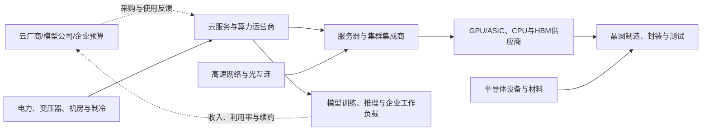

# AI算力供需周期分析

分析日期：2026-07-18 00:46:00 +08:00

地理范围：全球；重点观察北美云厂商需求、美国/中国台湾/韩国的芯片供应与全球数据中心部署

数据时效：NVIDIA 截至 2026-04-26 的 FY2027 Q1、Meta 与 Microsoft 截至 2026-03-31、Alphabet 截至 2025-12-31；2026 年第二季度尚未披露的实际结果不被写成已发生事实

行业边界：纳入 AI 加速器、CPU、HBM、服务器、网络、机房电力与制冷、云算力租赁和集群运维；模型、应用软件和普通互联网广告只作为需求来源，不计入算力供给收入

研究模式：完整深研

## 0. 一页看懂

### 这个行业是做什么的

AI 算力把芯片、内存、服务器、网络和数据中心组合成能训练或运行模型的计算能力。云厂商、模型公司和企业为可用算力、低时延和稳定性付款；加速器厂、存储厂、服务器与机房供应商分别从这笔预算中取得订单。真正稀缺的不是宣传中的“GPU 数量”，而是已经接通电力、网络、内存、软件并被客户实际使用的集群。[E1][E3][E4]

### 三个最重要的数字

| 数字 | 截止期间 | 它回答什么问题 | 结论 |
|---|---|---|---|
| NVIDIA 数据中心收入 **752 亿美元**、同比 **+92%** | FY2027 Q1，截至 2026-04-26 | 加速器采购是否已兑现 | 已兑现，且网络收入同比更快；但单一供应商不能代表全部算力市场。[E1] |
| Meta 当季资本开支 **198.4 亿美元**，全年指引 **1250—1450 亿美元** | 2026 年第一季度/全年指引 | 大型买方是否继续下单 | 当季为实际值、全年为计划；组件涨价和未来容量是上调原因。[E2] |
| Alphabet 2026 年资本开支指引 **1750—1850 亿美元** | 2026 年全年指引 | 云端供需缺口是否仍在 | 管理层仍称供给偏紧，且约六成投资用于服务器；它是指导而不是实际支出。[E3] |

结论状态：暂定。需求、供给和利润证据足以判断高端 AI 集群仍在扩张，但行业总装机、实际利用率、租赁价格和统一资金流序列并未公开。

- **周期位置**：高端加速器、网络和已通电数据中心处于订单兑现与供给追赶阶段；通用服务器及未接电的项目不能一概而论。[E1][E2][E3]
- **最紧约束**：可交付的系统级能力——先进芯片、HBM、网络、机房电力和运维软件要同时到位。
- **置信度**：中等；收入与资本开支强劲是事实，对供给何时足以满足需求只作中等判断。

## 1. 产业链地图



货物流从芯片与基础设施进入服务器和集群，钱从使用者和云客户反向形成采购预算。网络、电力和制冷是平行输入；少任何一项，采购到的加速器也不能形成有效算力。[E1][E3][E4]

### 1.2 各环节详解

#### 1.2.1 加速器、CPU 与 HBM

这个环节出售执行 AI 训练和推理的 GPU/ASIC、通用 CPU 及高带宽内存。芯片设计公司向晶圆厂和封装厂购买制造能力，向服务器商与云厂商销售；性能、软件生态和先进封装供给决定议价能力。

| 代表企业 | 上市地/代码 | 地位 | 代表性 | 证据 |
|---|---|---|---|---|
| NVIDIA | 纳斯达克 / NVDA | AI 加速器与网络平台 | 最新数据中心收入、计算与网络收入均披露 | E1 |
| AMD | 纳斯达克 / AMD | CPU 与 AI 加速器供应商 | 代表第二供应源和产品替代压力 | E1 |
| SK hynix | 韩国交易所 / 000660 | HBM 供应商 | 代表内存带宽约束，未以其未核验数据作量化判断 | E6 |

**怎么赚钱、议价能力**：高端产品以芯片、系统和软件生态收费。NVIDIA FY2027 Q1 数据中心计算收入 604 亿美元、网络收入 148 亿美元，显示系统互连也在兑现；但收入不是订单积压，且受产品组合影响。[E1]

**进阶视角**：把 GPU 收入当作“可用算力”会高估供给。芯片发货后仍需配 HBM、机柜、网络与电力并完成软件部署；所以芯片供给改善并不自动解除集群可用性瓶颈。[E1][E3]

#### 1.2.2 服务器、网络与集群集成

集成商把芯片、内存、网卡、交换机、机柜和软件组合成客户能运行的集群。它们向芯片和零部件厂采购，向云、模型公司和企业交付；交付速度、网络拓扑与调试能力决定收入确认。

| 代表企业 | 上市地/代码 | 地位 | 代表性 | 证据 |
|---|---|---|---|---|
| Dell Technologies | 纽约证券交易所 / DELL | 企业与云服务器集成 | 代表服务器交付层，不以其未核验数据作结论 | E4 |
| Super Micro Computer | 纳斯达克 / SMCI | AI 服务器和机柜集成 | 代表快速迭代的整机环节 | E4 |
| NVIDIA | 纳斯达克 / NVDA | 网络平台提供商 | 数据中心网络收入同比 +199% | E1 |

**怎么赚钱、议价能力**：硬件集成通常竞争更强，真正的溢价来自交付复杂集群、固件/软件兼容和客户验收。网络收入增速高不等于所有服务器厂毛利同步上行。[E1]

**进阶视角**：集群采购订单可早于数据中心交付数季。Meta、Alphabet 的资本开支包括服务器、数据中心和网络，不能从一个总数反推每家公司当季购买了多少机柜。[E2][E3]

#### 1.2.3 数据中心、电力、制冷与云运营

这一层建设机房、接入电网、配置制冷并将集群切分为云服务或内部计算资源。它购买土地、电力设备、服务器和网络，最终把计算能力卖给模型团队、企业与内部产品线。并网时间、变压器、机房建设和利用率决定名义装机何时成为可售算力。

| 代表企业 | 上市地/代码 | 地位 | 代表性 | 证据 |
|---|---|---|---|---|
| Microsoft | 纳斯达克 / MSFT | Azure 云与 AI 基础设施运营者 | Azure 增长及利润率变化反映实际承载压力 | E4 |
| Alphabet | 纳斯达克 / GOOGL | 自建数据中心、TPU/GPU 云服务商 | 披露服务器、数据中心与网络投资结构 | E3 |
| Meta | 纳斯达克 / META | 大规模内部 AI 基建买方 | 披露资本开支实际值和全年计划 | E2 |

**怎么赚钱、议价能力**：云运营者通过云服务、API、订阅或广告/产品效率收回投资。Microsoft 表示云毛利率受持续 AI 基建与使用增长拖累，说明需求强并不意味着买方当期利润率同步改善。[E4]

**进阶视角**：最危险的口径陷阱是把“宣布投资的数据中心”当成“已通电的可用容量”。Alphabet 管理层明确把电力、土地和供应链列为约束；可用容量需经过建设、并网和服务器部署多个环节。[E3]

### 1.3 钱怎么流：利益传导

| 问题 | 回答 | 证据 | 缺口 |
|---|---|---|---|
| 谁最终付款？ | 企业云客户、模型使用者、广告客户和内部产品业务通过云服务、订阅或效率收益承担成本。 | E2、E3、E4 | 各客户按 GPU 小时的付款额未披露。 |
| 利润现在集中在哪？ | 高端加速器和网络平台的收入、毛利兑现最显著；云端要先承受资本开支和折旧。 | E1、E4 | 没有统一行业利润池核算。 |
| 谁承担资本开支和库存风险？ | 云厂商、数据中心运营者和服务器集成商承担机房、设备、库存和折旧风险。 | E2、E3、E4 | 项目取消和利用率条款通常不公开。 |
| 谁有定价权？ | 软硬件生态、先进供应和系统验证完整的加速器/网络平台更强。 | E1 | 不同客户的折扣不可见。 |

## 2. 需求：谁在买、为什么买

- NVIDIA 数据中心收入 752 亿美元、同比 +92%，是已经确认的供应商收入。[E1]
- Meta 2026 年第一季度资本开支 198.4 亿美元，并将全年计划上调至 1250—1450 亿美元；年度区间仍是前瞻计划。[E2]
- Alphabet 2025 年第四季度云收入 177 亿美元、同比 +48%，云积压订单 2400 亿美元；管理层预计 2026 年继续处于供给偏紧状态。[E3]

| 终端用途 | 买方 | 动因 | 已兑现还是预期 | 可观察指标 | 证据 |
|---|---|---|---|---|---|
| 前沿模型训练 | 云厂商、模型公司 | 缩短训练时间、扩大模型规模 | 芯片收入已兑现；项目量不透明 | 数据中心收入、资本开支 | E1、E2 |
| 在线推理 | 云厂商与企业 | 降低响应延迟与单位推理成本 | 云收入已兑现 | Azure/Google Cloud 增长、利用率 | E3、E4 |
| 企业 AI 服务 | 企业 IT 部门 | 部署智能客服、代码和分析工作负载 | 部分兑现，采购节奏分化 | 云积压订单与合同 | E3 |

**进阶视角**：资本开支不是终端使用量。它可能提前建设、包含长期资产，且受付款节奏影响；收入、利用率和续约才是验证投资回报的后续指标。[E2][E3][E4]

## 3. 供给：现在有多少、真能用的有多少

| 环节/项目 | 公告产能 | 已安装 | 已验证/爬坡 | 客户订单支撑 | 释放窗口 | 证据 | 缺口 |
|---|---|---|---|---|---|---|---|
| NVIDIA 数据中心平台 | 未披露行业总供给 | FY2027 Q1 已形成 752 亿美元收入 | 已交付产品形成收入 | 云与企业客户需求 | Q2 收入指引 910 亿美元 ±2% | E1 | 无 GPU 数量、库存或客户拆分 |
| Alphabet AI 基建 | 2026 年计划 CapEx 1750—1850 亿美元 | 2025 年已投 914 亿美元 | 管理层仍称供给偏紧 | 云积压订单 2400 亿美元 | 2026 年逐步投入 | E3 | 不披露 MW、GPU 数或机柜利用率 |
| Meta AI 基建 | 2026 年计划 CapEx 1250—1450 亿美元 | Q1 已支出 198.4 亿美元 | 未来容量为计划 | 内部需求与未来数据中心 | 2026 年内 | E2 | 不披露按项目的可用容量 |

**进阶视角**：有效供给的最大折损在交付后的系统整合和电力接入。公司 CapEx、芯片收入与项目规划分别是不同口径；不能相加成“全行业算力”。[E1][E2][E3]

## 4. 供需矛盾与高频信号

| 信号 | 最新值/方向 | 数据期间 | 证据 | 解读 | 缺口 |
|---|---|---|---|---|---|
| 加速器收入 | NVIDIA 数据中心 752 亿美元，同比 +92% | FY2027 Q1 | E1 | 采购兑现强，但单一供应商口径。 | 竞争对手与租赁价格序列 |
| 网络收入 | NVIDIA 数据中心网络 148 亿美元，同比 +199% | FY2027 Q1 | E1 | 集群互连成为同步约束。 | 不代表所有网络厂商 |
| 云需求 | Google Cloud 收入 177 亿美元，同比 +48% | 2025 Q4 | E3 | 外部云需求与积压订单仍扩张。 | 2026 Q1 实际尚未披露 |
| 买方 CapEx | Meta 198.4 亿美元 | 2026 Q1 | E2 | 基建投资实际发生。 | 不拆分芯片、土地和电力 |
| 云利润率 | Microsoft Cloud 毛利率 66%，受 AI 基建影响下降 | FY2026 Q3 | E4 | 供给扩张需要先付出折旧和运营成本。 | 未披露每种加速器利用率 |

## 5. 周期位置与传导

```text
[模型与云服务需求] -> [云预算] -> [加速器/服务器订单] -> [芯片与网络收入] -> [数据中心扩建] -> [通电、部署与利用率] -> [价格、毛利或投资回报变化]
```

- **阶段**：高端集群订单兑现与基础设施追赶。
- **进入锚点**：NVIDIA FY2027 Q1 数据中心收入和主要云厂商 2026 年资本开支计划共同显示采购与建设仍在进行。[E1][E2][E3]
- **预期切换条件**：NVIDIA 下一季实际收入显著低于 910 亿美元指引下沿，且 Meta/Alphabet 同时下调未来 CapEx；或云收入增长放缓而可用容量明显增加。
- **什么会证明这个判断错了**：若云厂商大幅削减资本开支而加速器/网络收入继续增长，说明需求来源已从超大规模云转移；若 CapEx 继续上升但云收入和利用率下降，则当前投资可能前置过度。

**进阶视角：与 2021—2022 年通用服务器周期的对照**：上一轮服务器需求在疫情后复常、部件缺货缓解后经历库存调整；本轮由训练与推理集群、网络和电力共同驱动，且云厂商自建比例更高。相似风险仍是买方集中和过度预订；差异是平台软件、HBM、网络和并网将供给约束拉长。公开资料不足以给出统一的历史滞后月数。[E1][E3][E4]

## 6. 资金动向

| 尝试的来源类型 | 具体来源 | 结果 |
|---|---|---|
| 行业估值分位 | SOXX/SMH 公开基金页面 | 半导体 ETF 不能代表 AI 算力全链，未取用作估值结论。 |
| 行业 ETF 份额/资金流 | ETF 发行方公开页面 | 缺少覆盖芯片、机房、电力和云的可比序列。 |
| 龙头价格与盈利剪刀差 | NVIDIA、云厂商财报与公开行情页 | 盈利改善已核验，但未取得统一历史估值方法。 |

- **市场大概已定价**：超大规模云厂商会持续建设 AI 基础设施，高端加速器和网络仍有强需求。[E1][E2][E3]
- **市场大概未定价**：资本开支最终形成的实际利用率、模型服务变现、并网速度和新平台替代速度。
- 这是产业披露推断，不是估值或买卖建议；资本市场证据缺口使报告保持暂定。

## 7. 未来资金可能流向

> 本节为情景推演，不构成买卖建议、目标价或个股推荐。

| 情景 | 触发条件 | 利润池移动 | 先受益 | 后受益/受损 | 观察证据 |
|---|---|---|---|---|---|
| 基准 | 云收入和加速器收入按指引兑现 | 高端芯片、网络与已通电云容量 | 加速器、HBM、网络 | 服务器和机房建设 | E1、E3、E4 |
| 上行 | 利用率上升且新增集群供不应求 | 向系统级瓶颈集中 | 高端芯片、网络、电力设备 | 新机房和制冷 | 订单、交期、CapEx |
| 下行 | 云收入放缓或项目推迟而供给继续释放 | 由硬件供应商向买方回流 | 软件/维护相对抗压 | 通用服务器和未锁定项目 | 实际收入、库存、CapEx 下调 |

## 8. 分歧与反证

| 主流叙事 | 本报告判断 | 分歧 | 谁的证据更硬 | 证据 |
|---|---|---|---|---|
| CapEx 上升等于立刻有同量可用算力 | 电力、网络、部署和利用率会造成滞后 | 把建设金额和可用容量混同 | 运营商的实际云收入、芯片收入和供给约束说明更直接 | E1、E3、E4 |
| AI 算力全面短缺 | 高端集群偏紧，不代表所有服务器和所有区域 | 产品、地点与接电状态不同 | 公司披露无法支持全行业同质短缺 | E1、E2、E3 |

| 议题 | 支持证据 | 限制证据 | 处理 |
|---|---|---|---|
| 需求强 | 芯片收入、云收入、资本开支均增长 | CapEx 是计划或混合口径 | 以“高端订单兑现”表述，不外推总市场 | E1、E2、E3、E4 |
| 供给偏紧 | Alphabet 管理层称紧、网络收入快速增长 | 无统一 GPU 数量与利用率 | 阶段结论保持暂定 | E1、E3 |

## 9. 观察哨与跟踪

| 指标 | 基线（数值+日期） | 来源 | 频率 | 正向触发 | 反证触发 | 含义 |
|---|---|---|---|---|---|---|
| NVIDIA 数据中心收入 | 752 亿美元，FY2027 Q1 | E1 | 季度 | 下一季实际接近或高于 910 亿美元指引中值 | 低于 891.8 亿美元指引下沿 | 验证加速器与网络采购 |
| Meta 资本开支 | 198.4 亿美元，2026 Q1 | E2 | 季度 | 全年计划维持且实际递增 | 下调全年 1250 亿美元下沿 | 验证大买方建设强度 |
| Alphabet 云积压订单 | 2400 亿美元，2025 Q4 | E3 | 季度 | 积压继续增长并转为云收入 | 积压下降且云收入放缓 | 验证外部云需求 |
| Microsoft Cloud 毛利率 | 66%，FY2026 Q3 | E4 | 季度 | 收入增长同时利润率稳定 | 利润率下降且收入放缓 | 检验投资回报压力 |

### 9.1 可比时间序列

| 日期 | 指标 | 数值 | 单位 | 来源 | 含义 |
|---|---|---:|---|---|---|
| FY2026 Q1，截至 2025-04-27 | NVIDIA 数据中心收入 | 39.6 | 十亿美元 | E1 | 同一公司历史季度基线 |
| FY2026 Q4，截至 2026-01-25 | NVIDIA 数据中心收入 | 62.2 | 十亿美元 | E1 | 交付加速但产品代际变化需注意 |
| FY2027 Q1，截至 2026-04-26 | NVIDIA 数据中心收入 | 75.2 | 十亿美元 | E1 | 最近已披露的实际点 |

## 10. 术语表

| 术语 | 人话解释 |
|---|---|
| 加速器 | 专门加快 AI 训练或推理的芯片，如 GPU、ASIC。 |
| HBM | 高带宽内存，给高性能加速器快速供给数据。 |
| 推理 | 已训练模型对新输入生成答案或决策的计算过程。 |
| 利用率 | 已安装计算资源中实际被客户或内部任务使用的比例。 |
| 并网 | 数据中心接入稳定电网并获得可用电力容量。 |

## 附录A 证据台账

| 证据ID | 结论 | 类型 | 发布方 | 发布日期 | 访问日期 | 数据期间 | 地域/单位 | 原文链接/定位 | 已打开 | 时效 | 局限 |
|---|---|---|---|---|---|---|---|---|---|---|---|
| E1 | NVIDIA 数据中心收入 752 亿美元，网络收入 148 亿美元 | 事实/指引 | NVIDIA | 2026-05-20 | 2026-07-18 | FY2027 Q1 | 全球；美元 | https://investor.nvidia.com/news/press-release-details/2026/NVIDIA-Announces-Financial-Results-for-First-Quarter-Fiscal-2027/default.aspx ，第 103—150 行 | 是 | 当前 | 单一供应商且产品组合变化。 |
| E2 | Meta Q1 CapEx 198.4 亿美元，2026 年计划 1250—1450 亿美元 | 事实/指引 | Meta | 2026-04-29 | 2026-07-18 | 2026 Q1/全年计划 | 全球；美元 | https://investor.atmeta.com/investor-news/press-release-details/2026/Meta-Reports-First-Quarter-2026-Results/ ，第 163—192 行 | 是 | 当前 | CapEx 包括多类资产，全年不是实际值。 |
| E3 | Alphabet 2025 CapEx 914 亿美元，2026 年计划 1750—1850 亿美元；仍称供给偏紧 | 事实/指引 | Alphabet | 2026-02-04 | 2026-07-18 | 2025 Q4/2026 计划 | 全球；美元 | https://abc.xyz/investor/events/event-details/2026/2025-Q4-Earnings-Call-2026-Dr_C033hS6/default.aspx ，第 229—254、286—291 行 | 是 | 当前 | 最近实际财季是 2025 Q4。 |
| E4 | Microsoft Cloud 毛利率降至 66%，受 AI 基建和使用增长影响 | 事实 | Microsoft | 2026-04-29 | 2026-07-18 | FY2026 Q3 | 全球；美元 | https://www.microsoft.com/en-us/Investor/earnings/FY-2026-Q3/performance ，第 7—15 行 | 是 | 当前 | 未披露单项目利用率或 GPU 成本。 |
| E5 | 台积电 2026 Q2 结果页为当前先进制造披露入口 | 事实入口 | TSMC | 2026-07 | 2026-07-18 | 2026 Q2 | 全球；新台币/美元 | https://investor.tsmc.com/english/quarterly-results/2026/q2 | 是 | 当前 | 本轮页面未提取可复核的 HPC 分项数字，未用于量化结论。 |
| E6 | HBM/服务器代表企业作为产业链节点，缺少本轮同口径量化原始材料 | 缺口记录 | 公司 IR | 2026-07-18 | 2026-07-18 | 不适用 | 全球 | https://www.sec.gov/edgar/search/ | 是 | 未核验 | 不以二手市场数字填补供给缺口。 |

## 附录B 数据时效与证据覆盖

| 指标 | 期间 | 状态 | 发布日期 | 访问日期 | 时效 | 来源 | 定位 | 局限 |
|---|---|---|---|---|---|---|---|---|
| NVIDIA 数据中心收入 | FY2027 Q1 | 实际 | 2026-05-20 | 2026-07-18 | 当前 | E1 | 业绩摘要 | 单一供应商。 |
| Meta CapEx | 2026 Q1 | 实际/计划 | 2026-04-29 | 2026-07-18 | 当前 | E2 | 业绩与展望 | 年度区间是计划。 |
| Alphabet CapEx/云 | 2025 Q4/2026 | 实际/计划 | 2026-02-04 | 2026-07-18 | 当前 | E3 | 电话会 | Q1 实际未披露。 |
| Microsoft Cloud | FY2026 Q3 | 实际 | 2026-04-29 | 2026-07-18 | 当前 | E4 | Performance 页 | 不拆分 AI 工作负载。 |

## 附录C 证据就绪度与研究执行记录

| 证据轨道 | 状态 | 已打开可靠来源数 | 最低要求 | 证据/缺口 |
|---|---|---:|---:|---|
| 产业链 | 就绪 | 3 | 2 | E1、E3、E4 |
| 需求 | 就绪 | 3 | 3 | E1、E2、E3 |
| 供给与有效产能 | 就绪 | 3 | 3 | E1、E3、E4 |
| 价格/订单/库存/利润 | 就绪 | 3 | 3 | E1、E3、E4 |
| 资本市场预期 | 缺口 | 1 | 2 或明确缺口 | 第 6 节记录四类尝试与不可比原因 |

| 子任务 | 检索轮次 | 实际使用的路径 | 证据 | 状态 | 缺口/回退 |
|---|---:|---|---|---|---|
| 边界与链条 | 2 | SearXNG 发现 + 公司 IR 原文 | E1、E3、E4 | 完成 | 无行业总装机。 |
| 需求与买方 | 2 | 公司财报与电话会 | E1、E2、E3 | 完成 | 无按模型客户拆分。 |
| 有效供给 | 2 | 芯片、云运营商原文 | E1、E3、E4 | 完成 | GPU 数、MW 与利用率未公开。 |
| 利润与订单 | 2 | 公司季报 | E1、E3、E4 | 完成 | 缺统一租赁价格序列。 |
| 资本市场映射 | 2 | ETF 与公开行情页尝试 | E1、E2、E3 | 缺口 | 边界不一致，结论暂定。 |

## 尾注

- 供需缺口 ≠ 股价上涨。
- 方向正确 ≠ 时点正确。
- 盈利兑现 ≠ 股价继续上涨。
- AI 回答和搜索摘要不是事实。
- 过期数据不是当前事实。
