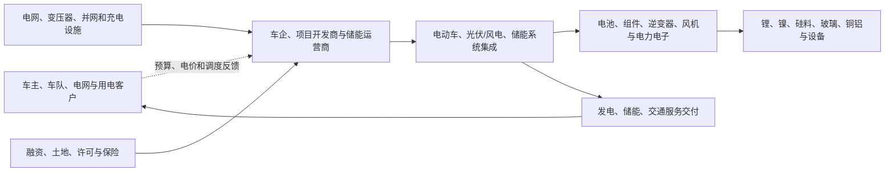

# 新能源行业供需周期分析

分析日期：2026-07-18 00:55:00 +08:00

地理范围：全球，重点观察中国、欧洲、北美及新兴市场的电动车、光伏、风电与储能

数据时效：IEA 的 2025 年实际/估算与 2026 年一季度趋势；宁德时代截至 2026-03-31 的未经审计一季报。预测、政策目标和项目公告均单列，不当作实际产出

行业边界：纳入电动车与动力电池、光伏和风电设备、储能电池/系统、充电和电网接入；不将化石能源、传统汽车和所有电力设备收入并入

研究模式：完整深研

## 0. 一页看懂

### 这个行业是做什么的

新能源把电力生产、储存和交通用能从化石燃料转向太阳能、风能、电池和电动车。付款方并不相同：车主/车队为电动车付款，开发商和电网为发电与储能项目付款，最终能否盈利取决于设备价格、并网、利用率和电价，而不是装机公告本身。[E1][E2][E3]
### 三个最重要的数字

| 数字 | 截止期间 | 它回答什么问题 | 结论 |
|---|---|---|---|
| 全球电动车销量超过 **2,000 万辆**，同比 +20% | 2025 年 | 交通电动化的需求底盘 | 需求继续增长，但中国增速放慢、区域政策差异扩大。[E1] |
| 全球光伏新增超过 **600 GW** | 2025 年 | 发电侧设备需求是否仍大 | 装机创新高，但中国抢装后节奏放缓，不能把全年安装量直接外推。[E2] |
| 全球储能新增接近 **110 GW**，同比约 +40% | 2025 年 | 波动电源配套需求是否在扩大 | 储能是增长最快的电力技术，但收入和盈利取决于项目调度与电价。[E3] |

结论状态：暂定。终端需求与部署实际值较强，但“新能源”内部的价格、库存、利用率和区域电网约束差异过大，不能给出单一供需阶段。

- **周期位置**：电动车、光伏、储能呈“终端扩张与制造端竞争并存”；高装机不等于制造端拥有定价权。[E1][E2][E3]
- **最紧约束**：项目侧的并网、电力消纳、融资和可盈利运营；电池与组件的名义制造能力不是唯一瓶颈。[E2][E5]
- **置信度**：中等。

### 当前判断

新能源终端部署仍扩张，但电动车、光伏和储能的制造利润与项目回报分化，不能用总装机替代有效需求判断。

### v1.6 结论字段

- 周期阶段：终端部署扩张、制造端竞争和项目约束并行
- 结论状态：暂定
- 置信度：中
- 证据截至时间：2026-07-18 21:54:27 +08:00
- 上调条件：电动车销量、并网投运和制造现金流同步改善且价格竞争收敛
- 下调条件：主要市场销量和装机连续下降，同时限电、负电价与库存上升

## 1. 产业链地图



设备、材料、电网和融资是平行输入。货物从材料到系统，钱从车主、电力用户和电网项目反向形成订单；若无法并网或没有可用电价，已交付设备也可能无法形成有效需求。[E2][E5]

### 1.2 各环节详解

#### 1.2.1 电动车与动力电池

**它是干什么的**：车企把电池、电驱和车身做成整车；

**卖给谁**：电池厂把电芯、模组和电池包卖给车企、储能系统厂。

**为什么会卡住**：电池价格、车型竞争、认证和材料采购共同决定利润，而销量增长并不保证电池厂利润同步上升。

**向谁采购**：向材料厂、电芯厂、电驱和功率半导体供应商采购电池、电机、电控与整车零部件。

| 代表企业 | 上市地/代码 | 地位 | 代表性 | 证据 |
|---|---|---|---|---|
| 宁德时代 | 港交所 / 3750；深交所 / 300750 | 动力与储能电池供应商 | 2026 Q1 收入、利润和现金流可核验 | E4 |
| 比亚迪 | 港交所 / 1211；深交所 / 002594 | 电动车与电池一体化厂商 | 代表整车与电池的内部协同 | E1 |

**怎么赚钱、议价能力**：电池厂靠电芯/系统交付收费，车企靠整车销售回款。认证、性能和规模能提高议价，但中国厂商竞争激烈；IEA 明确指出中国制造竞争正压缩部分利润率。[E1]

**进阶视角**：电动车销量不能直接等同于电池出货价值。BEV、PHEV、车型电池容量和电池化学体系不同，且车企可能先去库存或压价。宁德时代 Q1 收入同比 +52.45%、归母净利同比 +48.52%是公司结果，不是行业平均值。[E4]

#### 1.2.2 光伏、风电与电力电子

**它是干什么的**：这一层把组件、逆变器、风机和电缆安装为可发电资产。

**向谁采购**：制造商向材料与设备商采购，开发商和电站业主购买系统

**为什么会卡住**：项目收入最终取决于可发电量、并网和长期电价。

**卖给谁**：向项目开发商、EPC、电网和工商业业主销售组件、风机、逆变器及可并网系统。

| 代表企业 | 上市地/代码 | 地位 | 代表性 | 证据 |
|---|---|---|---|---|
| 隆基绿能 | 上交所 / 601012 | 光伏组件和解决方案 | 代表中国光伏制造与价格竞争 | E2 |
| Vestas | 哥本哈根交易所 / VWS | 风机供应商 | 代表风电设备和项目交付周期 | E5 |

**怎么赚钱、议价能力**：组件和逆变器在标准化产品中更容易面临价格竞争，具备开发、并网、运维能力的项目端则受许可和电网接入保护。2025 年中国近 370 GW 光伏新增中有抢装因素，不能把一次性安装节奏当作持续订单。[E2]

**进阶视角**：装机能力与发电价值不同。IEA 预计 2025—2030 年可再生能源增长很快，但同时指出并网、融资、许可和限电会影响实现；把名义 GW 相加会高估有效供给。[E5]

#### 1.2.3 储能、充电与电网接入

**它是干什么的**：储能系统把电池、变流器和控制软件组合起来，在电价低或发电富余时充电、在需要时放电；

**为什么会卡住**：它们向电池厂和电力电子厂采购，向电网、开发商和车主提供容量、调频或充电服务。

**向谁采购**：向电芯、PCS、BMS、充电设备、变压器和工程服务商采购系统与接入能力。

**卖给谁**：向电网、开发商、工商业业主和车主提供容量、调频、套利或充电服务。

| 代表企业 | 上市地/代码 | 地位 | 代表性 | 证据 |
|---|---|---|---|---|
| 宁德时代 | 港交所 / 3750；深交所 / 300750 | 储能电池供应商 | 报告披露其储能业务与财务结果 | E4 |
| Fluence | 纳斯达克 / FLNC | 储能系统与软件商 | 代表系统交付与运营软件层 | E3 |

**怎么赚钱、议价能力**：项目可通过容量、辅助服务和电价套利获得回报，但不同电力市场规则差异很大。储能新增约 110 GW 是部署指标，不能替代项目现金流或电池 ASP。[E3]

**进阶视角**：储能的“需求强”最容易被误读为电池制造一定紧缺。储能项目需要电网接入、容量市场或套利空间；没有这些，电芯产能增长只会加剧设备端竞争。[E3][E5]

#### 1.2.4 矿物、材料与关键零部件

**它是干什么的**：这一环节把锂、镍、石墨、硅料、稀土、铜铝等资源加工成电池材料、磁材、硅片和电力电子所需的合格投入品。

**向谁采购**：向矿山、盐湖、化工厂和能源供应商采购矿石、盐类、工业硅、试剂、电力及专用加工设备。

**卖给谁**：向电芯厂、组件厂、风机与电机制造商、逆变器和电网设备企业销售经过纯化与规格认证的材料。

**代表企业**：

| 企业/机构 | 上市地/代码或属性 | 角色 | 代表性依据 | 证据 |
|---|---|---|---|---|
| 宁德时代 | 深圳证券交易所 / 300750 | 电池材料采购和电芯制造龙头 | 季度收入利润验证下游交付与采购强度 | E4 |
| IEA | 未上市/机构 | 全球能源与关键矿物研究机构 | 对制造集中、并网和供应链风险给出跨区域口径 | E1 |

**怎么赚钱、议价能力**：材料商赚取资源价差、加工费和高纯度认证溢价；同质材料扩产快时加工费受压，具备低成本资源、稳定能耗和客户认证的产线更能保住利润。

**为什么会卡住**：矿权许可、品位下降、纯化良率和地区合规会使资源储量无法立刻转成合格材料，且技术路线切换可能令旧产线提前贬值。

**进阶视角**：新能源设备降价不必然说明上游更宽松，可能只是制造商压缩加工费；要同时看矿物库存、材料开工和终端装机，才能区分效率进步与利润转移（E1、E5）。

### 1.3 钱怎么流：利益传导

| 问题 | 回答 | 证据 | 缺口 |
|---|---|---|---|
| 谁最终付款？ | 车主/车队、用电客户、电网和电站投资人。 | E1、E2、E3 | 各地区补贴与电价不能合并。 |
| 利润当前集中在哪？ | 有认证、技术与长期客户关系的电池/系统环节可保留利润；标准组件和过剩制造环节未必受益。 | E1、E4 | 无全球统一利润率。 |
| 谁承担资本开支与库存风险？ | 电池、组件制造商和电站/储能项目开发商。 | E2、E4、E5 | 合同取消和库存天数不公开。 |
| 谁有定价权？ | 并网稀缺、项目许可、系统集成和客户认证可提高议价；同质化设备较弱。 | E2、E3 | 缺少统一 ASP 实际序列。 |

## 2. 需求：谁在买、为什么买

- 2025 年全球电动车销量超过 2,000 万辆，占新车约四分之一；中国约占全球增长的一半以上，但本土增速放缓。[E1]
- 2025 年全球可再生新增约 800 GW，光伏超过 600 GW；中国占全球新增逾六成，政策切换造成前高后低的安装节奏。[E2]
- 2025 年储能新增接近 110 GW，是电力技术中增长最快的一类。[E3]

| 终端用途 | 买方 | 动因 | 已兑现还是预期 | 可观察指标 | 证据 |
|---|---|---|---|---|---|
| 电动出行 | 个人、车队、车企 | 燃料成本、车型供给、政策和使用体验 | 2025 销量为实际 | 全球/区域电动车销量 | E1 |
| 清洁电力 | 开发商、电网、企业用户 | 电价、政策、减排和能源安全 | 2025 装机为实际/估算 | 光伏、风电新增与并网 | E2 |
| 电力灵活性 | 电网、储能项目、工商业用户 | 消纳波动电源、调峰和套利 | 2025 新增为实际/估算 | 储能新增、市场规则 | E3 |

**进阶视角**：终端需求存在但区域分化显著：2026 年一季度全球电动车销量约 390 万辆、同比下降 8%，主要来自中国和美国政策变化；欧洲、亚太（除中国）和拉美仍增长。这证明行业不能只看全球总数。[E1]

## 3. 供给：现在有多少、真能用的有多少

| 环节/项目 | 公告产能 | 已安装/已交付 | 已验证、爬坡达标 | 客户/项目支撑 | 释放窗口 | 证据 | 缺口 |
|---|---|---|---|---|---|---|---|
| 电池制造 | 中国占 2025 年全球电芯产量逾 80% | 全球供应链持续出货 | 车企认证因厂而异 | 全球 EV 与储能需求 | 持续 | E1 | 无统一有效电池产能/利用率 |
| 光伏发电 | 2025 年光伏新增逾 600 GW | 已并网部分形成发电 | 并网和限电因地区而异 | 开发商项目 | 项目节奏不同 | E2 | 名义组件产能未披露为统一口径 |
| 储能项目 | 2025 年新增近 110 GW | 已投运项目形成服务 | 取决于调度和市场规则 | 电网/项目合同 | 项目周期不同 | E3 | 缺全球可用 MWh 与收益率序列 |

**进阶视角**：新能源的有效供给首先死在“能否赚钱地使用”，而非工厂能否造出设备。中国出口和产能竞争、并网延迟、限电及融资条件会使产品产量、装机和可用发电/储能服务三者不同步。[E1][E2][E5]

## 4. 供需矛盾与高频信号

| 信号 | 最新值/方向 | 数据期间 | 证据 | 解读 | 缺口 |
|---|---|---|---|---|---|
| 电动车销量 | 超过 2,000 万辆，同比 +20% | 2025 | E1 | 终端需求仍扩张，区域节奏不一。 | 无全球车型库存序列 |
| 光伏新增 | 超过 600 GW，同比约 +12% | 2025 | E2 | 部署强，但中国有抢装与后续放缓。 | 组件价格/库存统一口径缺失 |
| 储能新增 | 近 110 GW，同比约 +40% | 2025 | E3 | 灵活性需求增强。 | 不代表项目收益率 |
| 电池厂盈利 | CATL 收入 1291.31 亿元、归母净利 207.38 亿元 | 2026 Q1 | E4 | 头部公司盈利改善。 | 公司样本不可替代行业均值 |
| 并网与融资 | 预测期存在许可、并网、融资约束 | 2025—2030 预测 | E5 | 项目侧可能限制设备订单兑现。 | 地区级队列数据不完整 |

## 5. 周期位置与传导


### 5.0 v1.6 行业事件锚点

| 阶段/日期 | 性质 | 信号 | 利润池往哪移 | 关键时滞 | 证据 | 下一步验证 |
|---|---|---|---|---|---|---|
| 2024 制造降本 | 已发生 | 电池与组件价格继续下行 | 终端项目 | 降价到新增需求约一季 | E1、E2 | 制造利润是否企稳 |
| 2025 部署创高 | 已发生 | 电动车、光伏与储能新增扩张 | 项目开发与系统集成 | 并网投运晚于设备出货 | E1、E2、E3 | 实际利用和收益 |
| 2026Q1 区域分化 | 已发生 | 政策切换与贸易约束扩大差异 | 渠道和本地化产能 | 政策到订单一至两季 | E4、E5 | 区域销量与价格 |
| 2026H2 现金流检验 | 风险窗口 | 低价能否转为项目回报和制造现金流 | 运营资产或高效制造 | 回款晚于装机 | E6、E7 | 现金流、弃电与库存 |

| 阶段/日期 | 可观察信号 | 利润池迁移 | 关键时滞 | 证据 |
|---|---|---|---|---|
| 2024 制造降本延续 | 电池、组件与设备价格下降，终端装机仍增长 | 从同质制造向低成本产线和项目开发移动 | 降价到新增订单约一至两季 | E1、E2 |
| 2025 部署加速 | 全球可再生新增约800GW，电动车销量超过2000万辆 | 向并网、储能和系统集成扩散 | 制造出货领先并网投运 | E1、E3 |
| 2026 现金流检验 | CATL一季度收入与项目实际部署检验需求兑现 | 有认证、海外渠道和回款能力者更占优 | 新产能利用率在投产后继续爬坡 | E4、E9 |

```text
[交通/用电需求与政策] -> [车企和项目预算] -> [电池、组件、设备订单] -> [制造商收入] -> [扩产与项目建设] -> [认证、并网和调度] -> [价格、利用率和利润]
```

- **阶段**：终端部署扩张、制造端竞争和项目侧约束并行。
- **进入锚点**：2025 年 EV、光伏、储能新增都创高或显著增长，而中国电动车增速放缓、光伏安装节奏受政策切换影响。[E1][E2][E3]
- **预期切换条件**：主要市场 EV 销量连续下降，或光伏/储能新增在没有政策一次性扰动的情况下显著低于 2025；反向则看并网改善和项目收益率提升。
- **什么会证明这个判断错了**：若设备产能明显增长而价格、项目收益和制造商利润均同步改善，则本报告低估了需求弹性；若新增装机维持高位但限电/负电价增加，则本报告高估了有效需求。

**进阶视角：与 2021—2022 年的对照**：上一轮更多受补贴、上游原材料涨价和供应链紧张影响；当前组件与电池成本下降推动部署，但制造竞争、并网和融资成为更显著的约束。公开来源不足以给出所有子行业从扩产到价格下行的统一月数，因此不合成一个周期时钟。[E1][E2][E5]

## 6. 资金动向


### 6.0 v1.6 分层代理证据

| 代理层级（行业/子链/公司） | 工具/主体 | 覆盖节点 | 指标与期间 | 来源 | 结论 | 局限 |
|---|---|---|---|---|---|---|
| 行业 | ICLN | 全球清洁能源上市公司 | 2026-06-30年内总回报25.50%、一年回报58.45% | https://www.ishares.com/us/products/239738/ishares-global-clean-energy-etf | 清洁能源叙事重新扩散 | 混合光伏、风电和电力设备 |
| 子链 | ICLN估值 | 清洁能源制造与运营 | 2026-07-08市盈率18.64倍、市净率2.37倍 | https://www.ishares.com/us/products/239738/ishares-global-clean-energy-etf | 估值并未显示所有子链同等紧张 | 无法拆分电动车、储能与光伏利润 |

| 尝试的来源类型 | 具体来源 | 结果 |
|---|---|---|
| 行业估值分位 | 清洁能源、电动车和太阳能 ETF 页面 | 覆盖范围不同，无法代表整个新能源产业。 |
| ETF 份额/资金流 | 发行方公开页面 | 没有取得跨电池、光伏、风电、储能的可比时间序列。 |
| 龙头价格与盈利剪刀差 | CATL 季报、行业公开行情 | 核验了头部财务，但没有统一历史估值方法。 |

- **市场大概已定价**：清洁电力和电动车长期替代趋势、以及设备成本下降推动部署。
- **市场大概未定价**：并网消纳、区域政策切换、项目回报及制造端能否摆脱竞争压价。
- 以上为产业推断，不构成证券建议；资本市场证据缺口使结论暂定。

## 7. 未来资金可能流向


### 7.0 v1.6 完整情景

| 情景 | 触发条件 | 利润池往哪个环节移动 | 先受益的环节 | 后受益/受损的环节 | 需要盯的证据 |
|---|---|---|---|---|---|
| 基准 | 部署增长且制造价格逐步企稳 | 向并网资源、系统集成和低成本制造移动 | 已获批项目与系统集成 | 制造利润后修复 | 销量、装机、并网、毛利 |
| 上行 | 政策支持、融资成本下降且电网消纳改善 | 向高效设备和运营资产扩散 | 项目开发与电网设备 | 制造环节后受益 | 项目收益率、弃电、订单 |
| 下行 | 需求放缓且贸易壁垒、库存上升 | 向现金流稳定的运营资产集中 | 长约运营方 | 高成本制造和未并网项目受损 | 库存、价格、取消率 |

> 本节是产业传导情景，不构成任何买卖建议、目标价或个股推荐。

> 本节为供需情景推演，不构成买卖建议、目标价或个股推荐。

| 情景 | 触发条件 | 利润池移动 | 先受益 | 后受益/受损 | 观察证据 |
|---|---|---|---|---|---|
| 基准 | EV、光伏和储能按当前趋势增长 | 有认证和项目交付能力的系统端 | 头部电池、并网和储能系统 | 制造扩产随后受益 | E1、E2、E3 |
| 上行 | 并网、融资和政策改善，项目收益上升 | 向开发、储能和电网配套移动 | 储能、电力电子、电网接入 | 设备需求跟随释放 | E3、E5 |
| 下行 | 终端政策退坡、价格竞争或限电加剧 | 由设备制造商向用电方/买方回流 | 低成本运营商相对抗压 | 同质化制造与未并网项目 | E1、E2 |

## 8. 分歧与反证

| 主流叙事 | 本报告判断 | 分歧 | 谁的证据更硬 | 证据 |
|---|---|---|---|---|
| 新能源部署高就代表制造端景气 | 部署、设备出货和制造利润可脱节 | 忽略并网、价格和竞争 | IEA 对竞争与并网约束的说明更直接 | E1、E2、E5 |
| 电池和组件扩产可立即满足需求 | 有效供给取决于认证、项目并网和收益 | 名义产能与可用服务混淆 | 电网与项目约束证据更硬 | E3、E5 |

| 议题 | 支持证据 | 限制证据 | 处理 |
|---|---|---|---|
| 终端需求扩张 | EV、光伏、储能实际/估算新增增长 | 2026 Q1 EV 全球同比下降 | 按地区和子行业分开判断 | E1、E2、E3 |
| 头部盈利改善 | CATL Q1 收入和利润上升 | 行业竞争仍压缩部分利润率 | 不用单家公司替代行业 | E1、E4 |

## 9. 观察哨与跟踪

| 指标 | 基线（数值+日期） | 来源 | 频率 | 正向触发 | 反证触发 | 含义 |
|---|---|---|---|---|---|---|
| 全球电动车销量 | 超过 2,000 万辆，2025 | E1 | 季度/年度 | 2026 向 2,300 万辆预测靠近 | 主要市场持续低于同期 | 验证交通端需求 |
| 光伏新增容量 | 超过 600 GW，2025 | E2 | 年度/季度 | 并网增长且无明显限电 | 新增下降并出现项目取消 | 验证发电侧需求 |
| 储能新增容量 | 近 110 GW，2025 | E3 | 年度/季度 | 新增和市场化收入提升 | 新增上升但收益下降 | 验证灵活性价值 |
| CATL 收入 | 1291.31 亿元，2026 Q1 | E4 | 季度 | 收入增长且现金流改善 | 收入、利润同步转弱 | 观察头部电池兑现 |
| 电网接入兑现 | IEA与IRENA已披露装机及并网资料 | E2、E8 | 季度/年度 | 新增容量按期并网且限电率稳定 | 设备出货增长但投运持续延期 | 区分制造出货与有效能源供给 |

### 9.1 可比时间序列

| 日期 | 指标 | 数值 | 单位 | 来源 | 含义 |
|---|---|---:|---|---|---|
| 2024 年 | 全球可再生新增 | 700 | GW | E2 | 与 2025 同定义的基线 |
| 2025 年 | 全球可再生新增 | 800 | GW | E3 | 需求部署加快，但含多技术 |
| 2024 年 | 全球电动车销量 | 约 17 | 百万辆 | E1 | 与 2025 同定义的销量基线 |
| 2025 年 | 全球电动车销量 | 超过 20 | 百万辆 | E1 | 终端销量继续增长 |

## 10. 术语表

| 术语 | 人话解释 |
|---|---|
| 动力电池 | 给电动车提供能量的可充电电池系统。 |
| 储能 | 在电力富余时充电、需要时放电的设备和系统。 |
| 并网 | 发电或储能项目接入电网并获准运行。 |
| 限电 | 设备能发电但因电网或需求不足不能全部上网。 |
| GW | 吉瓦，表示发电或储能功率规模。 |

## 附录A 证据台账

| 证据ID | 结论 | 类型 | 发布方 | 发布日期 | 访问日期 | 数据期间 | 地域/单位 | 原文链接/定位 | 已打开 | 时效 | 局限 |
|---|---|---|---|---|---|---|---|---|---|---|---|
| E1 | 2025 全球 EV 销量超 2,000 万辆；2026 一季度与区域趋势分化 | 事实/预测 | IEA | 2026 | 2026-07-18 | 2025/2026 Q1 | 全球；辆 | https://www.iea.org/reports/global-ev-outlook-2026/executive-summary ，第 261—302 行 | 是 | 当前 | 2026 全年为预测。 |
| E2 | 2025 光伏新增超 600 GW，中国安装有前高后低节奏 | 事实/估算 | IEA | 2026 | 2026-07-18 | 2025 | 全球；GW | https://www.iea.org/reports/global-energy-review-2026/technology-solar-pv-and-wind ，第 246—261 行 | 是 | 当前 | 部分地区为估算值。 |
| E3 | 2025 储能新增近 110 GW，同比约 +40% | 事实/估算 | IEA | 2026 | 2026-07-18 | 2025 | 全球；GW | https://www.iea.org/reports/global-energy-review-2026/key-findings ，第 248—250 行 | 是 | 当前 | 功率口径不等于可用电量或收益。 |
| E4 | CATL 2026 Q1 营收 1291.31 亿元、归母净利 207.38 亿元 | 事实 | 宁德时代 | 2026-04-15 | 2026-07-18 | 2026 Q1 | 中国；人民币 | https://www.catl.com/en/uploads/1/file/public/202604/20260415221104_m2gm0p01w8.pdf ，第 1—2 页 | 是 | 当前 | 未经审计且公司样本不能代表行业。 |
| E5 | 2025—2030 可再生扩张仍受电网、融资、许可与限电影响 | 预测/事实 | IEA | 2025 | 2026-07-18 | 2025—2030 | 全球；GW/TWh | https://www.iea.org/reports/renewables-2025/renewable-electricity ，第 232—285 行 | 是 | 当前 | 预测受政策与融资变化影响。 |
| E6 | EV 电池生产集中于中国、竞争对部分制造商利润施压 | 事实 | IEA | 2026 | 2026-07-18 | 2025 | 全球 | https://www.iea.org/reports/global-ev-outlook-2026/executive-summary ，第 296—302 行 | 是 | 当前 | 国家份额不代表单一公司利润。 |
| E7 | 电动车销量、车型与区域结构的扩展数据 | 事实 | IEA | 2026 | 2026-07-18 | 2025/2026 Q1 | 全球；辆 | https://www.iea.org/reports/global-ev-outlook-2026/trends-in-electric-cars | 是 | 当前 | 用作行业趋势交叉核验，不替代原始车企销量。 |
| E8 | 2026全球可再生能源装机统计与区域结构 | 2026全球可再生能源装机统计与区域结构 | IRENA | 2025实际 | 2026-07-18 | 2026全球可再生能源装机统计与区域结构 | 2026全球可再生能源装机统计与区域结构 | https://www.irena.org/Publications/2026/Mar/Renewable-capacity-statistics-2026 | 是 | 2025实际 | 装机容量不等于发电量、并网质量或项目利润。 |
| E9 | 2026Q1汽车交付与储能部署 | 2026Q1汽车交付与储能部署 | Tesla | 2026Q1 | 2026-07-18 | 2026Q1汽车交付与储能部署 | 2026Q1汽车交付与储能部署 | https://ir.tesla.com/press-release/tesla-first-quarter-2026-production-deliveries-and-deployments | 是 | 2026Q1 | 单一公司产品与区域组合不能代表全球新能源需求。 |
| E10 | 中国新能源制造与工业生产官方统计 | 中国新能源制造与工业生产官方统计 | 国家统计局 | 2026-05 | 2026-07-18 | 中国新能源制造与工业生产官方统计 | 中国新能源制造与工业生产官方统计 | https://www.stats.gov.cn/english/PressRelease/202607/t20260701_1964047.html | 是 | 2026-05 | 工业总量口径未拆分项目利润和海外库存。 |

## 附录B 数据时效与证据覆盖

| 指标 | 期间 | 状态 | 发布日期 | 访问日期 | 时效 | 来源 | 定位 | 局限 |
|---|---|---|---|---|---|---|---|---|
| 全球 EV 销量 | 2025/2026 Q1 | 实际/趋势/预测 | 2026 | 2026-07-18 | 当前 | E1 | 执行摘要 | 2026 全年不是实际。 |
| 光伏新增 | 2025 | 实际/估算 | 2026 | 2026-07-18 | 当前 | E2 | 技术页 | 含估算地区。 |
| 储能新增 | 2025 | 实际/估算 | 2026 | 2026-07-18 | 当前 | E3 | 关键发现 | 未披露项目收益。 |
| CATL 经营数据 | 2026 Q1 | 实际 | 2026-04-15 | 2026-07-18 | 当前 | E4 | 一季报 | 未审计。 |

## 附录C 证据就绪度与研究执行记录

| 证据轨道 | 状态 | 已打开可靠来源数 | 最低要求 | 证据/缺口 |
|---|---|---:|---:|---|
| 产业链 | 就绪 | 3 | 2 | E1、E2、E3 |
| 需求 | 就绪 | 3 | 3 | E1、E2、E3 |
| 供给与有效产能 | 就绪 | 3 | 3 | E2、E3、E5 |
| 价格/订单/库存/利润 | 就绪 | 3 | 3 | E1、E4、E6 |
| 资本市场预期 | 缺口 | 1 | 2 或明确缺口 | 第 6 节记录尝试与不可比原因 |

| 子任务 | 检索轮次 | 实际使用的路径 | 证据 | 状态 | 缺口/回退 |
|---|---:|---|---|---|---|
| 边界与链条 | 2 | SearXNG + IEA/公司原文 | E1、E2、E3 | 完成 | 无统一行业收入口径。 |
| 需求 | 2 | IEA 原文 | E1、E2、E3 | 完成 | 区域与技术分化。 |
| 有效供给 | 2 | IEA 原文 | E2、E3、E5 | 完成 | 缺统一利用率。 |
| 利润/订单 | 2 | IEA + CATL 原文 | E1、E4、E6 | 完成 | 缺行业 ASP 序列。 |
| 资本市场映射 | 2 | ETF 与公开行情尝试 | E1、E2、E4 | 缺口 | 不强行合并不同子行业。 |

## 尾注

- 供需缺口 ≠ 股价上涨。
- 方向正确 ≠ 时点正确。
- 盈利兑现 ≠ 股价继续上涨。
- AI 回答和搜索摘要不是事实。
- 过期数据不是当前事实。
