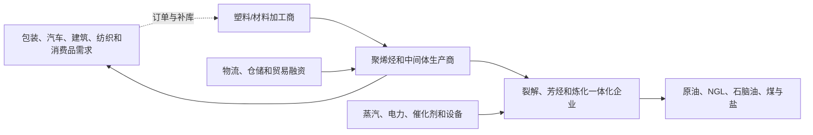

# 化工行业供需周期分析

分析日期：2026-07-18 01:05:00 +08:00

地理范围：全球基础化工，重点观察中国、北美和欧洲的烯烃、聚烯烃、中间体与石化原料

数据时效：公司数据截至 2026 年第一季度；IEA 的 2025 年实际/估算与 2026 年预测。中东地缘冲突后的油价和原料扰动需与长期供需分开

行业边界：纳入乙烯、丙烯、聚乙烯、聚丙烯、芳烃、基础中间体及其原料；农化、精细化工、制药和橡胶仅作相邻行业，不合并为一个价格周期

研究模式：完整深研

## 0. 一页看懂

### 这个行业是做什么的

化工把原油、天然气、煤炭、盐和矿物等原料变成塑料、纤维、溶剂、涂料和各种工业中间体。包装、汽车、建筑、纺织和消费品公司最终付款；化工厂的利润由产品价格减去原料、能源、物流和固定成本决定。需求复苏只有在产能利用率和价差改善时才会变成利润。[E1][E2][E3]
### 三个最重要的数字

| 数字 | 截止期间 | 含义 | 结论 |
|---|---|---|---|
| BASF Chemicals 销售 **26.62 亿欧元**、EBITDA **2.33 亿欧元** | 2026 Q1 | 基础化工盈利 | 销量增、价格降，EBITDA 同比 -30.5%，过剩压价仍在。[E1] |
| LYB 北美烯烃/聚烯烃 EBITDA 环比翻倍 | 2026 Q1 | 价差是否修复 | 低原料成本和聚乙烯涨价改善北美，但欧洲和聚丙烯并不同步。[E2] |
| 2025 油品需求增长仅 **0.65 mb/d** | 2025 | 石化原料需求环境 | 石脑油、LPG、乙烷需求受贸易扰动拖累；原料需求不是强复苏。[E3] |

结论状态：暂定。全球基础化工仍是“局部价差修复与全球过剩并存”，无法用一家公司或短期油价冲击判断整体拐点。

- **周期位置**：供给竞争压低产品价格，北美部分聚乙烯价差修复；欧洲高成本资产仍承压。[E1][E2]
- **最紧约束**：不是原料可得性本身，而是过剩产能出清、区域成本曲线和终端补库能否持续。
- **置信度**：中等。

### 当前判断

化工仍处于过剩压价与区域价差修复并存阶段，北美部分聚烯烃改善尚不足以证明全球盈利周期反转。

### v1.6 结论字段

- 周期阶段：全球过剩背景中的区域性价差修复
- 结论状态：暂定
- 置信度：中
- 证据截至时间：2026-07-18 21:54:27 +08:00
- 上调条件：主要产品价格、开工率与现金利润跨区域连续两个季度同步改善
- 下调条件：新增产能继续投放且价格、库存和利润再次同向恶化

## 1. 产业链地图



原料、能源、设备和物流并行进入生产。产品从裂解到聚合再到加工，订单反向传递；油价上涨可能提高产品价格，也可能先压缩下游需求和原料可得性。[E2][E4]

### 1.2 各环节详解

#### 1.2.1 原料与裂解

**它是干什么的**：炼化和裂解装置把石脑油、乙烷、丙烷等原料转化为乙烯、丙烯和芳烃。

**向谁采购**：它们从油气生产商采购

**卖给谁**：卖给聚合物与中间体厂

**为什么会卡住**：原料结构、能源成本和装置利用率决定成本曲线。

| 代表企业 | 上市地/代码 | 地位 | 证据 |
|---|---|---|---|
| LyondellBasell | 纽约证券交易所 / LYB | 北美与欧洲烯烃、聚烯烃一体化 | E2 |
| BASF | 法兰克福交易所 / BAS | 欧洲与中国石化/中间体综合厂 | E1 |

**怎么赚钱、议价能力**：裂解利润取决于产品与原料价差，低成本乙烷路线在某些地区更有弹性。IEA 的 2026 年油市冲击造成原料紧张与需求下修并存，短期裂解利润不能代表长期结构改善。[E4]

**进阶视角**：低油价不一定利好所有石化厂。对石脑油路线，原料下跌可改善成本；对产品需求疲弱或原料供应受扰的地区，价差反而会恶化。[E1][E4]

#### 1.2.2 聚烯烃与基础中间体

**它是干什么的**：这一环节把乙烯、丙烯等聚合为聚乙烯、聚丙烯，或制成醇、胺、酸等中间体，卖给包装、汽车、建筑和工业客户。

**卖给谁**：标准品更受全球供给和贸易影响，差异化牌号与客户认证具有较高转换成本。

**向谁采购**：向裂解装置和能源供应商采购乙烯、丙烯、芳烃及公用工程。

| 代表企业 | 上市地/代码 | 地位 | 证据 |
|---|---|---|---|
| BASF | 法兰克福交易所 / BAS | 石化与中间体生产商 | E1 |
| LyondellBasell | 纽约证券交易所 / LYB | 聚乙烯、聚丙烯供应商 | E2 |

**怎么赚钱、议价能力**：产品售价上升、原料成本下降和高开工共同改善价差。BASF Q1 化工销量同比 +11.4%，但价格 -13.9%，显示增加出货未能抵消过剩压力。[E1]

**为什么会卡住**：库存回补会让季度销量变好，却不等于终端消耗已恢复。。

**进阶视角**：库存回补会让季度销量变好，却不等于终端消耗已恢复。BASF 管理层也把 2026 年初的量增与三月变化区分，未把它直接定义为持续需求复苏。[E6]

#### 1.2.3 下游加工、物流与终端

**它是干什么的**：加工商把树脂和中间体变成包装、零部件、纺织纤维和工业材料；

**为什么会卡住**：加工商最终面对品牌商、汽车厂和建筑客户，因此补库、消费和出口决定其采购节奏。

**向谁采购**：向树脂、中间体、添加剂、包装和物流供应商采购加工所需原料与交付服务。

**卖给谁**：向品牌商、汽车、建筑、纺织、农业和工业客户销售包装、零部件与功能材料。

| 代表企业 | 上市地/代码 | 地位 | 证据 |
|---|---|---|---|
| Berry Global | 纽约证券交易所 / BERY | 包装加工商 | E3 |
| BASF | 法兰克福交易所 / BAS | 向多类工业客户供货 | E1 |

**怎么赚钱、议价能力**：下游能否转嫁树脂价格取决于合同与产品差异化。贸易扰动可同时打断原料输入和出口需求，因此库存、运费和客户订单需要共同观察。[E3][E4]

**进阶视角**：石化最终需求长期仍重要，IEA 预计石化将成为油品需求增长的主要来源之一；这不是对 2026 年任何一个产品价差的预测，更不能覆盖高成本地区的关停压力。[E5]

#### 1.2.4 特种化学品与客户认证

**它是干什么的**：特种化学品企业将基础分子通过配方、纯化和应用开发转成涂料、催化剂、电子化学品、添加剂及农业解决方案。

**向谁采购**：向基础化工厂采购溶剂、单体和中间体，并采购高纯原料、试验设备、能源及合规服务。

**卖给谁**：向汽车、电子、半导体、农业、医药和高端制造客户销售经过配方验证的功能材料与技术服务。

**代表企业**：

| 企业/机构 | 上市地/代码或属性 | 角色 | 代表性依据 | 证据 |
|---|---|---|---|---|
| BASF | 法兰克福交易所 / BAS | 综合化工与特种配方供应商 | 财报同时披露销量、价格和区域经营变化 | E1 |
| IEA | 未上市/机构 | 原料与石化需求研究机构 | 可核对油品、石化需求和原料冲击的不同口径 | E4 |

**怎么赚钱、议价能力**：利润来自配方性能、认证服务和客户更换成本，而非只赚大宗价差；能嵌入客户工艺并稳定供货的品种比标准树脂更有议价力。

**为什么会卡住**：客户验证往往跨越多个生产周期，杂质、法规或配方稳定性任何一项不合格都会使名义装置无法成为可替代供给。

**进阶视角**：基础化工过剩和高认证材料紧缺可以同时发生；若只看行业总开工率，会漏掉利润向小批量、高验证门槛产品迁移的结构变化（E1、E3）。

### 1.3 钱怎么流：利益传导

| 问题 | 回答 | 证据 | 缺口 |
|---|---|---|---|
| 谁最终付款？ | 包装、汽车、建筑和消费品客户。 | E1、E3 | 终端品类采购额未统一披露。 |
| 利润在哪里？ | 低成本原料和一体化装置可在价差修复时获益；高成本、标准品产能承压。 | E1、E2 | 缺全球统一成本曲线。 |
| 谁承担库存与 CapEx 风险？ | 裂解、聚合厂和贸易商承担原料/成品库存，项目方承担扩产折旧。 | E1、E2 | 客户库存天数不公开。 |
| 谁有定价权？ | 差异化材料、区域紧平衡与认证客户较强；通用聚烯烃较弱。 | E1、E2 | 缺 ASP 序列。 |

## 2. 需求：谁在买、为什么买

- 2025 年石脑油、LPG、乙烷等石化原料需求在二季度受贸易扰动影响最明显。[E3]
- LYB 观察到聚烯烃季节性需求改善和价格上升，但同时以约 85%/75% 的区域开工率匹配需求。[E2]
- IEA 长期情景中，石化是油品需求增长的重要来源，但这属于结构预测。[E5]

| 终端用途 | 买方 | 动因 | 已兑现还是预期 | 指标 | 证据 |
|---|---|---|---|---|---|
| 包装/消费品 | 加工商与品牌商 | 食品、日化与物流包装 | 季度订单/补库 | 聚烯烃价格与销量 | E1、E2 |
| 汽车/建筑 | 零部件厂、开发商 | 生产与开工周期 | 分化 | 工业需求与项目量 | E1 |
| 纤维/工业材料 | 纺织和工业客户 | 出口与制造活动 | 分化 | 原料需求、库存 | E3 |

**进阶视角**：最容易误读的是把油价/地缘冲突造成的价格上升称为需求复苏。2026 年 IEA 同时下调石化需求并提示原料受限；价格变化必须与销量、开工和库存同看。[E4]

## 3. 供给：现在有多少、真能用的有多少

| 环节/项目 | 公告产能 | 已安装 | 已验证/开工 | 客户支撑 | 窗口 | 证据 | 缺口 |
|---|---|---|---|---|---|---|---|
| BASF 湛江一体化基地裂解装置 | 已投产项目 | 2026 年初启动 | 增加 Q1 石化销量 | 无单客户披露 | 已开始 | E1 | 新增产量和利用率未披露 |
| LYB 北美/欧洲资产 | 存量装置 | 已运营 | 计划以约 85%/75% 运行 | 以市场需求匹配 | 2026 Q1 | E2 | 企业开工不代表行业开工 |
| 全球石化能力 | 中国和美国持续建设 | 各地区差异大 | 高成本地区可能退出 | 终端需求分化 | 2026—2030 | E5 | 无统一有效产能数据库 |

**进阶视角**：名义裂解能力不能直接视为供给。检修、原料、环保、现金成本和主动降负都会让实际开工低于设计产能；BASF 的新增装置提高量，却在全球过剩下压低贡献利润。[E1][E2]

## 4. 供需矛盾与高频信号

| 信号 | 最新值/方向 | 期间 | 证据 | 解读 | 缺口 |
|---|---|---|---|---|---|
| BASF 化工价格 | 同比 -13.9% | 2026 Q1 | E1 | 全球过剩压价仍强。 | 无产品 ASP 明细 |
| BASF 化工销量 | 同比 +11.4% | 2026 Q1 | E1 | 新产能和出货增加。 | 不等于终端消耗 |
| LYB 北美聚乙烯价差 | 环比改善 | 2026 Q1 | E2 | 原料成本与价格支持局部修复。 | 无统一绝对价差 |
| LYB 运行率 | 美洲约 85%、EAI 约 75% | 2026 Q1 计划 | E2 | 企业主动按需求降负。 | 不是全行业利用率 |
| 石化原料需求 | 受贸易/高价冲击 | 2025—2026 | E3、E4 | 需求与原料同时受扰。 | 月度产品库存缺失 |

## 5. 周期位置与传导


### 5.0 v1.6 行业事件锚点

| 阶段/日期 | 性质 | 信号 | 利润池往哪移 | 关键时滞 | 证据 | 下一步验证 |
|---|---|---|---|---|---|---|
| 2024 亚洲新增产能 | 已发生 | 乙烯和衍生物供给继续释放 | 利润向低成本原料端集中 | 装置到市场供给数月 | E3、E4 | 开工率与出口 |
| 2025 贸易分化 | 已发生 | 区域成本和关税改变货物流向 | 北美低成本产能 | 运费与套利窗口变化快 | E2、E5 | 价差和库存 |
| 2026Q1 局部修复 | 已发生 | 北美聚乙烯价差改善但欧洲承压 | 北美烯烃聚烯烃 | 销量到利润约一季 | E1、E2 | BASF与LYB利润 |
| 2026H2 新增供给检验 | 预测 | 新装置与检修结束可能重压价格 | 现金成本最低装置 | 供给释放快于需求培育 | E4、E6 | 价格、开工与现金利润 |

| 阶段/日期 | 可观察信号 | 利润池迁移 | 关键时滞 | 证据 |
|---|---|---|---|---|
| 2024 新增装置释放 | 标准品供给增长快于终端消化 | 利润由高成本基础品向低成本原料端转移 | 投产到稳定负荷跨越数月 | E3、E4 |
| 2025 需求与贸易分化 | 原料需求偏弱、地区贸易流重新配置 | 向具备区域成本和物流优势的装置集中 | 船期和客户去库存造成季度滞后 | E3、E6 |
| 2026Q1 价差仍承压 | BASF化工价格同比下降、LYB区域开工分化 | 特种配方和认证服务相对抗压 | 调价通常早于年度合同和利润修复 | E1、E2 |

```text
[终端消费与工业需求] -> [加工商补库] -> [树脂/中间体订单] -> [裂解价差和化工利润] -> [检修、降负或扩产] -> [实际开工] -> [价格和库存再平衡]
```

- **阶段**：全球过剩背景中的区域性价差修复，尚非广泛盈利复苏。
- **进入锚点**：BASF 价格下跌、利润下降与 LYB 北美价差改善同时出现，说明区域和产品分化。[E1][E2]
- **预期切换条件**：BASF 化工价格跌幅收窄并伴随利润改善、LYB 开工率上升且终端订单增长；反向是价格下跌、库存累积和进一步降负。
- **什么会证明这个判断错了**：若全球新增能力继续投放但价格、开工和利润同步持续改善，则需求弹性被低估；若油价上升但产品销量与价差下滑，则短期供给扰动被错误当作景气。

**进阶视角：与 2021—2022 年对照**：上一轮的高价差受供应链中断、能源冲击和库存重建推动；当前主要矛盾是全球产能竞争和区域成本差异。两轮都可能被原料冲击放大，但当前的新增能力使价格上行更难持续。[E1][E5]

## 6. 资金动向


### 6.0 v1.6 分层代理证据

| 代理层级（行业/子链/公司） | 工具/主体 | 覆盖节点 | 指标与期间 | 来源 | 结论 | 局限 |
|---|---|---|---|---|---|---|
| 行业 | XLB | 美国材料与化工龙头 | 截至2026-06-30基准一年回报13.17% | https://www.ssga.com/us/en/individual/etfs/state-street-materials-select-sector-spdr-etf-xlb | 材料板块已有正回报但并非化工全面复苏 | 混合金属、包装和建材 |
| 公司 | BASF Chemicals | 基础化工 | 2026Q1 EBITDA 2.33亿欧元、同比下降30.5% | E1 | 经营证据仍未确认全球盈利反转 | 欧洲公司样本不代表北美价差 |

| 尝试的来源类型 | 具体来源 | 结果 |
|---|---|---|
| 化工指数估值 | 化工 ETF 与行业指数公开页 | 地域、产品和公司边界不一致。 |
| ETF 份额/资金流 | 基金发行方页面 | 无法取得全球基础化工可比序列。 |
| 龙头盈利与价格 | BASF、LYB 财报及行情页 | 取得盈利样本，缺统一估值历史。 |

- **已定价**：过剩、欧洲高成本压力和短期原料波动。
- **未定价**：真实终端补库、关停速度和中东原料扰动持续时间。
- 这只是产业映射，不构成任何投资建议。

## 7. 未来资金可能流向


### 7.0 v1.6 完整情景

| 情景 | 触发条件 | 利润池往哪个环节移动 | 先受益的环节 | 后受益/受损的环节 | 需要盯的证据 |
|---|---|---|---|---|---|
| 基准 | 需求温和而新增供给继续释放 | 向低成本原料和特种产品移动 | 低成本一体化装置 | 高成本基础品受损 | 价差、开工率、E1、E2 |
| 上行 | 检修增加且终端补库持续 | 向基础化工和物流套利扩散 | 现货紧张产品 | 下游改性材料后受益 | 库存、订单、出口 |
| 下行 | 新增装置集中投产且需求走弱 | 向现金流和轻资产服务集中 | 特种化学与分销 | 高成本大宗装置受损 | 价格、负荷、现金利润 |

> 本节是产业传导情景，不构成任何买卖建议、目标价或个股推荐。

> 情景推演不构成买卖建议、目标价或个股推荐。

| 情景 | 触发条件 | 利润池移动 | 先受益 | 后受益/受损 | 观察证据 |
|---|---|---|---|---|---|
| 基准 | 需求温和、过剩持续 | 低成本一体化厂 | 原料优势裂解与差异化材料 | 高成本通用品 | E1、E2 |
| 上行 | 终端补库、关停加速、库存下降 | 向聚合和加工端扩散 | 低成本聚烯烃 | 扩产项目后受益 | 价格、开工、库存 |
| 下行 | 贸易或原料冲击压低需求 | 向终端买方回流 | 现金流稳健服务 | 标准树脂和高成本装置 | E3、E4 |

## 8. 分歧与反证

| 主流叙事 | 本报告判断 | 分歧 | 谁的证据更硬 | 证据 |
|---|---|---|---|---|
| 油价上涨必然利好化工 | 原料、物流与需求可能同时受损 | 只看产品价格 | 分部价差、销量和开工更直接 | E1、E2、E4 |
| 销量增加即行业复苏 | 新产能与补库也会推高销量 | 忽略价格和边际利润 | BASF 量升价跌的分部数据更硬 | E1 |

| 议题 | 支持证据 | 反对证据 | 处理 |
|---|---|---|---|
| 局部修复 | LYB 北美价差改善 | BASF 全球价格/利润承压 | 维持区域性判断 | E1、E2 |
| 长期石化需求 | IEA 长期油品需求结构 | 2025—2026 原料需求受扰 | 长期结构不替代短期周期 | E3、E5 |

## 9. 观察哨与跟踪

| 指标 | 基线 | 来源 | 频率 | 正向触发 | 反证触发 | 含义 |
|---|---|---|---|---|---|---|
| BASF 化工价格 | 同比 -13.9%，2026 Q1 | E1 | 季度 | 跌幅收窄并转正 | 继续双位数下跌 | 过剩是否缓解 |
| BASF 化工 EBITDA | 2.33 亿欧元，2026 Q1 | E1 | 季度 | 高于 2.33 亿且销量稳 | 低于基线 | 价差兑现 |
| LYB 开工率 | 美洲 85%、EAI 75% | E2 | 季度 | 提升且价差扩大 | 继续降负 | 需求与供给平衡 |
| 石化原料需求 | 2025 增长偏弱 | E3 | 月度/年度 | 乙烷/LPG/石脑油需求恢复 | 继续受贸易冲击 | 下游实际消耗 |
| Dow销量与本地价格 | 2026 Q1公司披露基线 | E7 | 季度 | 销量、价格与现金流同步改善 | 仅销量恢复而价格和利润继续下行 | 交叉验证综合化工公司景气修复 |

### 9.1 可比时间序列

| 日期 | 指标 | 数值 | 单位 | 来源 | 含义 |
|---|---|---:|---|---|---|
| 2025 Q1 | BASF Chemicals EBITDA before special items | 336 | 百万欧元 | E1 | 同一分部基线 |
| 2026 Q1 | BASF Chemicals EBITDA before special items | 233 | 百万欧元 | E1 | 价格/利润仍受压 |
| 2025 Q1 | BASF Chemicals 销售 | 2777 | 百万欧元 | E1 | 同一定义销售基线 |
| 2026 Q1 | BASF Chemicals 销售 | 2662 | 百万欧元 | 销量增加未抵消价格下降 |

## 10. 术语表

| 术语 | 人话解释 |
|---|---|
| 裂解 | 高温把石脑油或乙烷等原料分解成乙烯、丙烯等基础化学品。 |
| 聚烯烃 | 以乙烯或丙烯制成的塑料，如聚乙烯、聚丙烯。 |
| 价差 | 产品售价减去原料和能源等关键成本后的空间。 |
| 开工率 | 工厂实际生产能力占设计能力的比例。 |
| NGL | 天然气液体，可作为石化裂解原料。 |

## 附录A 证据台账

| 证据ID | 结论 | 类型 | 发布方 | 发布日期 | 访问日期 | 期间 | 地域/单位 | 原文链接/定位 | 已打开 | 时效 | 局限 |
|---|---|---|---|---|---|---|---|---|---|---|---|
| E1 | BASF Chemicals 销售、价格、销量和 EBITDA 分部数据 | 事实 | BASF | 2026-04 | 2026-07-18 | 2026 Q1 | 全球；欧元 | https://www.basf.com/global/en/investors/basf-at-a-glance/key-financial-data/segment-data-and-regional-results | 是 | 当前 | 单一公司分部。 |
| E2 | LYB 北美价差、欧洲需求和目标运行率 | 事实/指引 | LyondellBasell | 2026-05-01 | 2026-07-18 | 2026 Q1 | 美洲/欧洲；美元 | https://www.lyondellbasell.com/en/who-we-are/updates-events/corporate--financial-news/lyondellbasell-reports-first-quarter-2026-earnings | 是 | 当前 | 企业经营不代表行业。 |
| E3 | 2025 石化原料需求受贸易扰动拖累 | 事实 | IEA | 2026 | 2026-07-18 | 2025 | 全球 | https://www.iea.org/reports/global-energy-review-2026/oil | 是 | 当前 | 只覆盖油基原料。 |
| E4 | 2026 石化需求与原料供应受冲击 | 预测/事实 | IEA | 2026-05 | 2026-07-18 | 2026 | 全球 | https://www.iea.org/reports/oil-market-report-may-2026 | 是 | 当前 | 地缘情景变化快。 |
| E5 | 石化在长期油品需求中的结构角色与新增能力压力 | 预测 | IEA | 2025 | 2026-07-18 | 2024—2030 | 全球 | https://www.iea.org/reports/oil-2025/executive-summary | 是 | 当前 | 长期预测不能替代季度价差。 |
| E6 | BASF 对量增是否来自补库的管理层讨论 | 事实线索 | BASF | 2026-04-30 | 2026-07-18 | 2026 Q1 | 全球 | https://www.basf.com/dam/jcr%3Af905567a-45e9-4513-99aa-0963835720d9/basf/www/global/documents/en/investor-relations/calendar-and-publications/presentations-en-de/2026/BASF_Transcript_Q1-2026_sorted-by-topic.pdf | 是 | 当前 | 管理层判断不是行业统计。 |
| E7 | 2026Q1销量、价格、利润及终端市场变化 | 2026Q1销量、价格、利润及终端市场变化 | Dow | 2026Q1 | 2026-07-18 | 2026Q1销量、价格、利润及终端市场变化 | 2026Q1销量、价格、利润及终端市场变化 | https://investors.dow.com/en/news/news-details/2026/Dow-reports-first-quarter-2026-results/default.aspx | 是 | 2026Q1 | 公司产品组合不能代表所有基础和特种化学品。 |
| E8 | 中国化工相关工业增加值与产量官方数据 | 中国化工相关工业增加值与产量官方数据 | 国家统计局 | 2026-05 | 2026-07-18 | 中国化工相关工业增加值与产量官方数据 | 中国化工相关工业增加值与产量官方数据 | https://www.stats.gov.cn/english/PressRelease/202606/t20260617_1963964.html | 是 | 2026-05 | 宏观工业口径没有统一产品价差和库存。 |

## 附录B 数据时效与证据覆盖

| 指标 | 期间 | 状态 | 发布日期 | 访问日期 | 时效 | 来源 | 定位 | 局限 |
|---|---|---|---|---|---|---|---|---|
| BASF Chemicals | 2026 Q1 | 实际 | 2026-04 | 2026-07-18 | 当前 | E1 | 分部表 | 欧洲/中国组合。 |
| LYB 聚烯烃 | 2026 Q1 | 实际/指引 | 2026-05-01 | 2026-07-18 | 当前 | E2 | 业绩稿 | 公司口径。 |
| 石化原料需求 | 2025/2026 | 实际/预测 | 2026 | 2026-07-18 | 当前 | E3、E4 | IEA 油市页 | 受地缘情景影响。 |

## 附录C 证据就绪度与研究执行记录

| 证据轨道 | 状态 | 已打开可靠来源数 | 最低要求 | 证据/缺口 |
|---|---|---:|---:|---|
| 产业链 | 就绪 | 3 | 2 | E1、E2、E5 |
| 需求 | 就绪 | 3 | 3 | E2、E3、E5 |
| 供给与有效产能 | 就绪 | 3 | 3 | E1、E2、E5 |
| 价格/订单/库存/利润 | 就绪 | 3 | 3 | E1、E2、E4 |
| 资本市场预期 | 缺口 | 1 | 2 或明确缺口 | 第 6 节记录尝试 |

| 子任务 | 检索轮次 | 路径 | 证据 | 状态 | 缺口 |
|---|---:|---|---|---|---|
| 链条与边界 | 2 | SearXNG + 公司/IEA 原文 | E1、E2、E5 | 完成 | 无全球收入总额。 |
| 需求 | 2 | IEA + 公司原文 | E2、E3、E5 | 完成 | 终端库存不公开。 |
| 供给 | 2 | 公司分部及长期报告 | E1、E2、E5 | 完成 | 有效开工口径不统一。 |
| 资本市场 | 2 | ETF/行情尝试 | E1、E2 | 缺口 | 无可比跨区域序列。 |

## 尾注

- 供需缺口 ≠ 股价上涨。
- 方向正确 ≠ 时点正确。
- 盈利兑现 ≠ 股价继续上涨。
- AI 回答和搜索摘要不是事实。
- 过期数据不是当前事实。
