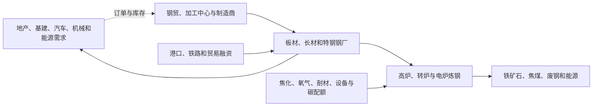

# 钢铁行业供需周期分析

分析日期：2026-07-18 01:15:00 +08:00

地理范围：全球，重点观察中国、印度、欧洲、北美的粗钢生产、终端需求与贸易流

数据时效：worldsteel 产量截至 2026 年 4 月、需求预测截至 2026 年 4 月；ArcelorMittal 截至 2026-03-31 的一季报。预测与实际产量分开

行业边界：纳入铁矿石、焦煤/焦炭、炼铁炼钢、热轧/冷轧/长材、废钢电炉和钢材流通；采矿、机械、房地产和汽车只作为上下游

研究模式：完整深研

## 0. 一页看懂

### 这个行业是做什么的

钢铁把铁矿石、焦炭或废钢变成用于建筑、汽车、机械、能源和基础设施的板材、长材和特钢。开发商、制造商和政府项目最终付款；钢厂利润取决于钢价与铁矿、焦煤、电力、运费之间的价差，以及高炉或电炉的实际开工。[E1][E2][E3]
### 三个最重要的数字

| 数字 | 截止期间 | 含义 | 结论 |
|---|---|---|---|
| 全球钢材需求预计 **1,724 Mt**，同比 **+0.3%** | 2026 年预测 | 终端需求 | 仅温和增长，且地区差异很大。[E1] |
| 全球粗钢产量 **153.4 Mt**，同比 **-1.9%** | 2026 年 4 月 | 实际供给 | 月度产量仍下降，不能把需求触底预测当成供给已出清。[E4] |
| ArcelorMittal 吨钢 EBITDA **131 美元/吨** | 2026 Q1 | 企业利润 | 同比改善，但政策、地区结构和公司资产组合影响很大。[E2] |

结论状态：暂定。钢铁处在需求低位企稳、供给实际收缩与区域贸易保护重塑并行的阶段；全球供需尚未证实全面反转。

- **周期位置**：中国地产拖累减弱、印度增长强，欧洲/北美依赖政策与基建；产量仍在压缩。[E1][E3][E4]
- **最紧约束**：终端地产/制造订单和区域贸易流，而不是单纯名义炼钢能力。
- **置信度**：中等。

### 当前判断

钢铁处于需求低位企稳、粗钢供给收缩与地区政策分化并存阶段，吨钢利润修复尚未形成全球同步上行。

### v1.6 结论字段

- 周期阶段：需求低位企稳预期与供给实际收缩并存
- 结论状态：暂定
- 置信度：中
- 证据截至时间：2026-07-18 21:54:27 +08:00
- 上调条件：钢厂发货、价格和吨钢利润连续改善且库存不累积
- 下调条件：需求预测下修、库存上升并触发新一轮减产

## 1. 产业链地图



铁矿、煤焦、废钢、能源和碳配额并行进入炼钢。货物由原料到钢材，订单从终端反向传递；设计产能只有在原料、利润和订单同时允许时才会成为有效供给。[E2][E3]

### 1.2 各环节详解

#### 1.2.1 原料、焦化与废钢

**它是干什么的**：铁矿石与焦煤进入高炉—转炉路线，废钢进入电炉路线。

**卖给谁**：矿山和贸易商向钢厂销售，钢厂受原料价格、运输和能源成本影响

**为什么会卡住**：废钢与绿色电力可降低部分碳排放，但并不消除电价和废钢供应约束。

**向谁采购**：向铁矿、焦煤、废钢、合金、运输和能源供应商采购高炉与电炉所需原料。

**怎么赚钱、议价能力**：矿山和焦化企业赚资源及加工价差，废钢商赚回收分选价差；钢厂利润取决于原料成本能否向钢价转嫁。

| 代表企业 | 上市地/代码 | 地位 | 证据 |
|---|---|---|---|
| Vale | 纽约证券交易所 / VALE | 铁矿石供应商 | E2 |
| ArcelorMittal | 纽约证券交易所 / MT | 矿山与钢厂一体化 | E2 |

**进阶视角**：原料下跌未必提高利润；若钢价和发货量下降更快，钢厂价差仍会收窄。企业矿石产量和钢材发货必须与钢价、能源和库存结合看。[E2]

#### 1.2.2 炼钢与轧钢

**它是干什么的**：钢厂把铁水或废钢炼成粗钢，再轧成板材、长材和特钢，向贸易商、汽车、建筑与设备客户出售。

**为什么会卡住**：电炉更灵活但依赖废钢和电力。

**向谁采购**：向矿山、焦化厂、废钢商、合金和能源企业采购铁水、电炉所需金属料及公用工程。

**卖给谁**：向钢贸、汽车、建筑、家电、机械与船舶客户销售板材、长材和特钢。

| 代表企业 | 上市地/代码 | 地位 | 证据 |
|---|---|---|---|
| ArcelorMittal | 纽约证券交易所 / MT | 全球一体化钢厂 | E2 |
| 宝武 | 非上市 | 中国大型钢企 | 中国产量与需求的重要代表，未用未核验公司数据量化 | E3 |

**怎么赚钱、议价能力**：板材和高附加值钢种更依赖客户认证；通用长材与热轧更受区域供需和贸易影响。ArcelorMittal Q1 发货 12.8 Mt、粗钢产量 13.3 Mt，显示其实际交付和生产均低于一年前水平。[E2]

**进阶视角**：CBAM 和欧洲关税配额可能改善区域本地供给利用率，但这是政策预期，不是全球钢材需求已经增长的事实。[E2]

#### 1.2.3 加工、贸易与终端使用

**它是干什么的**：加工中心按规格剪切、配送并提供库存，终端将钢材装入建筑、汽车、家电、船舶和设备。

**向谁采购**：它们从钢厂采购，最终依赖房地产开工、公共基建和制造出口。

**卖给谁**：向建筑承包商、汽车与家电厂、机械船舶企业和出口客户销售加工配送后的钢材。

**怎么赚钱、议价能力**：加工中心赚取剪切、仓储和配送服务费，贸易商赚区域与期限价差；认证产品更能覆盖库存和信用成本。

| 代表企业 | 上市地/代码 | 地位 | 证据 |
|---|---|---|---|
| ArcelorMittal | 纽约证券交易所 / MT | 向汽车、建筑等多终端销售 | E2 |
| Tata Steel | 印度国家证券交易所 / TATASTEEL | 印度增长市场钢厂 | E1 |

**为什么会卡住**：worldsteel 预计中国 2026 需求 -1.5%、印度 +7.4%，两者不能用全球 +0.3% 平均掉。

**进阶视角**：worldsteel 预计中国 2026 需求 -1.5%、印度 +7.4%，两者不能用全球 +0.3% 平均掉。对钢厂而言，产品、市场和贸易壁垒决定利润池比全球平均需求更重要。[E1]

#### 1.2.4 低碳电炉、氢冶金与循环利用

**它是干什么的**：电炉使用废钢和电力炼钢，直接还原铁与氢冶金路线则尝试降低高炉焦炭依赖，并把低碳属性纳入钢材交付。

**向谁采购**：向废钢回收商、电力公司、气体供应商和直接还原铁项目采购金属料、能源与低碳工艺设备。

**卖给谁**：向汽车、机械、建筑和希望降低范围三排放的制造客户销售电炉钢或带可追溯碳强度的钢材。

**代表企业**：

| 企业/机构 | 上市地/代码或属性 | 角色 | 代表性依据 | 证据 |
|---|---|---|---|---|
| ArcelorMittal | 纽约证券交易所 / MT | 高炉与低碳项目并行的一体化钢企 | 实际发货、产量及政策风险在同一财报披露 | E2 |
| worldsteel | 未上市/机构 | 全球钢铁工艺与需求统计机构 | 可比较不同地区转炉、电炉和钢需口径 | E1 |

**怎么赚钱、议价能力**：电炉利润取决于废钢、电价和区域钢价，低碳钢还需客户愿意为可追溯减排支付溢价；政策配额可改善区域价差但不是永久需求。

**为什么会卡住**：高品质废钢、低价稳定电力、直接还原铁和客户认证必须同时到位，单独建成电炉并不代表能低成本满产。

**进阶视角**：低碳投资会改变原料结构和区域成本曲线，却不会自动消除总量过剩；判断利润要把政策保护、利用率与终端合同分开，而不能只统计公告产能（E1、E2）。

### 1.3 钱怎么流：利益传导

| 问题 | 回答 | 证据 | 缺口 |
|---|---|---|---|
| 谁最终付款？ | 地产开发、基建、汽车、机械和能源项目。 | E1 | 不同终端的合同额未统一披露。 |
| 利润集中在哪？ | 成本低、产品差异化和本地市场保护较强的钢厂；矿山在原料紧张时也可能受益。 | E2 | 无全球统一成本曲线。 |
| 谁承担库存与 CapEx 风险？ | 钢厂、贸易商和加工中心承担钢材/原料库存，钢厂承担高炉与电炉折旧。 | E2、E3 | 库存天数未公开。 |
| 谁有定价权？ | 认证板材、区域紧平衡和贸易壁垒下的本地厂较强。 | E2 | 缺分钢种 ASP 序列。 |

## 2. 需求：谁在买、为什么买

- worldsteel 预计全球需求 2026 年仅增 0.3%，中国需求收缩放缓，印度需求预计 +7.4%。[E1]
- 发达经济体预计 2027 年才更普遍增长，当前仍受能源、利率和贸易风险影响。[E1]
- 2025 年中国钢材需求官方数字下降 7.1%，说明地产调整的基数压力仍大。[E1]

| 用途 | 买方 | 动因 | 实际/预测 | 指标 | 证据 |
|---|---|---|---|---|---|
| 地产与基建 | 开发商、政府 | 新开工、公共投资 | 地区分化 | 中国/印度需求 | E1 |
| 汽车与机械 | 整车厂、设备商 | 制造订单和出口 | 温和增长/风险 | 钢材发货、制造需求 | E1、E2 |
| 能源与电网 | 项目开发商 | 管道、风电、输电建设 | 项目周期长 | 基建资本开支 | E1 |

**进阶视角**：需求“触底”是预测判断，不等于订单已回升。worldsteel 的基准假设包含中东冲突按期缓和，若持续更久，地区需求需要下修。[E1]

## 3. 供给：现在有多少、真能用的有多少

| 环节 | 名义能力 | 实际产出/开工 | 已验证 | 客户支撑 | 窗口 | 证据 | 缺口 |
|---|---|---|---|---|---|---|---|
| 全球粗钢 | 设计能力未统一 | 2026 年 4 月 153.4 Mt，同比 -1.9% | 月度实际 | 不适用 | 当前 | E4 | 仅覆盖报告国家 |
| 中国粗钢 | 大型存量能力 | 2025 年 960.8 Mt，同比 -4.4% | 年度实际 | 国内/出口需求 | 当前 | E3 | 无统一产能利用率 |
| ArcelorMittal | 全球钢厂资产 | Q1 粗钢 13.3 Mt、发货 12.8 Mt | 季度实际 | 多终端客户 | 当前 | E2 | 公司不代表行业 |

**进阶视角**：有效供给会在亏损、检修、原料、环保和贸易壁垒前被削减。月度粗钢下降支持供给收缩，但不能证明过剩已消失，因为终端需求也处低位。[E3][E4]

## 4. 供需矛盾与高频信号

| 信号 | 最新值/方向 | 期间 | 证据 | 解读 | 缺口 |
|---|---|---|---|---|---|
| 全球需求 | 1,724 Mt，+0.3%预测 | 2026 | E1 | 仅温和企稳。 | 预测非实际 |
| 全球粗钢 | 153.4 Mt，-1.9% | 2026-04 | E4 | 供给仍在收缩。 | 月度波动 |
| 中国粗钢 | 960.8 Mt，-4.4% | 2025 | E3 | 主产区压产明显。 | 非 2026 实时值 |
| AM 吨钢 EBITDA | 131 美元/吨 | 2026 Q1 | E2 | 公司利润改善。 | 资产组合/政策影响 |
| AM 发货 | 12.8 Mt | 2026 Q1 | E2 | 实际交付低于 Q1 2025。 | 不拆终端 |

## 5. 周期位置与传导

### 5.0 v1.6 行业事件锚点

| 阶段/日期 | 性质 | 信号 | 利润池往哪移 | 关键时滞 | 证据 | 下一步验证 |
|---|---|---|---|---|---|---|
| 2024 需求低增 | 已发生 | 中国地产拖累而印度需求增长 | 区域低成本钢厂 | 终端到钢材订单约一季 | E1、E3 | 地区发货 |
| 2025 粗钢收缩 | 已发生 | 中国与部分地区主动减产 | 吨钢利润开始企稳 | 减产到库存下降数周 | E3、E4 | 库存与价格 |
| 2026Q1 利润分化 | 已发生 | 政策保护和基建支撑部分市场 | 高附加值与本地供应 | 订单到利润一季 | E2、E5 | 吨钢EBITDA |
| 2026H2 复产风险 | 风险窗口 | 价格改善可能触发供给复产 | 利润可能重新被原料和供给竞争分走 | 高炉复产快于新需求 | E4、E6 | 产量、库存、价差 |

```text
[地产、基建和制造需求] -> [贸易商订单] -> [钢厂发货与钢价] -> [吨钢利润] -> [减产/检修或扩产] -> [实际粗钢产量] -> [库存和价差再平衡]
```

- **阶段**：需求低位企稳预期与供给实际收缩并存。
- **进入锚点**：2025 中国粗钢减产、2026 月度全球产量下降，以及 worldsteel 对需求温和增长的预测。[E1][E3][E4]
- **预期切换条件**：实际粗钢与钢厂发货连续增长、价格和吨钢利润改善；反向为需求预测下调、库存累积和再度减产。
- **什么会证明这个判断错了**：若粗钢继续下降而钢价/利润同步走弱，说明需求比供给收缩更差；若产量上升且库存不增、利润上升，则低估了终端需求弹性。

**进阶视角：与 2021—2022 年对照**：上一轮高价受疫情后补库和供应约束推动；当前需求更受中国地产调整与贸易保护影响，减产和区域壁垒比普遍缺货更重要。[E1][E2]

## 6. 资金动向


### 6.0 v1.6 分层代理证据

| 代理层级（行业/子链/公司） | 工具/主体 | 覆盖节点 | 指标与期间 | 来源 | 结论 | 局限 |
|---|---|---|---|---|---|---|
| 行业 | SLX | 全球钢铁生产商 | 2026-04-30发行商事实表覆盖全球钢铁指数 | https://www.vaneck.com/us/en/investments/steel-etf-slx | 钢铁已有可交易行业篮子 | 上市钢企权重不代表中国全部产能 |
| 公司 | ArcelorMittal | 综合钢厂 | 2026Q1吨钢EBITDA 131美元 | E2 | 部分钢企利润已改善 | 资产和政策结构影响公司可比性 |

| 尝试的来源类型 | 具体来源 | 结果 |
|---|---|---|
| 钢铁指数估值 | 钢铁 ETF 与指数页面 | 地区、矿山和钢厂边界不一致。 |
| ETF 份额/资金流 | 发行方页面 | 无全球可比序列。 |
| 龙头价盈关系 | ArcelorMittal 财报和行情 | 有盈利样本，缺统一历史估值。 |

- **已定价**：中国地产调整、贸易摩擦和区域政策变化。
- **未定价**：实际终端订单、减产持续性、印度与基础设施增长兑现。
- 本节不构成投资建议。

## 7. 未来资金可能流向

### 7.0 v1.6 完整情景

| 情景 | 触发条件 | 利润池往哪个环节移动 | 先受益的环节 | 后受益/受损的环节 | 需要盯的证据 |
|---|---|---|---|---|---|
| 基准 | 需求温和增长且产量受控 | 向高附加值钢材和区域龙头移动 | 订单稳定的板材钢厂 | 原料与设备后受益 | 发货、库存、吨钢利润 |
| 上行 | 基建与制造订单超预期 | 向产能利用率和定价权较强钢厂扩散 | 高附加值钢材 | 铁矿与焦煤后受益 | 订单、价格、开工率 |
| 下行 | 地产和制造需求转弱且复产增加 | 向低成本和现金流防御环节集中 | 低成本钢厂 | 高成本产能与原料受损 | 库存、减产、利润 |

> 本节是产业传导情景，不构成任何买卖建议、目标价或个股推荐。


## 8. 分歧与反证

| 主流叙事 | 本报告判断 | 分歧 | 更硬证据 | 证据 |
|---|---|---|---|---|
| 需求触底就是钢铁全面复苏 | 预测触底，实际产量与区域订单仍需验证 | 把预测当事实 | 月度产量和发货 | E1、E2、E4 |
| 欧洲贸易保护解决全球过剩 | 改变区域利润，不改变全球终端需求 | 政策范围有限 | 全球需求/产量数据 | E1、E2 |

| 议题 | 支持证据 | 限制证据 | 处理 |
|---|---|---|---|
| 供给收缩 | 月度与中国年度产量下降 | 需求也低位 | 阶段暂定 | E3、E4 |
| 利润修复 | AM 吨钢 EBITDA 提升 | 公司政策/组合特殊 | 不外推全行业 | E2 |

## 9. 观察哨与跟踪

| 指标 | 基线 | 来源 | 频率 | 正向触发 | 反证触发 | 含义 |
|---|---|---|---|---|---|---|
| 全球钢材需求 | 1,724 Mt，2026预测 | E1 | 半年 | 预测上调 | 再度下调 | 终端方向 |
| 全球粗钢产量 | 153.4 Mt，2026-04 | E4 | 月度 | 产量增而库存稳 | 产量/价差同降 | 供给调整 |
| 中国粗钢 | 960.8 Mt，2025 | E3 | 月度/年度 | 需求企稳且产量受控 | 出口/库存压力上升 | 主产区平衡 |
| AM 吨钢 EBITDA | 131 美元/吨，2026 Q1 | E2 | 季度 | 高于 131 且发货增 | 低于基线 | 利润兑现 |
| 区域订单与库存 | EUROFER 2026Q2展望基线 | E9 | 季度 | 订单、利用率和钢价同步改善 | 库存上升且终端订单再次下调 | 检验欧洲供需是否真实修复 |

### 9.1 可比时间序列

| 日期 | 指标 | 数值 | 单位 | 来源 | 含义 |
|---|---|---:|---|---|---|
| 2025 Q1 | AM 吨钢 EBITDA | 116 | 美元/吨 | E2 | 同一公司基线 |
| 2026 Q1 | AM 吨钢 EBITDA | 131 | 美元/吨 | E2 | 公司利润改善 |
| 2025-03 | AM 钢材发货 | 13.6 | Mt | E2 | 同一定义交付基线 |
| 2026-03 | AM 钢材发货 | 12.8 | Mt | E2 | 发货仍较低 |

## 10. 术语表

| 术语 | 人话解释 |
|---|---|
| 高炉 | 用铁矿石和焦炭炼出铁水的连续生产设备。 |
| 电炉 | 用电和废钢炼钢的设备，启停相对灵活。 |
| 吨钢 EBITDA | 每销售一吨钢在利息、税、折旧摊销前的经营利润。 |
| CBAM | 欧盟对进口产品碳排放计价的机制。 |
| 长材 | 用于钢筋、型钢等建筑用途的钢材。 |

## 附录A 证据台账

| 证据ID | 结论 | 类型 | 发布方 | 发布日期 | 访问日期 | 期间 | 地域/单位 | 原文链接/定位 | 已打开 | 时效 | 局限 |
|---|---|---|---|---|---|---|---|---|---|---|---|
| E1 | 全球/区域钢材需求预测 | 预测 | worldsteel | 2026-04-14 | 2026-07-18 | 2026—2027 | 全球；Mt | https://worldsteel.org/media/press-releases/2026/worldsteel-short-range-outlook-april-2026/ | 是 | 当前 | 受冲突假设影响。 |
| E2 | AM Q1 产量、发货、吨钢 EBITDA 与政策影响 | 事实/指引 | ArcelorMittal | 2026-04-30 | 2026-07-18 | 2026 Q1 | 全球；美元/Mt | https://corporate.arcelormittal.com/media/news/regulatory-news/arcelormittal-reports-first-quarter-2026-results | 是 | 当前 | 单一公司、未审计。 |
| E3 | 2025 粗钢年度产量 | 事实 | worldsteel | 2026-01-23 | 2026-07-18 | 2025 | 全球；Mt | https://worldsteel.org/media/press-releases/2026/december-2025-crude-steel-production-2025-global-crude-steel-production/ | 是 | 当前 | 年度数据，非实时需求。 |
| E4 | 2026 月度粗钢产量 | 事实 | worldsteel | 2026-05 | 2026-07-18 | 2026-04 | 全球；Mt | https://worldsteel.org/media/blog/?tag=statistics | 是 | 当前 | 覆盖报告国家。 |
| E5 | 区域需求历史预测表 | 预测 | worldsteel | 2025-10 | 2026-07-18 | 2024—2026 | 全球；Mt | https://worldsteel.org/wp-content/uploads/worldsteel-Short-Range-Outlook-October-2025_table.pdf | 是 | 被更新 | 被 2026 SRO 部分取代，仅作时间序列。 |
| E6 | AM 管理层对价格、订单和政策的解释 | 事实线索 | ArcelorMittal | 2026-04-30 | 2026-07-18 | 2026 Q1 | 全球 | https://cdn.arcelormittal.com/media/lgznn10a/arcelormittal-q1-2026-webcast-transcript_30-april26.pdf | 是 | 当前 | 管理层预期非实际结果。 |
| E7 | Steel Outlook 2026需求、贸易和产能结构 | Steel Outlook 2026需求、贸易和产能结构 | OECD | 2026-06 | 2026-07-18 | Steel Outlook 2026需求、贸易和产能结构 | Steel Outlook 2026需求、贸易和产能结构 | https://www.oecd.org/en/publications/2026/06/oecd-steel-outlook-2026_a79fb861.html | 是 | 2026-06 | 中期预测含政策和宏观假设，不是钢厂订单。 |
| E8 | 中国粗钢与工业生产官方月度数据 | 中国粗钢与工业生产官方月度数据 | 国家统计局 | 2026-05 | 2026-07-18 | 中国粗钢与工业生产官方月度数据 | 中国粗钢与工业生产官方月度数据 | https://www.stats.gov.cn/english/PressRelease/202606/t20260617_1963964.html | 是 | 2026-05 | 总量无法拆分板材、长材和企业盈利。 |
| E9 | 欧洲钢铁市场与终端行业展望 | 欧洲钢铁市场与终端行业展望 | EUROFER | 2026Q2 | 2026-07-18 | 欧洲钢铁市场与终端行业展望 | 欧洲钢铁市场与终端行业展望 | https://www.eurofer.eu/publications/economic-market-outlook/economic-and-steel-market-outlook-2026-2027-second-quarter | 是 | 2026Q2 | 区域预测受贸易政策和地缘假设影响。 |

## 附录B 数据时效与证据覆盖

| 指标 | 期间 | 状态 | 发布日期 | 访问日期 | 时效 | 来源 | 定位 | 局限 |
|---|---|---|---|---|---|---|---|---|
| 钢材需求 | 2026—2027 | 预测 | 2026-04 | 2026-07-18 | 当前 | E1 | SRO | 预测。 |
| 粗钢产量 | 2026-04 | 实际 | 2026-05 | 2026-07-18 | 当前 | E4 | 月度数据 | 覆盖国家。 |
| AM 经营数据 | 2026 Q1 | 实际 | 2026-04 | 2026-07-18 | 当前 | E2 | 季报 | 公司口径。 |

## 附录C 证据就绪度与研究执行记录

| 证据轨道 | 状态 | 已打开可靠来源数 | 最低要求 | 证据/缺口 |
|---|---|---:|---:|---|
| 产业链 | 就绪 | 3 | 2 | E1、E2、E3 |
| 需求 | 就绪 | 3 | 3 | E1、E2、E5 |
| 供给与有效产能 | 就绪 | 3 | 3 | E2、E3、E4 |
| 价格/订单/库存/利润 | 就绪 | 3 | 3 | E2、E4、E6 |
| 资本市场预期 | 缺口 | 1 | 2 或明确缺口 | 第 6 节记录尝试 |

| 子任务 | 检索轮次 | 路径 | 证据 | 状态 | 缺口 |
|---|---:|---|---|---|---|
| 链条与边界 | 2 | SearXNG + 协会/公司原文 | E1、E2、E3 | 完成 | 无全球成本曲线。 |
| 需求 | 2 | worldsteel 原文 | E1、E5、E6 | 完成 | 预测非订单。 |
| 供给 | 2 | worldsteel/公司原文 | E2、E3、E4 | 完成 | 利用率口径不一。 |
| 资本市场 | 2 | ETF/行情尝试 | E1、E2 | 缺口 | 无跨区域序列。 |

## 尾注

- 供需缺口 ≠ 股价上涨。
- 方向正确 ≠ 时点正确。
- 盈利兑现 ≠ 股价继续上涨。
- AI 回答和搜索摘要不是事实。
- 过期数据不是当前事实。
