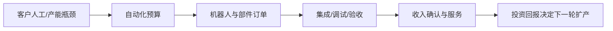

# 机器人行业供需周期分析：制造业自动化需求与具身智能预期分层

分析日期：2026-07-18 16:10 +08:00  
地理范围：全球工业机器人、专业服务机器人与具身智能相关产业链，重点观察中国、日本、欧美  
数据时效：截至2026-07-18；行业部署数据主要截至2024年，公司数据主要截至2026年一季度或FY2025  
行业边界：本文覆盖机器人本体、核心部件、控制软件、系统集成与专业服务机器人；不把一般工业软件、纯大模型或无人机全部视作机器人收入。

## 0. 一页看懂

### 这个行业是做什么的

机器人用执行器、减速器、伺服、控制器、传感器与软件，把感知和决策转为物理动作。工业机器人主要由制造企业为降低人工、提高一致性和扩大产能而购买；服务与人形机器人仍更多由物流、医疗、商业和试点项目驱动。最终付款方是工厂、医院、仓储运营商和服务业企业，而非“AI”本身。

结论状态：暂定

### 三个最重要的数字

| 数字 | 含义 | 当前解读 |
|---|---|---|
| 542,000台 | 全球2024年工业机器人安装量 | 连续第四年超过50万台，产业需求仍有规模基础。[E1] |
| 295,000台 | 中国2024年工业机器人安装量 | 占全球54%，中国是边际需求和本土化竞争中心。[E1] |
| 57% | 中国本土厂商在本土市场份额 | 价格、渠道和交付能力正在重塑全球供应链分工。[E2] |

### 当前判断

机器人行业的实际需求仍由制造业资本开支与系统集成节奏决定；具身智能带来新的技术叙事和研发投入，但尚未能替代订单、交付和售后收入。工业机器人处在区域分化的成熟扩张期，中国需求与本土份额增强，欧美部分市场偏弱；人形/Physical AI处在技术验证与早期商业化之间。

## 1. 产业链地图

### 1.1 价值形成

机器人销售不是一次性硬件交易：标准本体的价值要经集成、治具、视觉、安全认证、工艺调试和维保才变成客户产能。客户预算通常从人工短缺、质量、节拍或扩产项目进入，而不是从“机器人概念”进入。

| 环节 | 代表公司/机构 | 上市地与代码 | 关键变量 |
|---|---|---|---|
| 核心部件 | 汇川技术、安川、纳博特斯克 | SZSE: 300124、TSE: 6506、TSE: 6268 | 性能、成本、交期 |
| 本体/控制 | FANUC、安川、埃斯顿 | TSE: 6954、TSE: 6506、SZSE: 002747 | 出货、产品组合、渠道 |
| 集成与软件 | ABB、发那科、系统集成商 | SIX: ABBN、TSE: 6954 | 项目订单、交付、毛利 |
| 应用客户 | 汽车、电子、物流、医疗 | 非单一上市主体 | CAPEX、人工、利用率 |

### 1.2 各环节详解

#### 1.2.1 减速器、伺服、控制器与传感器

**它是干什么的**：核心部件把电能和控制指令转成精确运动、位置与力反馈，决定机器人速度、负载、重复精度和寿命。

**向谁采购**：向精密齿轮、轴承、电机、编码器、芯片和材料厂采购经过一致性验证的零件。

**卖给谁**：向机器人本体厂、自动化设备商和部分自研机械臂的制造客户销售标准或定制部件。

**代表企业**：

| 企业/机构 | 上市地/代码或属性 | 角色 | 代表性依据 | 证据 |
|---|---|---|---|---|
| 安川电机 | 东京证券交易所 / 6506 | 伺服与机器人供应商 | 分部收入利润可观察部件和本体联动 | E4 |
| 汇川技术 | 深圳证券交易所 / 300124 | 工业控制与伺服供应商 | 代表中国自动化核心部件本土供给 | E2 |

**怎么赚钱、议价能力**：部件商依靠精度、可靠性、规模和客户认证获得售价与售后收入；通用伺服竞争强，长期寿命数据和系统兼容形成壁垒。

**为什么会卡住**：精密加工良率、寿命测试和控制软件适配使新产能不能立即替代，单一部件延迟会阻止整机交付。

**进阶视角**：本体降价可能来自部件国产化和规模效应，也可能是厂商压缩毛利；需用部件利润、整机价格与安装量共同判断渗透（E2、E4）。

#### 1.2.2 机器人本体与运动控制

**它是干什么的**：本体厂把关节、驱动和控制系统集成为可编程机械平台，提供工业臂、协作机器人或移动操作设备。

**向谁采购**：向核心部件、铸件、线缆、安全和控制软件供应商采购整机所需模块。

**卖给谁**：向系统集成商、汽车电子工厂、仓储物流和教育研究客户销售本体、控制柜与维保服务。

**代表企业**：

| 企业/机构 | 上市地/代码或属性 | 角色 | 代表性依据 | 证据 |
|---|---|---|---|---|
| FANUC | 东京证券交易所 / 6954 | 全球工业机器人本体厂 | 财报入口与仿真协作可观察产品和技术路线 | E5、E6 |
| ABB | 瑞士证券交易所 / ABBN | 机器人与离散自动化供应商 | 订单、收入和积压提供公司侧需求证据 | E3 |

**怎么赚钱、议价能力**：企业通过本体、控制器、软件选件和维保收费；标准硬件价格竞争激烈，安全认证、生态和全球服务网络提高转换成本。

**为什么会卡住**：订单还要经过配置、制造、渠道库存和客户验收，出货量不能直接等于已安装并产生生产率的设备。

**进阶视角**：安装量与公司收入可能因价格、产品组合和渠道库存背离，因此IFR台数应与厂商订单、积压和利润分开核验（E1、E3）。

#### 1.2.3 视觉、仿真软件与Physical AI

**它是干什么的**：软件层提供感知、路径规划、离线编程、数字孪生与安全控制，让机器人能适配新工件和非结构化任务。

**向谁采购**：向GPU、相机、传感器、工业软件和数据服务商采购算力、开发工具与训练数据。

**卖给谁**：向本体厂、集成商和终端工厂出售软件许可、开发平台、模型和持续升级服务。

**代表企业**：

| 企业/机构 | 上市地/代码或属性 | 角色 | 代表性依据 | 证据 |
|---|---|---|---|---|
| NVIDIA | 纳斯达克 / NVDA | 仿真与Physical AI计算平台 | 与FANUC合作验证技术接入方向 | E6 |
| Rockwell Automation | 纽约证券交易所 / ROK | 工业软件与自动化平台 | Q2订单收入反映终端自动化需求 | E7 |

**怎么赚钱、议价能力**：软件通过许可、订阅和工程服务变现；能缩短部署周期并积累场景数据的平台比一次性算法项目更有黏性。

**为什么会卡住**：模型稳定性、功能安全、实时性和客户数据取得会限制大规模复制，技术演示不代表已经形成量产合同。

**进阶视角**：Physical AI若真正降低调试工时，价值会从标准本体迁向软件与集成；判断依据应是部署时间、故障率和复购，而不是发布会数量（E6、E7）。

#### 1.2.4 系统集成、交付与终端运营

**它是干什么的**：集成商把机器人、治具、视觉、安全围栏和生产节拍组合为可验收产线，终端客户再用它降低人工或提高质量产出。

**向谁采购**：向本体、部件、软件、夹具和工程承包商采购完整自动化单元所需设备与服务。

**卖给谁**：向汽车、电子、金属加工、物流、医药和服务业客户交付项目，并收取改造、维护与升级费用。

**代表企业**：

| 企业/机构 | 上市地/代码或属性 | 角色 | 代表性依据 | 证据 |
|---|---|---|---|---|
| ABB | 瑞士证券交易所 / ABBN | 自动化系统与集成服务商 | 积压订单可观察项目兑现节奏 | E3 |
| IFR | 未上市/机构 | 全球机器人安装统计机构 | 安装按行业和地区统计，可验证终端采用 | E1、E2 |

**怎么赚钱、议价能力**：集成商按项目、软件和售后收费，掌握工艺知识和停线风险管理的企业比单纯搬运硬件更能保住毛利。

**为什么会卡住**：客户资本开支、现场改造窗口、验收和投资回收期会延后订单，项目取消还会留下定制库存与应收风险。

**进阶视角**：机器人行业最终需求是客户生产率，而非本体台数；若安装增长却没有集成利润和复购，可能只是价格下降推动的低质量扩张（E1、E3）。

### 1.3 权力与利润传导

| 环节 | 谁最终付款 | 利润来源 | 当前约束 |
|---|---|---|---|
| 核心部件 | 本体厂和设备商 | 精度、寿命和认证 | 良率与客户验证 |
| 本体控制 | 集成商和工厂 | 硬件、软件选件与服务 | 价格竞争和渠道库存 |
| 软件视觉 | 本体厂与集成商 | 许可、订阅和数据生态 | 安全与场景泛化 |
| 系统交付 | 制造与物流客户 | 工艺集成和维护 | CAPEX、改造和验收 |

## 2. 需求：谁在买、为什么买

| 需求层 | 购买者 | 驱动 | 当前状态 |
|---|---|---|---|
| 第一层 | 汽车、电子、金属机械工厂 | 扩产、节拍、缺工与良率 | 中国最强，海外分化 |
| 第二层 | 仓储、医疗、商业服务 | 吞吐、劳动力、服务覆盖 | 专业服务机器人继续增长 |
| 第三层 | 政府、企业管理层、消费者 | 产业政策、投资回报与体验 | 决定预算能否持续 |

IFR统计显示，全球2024年安装54.2万台工业机器人，亚洲占74%；中国安装29.5万台，全球占比54%，运营存量超过200万台。专业服务机器人2024年销量接近20万台、同比增加9%，其中运输物流类10.29万台、同比增加14%。[E1]

**进阶视角：**机器人安装量与公司收入并非同步：安装可由低价本体拉动，也可由大项目确认时点推高；需同时看订单、积压、客户行业与集成商利用率。ABB自动化业务Q1 2026订单同比增12%、积压订单增25%，是制造自动化需求仍有韧性的公司侧证据。[E3]

## 3. 供给：现在有多少、真能用的有多少

供给能力不等于可交付能力。减速器、伺服、控制器与认证决定交期；集成工程师、客户现场与安全验收决定项目能否确认收入。中国本土供应商在2024年首次在本土市场销售超过海外供应商，份额57%，显示规模化供给和价格竞争增强。[E2]

| 供给变量 | 一手证据 | 含义 |
|---|---|---|
| 本土化竞争 | 中国厂商份额57% | 本体与部件降本、渠道加深。[E2] |
| 全球部署基础 | 2024年工业机器人54.2万台 | 维保、替换和软件升级形成存量需求。[E1] |
| 自动化订单 | ABB订单24.64亿美元、积压103.5亿美元 | 项目型需求仍支持交付端。[E3] |
| 龙头经营 | 安川机器人收入2470亿日元 | 反映业务规模但不等于新增订单。[E4] |

### 3.1 可比时间序列：部署与份额

| 指标 | 单位 | 数值 | 时点 | 来源 |
|---|---|---:|---|---|
| 中国工业机器人安装量 | 台 | 276,000 | 2023年 | [E2] |
| 中国工业机器人安装量 | 台 | 295,000 | 2024年 | [E2] |
| 中国本土供应商份额 | % | 47 | 2023年 | [E2] |
| 中国本土供应商份额 | % | 57 | 2024年 | [E2] |

**进阶视角：**低成本供给会提升渗透率，但也会提高对产品可靠性、渠道账期和售后覆盖的要求。只看出货增长，容易忽视价格下降、系统集成利润和应收风险。

## 4. 供需矛盾与高频信号

| 信号 | 偏强组合 | 偏弱组合 |
|---|---|---|
| 工厂CAPEX | 汽车/电子扩产、自动化订单上升 | 客户延后项目、集成商订单减少 |
| 交付 | 积压订单下降但收入上行 | 积压下降且收入也下降 |
| 本体价格 | 降价带动安装和系统订单 | 降价但安装、毛利均走弱 |
| 新应用 | 仿真缩短部署周期、真实付费试点增加 | 展示多、批量合同少 |
| 零部件与集成利润 | 减速器、伺服与集成收入同步增长 | 本体出货增加但集成毛利和回款恶化 |

## 5. 周期位置与传导

| 阶段/日期 | 可观察信号 | 利润池迁移 | 关键时滞 | 证据 |
|---|---|---|---|---|
| 2024 工业自动化去库存 | 客户推迟项目、集成订单弱于展示热度 | 向存量服务和高可靠零部件集中 | 资本预算到订单约一至两季 | E1、E3 |
| 2025 应用试点扩散 | 汽车、电子与物流继续验证协作和移动机器人 | 从本体硬件向集成软件与场景工程迁移 | 试点到批量验收常跨年度 | E2、E5 |
| 2026Q2 订单验证 | Rockwell自动化销售与利润改善提供制造投资样本 | 能缩短部署周期并承担交付的集成商占优 | 收入通常滞后订单和项目进度 | E7、E8 |

阶段判断：**工业自动化为主线的温和扩张期，具身智能处于验证期。** 全球工业安装量维持高位、ABB订单与积压改善支持这一判断；但欧洲和美洲2024年安装量下降，说明不是全球同步繁荣。[E1][E3]

**进阶视角：**具身智能真正改变周期的位置，不在于模型演示，而在于把非结构化任务的部署成本、调试时间和故障率压到客户可接受的投资回收期。FANUC与NVIDIA把仿真、编程和验证连接，提供了技术方向，但尚非大规模收入证据。[E6]

### 5.1 什么会证明这个判断错了

若汽车、电子和物流客户的订单、积压与交付连续下滑，且本体降价无法带动安装量，工业自动化应下调为去库存期；若人形/Physical AI出现可复核的大额量产合同、稳定交付与复购，则“验证期”应升级。

## 6. 资金动向

### 6.1 尝试的来源类型

| 来源类型 | 对象 | 已定价 | 未定价 | 研究结果 |
|---|---|---|---|---|
| 行业统计 | IFR | 安装量、区域份额 | 未来订单和价格 | 已打开年度统计。[E1][E2] |
| 公司经营 | ABB、安川 | 订单、积压、分部收入 | 下游项目持续性 | 已打开官方报告。[E3][E4] |
| 技术发布 | FANUC/NVIDIA、安川/SoftBank | 研发方向与合作 | 商业化规模、单位经济性 | 仅能证明技术验证。[E5][E6] |

### 6.2 已定价与未定价

已定价的是中国本土化、工业自动化订单改善和AI仿真工具的推出。未定价的是人形机器人何时形成持续收入、制造业客户能否在宏观波动下继续资本开支、以及本体价格竞争对利润的最终影响。

## 7. 未来资金可能流向

以下为情景研究框架，不构成买卖建议。

| 情景 | 条件 | 产业链可能受益环节 | 验证变量 |
|---|---|---|---|
| 基准 | 工业CAPEX温和增长、本体降价提升渗透 | 伺服控制、集成、维保 | 订单、积压、安装量 |
| 上行 | 电子/汽车扩产、非结构化场景付费落地 | 高性能部件、机器视觉、仿真软件 | 量产合同、交付、复购 |
| 下行 | 客户延后CAPEX、价格战压缩利润 | 现金流强和存量服务占比高的主体 | 应收、库存、毛利 |

## 8. 分歧与反证

### 主流叙事

“人形机器人和Physical AI会迅速把机器人行业带入爆发期。”

### 反证

1. 大多数工业机器人需求仍来自汽车、电子与传统制造，区域装机已有明显分化。[E1]
2. 技术合作与仿真演示不能替代批量订单、现场安全与客户回收期。[E5][E6]
3. 中国本土份额快速提升可能增加渗透率，也可能使本体价格和利润率承压。[E2]

## 9. 观察哨与跟踪

### 9.1 可比时间序列

| 指标 | 单位 | 数值 | 时点 | 来源 |
|---|---|---:|---|---|
| 中国工业机器人安装量 | 台 | 276,000 | 2023年 | [E2] |
| 中国工业机器人安装量 | 台 | 295,000 | 2024年 | [E2] |
| ABB自动化积压订单 | 百万美元 | 8,261 | 2025年Q1 | [E3] |
| ABB自动化积压订单 | 百万美元 | 10,350 | 2026年Q1 | [E3] |

### 9.2 观察表

| 指标 | 基线 | 来源 | 频率 | 正向触发 | 反证触发 |
|---|---|---|---|---|---|
| 中国安装量 | 2024年29.5万台 | IFR | 年度 | 电子/金属行业继续增长 | 总安装量和本土出货转弱 |
| 全球工业机器人 | 2024年54.2万台 | IFR | 年度 | 亚洲外市场恢复 | 欧美持续下降 |
| ABB订单 | Q1同比+12% | ABB | 季度 | 订单与收入共同增长 | 订单、积压同步转弱 |
| Physical AI | 仿真/控制协作已发布 | FANUC | 季度 | 批量合同和复购出现 | 停留在样机与新闻发布 |
| 机器人分部收入 | 安川2470亿日元 | 安川 | 年度/季度 | 收入、利润和订单一致改善 | 降价导致收入/利润背离 |

## 10. 术语表

| 术语 | 含义 |
|---|---|
| 工业机器人 | 在制造现场执行搬运、焊接、装配等可编程任务的机器人。 |
| 系统集成 | 将本体、夹具、视觉、安全和工艺调试为可运行工作单元的过程。 |
| RaaS | Robot as a Service，以订阅或按使用付费方式部署机器人。 |
| Physical AI | 将AI感知、推理与真实物理执行闭环结合的机器人技术方向。 |
| 积压订单 | 已签约但尚未交付确认收入的订单，是短期收入能见度之一。 |

## 附录A 证据台账

| 证据ID | 事实/用途 | 发布方 | 链接 | 已打开 | 访问日期 | 时效 | 局限 |
|---|---|---|---|---|---|---|---|
| E1 | 全球和区域工业/服务机器人部署 | IFR | https://ifr.org/worldrobotics/report-2025 | 是 | 2026-07-18 | 2024 | 年度统计有滞后，不能直接反映2026年订单。 |
| E2 | 中国安装、本土份额和行业分布 | IFR | https://ifr.org/downloads/press_docs/2025-09-25-IFR_press_release_China_in_English.pdf | 是 | 2026-07-18 | 2024 | 为中国市场统计，不能推导海外厂商全部盈利。 |
| E3 | ABB自动化订单、收入与积压 | ABB | https://library.e.abb.com/public/dd7e26e13f7a4a4783979a725ef8ff7e/ABB-Q1-2026-press-release-English.pdf | 是 | 2026-07-18 | 2026-Q1 | 自动化分部并非纯机器人，含其他自动化业务。 |
| E4 | 安川机器人分部收入和利润 | Yaskawa | https://www.yaskawa-global.com/wp-content/uploads/2026/04/20260410_en.pdf | 是 | 2026-07-18 | FY2025 | 年度分部数据无法拆分单季度订单与地区。 |
| E5 | FANUC财报与会议材料入口 | FANUC | https://www.fanuc.co.jp/en/ir/announce/ | 是 | 2026-07-18 | FY2025 | 页面是资料目录，需逐份材料复核细节。 |
| E6 | FANUC与NVIDIA仿真和控制协作 | FANUC | https://www.fanuc.co.jp/en/profile/pr/newsrelease/2026/notice20260515.html | 是 | 2026-07-18 | 2026-05 | 技术发布没有披露收入、订单或量产规模。 |
| E7 | FY2026Q2自动化销售、利润和终端需求 | Rockwell Automation | https://www.rockwellautomation.com/en-us/company/news/press-releases/Rockwell-Automation-Reports-Second-Quarter-2026-Results.html | 是 | 2026-07-18 | FY2026Q2 | 业务包含广泛自动化产品，非纯机器人收入。 |
| E8 | Physical AI与机器人仿真计算平台资料 | NVIDIA | https://www.nvidia.com/en-us/industries/robotics/ | 是 | 2026-07-18 | 2026当前 | 平台能力和案例不等于量产订单。 |

## 附录B 数据时效与证据覆盖

| 模块 | 主要时点 | 覆盖评价 | 缺口 |
|---|---|---|---|
| 需求 | 2024年度、2026Q1 | 安装与订单有证据 | 缺少中国月度出货和集成商项目库 |
| 供给 | 2024—FY2025 | 本土份额和头部经营覆盖 | 缺少部件产能与库存细节 |
| 价格/利润 | 2026Q1 | ABB订单、积压与利润可观察 | 缺少本体ASP连续序列 |
| 资金 | 截至2026年7月 | 有技术和经营事实 | 缺少可比估值、仓位和资金流 |

## 附录C 证据就绪度与研究执行记录

| 研究线 | 状态 | 已打开来源数 | 最低来源数 | 证据ID | 结论 |
|---|---|---:|---:|---|---|
| 产业链 | Ready | 2 | 1 | E3,E6 | 部件、本体、软件、集成和付款端已覆盖 |
| 需求 | Ready | 2 | 2 | E1,E2 | 全球与中国部署均有来源 |
| 供给与有效产能 | Ready | 3 | 2 | E2,E3,E4 | 本土化竞争和龙头供给已覆盖 |
| 价格/订单/库存/利润 | Ready | 2 | 1 | E3,E4 | 有订单积压和分部收入利润证据 |
| 资本市场预期 | Gap | 0 | 2 | — | 缺少统一估值、仓位及资金流序列 |
| 反证 | Ready | 3 | 2 | E1,E2,E6 | 周期、价格战与商业化反证已列出 |

## 尾注

- 供需缺口 ≠ 股价上涨。
- 方向正确 ≠ 时点正确。
- 盈利兑现 ≠ 股价继续上涨。
- AI 回答和搜索摘要不是事实。
- 过期数据不是当前事实。
