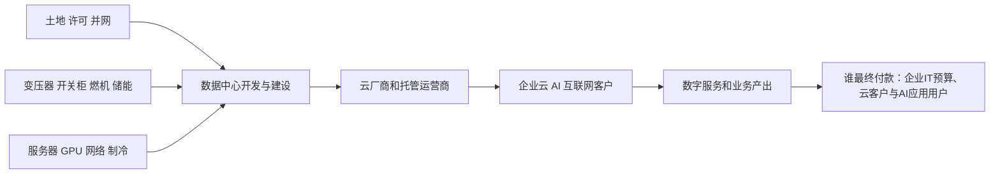

# 数据中心行业供需周期分析：AI算力需求与电力接入共同决定有效供给

分析日期：2026-07-18 01:04:26 +08:00  
地理范围：全球超大规模云、零售/批发托管数据中心与其电力、网络、服务器基础设施，重点观察美国、中国和欧洲  
数据时效：截至2026-07-18；经营实际主要截至2026年一季度，电力需求为IEA截至2026年4月的情景预测  
行业边界：纳入数据中心机房、供配电、制冷、网络、服务器部署与托管运营；不把芯片制造、通用云软件收入或电力行业整体收入全部计入数据中心。

## 0. 一页看懂

### 这个行业是做什么的

数据中心把土地、建筑、电力、制冷、网络和服务器组织成可连续运行的计算能力。超大规模云厂商用它提供云与AI服务；托管运营商把机柜、电力和互联卖给企业与云客户。真正支付预算的是云服务客户、企业IT部门和AI产品的最终使用者，电力接入与设备交付决定这些预算能否转化为上线容量。

结论状态：暂定

### 三个最重要的数字

| 数字 | 含义 | 当前解读 |
|---|---|---|
| 17% | 2025年数据中心用电增速 | 实际用电增长快于全球电力需求，表明AI负载已穿透到物理基础设施。[E1] |
| 1750—1850亿美元 | Alphabet 2026年资本开支指引 | 即175—185 billion美元；服务器与数据中心投入显著增加。[E5] |
| 40% | Azure及其他云服务FY26 Q3增速 | 云端需求仍强，但基础设施投资压低利润率。[E4] |

### 当前判断

数据中心处在需求快速扩张、有效供给受电力和并网约束限制的建设期。云厂商的CAPEX、云收入和托管预订量提供需求证据；但“宣布MW”不等于可交付容量，变压器、燃机、并网、土地许可和冷却设施才是短期瓶颈。结论暂定，因为区域供需差异极大，且电力数据多为情景而非逐项目实际。

## 1. 产业链地图

### 1.1 价值形成

数据中心不是“盖楼”即可出售：机房需在同一时间取得电力容量、网络互联、设备安装、散热和客户机柜交付。托管商按机柜、电力和互联收费，超大规模云厂商则以计算、存储、网络和AI服务变现；利润与风险在电力合同、建设进度和服务器利用率之间分配。

| 环节 | 代表公司/机构 | 上市地与代码 | 关键变量 |
|---|---|---|---|
| 云与AI需求 | Microsoft、Alphabet | NASDAQ: MSFT、NASDAQ: GOOGL | 云收入、客户订单、CAPEX |
| 托管与互联 | Equinix、Digital Realty | NASDAQ: EQIX、NYSE: DLR | 预订、上电、互联密度 |
| 供电与建设 | 电网、设备商、开发商 | 非单一上市主体 | 并网、变压器、燃机、许可 |
| 服务器与制冷 | 服务器商、网络与液冷厂商 | 非单一上市主体 | GPU交付、功率密度、PUE |

### 1.2 节点与可替代性

| 节点 | 代表企业 | 上市地/代码 | 节点功能 |
|---|---|---|---|
| 超大规模云 | Microsoft、Alphabet | NASDAQ: MSFT、NASDAQ: GOOGL | 将服务器容量转为云和AI服务 |
| 托管互联 | Equinix、Digital Realty | NASDAQ: EQIX、NYSE: DLR | 提供中立机房、电力和跨网连接 |
| 电力接入 | 公用事业、电网、设备商 | 非单一上市主体 | 把核准的电力变成可用负载 |

**进阶视角：**数据中心最稀缺的不是建筑面积，而是“客户已签约、设备已到、可稳定上电”的MW。IEA指出，网接缓慢、燃机和变压器供应链紧张正在限制近期扩张；因此同样的宣布容量，通电时间不同会造成价值差异。[E1]

## 2. 需求：谁在买、为什么买

| 需求层 | 购买者 | 驱动 | 当前状态 |
|---|---|---|---|
| 第一层 | 云厂商、AI模型开发者、企业IT | 训练/推理、云迁移、数据分析 | AI与云需求共同拉动 |
| 第二层 | SaaS、互联网、金融、制造企业 | 数字化服务和算力外包 | 通过云收入与托管预订体现 |
| 第三层 | 企业管理层与数字服务用户 | 生产率、客户体验和成本预算 | 决定长期变现 |

Microsoft FY26 Q3 Azure及其他云服务收入增长40%，但公司明确AI基础设施投资抬高成本并压缩云毛利率。[E4] Alphabet披露Google Cloud年化收入超过700亿美元、积压订单2400亿美元，并将2026年CAPEX指引定为1750—1850亿美元。[E5]

**进阶视角：**CAPEX不是终端需求的同义词。云厂商可以在需求强劲时前置建设，收入确认取决于客户上线和利用率；反过来，供给紧时云收入会因容量不足而低于真实需求。因此需同时看云收入、积压订单和可上电容量。[E4][E5]

## 3. 供给：现在有多少、真能用的有多少

Equinix 2026年Q1实现历史最大的一季度年化总预订量并形成创纪录积压，月度经常性收入同比增12%，显示托管侧需求能见度仍强。[E6] IEA预计数据中心用电到2030年在基准情景下约945TWh；但其最新研究强调，网接、规划许可、变压器、燃机和先进芯片供应均是现实瓶颈。[E1][E2]

| 供给变量 | 当前证据 | 意义 |
|---|---|---|
| 电网与许可 | IEA称并网和审批拖慢项目 | 已公告项目可能延期。[E1] |
| 设备供应链 | 变压器、燃机、先进芯片趋紧 | 设备交付限制有效上电。[E1] |
| 托管交付 | Equinix预订与积压创纪录 | 客户需求支持扩建，但不等于全部完工。[E6] |
| 自建CAPEX | Alphabet大幅上调2026投入 | 云厂商在争取未来容量。[E5] |

### 3.1 可比时间序列：实际用电与投入

| 指标 | 单位 | 数值 | 时点 | 来源 |
|---|---|---:|---|---|
| 数据中心用电增速 | % | 12 | 2017—2024年年均 | [E2] |
| 数据中心用电增速 | % | 17 | 2025年 | [E1] |
| Alphabet资本开支 | 十亿美元 | 91.4 | 2025年 | [E5] |
| Alphabet资本开支指引中值 | 十亿美元 | 180.0 | 2026年 | [E5] |

**进阶视角：**名义MW、已开工MW和可上电MW不可混用。高密度AI机柜还会提高冷却、变压器和备用电源要求；功率密度提升可以让单位面积更多计算，也会使电力与热管理更早成为上限。

## 4. 供需矛盾与高频信号

| 信号 | 偏紧组合 | 偏松组合 |
|---|---|---|
| 云收入与积压 | 云增长、预订和积压同升 | 云增速放缓、积压转弱 |
| 上电与并网 | 客户签约快于并网、延期增加 | 新容量按期通电 |
| 电力设备 | 变压器/燃机交期拉长 | 设备交期回落、替代供给增加 |
| 单位经济性 | 利用率上升、价格稳定 | 大量先建后租、租金/利用率转弱 |

## 5. 周期位置与传导

阶段判断：**建设扩张期，局部受制于电力与设备。** 用电增长、云收入、预订和CAPEX指向强需求；瓶颈使有效供给不能以地产开工速度释放。[E1][E4][E5][E6]

**进阶视角：**2023—2024年GPU/服务器成为显性瓶颈，2025—2026年约束更向并网、电力设备和现场建设外溢。IEA对2025年用电实际和2030年情景均强调这一点；若设备效率提升快于AI使用扩张，功率需求的斜率会低于建设计划。[E1][E2]

### 5.1 什么会证明这个判断错了

若云收入、Equinix预订与积压同步走弱，且已获批项目的并网和设备交付明显加速、空置容量上升，则该行业应从建设扩张期转为供给消化期。相反，若电网延误扩大而客户排队和预订继续增长，约束会更集中于已上电资产。

## 6. 资金动向

### 6.1 尝试的来源类型

| 尝试的来源类型 | 具体来源 | 结果 |
|---|---|---|
| 行业估值分位 | 公开指数估值页面 | 口径和历史序列未在本轮取得，记录为缺口。 |
| 行业ETF份额/资金流 | 数据中心相关ETF发行方页面 | 未获取可比的最新份额序列。 |
| 两融/跨境资金 | 交易所公开数据 | 行业映射不统一，未用于结论。 |
| 龙头经营与叙事 | Microsoft、Alphabet、Equinix官方披露 | 获得订单、CAPEX、云收入与预订证据。[E4][E5][E6] |

**推断—已定价：**市场大概率已对AI数据中心高CAPEX与电力瓶颈形成广泛叙事，依据是超大规模厂商显著上调投入和IEA的专题更新。

**推断—未定价：**更难定价的是这些CAPEX转为可上电容量的速度、利用率和折旧压力。该判断基于经营与叙事，并不是估值或资金流测量。

## 7. 未来资金可能流向

以下为情景研究框架，不构成买卖建议。

| 情景 | 触发条件 | 利润池移动 | 先受益 | 后受益/受损 | 需验证证据 |
|---|---|---|---|---|---|
| 基准 | 云需求强、并网逐步改善 | 向已上电托管和高利用率云资源移动 | 托管运营、配电和制冷 | 后续才是一般建设 | 云收入、预订、上电进度 |
| 上行 | AI任务增长快于效率、并网继续紧 | 向电力接入、备用电源和已通电容量集中 | 变压器/电网配套、优质机房 | 新开工项目因交期受限 | 用电、设备交期、项目延期 |
| 下行 | 效率提升快、客户延后CAPEX | 向低成本运营和存量服务集中 | 利用率高、负债稳健的运营节点 | 新开发和高杠杆建设承压 | 云增速、空置率、预订取消 |

## 8. 分歧与反证

### 主流叙事

“AI会使数据中心容量持续短缺，所有建设项目都将受益。”

| 主流叙事 | 本报告判断 | 分歧 | 谁的证据更硬 | 证据 |
|---|---|---|---|---|
| 容量一律短缺 | 需求强但有效容量取决于上电、设备和利用率 | 公告MW与可交付MW不同 | IEA电网/供应链限制、公司预订和云收入 | E1,E4,E5,E6 |

反证：IEA的高效率情景下，2035年数据中心用电约970TWh，低于基准情景；效率、AI采用和电力瓶颈会共同改变容量需求。[E2] 因此不能将CAPEX公告直接外推为长期租金和利润。

## 9. 观察哨与跟踪

### 9.1 可比时间序列

| 指标 | 单位 | 数值 | 时点 | 来源 |
|---|---|---:|---|---|
| 数据中心用电增速 | % | 12 | 2017—2024年年均 | [E2] |
| 数据中心用电增速 | % | 17 | 2025年 | [E1] |
| Alphabet资本开支 | 十亿美元 | 91.4 | 2025年 | [E5] |
| Alphabet资本开支指引中值 | 十亿美元 | 180.0 | 2026年 | [E5] |

### 9.2 观察表

| 指标 | 基线 | 来源 | 频率 | 正向触发 | 反证触发 |
|---|---|---|---|---|---|
| Azure及其他云服务增速 | FY26 Q3为40% | Microsoft业绩 | 季度 | 持续高增且毛利稳定 | 增速和毛利同时下行 |
| Alphabet CAPEX | 2026指引1750—1850亿美元 | Alphabet电话会 | 季度/年度 | 指引维持或上调且云积压增加 | CAPEX下调或积压转弱 |
| Equinix预订/积压 | Q1为历史最大预订和创纪录积压 | Equinix 8-K | 季度 | 预订与收入同步增长 | 预订下滑或取消增加 |
| 数据中心用电 | 2025年增长17% | IEA | 年度 | 增速维持且并网紧张 | 效率使实际用电明显低于预期 |
| 并网与设备交期 | 2026年存在紧张 | IEA | 季度/事件 | 延期增加、设备继续紧 | 交期缩短、项目按期投运 |

## 10. 术语表

| 术语 | 含义 |
|---|---|
| 超大规模云 | 自建大规模数据中心并向外提供云服务的运营模式。 |
| 托管 | 第三方提供机房、电力、制冷和互联，客户自带或租用服务器。 |
| MW | 兆瓦，数据中心可承载电力容量的常用单位。 |
| 上电容量 | 已具备稳定电力接入、可供客户设备运行的容量。 |
| PUE | 数据中心总用电与IT设备用电之比，越低通常代表基础设施能效越高。 |
| 积压订单 | 已签约但尚未全部交付或确认收入的订单。 |

## 附录A 证据台账

| 证据ID | 事实/用途 | 发布方 | 链接 | 已打开 | 访问日期 | 时效 | 局限 |
|---|---|---|---|---|---|---|---|
| E1 | 2025年用电、CAPEX、并网和设备瓶颈 | IEA | https://www.iea.org/news/data-centre-electricity-use-surged-in-2025-even-with-tightening-bottlenecks-driving-a-scramble-for-solutions | 是 | 2026-07-18 | 2026-04发布 | 新闻稿概述，逐项目数据有限。 |
| E2 | 全球和区域用电情景、效率/下行情景 | IEA | https://www.iea.org/reports/energy-and-ai/energy-demand-from-ai | 是 | 2026-07-18 | 2025报告 | 属于情景预测，并非开发商逐项目实际。 |
| E3 | 电力供应构成与2030后电源演进 | IEA | https://www.iea.org/reports/energy-and-ai/energy-supply-for-ai | 是 | 2026-07-18 | 2025报告 | 能源组合依赖政策、并网和项目执行。 |
| E4 | Azure增速、云成本与毛利影响 | Microsoft | https://www.microsoft.com/en-us/Investor/earnings/FY-2026-Q3/intelligent-cloud-performance | 是 | 2026-07-18 | FY26 Q3 | 分部包含非AI云业务，不能拆出数据中心租赁收入。 |
| E5 | Google Cloud积压、CAPEX和基础设施拆分 | Alphabet | https://abc.xyz/investor/events/event-details/2026/2025-Q4-Earnings-Call-2026-Dr_C033hS6/default.aspx | 是 | 2026-07-18 | 2025 Q4 | 2026CAPEX为管理层指引，非已发生实际。 |
| E6 | 托管收入、预订、积压与利润 | Equinix | https://investor.equinix.com/sec-filings/proxy-filings/content/0001101239-26-000089/0001101239-26-000089.pdf | 是 | 2026-07-18 | 2026 Q1 | 单一托管商不能代表所有区域租金与空置。 |

## 附录B 数据时效与证据覆盖

| 模块 | 主要时点 | 覆盖评价 | 缺口 |
|---|---|---|---|
| 需求 | 2025Q4—2026Q1 | 云收入、积压和预订有公司证据 | 缺少全球客户级使用率 |
| 供给 | 2026年4月 | 电网、设备与并网约束有IEA证据 | 缺少全球可上电MW统一统计 |
| 价格/订单/库存/利润 | 2026Q1 | 托管预订、收入与云毛利可观察 | 缺少区域租金与空置的连续公开序列 |
| 资本市场 | 截至2026年7月 | 已记录公开尝试和经营叙事 | 缺少统一估值、ETF和资金流序列 |

## 附录C 证据就绪度与研究执行记录

| 研究线 | 状态 | 已打开来源数 | 最低来源数 | 证据ID | 结论 |
|---|---|---:|---:|---|---|
| 产业链 | Ready | 3 | 2 | E1,E3,E6 | 电力、建设、托管与付款端已覆盖 |
| 需求 | Ready | 3 | 3 | E1,E4,E5 | 实际云业务、CAPEX和用电均有来源 |
| 供给与有效产能 | Ready | 3 | 3 | E1,E2,E3 | 并网、设备和电源约束已覆盖 |
| 价格/订单/库存/利润 | Ready | 3 | 3 | E4,E5,E6 | 云收入、积压及托管利润有证据 |
| 资本市场预期 | Gap | 0 | 2 | — | 尝试已记录，但缺统一估值与资金流序列 |
| 反证 | Ready | 2 | 2 | E1,E2 | 效率与建设延误的情景反证已覆盖 |

## 尾注

- 供需缺口 ≠ 股价上涨。
- 方向正确 ≠ 时点正确。
- 盈利兑现 ≠ 股价继续上涨。
- AI 回答和搜索摘要不是事实。
- 过期数据不是当前事实。
