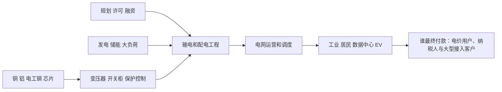

# 电力电网行业供需周期分析：负荷增长倒逼长周期电网扩容

分析日期：2026-07-18 02:10:00 +08:00  
地理范围：全球输配电网、变压器与电网设备，重点观察中国、美国、欧洲和印度  
数据时效：截至2026-07-18；行业实际主要为2025年，2026—2030为IEA预测；公司经营主要截至2026年一、二季度  
行业边界：覆盖输电、配电、变电、保护控制、储能并网和电网灵活性；不把全部发电、售电或新能源装机等同于电网行业。

## 0. 一页看懂

### 这个行业是做什么的

电网把发电端的电送至工业、居民、数据中心和交通负荷。它卖的是可靠接入、输配容量和调度能力；最终付款来自电价、输配费、政府投资和大型用电客户的接入预算。电网建设周期通常远长于风光、数据中心或充电桩建设，因此成为“电气化”扩张的物理瓶颈。

结论状态：暂定

### 三个最重要的数字

| 数字 | 含义 | 当前解读 |
|---|---|---|
| 2,500GW以上 | 全球排队等待电网接入的项目规模 | 并网能力已成为供需矛盾核心。[E1] |
| 50% | 到2030年年电网投资需增加的幅度 | 当前投资与需求增长不匹配。[E1] |
| 6,996百万欧元 | Siemens Energy FY26 Q2电网技术订单 | 设备订单已体现需求兑现。[E4] |

## 1. 产业链地图

### 1.1 电网与设备如何创造价值

输配电设备把电压变换、开断、保护和控制装入可长期运行的网络；工程商把设备、线路、变电站和许可组合成可并网资产。设备商的订单通常早于收入，电网运营商承担长期CAPEX和可靠性责任。

| 环节 | 代表公司/机构 | 上市地与代码 | 关键变量 |
|---|---|---|---|
| 设备 | Siemens Energy、GE Vernova、特变电工 | XETRA: ENR、NYSE: GEV、SSE: 600089 | 订单、产能、交期 |
| 工程/运营 | 国家电网、各国TSO/DSO | 非单一上市主体 | 核准、输配费、施工 |
| 灵活性 | 储能、需求响应服务商 | 非单一上市主体 | 峰谷价差、调度规则 |

### 1.2 有效供给不是名义投资

| 节点 | 代表企业 | 上市地/代码 | 节点功能 |
|---|---|---|---|
| 高压设备 | Siemens Energy、GE Vernova | XETRA: ENR、NYSE: GEV | 将电能可靠变换、保护并接入网络 |
| 电网建设 | TSO/DSO、工程总包 | 未上市/多主体 | 完成许可、线路和变电站投运 |
| 需求侧灵活性 | 聚合商、工业客户 | 多主体 | 在紧张时段削减或转移负荷 |

**进阶视角：**名义投资与可用接入之间损耗发生在许可、征地、变压器交付和施工。IEA估计新电网从规划到完工需5—15年，而数据中心只需1—3年；这解释了为什么短期利润先集中于已认证设备和已获批项目。[E1]

## 2. 需求：谁在买、为什么买

电网需求来自新增发电并网、工业电气化、EV、空调和数据中心。IEA预计全球电力需求2026—2030年年均增3.6%，中国年均4.9%、印度6.4%；美国到2030新增需求约420TWh，其中数据中心约占一半。[E2]

**进阶视角：**总用电增长并非直接等于设备订单。真正触发采购的是峰荷、接入排队、故障风险和监管允许的CAPEX；负荷可通过需求响应和储能部分缓解，故需同时跟踪接入队列与调度灵活性。[E2][E6]

## 3. 供给：现在有多少、真能用的有多少

IEA称关键电网部件价格五年内接近翻倍，且项目排队规模超过2,500GW；通过非固定义接入和电网增强技术可释放1,200—1,600GW的先进阶段项目容量，但属潜力而非既成投运。[E1][E5]

| 变量 | 事实 | 含义 |
|---|---|---|
| 设备订单 | GE Vernova Q1电气化订单183亿美元、数据中心相关设备订单24亿美元 | 需求已传导至设备端。[E3] |
| 电网设备订单 | Siemens Energy Grid Technologies订单69.96亿欧元，同比+41.5% | 高压设备订单仍强。[E4] |
| 电网投资 | 2026年全球电网投资预计接近5,500亿美元 | 基建投资加速但不等于完工。[E5] |

**进阶视角：**新增变压器产能不能立即解决瓶颈：产品需按电压等级、标准和电网参数定制，且建设端还受许可和线路施工约束。设备订单强并不自动等价于当期收入或全行业利润率。

## 4. 供需矛盾与高频信号

| 信号 | 偏紧组合 | 反证组合 |
|---|---|---|
| 接入队列 | 排队扩大、许可拖延 | 可接入容量释放、取消增加 |
| 设备 | 订单/积压增长、交期长 | 订单回落、价格趋稳 |
| CAPEX | 输配费核准、投资上调 | 监管压价、融资成本上升 |
| 灵活性 | 储能和需求响应扩张 | 峰荷风险继续恶化 |

## 5. 周期位置与传导

阶段判断：**需求兑现下的长周期扩容期。** 订单、接入排队和投资预测一致显示供给偏紧，但实际工程周期极长，结论保持暂定。[E1][E3][E4]

**进阶视角：**2021—2023年新能源装机快于电网，使瓶颈从发电设备转向接入；2025—2026年数据中心进一步集中负荷。若需求响应和储能成为可复制的替代方案，部分线路CAPEX可被延后，而非完全消失。[E1][E6]

### 5.1 什么会证明这个判断错了

若设备订单、积压与监管核准连续转弱，同时接入队列因取消和技术升级显著下降，则应下调为CAPEX消化期；若负荷增长和设备交期继续上行，已投运网络和关键设备的约束将加强。

## 6. 资金动向

| 尝试的来源类型 | 具体来源 | 结果 |
|---|---|---|
| 行业估值分位 | 公开指数估值页面 | 未获得同口径历史分位。 |
| ETF份额与资金流 | 电力设备ETF发行方页面 | 未形成可比时间序列。 |
| 龙头经营 | GE Vernova、Siemens Energy官方业绩 | 获得订单和积压相关证据。[E3][E4] |

**已定价（推断）：**市场大概率已关注电网设备订单高增与数据中心负荷，依据是公司订单披露和IEA专题。

**未定价（推断）：**许可、融资和工程执行能否将长期投资转成准时投运仍不确定；这不是估值或资金流的测量结论。

## 7. 未来资金可能流向

以下为情景研究框架，不构成买卖建议。

| 情景 | 条件 | 利润池移动 | 先受益 | 后受益/受损 | 验证 |
|---|---|---|---|---|---|
| 基准 | 电网CAPEX持续、工程按计划推进 | 向认证设备和运维移动 | 变压器、开关设备 | 工程收入滞后 | 订单、核准、投运 |
| 上行 | 数据中心/新能源接入更快、队列扩大 | 向稀缺高压设备和已投运资产集中 | 设备与保护控制 | 新项目受交期拖累 | 交期、积压、接入排队 |
| 下行 | 宏观放缓、审批/融资约束 | 向低成本运维与灵活性转移 | 存量网络、需求响应 | 高杠杆新工程承压 | CAPEX、取消、融资成本 |

## 8. 分歧与反证

### 主流叙事

“电网是确定性紧缺，所有电力设备都会受益。”

本报告认为，排队与订单的证据更硬，但不同电压等级、地区监管和工程能力差异很大；可释放的1,200—1,600GW属于技术/监管潜力，并非已交付容量。[E1][E5]

## 9. 观察哨与跟踪

### 9.1 可比时间序列

| 指标 | 单位 | 数值 | 时点 | 来源 |
|---|---|---:|---|---|
| 全球电力需求增速 | % | 3.0 | 2025年 | [E2] |
| 全球电力需求预测增速 | % | 3.6 | 2026—2030年均 | [E2] |
| Siemens Grid Technologies订单 | 百万欧元 | 4,944 | FY25 Q2 | [E4] |
| Siemens Grid Technologies订单 | 百万欧元 | 6,996 | FY26 Q2 | [E4] |

### 9.2 观察表

| 指标 | 基线 | 来源 | 频率 | 正向触发 | 反证触发 |
|---|---|---|---|---|---|
| 全球接入队列 | 超过2,500GW | IEA | 年度 | 排队继续扩大 | 取消与接入释放明显增加 |
| 电网投资 | 当前约4,000亿美元 | IEA | 年度 | 迈向2030所需水平 | CAPEX延后或核准下降 |
| GE电气化订单 | Q1数据中心订单24亿美元 | GE Vernova | 季度 | 订单/积压增长 | 订单显著回落 |
| Siemens电网订单 | FY26Q2 69.96亿欧元 | Siemens Energy | 季度 | 订单和收入同增 | 订单转弱、利润压缩 |
| 灵活性 | 全球需求响应约100GW | IEA | 年度 | DR/储能扩大 | 峰荷与拥塞继续恶化 |

## 10. 术语表

| 术语 | 含义 |
|---|---|
| TSO/DSO | 分别指输电系统和配电系统运营商。 |
| 接入队列 | 等待获得电网接入批准的发电、储能或大负荷项目。 |
| 非固定义接入 | 可更快接入但在拥塞时可能被限制的接入安排。 |
| 需求响应 | 用户按价格或指令调整用电以帮助电网平衡。 |
| 电网增强技术 | 通过动态评级、潮流控制等提高现有网络容量的技术。 |

## 附录A 证据台账

| 证据ID | 事实/用途 | 发布方 | 链接 | 已打开 | 访问日期 | 时效 | 局限 |
|---|---|---|---|---|---|---|---|
| E1 | 队列、投资、周期与部件价格 | IEA | https://www.iea.org/reports/electricity-2026/grids | 是 | 2026-07-18 | 2025—2030 | 项目排队为全球估计，非每个地区实际投运。 |
| E2 | 全球及区域电力需求 | IEA | https://www.iea.org/reports/electricity-2026/demand | 是 | 2026-07-18 | 2025实际/2030预测 | 预测受宏观、天气与政策假设影响。 |
| E3 | GE订单、积压和数据中心设备 | GE Vernova | https://www.gevernova.com/news/press-releases/ge-vernova-reports-first-quarter-2026-financial | 是 | 2026-07-18 | 2026Q1 | 单一公司且含收购影响。 |
| E4 | Siemens电网技术订单和收入 | Siemens Energy | https://assets.siemens-energy.com/dam/352bf02e-bbc1-4061-b00d-b45200cd6b3b/2026-05-22-Shareholder-Letter-Q2-FY2026_EN-pdf_Original%20file.pdf | 是 | 2026-07-18 | FY26Q2 | 分部口径含多类电网技术。 |
| E5 | 2026电网投资与燃机约束 | IEA | https://www.iea.org/news/impacts-of-middle-east-conflict-set-to-reshape-energy-investment-plans-as-disruptions-put-focus-on-security | 是 | 2026-07-18 | 2026预测 | 新闻稿概述，投资未必按计划落地。 |
| E6 | 需求响应与储能灵活性 | IEA | https://www.iea.org/reports/electricity-2026/flexibility | 是 | 2026-07-18 | 2024—2030 | 全球潜力受市场规则和用户参与限制。 |

## 附录B 数据时效与证据覆盖

| 模块 | 主要时点 | 覆盖评价 | 缺口 |
|---|---|---|---|
| 需求 | 2025—2030 | 全球和主要区域有IEA数据 | 缺少各国月度接入申请 |
| 供给 | 2025—2026 | 队列、设备订单与投资覆盖 | 缺少统一变压器交期序列 |
| 价格/订单/库存/利润 | 2026Q1/Q2 | 两家设备商订单可观察 | 缺少行业统一价格指数 |
| 资本市场 | 截至2026年7月 | 经营证据与尝试已记录 | 缺少估值和资金流序列 |

## 附录C 证据就绪度与研究执行记录

| 研究线 | 状态 | 已打开来源数 | 最低来源数 | 证据ID | 结论 |
|---|---|---:|---:|---|---|
| 产业链 | Ready | 2 | 2 | E1,E6 | 设备、运营和灵活性已覆盖 |
| 需求 | Ready | 3 | 3 | E1,E2,E5 | 电力、数据中心和区域驱动已覆盖 |
| 供给与有效产能 | Ready | 3 | 3 | E1,E3,E4 | 队列、设备与工程约束已覆盖 |
| 价格/订单/库存/利润 | Ready | 3 | 3 | E3,E4,E5 | 设备订单与投资有证据 |
| 资本市场预期 | Gap | 0 | 2 | — | 已记录尝试，缺可比估值与资金流 |
| 反证 | Ready | 2 | 2 | E1,E6 | 技术升级和需求响应可缓解约束 |

## 尾注

- 供需缺口 ≠ 股价上涨。
- 方向正确 ≠ 时点正确。
- 盈利兑现 ≠ 股价继续上涨。
- AI 回答和搜索摘要不是事实。
- 过期数据不是当前事实。
