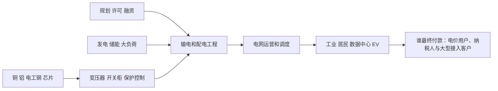

# 电力电网行业供需周期分析：负荷增长倒逼长周期电网扩容

分析日期：2026-07-18 02:10:00 +08:00  
地理范围：全球输配电网、变压器与电网设备，重点观察中国、美国、欧洲和印度  
数据时效：截至2026-07-18；行业实际主要为2025年，2026—2030为IEA预测；公司经营主要截至2026年一、二季度  
行业边界：覆盖输电、配电、变电、保护控制、储能并网和电网灵活性；不把全部发电、售电或新能源装机等同于电网行业。

## 0. 一页看懂

### 这个行业是做什么的

电网把发电端的电送至工业、居民、数据中心和交通负荷。它卖的是可靠接入、输配容量和调度能力；最终付款来自电价、输配费、政府投资和大型用电客户的接入预算。电网建设周期通常远长于风光、数据中心或充电桩建设，因此成为“电气化”扩张的物理瓶颈。
### 三个最重要的数字

| 数字 | 含义 | 当前解读 |
|---|---|---|
| 2,500GW以上 | 全球排队等待电网接入的项目规模 | 并网能力已成为供需矛盾核心。[E1] |
| 50% | 到2030年年电网投资需增加的幅度 | 当前投资与需求增长不匹配。[E1] |
| 6,996百万欧元 | Siemens Energy FY26 Q2电网技术订单 | 设备订单已体现需求兑现。[E4] |

### 当前判断

电力电网处于负荷和接入需求兑现的长周期扩容期，但设备交付、监管核准和工程建设决定投资何时转成可用网络。

### v1.6 结论字段

- 周期阶段：需求兑现下的长周期扩容期
- 结论状态：暂定
- 置信度：中
- 证据截至时间：2026-07-18 21:54:27 +08:00
- 上调条件：接入队列、设备交期和电网订单继续上升且投资核准加快
- 下调条件：设备订单和积压连续转弱，接入队列因取消显著下降

## 1. 产业链地图

### 1.1 电网与设备如何创造价值

输配电设备把电压变换、开断、保护和控制装入可长期运行的网络；工程商把设备、线路、变电站和许可组合成可并网资产。设备商的订单通常早于收入，电网运营商承担长期CAPEX和可靠性责任。

| 环节 | 代表公司/机构 | 上市地与代码 | 关键变量 |
|---|---|---|---|
| 设备 | Siemens Energy、GE Vernova、特变电工 | XETRA: ENR、NYSE: GEV、SSE: 600089 | 订单、产能、交期 |
| 工程/运营 | 国家电网、各国TSO/DSO | 非单一上市主体 | 核准、输配费、施工 |
| 灵活性 | 储能、需求响应服务商 | 非单一上市主体 | 峰谷价差、调度规则 |

### 1.2 各环节详解

#### 1.2.1 变压器、开关与保护控制设备

**它是干什么的**：设备层完成电压变换、故障开断、继电保护和潮流控制，是输配电网络扩容与安全运行的物理基础。

**向谁采购**：向铜铝、电工钢、绝缘材料、芯片、套管和精密制造供应商采购关键材料与零部件。

**卖给谁**：向输电运营商、配电公司、发电项目、数据中心和大型工业接入客户销售经型式试验的设备。

**代表企业**：

| 企业/机构 | 上市地/代码或属性 | 角色 | 代表性依据 | 证据 |
|---|---|---|---|---|
| Siemens Energy | 法兰克福交易所 / ENR | 全球电网技术设备商 | 分部订单与收入验证设备需求 | E4 |
| GE Vernova | 纽约证券交易所 / GEV | 电网设备与电气化供应商 | Q1订单、积压和数据中心需求披露 | E3 |

**怎么赚钱、议价能力**：设备商通过项目售价、工程和生命周期服务获利；高压定制、认证和长交期使头部厂商议价较强，但原材料与扩产成本会侵蚀毛利。

**为什么会卡住**：电工钢、绕组、套管、试验台和熟练工人共同限制产出，新工厂还需通过客户标准和质量验证。

**进阶视角**：扩产公告只增加未来选项，Hitachi新工厂计划到FY28完成，不能填补当前交付缺口；订单、交期和实际投产要分开（E3、E7）。

#### 1.2.2 规划许可、线路与变电站工程

**它是干什么的**：工程环节完成规划、环境审批、征地、融资、线路施工和变电站集成，把设备变成已投运网络资产。

**向谁采购**：向设备商、导线电缆、铁塔、土建、设计院、施工队和融资机构采购工程能力。

**卖给谁**：向输配电运营商、政府和大型接入项目交付可送电的线路、变电站与扩容工程。

**代表企业**：

| 企业/机构 | 上市地/代码或属性 | 角色 | 代表性依据 | 证据 |
|---|---|---|---|---|
| 国家电网 | 未上市/机构 | 中国输配电规划建设运营者 | 代表大型统一电网投资和项目验收 | E5 |
| IEA | 未上市/机构 | 全球电网投资与项目队列研究机构 | 给出规划至完工周期和投资缺口 | E1 |

**怎么赚钱、议价能力**：工程商按里程、站点和总包合同获利，拥有许可、走廊和复杂项目交付能力的主体更有价值；运营商通过核准输配费回收CAPEX。

**为什么会卡住**：征地、环境审查、跨区域协调和施工劳动力常比设备制造更慢，已采购设备也可能等待站址和线路。

**进阶视角**：IEA估计项目周期可达5—15年，长于许多负荷和发电项目；瓶颈因此会从设备订单外溢到许可与施工（E1）。

#### 1.2.3 电网运营、调度与输配费回收

**它是干什么的**：运营商实时平衡发电与负荷，维护频率电压和可靠性，并通过输配费、容量或接入收费回收长期资产投资。

**向谁采购**：向设备、工程、通信、软件、储能和辅助服务提供商采购网络能力与运行灵活性。

**卖给谁**：向发电商、售电商、工业、居民、数据中心和电动车负荷提供接入、输配和调度服务。

**代表企业**：

| 企业/机构 | 上市地/代码或属性 | 角色 | 代表性依据 | 证据 |
|---|---|---|---|---|
| 各国TSO/DSO | 未上市/机构 | 输配电运营与投资主体 | 投资由监管核准并通过费率回收 | E1、E2 |
| IEA | 未上市/机构 | 电力需求与灵活性研究机构 | 可比较需求、队列和可释放容量 | E2、E6 |

**怎么赚钱、议价能力**：受监管网络通过允许收益率和费率回收，市场化运营者通过拥塞、容量与服务收费；可靠性责任限制其短期削减投资。

**为什么会卡住**：费率审批、资金成本、负荷预测和系统安全标准会延迟投资，需求增长并不自动在同季转为设备订单。

**进阶视角**：大型负荷若愿意自备电源或承担接入成本，可改变项目排序；总用电增速仍不能替代峰荷、队列和区域拥塞（E1、E2）。

#### 1.2.4 储能、需求响应与电网增强技术

**它是干什么的**：灵活性资源在高峰削减或转移负荷，储能提供功率与备用，动态增容和潮流控制提升既有线路的可用容量。

**向谁采购**：向电池、逆变器、控制软件、传感器、聚合商和终端用户采购可调度能力。

**卖给谁**：向电网运营商、容量和辅助服务市场及大型用电客户出售削峰、调频、备用与接入优化。

**代表企业**：

| 企业/机构 | 上市地/代码或属性 | 角色 | 代表性依据 | 证据 |
|---|---|---|---|---|
| 聚合商与工业客户 | 未上市/机构 | 可调负荷提供者 | 灵活性章节核对可释放容量而非名义负荷 | E6 |
| 美国能源部 | 未上市/机构 | 电网供应链与技术政策机构 | 汇总变压器、导线和灵活技术供应链 | E8 |

**怎么赚钱、议价能力**：资源通过容量、辅助服务和节约扩容成本获利；能被验证、远程控制并持续履约的资源比纸面可调负荷更有价值。

**为什么会卡住**：市场规则、计量通信、用户基线和持续时间限制可调用规模，不能把所有储能或工业负荷同时计入可用供给。

**进阶视角**：灵活性可以缓解但不能完全替代长期电网投资；应按地点、时段和持续时间核算，避免把全球潜力直接用于单一区域（E6、E8）。

### 1.3 权力与利润传导

| 环节 | 谁最终付款 | 利润来源 | 当前约束 |
|---|---|---|---|
| 电网设备 | 电网和接入客户 | 设备、工程与服务 | 材料、试验和交期 |
| 线路工程 | 受监管运营商 | 总包、建设和费率资产 | 许可、征地和施工 |
| 网络运营 | 电价用户与发电商 | 输配费和接入费 | 监管与负荷预测 |
| 灵活性 | 电网和市场参与者 | 容量与辅助服务 | 规则、计量和履约 |

## 2. 需求：谁在买、为什么买

电网需求来自新增发电并网、工业电气化、EV、空调和数据中心。IEA预计全球电力需求2026—2030年年均增3.6%，中国年均4.9%、印度6.4%；美国到2030新增需求约420TWh，其中数据中心约占一半。[E2]

**进阶视角：**总用电增长并非直接等于设备订单。真正触发采购的是峰荷、接入排队、故障风险和监管允许的CAPEX；负荷可通过需求响应和储能部分缓解，故需同时跟踪接入队列与调度灵活性。[E2][E6]

## 3. 供给：现在有多少、真能用的有多少

IEA称关键电网部件价格五年内接近翻倍，且项目排队规模超过2,500GW；通过非固定义接入和电网增强技术可释放1,200—1,600GW的先进阶段项目容量，但属潜力而非既成投运。[E1][E5]

| 变量 | 事实 | 含义 |
|---|---|---|
| 设备订单 | GE Vernova Q1电气化订单183亿美元、数据中心相关设备订单24亿美元 | 需求已传导至设备端。[E3] |
| 电网设备订单 | Siemens Energy Grid Technologies订单69.96亿欧元，同比+41.5% | 高压设备订单仍强。[E4] |
| 电网投资 | 2026年全球电网投资预计接近5,500亿美元 | 基建投资加速但不等于完工。[E5] |

**进阶视角：**新增变压器产能不能立即解决瓶颈：产品需按电压等级、标准和电网参数定制，且建设端还受许可和线路施工约束。设备订单强并不自动等价于当期收入或全行业利润率。

## 4. 供需矛盾与高频信号

| 信号 | 偏紧组合 | 反证组合 |
|---|---|---|
| 接入队列 | 排队扩大、许可拖延 | 可接入容量释放、取消增加 |
| 设备 | 订单/积压增长、交期长 | 订单回落、价格趋稳 |
| CAPEX | 输配费核准、投资上调 | 监管压价、融资成本上升 |
| 灵活性 | 储能和需求响应扩张 | 峰荷风险继续恶化 |
| 工厂有效产出 | 变压器扩产完成认证并开始交货 | 仅公告厂房投资、关键材料或试验能力仍受限 |

## 5. 周期位置与传导

### 5.0 v1.6 行业事件锚点

| 阶段/日期 | 性质 | 信号 | 利润池往哪移 | 关键时滞 | 证据 | 下一步验证 |
|---|---|---|---|---|---|---|
| 2024 接入约束显性化 | 已发生 | 全球接入队列超过2500GW | 变压器、电缆与工程 | 排队到投运多年 | E1 | 队列取消率 |
| 2025 投资计划上调 | 已发生 | 电网资本开支目标提高 | 设备与EPC | 核准到订单数季 | E2、E3 | 招标和订单 |
| 2026Q2 订单兑现 | 已发生 | Siemens Energy电网订单达到6996百万欧元 | 高压设备与服务 | 积压到收入一年以上 | E4 | 交付与毛利 |
| 2026-2028 扩产交付 | 计划 | 设备厂扩产和电网工程陆续投运 | 利润向能按期交付者集中 | 认证和施工周期长 | E3、E5 | 产能、交期、投运 |

阶段判断：**需求兑现下的长周期扩容期。** 订单、接入排队和投资预测一致显示供给偏紧，但实际工程周期极长，结论保持暂定。[E1][E3][E4]

**进阶视角：**2021—2023年新能源装机快于电网，使瓶颈从发电设备转向接入；2025—2026年数据中心进一步集中负荷。若需求响应和储能成为可复制的替代方案，部分线路CAPEX可被延后，而非完全消失。[E1][E6]

### 5.1 什么会证明这个判断错了

若设备订单、积压与监管核准连续转弱，同时接入队列因取消和技术升级显著下降，则应下调为CAPEX消化期；若负荷增长和设备交期继续上行，已投运网络和关键设备的约束将加强。

## 6. 资金动向

### 6.0 v1.6 分层代理证据

| 代理层级（行业/子链/公司） | 工具/主体 | 覆盖节点 | 指标与期间 | 来源 | 结论 | 局限 |
|---|---|---|---|---|---|---|
| 行业 | GRID | 智能电网设备、工程和公用事业 | 2026-06-30年内NAV回报25.42%、一年回报39.00% | https://www.ftportfolios.com/Retail/Etf/EtfSummary.aspx?Ticker=GRID | 电网扩容已形成清晰市场主题 | 含工业自动化与公用事业 |
| 子链 | GRID持仓 | 电气设备与工程 | 2026-07-15 Eaton 8.65%、Schneider 8.25%、ABB 8.10% | https://www.ftportfolios.com/Retail/Etf/EtfSummary.aspx?Ticker=GRID | 利润预期集中在关键设备龙头 | 权重不是订单份额 |

| 尝试的来源类型 | 具体来源 | 结果 |
|---|---|---|
| 行业估值分位 | 公开指数估值页面 | 未获得同口径历史分位。 |
| ETF份额与资金流 | 电力设备ETF发行方页面 | 未形成可比时间序列。 |
| 龙头经营 | GE Vernova、Siemens Energy官方业绩 | 获得订单和积压相关证据。[E3][E4] |

**已定价（推断）：**市场大概率已关注电网设备订单高增与数据中心负荷，依据是公司订单披露和IEA专题。

**未定价（推断）：**许可、融资和工程执行能否将长期投资转成准时投运仍不确定；这不是估值或资金流的测量结论。

## 7. 未来资金可能流向

### 7.0 v1.6 完整情景

| 情景 | 触发条件 | 利润池往哪个环节移动 | 先受益的环节 | 后受益/受损的环节 | 需要盯的证据 |
|---|---|---|---|---|---|
| 基准 | 核准和订单按计划推进 | 向变压器、电缆和EPC移动 | 关键设备 | 公用事业资产后受益 | 订单、交期、投运 |
| 上行 | 负荷增长超预期且设备交期延长 | 向稀缺高压设备和工程集中 | 变压器与开关设备 | 电缆和服务后受益 | 接入队列、价格、积压 |
| 下行 | 项目取消和监管延迟增加 | 向维护和存量网络移动 | 运维服务 | 扩产设备厂和高杠杆项目受损 | 取消率、核准、订单 |

> 本节是产业传导情景，不构成任何买卖建议、目标价或个股推荐。

以下为情景研究框架，不构成买卖建议。

## 8. 分歧与反证

### 主流叙事

“电网是确定性紧缺，所有电力设备都会受益。”

本报告认为，排队与订单的证据更硬，但不同电压等级、地区监管和工程能力差异很大；可释放的1,200—1,600GW属于技术/监管潜力，并非已交付容量。[E1][E5]

## 9. 观察哨与跟踪

### 9.1 可比时间序列

| 指标 | 单位 | 数值 | 时点 | 来源 |
|---|---|---:|---|---|
| 全球电力需求增速 | % | 3.0 | 2025年 | [E2] |
| 全球电力需求预测增速 | % | 3.6 | 2026—2030年均 | [E2] |
| Siemens Grid Technologies订单 | 百万欧元 | 4,944 | FY25 Q2 | [E4] |
| Siemens Grid Technologies订单 | 百万欧元 | 6,996 | FY26 Q2 | [E4] |

### 9.2 观察表

| 指标 | 基线 | 来源 | 频率 | 正向触发 | 反证触发 |
|---|---|---|---|---|---|
| 全球接入队列 | 超过2,500GW | IEA | 年度 | 排队继续扩大 | 取消与接入释放明显增加 |
| 电网投资 | 当前约4,000亿美元 | IEA | 年度 | 迈向2030所需水平 | CAPEX延后或核准下降 |
| GE电气化订单 | Q1数据中心订单24亿美元 | GE Vernova | 季度 | 订单/积压增长 | 订单显著回落 |
| Siemens电网订单 | FY26Q2 69.96亿欧元 | Siemens Energy | 季度 | 订单和收入同增 | 订单转弱、利润压缩 |
| 灵活性 | 全球需求响应约100GW | IEA | 年度 | DR/储能扩大 | 峰荷与拥塞继续恶化 |

## 10. 术语表

| 术语 | 含义 |
|---|---|
| TSO/DSO | 分别指输电系统和配电系统运营商。 |
| 接入队列 | 等待获得电网接入批准的发电、储能或大负荷项目。 |
| 非固定义接入 | 可更快接入但在拥塞时可能被限制的接入安排。 |
| 需求响应 | 用户按价格或指令调整用电以帮助电网平衡。 |
| 电网增强技术 | 通过动态评级、潮流控制等提高现有网络容量的技术。 |

## 附录A 证据台账

| 证据ID | 事实/用途 | 发布方 | 链接 | 已打开 | 访问日期 | 时效 | 局限 |
|---|---|---|---|---|---|---|---|
| E1 | 队列、投资、周期与部件价格 | IEA | https://www.iea.org/reports/electricity-2026/grids | 是 | 2026-07-18 | 2025—2030 | 项目排队为全球估计，非每个地区实际投运。 |
| E2 | 全球及区域电力需求 | IEA | https://www.iea.org/reports/electricity-2026/demand | 是 | 2026-07-18 | 2025实际/2030预测 | 预测受宏观、天气与政策假设影响。 |
| E3 | GE订单、积压和数据中心设备 | GE Vernova | https://www.gevernova.com/news/press-releases/ge-vernova-reports-first-quarter-2026-financial | 是 | 2026-07-18 | 2026Q1 | 单一公司且含收购影响。 |
| E4 | Siemens电网技术订单和收入 | Siemens Energy | https://assets.siemens-energy.com/dam/352bf02e-bbc1-4061-b00d-b45200cd6b3b/2026-05-22-Shareholder-Letter-Q2-FY2026_EN-pdf_Original%20file.pdf | 是 | 2026-07-18 | FY26Q2 | 分部口径含多类电网技术。 |
| E5 | 2026电网投资与燃机约束 | IEA | https://www.iea.org/news/impacts-of-middle-east-conflict-set-to-reshape-energy-investment-plans-as-disruptions-put-focus-on-security | 是 | 2026-07-18 | 2026预测 | 新闻稿概述，投资未必按计划落地。 |
| E6 | 需求响应与储能灵活性 | IEA | https://www.iea.org/reports/electricity-2026/flexibility | 是 | 2026-07-18 | 2024—2030 | 全球潜力受市场规则和用户参与限制。 |
| E7 | 印度大型电力变压器新工厂投资与FY28时间表 | Hitachi Energy | https://www.hitachienergy.com/news-and-events/press-releases/2026/06/hitachi-energy-secures-india-s-grid-future-with-major-manufacturing-expansion | 是 | 2026-07-18 | 2026-06 | 计划产能尚未投产，不能缓解当前交期。 |
| E8 | 变压器、导线和电网供应链资料入口 | US Department of Energy | https://www.energy.gov/oe/supply-chain-resources | 是 | 2026-07-18 | 当前资料库 | 美国供应链资料不能代表所有地区采购周期。 |

## 附录B 数据时效与证据覆盖

| 模块 | 主要时点 | 覆盖评价 | 缺口 |
|---|---|---|---|
| 需求 | 2025—2030 | 全球和主要区域有IEA数据 | 缺少各国月度接入申请 |
| 供给 | 2025—2026 | 队列、设备订单与投资覆盖 | 缺少统一变压器交期序列 |
| 价格/订单/库存/利润 | 2026Q1/Q2 | 两家设备商订单可观察 | 缺少行业统一价格指数 |
| 资本市场 | 截至2026年7月 | 经营证据与尝试已记录 | 缺少估值和资金流序列 |

## 附录C 证据就绪度与研究执行记录

| 研究线 | 状态 | 已打开来源数 | 最低来源数 | 证据ID | 结论 |
|---|---|---:|---:|---|---|
| 产业链 | Ready | 2 | 2 | E1,E6 | 设备、运营和灵活性已覆盖 |
| 需求 | Ready | 3 | 3 | E1,E2,E5 | 电力、数据中心和区域驱动已覆盖 |
| 供给与有效产能 | Ready | 3 | 3 | E1,E3,E4 | 队列、设备与工程约束已覆盖 |
| 价格/订单/库存/利润 | Ready | 3 | 3 | E3,E4,E5 | 设备订单与投资有证据 |
| 资本市场预期 | Gap | 0 | 2 | — | 已记录尝试，缺可比估值与资金流 |
| 反证 | Ready | 2 | 2 | E1,E6 | 技术升级和需求响应可缓解约束 |

## 尾注

- 供需缺口 ≠ 股价上涨。
- 方向正确 ≠ 时点正确。
- 盈利兑现 ≠ 股价继续上涨。
- AI 回答和搜索摘要不是事实。
- 过期数据不是当前事实。
