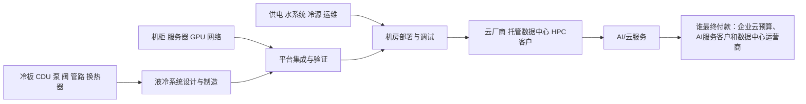
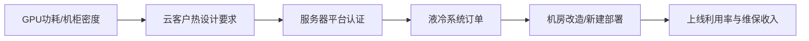

# 液冷行业供需周期分析：AI机柜功率密度推动冷却从部件走向系统交付

分析日期：2026-07-18 01:10:07 +08:00  
地理范围：全球AI/HPC数据中心液冷，包括冷板、CDU、冷却分配、后门换热器、冷水机组与系统集成  
数据时效：截至2026-07-18；公司经营数据主要截至2026年一季度或FY26 Q3，技术与需求资料截至2026年7月  
行业边界：纳入数据中心热管理硬件、冷媒回路与部署服务；不把服务器整机、普通机房空调或通用暖通全部计入液冷收入。

## 0. 一页看懂

### 这个行业是做什么的

液冷通过冷却液把GPU、CPU或机柜产生的热量带走，再经CDU、管路、换热器和外部冷源排出。它卖给云厂商、服务器商和托管数据中心，解决高功率密度AI机柜的温度、能效和占地问题。最终付款方是AI/云算力的使用客户；但采购由服务器平台、机房电力、供水和运维条件共同决定。

结论状态：暂定

### 三个最重要的数字

| 数字 | 含义 | 当前解读 |
|---|---|---|
| 11倍 | 2020—2025年AI服务器功率密度提升 | 高密度正在突破传统风冷的经济边界。[E1] |
| 240kW | Supermicro RDHx方案可达的机柜级冷却能力 | 液冷开始覆盖更高密度和改造场景。[E5] |
| 45% | Vertiv Ohio液冷/冷冻水系统产能计划增幅 | 供给端已开始针对AI热管理扩产，但要到2027年Q2投运。[E3] |

### 当前判断

液冷位于从“可选节能方案”向“高密度AI集群必备系统”切换的早期兑现期。需求由加速服务器功率密度、AI数据中心CAPEX和机柜级交付驱动；有效供给受制于系统设计、客户验证、CDU/管路/冷源协同和现场服务，而非单一冷板产能。高增长成立不等于所有液冷零部件同步受益，价值更可能集中在能拿到整机平台认证、并能交付整套系统的厂商。

## 1. 产业链地图

### 1.1 谁做什么、钱怎么流

液冷系统供应商把冷板、CDU、管路、泵阀和控制组合成可安装的热管理单元；服务器商负责把冷却方案与GPU/主板/机柜验证；数据中心运营商负责冷源、供水、电力、漏液管理和现场SLA。其商业价值来自降低热点与改造难度，而不是单纯卖“水冷件”。

| 环节 | 代表公司/机构 | 上市地与代码 | 关键变量 |
|---|---|---|---|
| 热管理系统 | Vertiv、Schneider Electric | NYSE: VRT、EPA: SU | 系统订单、产能、服务 |
| 服务器/机柜集成 | Supermicro、Dell | NASDAQ: SMCI、NYSE: DELL | 平台认证、交付速度 |
| 冷板/CDU与部件 | 英维克、申菱环境、若干部件商 | SZSE: 002837、SZSE: 301018 | 可靠性、成本、客户导入 |
| 数据中心运营 | 云厂商、托管商 | 多主体 | 机柜密度、上电、改造窗口 |

### 1.2 各环节详解

#### 1.2.1 冷板、泵阀、管路与快速接头

**它是干什么的**：服务器侧部件把CPU、GPU和内存产生的热量传入冷却液，并通过泵阀、软管和接头安全输送到机柜或CDU。

**向谁采购**：向铜铝材料、密封件、泵阀、传感器和精密加工企业采购耐腐蚀、低泄漏的零部件。

**卖给谁**：向服务器厂、液冷系统商、机柜集成商和数据中心改造项目销售平台适配部件。

**代表企业**：

| 企业/机构 | 上市地/代码或属性 | 角色 | 代表性依据 | 证据 |
|---|---|---|---|---|
| 英维克 | 深圳证券交易所 / 002837 | 数据中心热管理供应商 | 代表冷却部件与系统本土供给 | E3 |
| nVent | 纽约证券交易所 / NVT | 液冷架构与连接系统供应商 | GTC资料说明CDU和机架接口延续性 | E8 |

**怎么赚钱、议价能力**：部件按散热能力、可靠性和平台定制收费；通过服务器平台认证并拥有漏液寿命数据的供应商比通用金属加工更有议价力。

**为什么会卡住**：冷媒兼容、腐蚀、密封和批量一致性会限制良率，一个接头失效可能造成高价值服务器停机。

**进阶视角**：冷板降价不代表系统价值下降，标准化可能把利润迁移到连接可靠性、控制和现场服务；需跟踪返修与批量验收（E5、E8）。

#### 1.2.2 CDU、换热与机房冷源

**它是干什么的**：CDU在IT液路与设施水路之间完成换热、控温、控压和过滤，外部冷源再把热量排到环境。

**向谁采购**：向换热器、泵、控制器、过滤器、冷水机组和水处理供应商采购设施级设备。

**卖给谁**：向液冷系统集成商、云厂商、托管数据中心和机电工程总包交付机柜或园区级冷却能力。

**代表企业**：

| 企业/机构 | 上市地/代码或属性 | 角色 | 代表性依据 | 证据 |
|---|---|---|---|---|
| Vertiv | 纽约证券交易所 / VRT | 数据中心电力与热管理系统商 | Q1收入和扩产计划可验证需求与供给时滞 | E3、E6 |
| Schneider Electric | 巴黎泛欧交易所 / SU | 机房基础设施与液冷设计商 | 2026参考设计区分液液与液空气CDU | E7 |

**怎么赚钱、议价能力**：系统商通过设备、设计、控制软件和维护收费；能将液路与电力、冗余和冷源协同交付的厂商更能保住毛利。

**为什么会卡住**：设施水温、水质、泵冗余和热排放路径必须与服务器平台匹配，CDU到货也可能因机房冷源不兼容无法上线。

**进阶视角**：参考设计显示液冷仍需处理网络等空气冷却负荷，所谓全液冷不能按机柜功率简单推算CDU和冷源需求（E7）。

#### 1.2.3 服务器、机柜与平台验证

**它是干什么的**：整机厂把GPU、主板、冷板、歧管、机柜和管理软件组合并验证，使液冷服务器具备可批量交付的接口和维护流程。

**向谁采购**：向芯片、主板、冷板、CDU、机柜、网络与电源厂采购完整平台部件。

**卖给谁**：向云厂商、HPC客户、托管运营商和企业AI项目销售液冷服务器、机柜或整套集群。

**代表企业**：

| 企业/机构 | 上市地/代码或属性 | 角色 | 代表性依据 | 证据 |
|---|---|---|---|---|
| Supermicro | 纳斯达克 / SMCI | 液冷服务器与机柜集成商 | 财报和产品组合可观察交付但未拆液冷收入 | E4、E5 |
| NVIDIA | 纳斯达克 / NVDA | 高密度AI平台定义者 | Vera Rubin公开资料明确液冷平台方向 | E8 |

**怎么赚钱、议价能力**：整机厂按系统配置、交付速度和服务收费；平台认证、固件兼容和批量供应链形成短期溢价，标准化后硬件毛利可能回落。

**为什么会卡住**：芯片版本、机柜接口、流量压差和维护SOP必须同步验证，服务器出货增长不能直接等于液冷渗透率。

**进阶视角**：平台代际会提高功率密度，也会沿用部分液路架构；供应商价值取决于跨代兼容与部署数据，而不是只押注某个新品发布（E5、E8）。

#### 1.2.4 数据中心部署、调试与长期运维

**它是干什么的**：现场团队完成管路、冷源、监控、漏液检测和冗余联调，并在运行中维护水质、压力和SLA。

**向谁采购**：向服务器、CDU、机电工程、水处理、传感器和保险服务商采购系统与持续运维。

**卖给谁**：向云与AI服务客户提供可稳定运行的高密度机柜，并通过托管、云用量和运维合同回收投入。

**代表企业**：

| 企业/机构 | 上市地/代码或属性 | 角色 | 代表性依据 | 证据 |
|---|---|---|---|---|
| Vertiv | 纽约证券交易所 / VRT | 现场基础设施与服务商 | 扩产和经营数据覆盖交付与服务能力 | E3、E6 |
| IEA | 未上市/机构 | 数据中心能耗与冷却研究机构 | 区分冷却能耗、效率情景和终端负荷 | E1、E2 |

**怎么赚钱、议价能力**：运营商靠上架容量和云服务变现，工程服务商靠调试、维护与SLA收费；拥有在运案例和快速响应能力的团队更有议价力。

**为什么会卡住**：存量机房改造窗口、停机风险、人员培训和水资源条件会延迟部署，产品认证通过也不等于现场已投运。

**进阶视角**：液冷有效供给应以已验收并稳定运行的机柜计算；扩产公告和服务器发布都必须经现场漏液率、利用率和客户批量验收验证（E3、E5）。

### 1.3 权力与利润传导

| 环节 | 谁最终付款 | 利润来源 | 当前约束 |
|---|---|---|---|
| 冷板部件 | 系统商和服务器厂 | 可靠性与平台认证 | 密封、腐蚀和良率 |
| CDU冷源 | 数据中心业主 | 设备、控制与维护 | 水温、冗余和冷源 |
| 服务器机柜 | 云厂商和HPC客户 | 系统配置与交付 | 平台兼容和供应链 |
| 部署运维 | AI与云服务客户 | 托管、云用量和SLA | 改造、验收和运维 |

## 2. 需求：谁在买、为什么买

| 需求层 | 购买者 | 触发条件 | 当前状态 |
|---|---|---|---|
| 第一层 | 云厂商、AI训练/推理集群 | GPU功耗、机柜热密度、PUE目标 | 高密度AI需求增加 |
| 第二层 | 服务器商、整机集成商 | 平台认证、交付周期、客户规格 | 开始提供机柜级液冷方案 |
| 第三层 | 企业/互联网/科研用户 | AI工作负载、TCO、机房改造 | 是否转为批量采购仍需验证 |

IEA指出，2020—2025年AI服务器功率密度提高11倍，2027年还可能再提高4倍；数据中心用电在2024—2030年基准情景下年增约15%，加速服务器用电年增约30%。[E1][E2] Supermicro FY26 Q3收入102亿美元、同比高于去年同期，其DCBBS业务增长反映AI机柜交付需求，但公司披露不单独拆出液冷收入。[E4]

**进阶视角：**服务器出货增长并不等于液冷渗透率同幅增长。较低密度机柜仍可用优化风冷或后门换热，液冷的实际订单要由GPU平台代际、机房供水能力、客户改造窗口和可靠性标准共同验证。

## 3. 供给：现在有多少、真能用的有多少

Vertiv在2026年3月宣布约5,000万美元扩建Ohio热管理制造，计划2027年Q2投运并将液冷/冷冻水系统产能提高约45%。这是一项计划产能，不是当前可交付产能。[E3] Supermicro在2026年7月扩展RDHx产品组合，机柜级能力最高240kW，并称可用于新建与存量机房改造。[E5]

| 供给变量 | 证据 | 行业含义 |
|---|---|---|
| 系统产能 | Vertiv计划2027Q2新增约45% | 供给扩张有滞后。[E3] |
| 产品形态 | RDHx 10—120kW、机柜最高240kW | 改造与高密度需求的方案增多。[E5] |
| 部署能力 | 服务器与机柜验证为前提 | 非认证部件难以直接变成收入。 |
| 数据中心需求 | AI数据中心过去18个月容量增逾三倍 | 下游项目增长快于传统基础设施。[E1] |

### 3.1 可比时间序列：关键需求与供给窗口

| 指标 | 单位 | 数值 | 时点 | 来源 |
|---|---|---:|---|---|
| AI服务器功率密度相对水平 | 倍 | 1 | 2020年 | [E1] |
| AI服务器功率密度相对水平 | 倍 | 11 | 2025年 | [E1] |
| Vertiv液冷/冷冻水系统产能 | 指数 | 100 | 2026年3月 | [E3] |
| Vertiv扩产后计划产能 | 指数 | 145 | 2027年Q2计划 | [E3] |

**进阶视角：**宣布扩产不是供给过剩的证据。液冷系统还要通过客户平台认证和现场投运，且部分项目是高定制交付；真正需监控的是交付周期、返修/漏液率、CDU供应和客户批量验收，而不是厂房公告数量。

## 4. 供需矛盾与高频信号

| 信号 | 偏强组合 | 偏弱组合 |
|---|---|---|
| AI机柜密度 | 平台功耗上升、液冷随GPU方案导入 | 能效提升压低热密度 |
| 系统订单 | 机柜级订单和服务积压增长 | 小批试点多、批量验收延后 |
| 供给 | CDU/管路/服务交期偏长 | 标准品竞争、交期缩短 |
| 机房条件 | 新建机房同步设计冷源 | 存量改造成本高、项目延期 |
| 现场质量 | 批量验收后漏液率稳定、运维工时下降 | 样机通过但规模部署故障和返工增加 |

## 5. 周期位置与传导

| 阶段/日期 | 可观察信号 | 利润池迁移 | 关键时滞 | 证据 |
|---|---|---|---|---|
| 2024 高密度机柜试点 | GPU功耗上升推动冷板、CDU和机房改造验证 | 向关键部件和工程设计环节集中 | 样机到现场试运行跨越数月 | E1、E3 |
| 2025 平台配套扩散 | 服务器与数据中心方案开始把液冷纳入标准配置 | 向系统集成、快接和长期运维扩散 | 平台发布领先批量交付 | E2、E5 |
| 2026 批量验收窗口 | NVIDIA新平台和Schneider参考设计进入客户项目验证 | 能控制漏液、调试和SLA的交付方占优 | 设备到货后仍需联调和负载爬坡 | E7、E8 |

阶段判断：**高密度AI拉动下的导入—扩产期。** AI功率密度快速上升、系统商扩产和服务器商产品扩展相互印证；但液冷收入披露不充分、产能多为计划，结论保持暂定。[E1][E3][E5]

**进阶视角：**2023—2024年市场先解决GPU可得性，2025—2026年热与电成为更显性约束。若软件/硬件效率进步快于负载增长，液冷的单机需求斜率会低于当前高功率路线；反之，若推理负载大幅上升，存量机房改造可能成为下一阶段瓶颈。[E1][E2]

### 5.1 什么会证明这个判断错了

若GPU机柜功率密度不再提高、风冷或后门换热已足以覆盖主流平台，且液冷系统订单未随AI服务器出货增长，则行业应停留在试点期；若系统级预订、交付和运维收入同步上升，才可上调为规模兑现期。

## 6. 资金动向

| 尝试的来源类型 | 具体来源 | 结果 |
|---|---|---|
| 行业估值分位 | 公开热管理/数据中心指数页面 | 未获得同口径历史分位。 |
| ETF资金流 | 发行方公开份额页面 | 未得到液冷纯主题可比序列。 |
| 龙头经营 | Vertiv、Supermicro官方披露 | 获得收入、扩产和产品交付证据。[E3][E4][E5] |

**已定价（推断）：**高密度AI将提升热管理需求已是市场主叙事，IEA功率密度数据和厂商扩产支持其现实基础。

**未定价（推断）：**液冷渗透率、系统利润归属和存量机房改造速度仍未被统一证据验证；这不是估值或资金流测量。

## 7. 未来资金可能流向

以下为情景研究框架，不构成买卖建议。

| 情景 | 条件 | 利润池移动 | 先受益 | 后受益/受损 | 验证 |
|---|---|---|---|---|---|
| 基准 | AI机柜持续增密，系统按计划交付 | 向平台认证与系统集成集中 | CDU、冷板系统、服务 | 通用风冷增长放慢 | 功率密度、订单、验收 |
| 上行 | 推理/训练负载大增，机房改造加速 | 向已验证的机柜级系统和部署服务集中 | 液冷系统商、机房工程 | 单一零件扩产滞后 | 系统预订、交期、维保 |
| 下行 | 效率提升或客户CAPEX延后 | 向通用制冷与低成本改造迁移 | 存量运维、模块化方案 | 高定制新建项目承压 | GPU功耗、出货、项目取消 |

## 8. 分歧与反证

### 主流叙事

“AI机柜功率越高，液冷一定会全面替代风冷。”

本报告判断：功率密度是必要条件，不是充分条件。RDHx等方案说明后门换热、直接芯片液冷与存量改造可并存；客户选择取决于机房水系统、平台认证、维护和TCO。IEA的效率情景也表明能效进步可能缓和总电力/热负荷。[E2][E5]

## 9. 观察哨与跟踪

### 9.1 可比时间序列

| 指标 | 单位 | 数值 | 时点 | 来源 |
|---|---|---:|---|---|
| AI服务器功率密度相对水平 | 倍 | 1 | 2020年 | [E1] |
| AI服务器功率密度相对水平 | 倍 | 11 | 2025年 | [E1] |
| Supermicro季度收入 | 十亿美元 | 4.6 | FY25Q3 | [E4] |
| Supermicro季度收入 | 十亿美元 | 10.2 | FY26Q3 | [E4] |

### 9.2 观察表

| 指标 | 基线 | 来源 | 频率 | 正向触发 | 反证触发 |
|---|---|---|---|---|---|
| AI服务器功率密度 | 2020—2025提升11倍 | IEA | 年度 | 新平台继续提高机柜功率 | 效率使功率密度放缓 |
| 数据中心用电 | 2030基准约945TWh | IEA | 年度 | AI负载接近基准/上行情景 | 接近高效率情景 |
| Vertiv扩产 | 2027Q2计划+45% | Vertiv | 季度/事件 | 按期投运且订单增长 | 扩产延后或利用率不足 |
| Supermicro液冷方案 | RDHx最高240kW/机柜 | Supermicro | 产品/季度 | 批量部署和平台扩展 | 仅展示、无规模交付 |
| 系统级收入 | Vertiv Q1销售同比+30% | Vertiv | 季度 | 收入、利润与订单同增 | 订单/利润背离 |

## 10. 术语表

| 术语 | 含义 |
|---|---|
| 冷板 | 与芯片接触并由冷媒带走热量的部件。 |
| CDU | 冷却液分配单元，控制液体循环、压力和换热。 |
| RDHx | 后门换热器，安装在机柜后部以带走热量。 |
| D2C | 直接芯片液冷，将冷却液直接导向CPU/GPU冷板。 |
| PUE | 数据中心总能耗与IT设备能耗之比。 |
| TCO | 总拥有成本，包含购置、能耗、运维和改造。 |

## 附录A 证据台账

| 证据ID | 事实/用途 | 发布方 | 链接 | 已打开 | 访问日期 | 时效 | 局限 |
|---|---|---|---|---|---|---|---|
| E1 | AI功率密度、AI工厂扩张与效率 | IEA | https://www.iea.org/reports/key-questions-on-energy-and-ai/executive-summary?_bhlid=10646f272364cf3af59c0fa8f3886b1cfe01e627 | 是 | 2026-07-18 | 2026-04 | 多数为全球估计和情景，不是液冷销售数据。 |
| E2 | 数据中心冷却占比、用电与效率情景 | IEA | https://www.iea.org/reports/energy-and-ai/energy-demand-from-ai | 是 | 2026-07-18 | 2024实际/2030预测 | 对不同机房冷却技术未完全拆分。 |
| E3 | Vertiv液冷产能扩建 | Vertiv | https://investors.vertiv.com/news/news-details/2026/Vertiv-to-Expand-Ohio-Manufacturing-to-Boost-U-S--Production-of-Critical-Thermal-Management-Technologies-for-AI-Data-Centers/ | 是 | 2026-07-18 | 2026-03公告 | 为2027Q2计划，尚非现有产能。 |
| E4 | Supermicro收入、DCBBS与经营表现 | Supermicro | https://ir.supermicro.com/news/news-details/2026/Supermicro-Announces-Third-Quarter-Fiscal-Year-2026-Financial-Results/default.aspx | 是 | 2026-07-18 | FY26Q3 | 公司未拆分液冷收入。 |
| E5 | RDHx产品容量与机房改造路径 | Supermicro | https://ir.supermicro.com/news/news-details/2026/Supermicro-Expands-End-to-End-DCBBS-Liquid-Cooling-Portfolio-with-Rear-Door-Heat-Exchangers-for-High-Density-AI-and-HPC-Infrastructure/default.aspx | 是 | 2026-07-18 | 2026-07 | 产品发布不等于订单或出货规模。 |
| E6 | Vertiv Q1收入与数据中心需求 | Vertiv | https://investors.vertiv.com/news/news-details/2026/Vertiv-Reports-Strong-First-Quarter-with-Diluted-EPS-Growth-of-136-Adjusted-Diluted-EPS-Growth-of-83-Raises-Full-Year-Guidance/default.aspx | 是 | 2026-07-18 | 2026Q1 | 公司收入覆盖电力和服务，非液冷纯口径。 |
| E7 | 液冷与风冷混合AI集群参考设计 | Schneider Electric | https://www.se.com/ae/en/download/document/RD100DSR0_EN/ | 是 | 2026-07-18 | 2026-03 | 设计容量不是实际项目订单或验收数据。 |
| E8 | Vera Rubin液冷平台与TCS/CDU架构 | NVIDIA | https://www.nvidia.com/gtc/session-catalog/sessions/gtc26-ex82328/ | 是 | 2026-07-18 | 2026-03 | 会议技术资料不披露供应商收入和批量交付。 |

## 附录B 数据时效与证据覆盖

| 模块 | 主要时点 | 覆盖评价 | 缺口 |
|---|---|---|---|
| 需求 | 2024—2026 | AI密度、数据中心用电和服务器收入有证据 | 缺全球液冷渗透率实际序列 |
| 供给 | 2026—2027计划 | 产品与扩产公告可核验 | 缺关键零部件交期和良率 |
| 价格/订单/库存/利润 | 2026Q1/Q3 | 系统商经营指标可观察 | 缺液冷单独ASP/毛利率 |
| 资本市场 | 截至2026年7月 | 已记录可获得的经营叙事 | 缺纯主题估值和资金流 |

## 附录C 证据就绪度与研究执行记录

| 研究线 | 状态 | 已打开来源数 | 最低来源数 | 证据ID | 结论 |
|---|---|---:|---:|---|---|
| 产业链 | Ready | 2 | 2 | E2,E5 | 从芯片到机房部署已覆盖 |
| 需求 | Ready | 3 | 3 | E1,E2,E4 | 功率密度、用电和服务器需求已覆盖 |
| 供给与有效产能 | Ready | 3 | 3 | E3,E5,E6 | 扩产、产品与系统商已覆盖 |
| 价格/订单/库存/利润 | Ready | 3 | 3 | E3,E4,E6 | 有经营和供给计划证据，纯液冷口径仍有缺口 |
| 资本市场预期 | Gap | 0 | 2 | — | 已记录尝试，缺可比估值与资金流 |
| 反证 | Ready | 2 | 2 | E1,E2 | 效率进步与技术替代路径已覆盖 |

## 尾注

- 供需缺口 ≠ 股价上涨。
- 方向正确 ≠ 时点正确。
- 盈利兑现 ≠ 股价继续上涨。
- AI 回答和搜索摘要不是事实。
- 过期数据不是当前事实。
