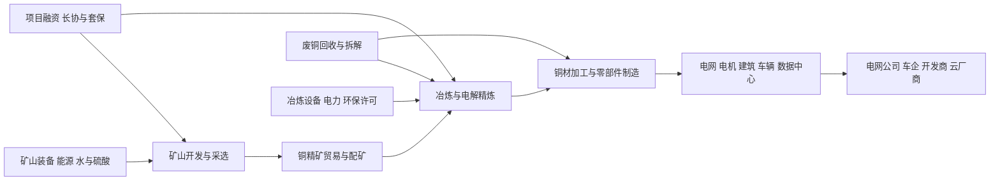

# 铜行业供需周期分析

分析日期：2026-07-18 01:14:58 +08:00
地理范围：全球铜矿、铜精矿、冶炼精炼与再生铜；重点观察中国冶炼环节、拉美和印尼矿山，以及全球电网、交通与数据中心终端。
数据时效：2026年7月可得的最新公司运营实际为 BHP 截至2026年6月的财年运营回顾；ICSG 2026—2027年为2026年4月预测；IEA 2035年缺口为情景预测，均与实际分列。
行业边界：纳入铜矿采选、铜精矿贸易、粗炼/精炼、铜材加工、废铜回收及终端用铜；不将铝、光纤和电力设备整机视为铜行业产能。
研究模式：完整深研

> 阅读路线——首次接触本行业：按 0→1→2→3→4→5→7→9 顺序阅读；熟悉行业者可先看第5、6、8节，再用附录A核对原始证据。

## 0. 一页看懂

**这个行业是做什么的**：铜行业把矿石中的铜选成铜精矿，再冶炼、精炼成阴极铜和铜杆、铜箔、铜管等材料，卖给电网、电机、建筑、汽车和数据中心的制造商。最终付款的不是矿山或冶炼厂，而是为输配电、交通、工业设备和数字基础设施立项的电网公司、车企、开发商与云厂商。

**一句话判断**：短期精炼铜年度平衡并未确认紧缺，但矿端扰动与精矿紧张已使冶炼加工费降至极端水平；在电网和电气化拉动下，行业处于“矿端偏紧、冶炼利润分化、终端需求仍待宏观验证”的暂定阶段。

- 周期阶段：矿端紧平衡与中游挤压并存（推导见第5节）
- 结论状态：暂定
- 置信度：中
- 最大缺口：公开的全球实物库存与中国保税/隐性库存不能与ICSG表观需求口径完整对齐。

**三个最重要的数字**：

| 数字 | 含义 | 为什么它最重要 | 证据 |
|---|---|---|---|
| 0美元/吨 | 2026年铜精矿年度TC/RC基准结算价 | 冶炼端传统加工收入被压缩，直接显示精矿而非精炼名义产能在约束利润 | E2 |
| +1.6% | ICSG对2026年全球矿产铜增长预测 | 比2025年10月的+2.3%下调，矿端恢复比预期慢 | E3 |
| 25% | IEA对2035年铜供应缺口的项目管线预测 | 远期缺口由项目交付、矿石品位和开发周期决定，不等同于当年现货缺货 | E1 |

## 1. 产业链地图

### 1.1 全景图



货物流从矿石到精矿、阴极铜再到铜材；资金从终端项目预算逆向形成采购与长协。真正的瓶颈不是“世界有没有冶炼炉”，而是可交付精矿、矿山许可和可持续的冶炼现金流。废铜能补充精炼供给，但其可得量和杂质等级受回收体系制约。

### 1.2 环节详解

### 1.2.1 矿山开发与采选

**它是干什么的**：用钻爆、破碎、浮选把低品位矿石中的铜富集为可供冶炼的铜精矿。

**上游买什么 / 下游卖给谁**：购买矿权、设备、电力、水和硫酸等投入；向贸易商、关联冶炼厂和独立冶炼厂出售精矿。

**代表企业**：

| 公司 | 上市地/代码 | 在该环节的地位 | 为什么能代表该环节 | 证据 |
|---|---|---|---|---|
| BHP | 澳交所/伦交所：BHP | 多矿山综合生产商 | FY2026连续第二年产铜约200万吨，代表大型矿山的真实交付能力 | E5 |
| Freeport-McMoRan | 纽约证券交易所：FCX | 美洲和印尼大型铜矿运营商 | Grasberg、Morenci、Cerro Verde等资产说明单一矿山事故可改变全球增量预期 | E6、E3 |

**怎么赚钱、议价能力**：矿山以精矿金属量和结算铜价取得收入；优质矿权、较高品位和配套基础设施决定成本曲线位置。开发周期长，价格上涨并不会立刻转成新增精矿。

**进阶视角**：市场容易把高铜价理解为矿产量会迅速释放，但IEA指出新矿从发现到投产平均约17年，ICSG又下调了2026年矿产量增速；因此应先观察存量矿修复和扩建爬坡，不能把远期项目公告等同于当年有效供给（E2、E3）。

### 1.2.2 冶炼与电解精炼

**它是干什么的**：把精矿熔炼为粗铜，再用电解把铜提纯为可进入制造业的阴极铜，同时回收金银和硫酸等副产品。

**上游买什么 / 下游卖给谁**：采购精矿、能源、氧气和环保处理服务；向铜杆厂、铜板带箔厂和电缆厂销售阴极铜及副产品。

**代表企业**：

| 公司 | 上市地/代码 | 在该环节的地位 | 为什么能代表该环节 | 证据 |
|---|---|---|---|---|
| 江西铜业 | 上交所：600362；港交所：0358 | 中国大型综合铜企 | 同时覆盖矿山、冶炼和铜材，能观察一体化对低TC/RC的缓冲 | E2 |
| Aurubis | 德交所：NDA | 欧洲铜冶炼与回收商 | 以外购精矿和再生料为主，代表独立冶炼对加工费和副产品价格的敏感性 | E2 |

**怎么赚钱、议价能力**：冶炼厂靠TC/RC、金银硫酸等副产品与精炼铜溢价覆盖加工成本。拥有自有精矿的一体化厂比完全依赖外购精矿的定制冶炼厂更抗压。

**进阶视角**：2026年基准TC/RC为0美元/吨，说明冶炼能力扩张不能直接证明中游景气；中国自2005年以来贡献了全球冶炼增量的九成以上，2025年约占全球产能一半，名义冶炼能力反而加剧了对精矿的竞购（E2）。

### 1.2.3 铜材加工与终端制造

**它是干什么的**：将阴极铜连铸连轧成铜杆、轧成铜箔或拉制成线缆、绕组和连接件，装入输配电设备、车辆和电子系统。

**上游买什么 / 下游卖给谁**：购买阴极铜、废铜和加工设备；向电缆厂、变压器厂、电机厂、车企和电子制造商销售半成品或部件。

**代表企业**：

| 公司 | 上市地/代码 | 在该环节的地位 | 为什么能代表该环节 | 证据 |
|---|---|---|---|---|
| 住友电工 | 东京证交所：5802 | 电线电缆与连接系统制造商 | 代表电网、电信和汽车线束对铜材的加工需求 | E4 |
| 金杯电工 | 深交所：002533 | 电磁线与电线电缆制造商 | 代表中国电网和工业设备采购向铜材的传导 | E4 |

**怎么赚钱、议价能力**：铜价通常以金属成本转嫁，真正的利润来自加工费、产品认证、交货能力与客户规格。标准铜杆弹性低，特种电磁线和高可靠线缆的认证壁垒更高。

**进阶视角**：终端用铜增长并非只由新能源车决定；ICSG将电气化、城镇化、数据中心和新增铜材产能并列为2026—2027年需求支持因素，但其同时下调了当年需求预测，意味着项目立项与实际拉货仍有时滞（E3）。

### 1.3 钱怎么流：利益传导

| 问题 | 回答 | 证据 | 缺口 |
|---|---|---|---|
| 谁最终付款？ | 电网公司、车企、地产和工业项目业主、云厂商以设备与基础设施预算付款。 | E1、E4 | 未取得终端行业统一的铜采购金额。 |
| 利润当前集中在哪里，为什么？ | 矿山端受高铜价直接受益；有自有矿的冶炼厂可缓冲，完全外购精矿的冶炼厂加工费收入受压。 | E2、E5 | 各厂副产品收入结构不完全公开。 |
| 谁承担资本开支和库存风险？ | 矿山承担勘探、建设和品位下降风险；贸易商和铜材厂承担金属库存、套保与客户交付风险。 | E2、E3 | 缺少全球统一库存持有者统计。 |
| 谁有定价权，凭什么？ | LME等基准价格影响金属价值；稀缺精矿使矿山在TC/RC谈判中更强，规格化铜材以加工服务定价。 | E2 | 长协条款多为非公开。 |
| 谁重要但赚不到钱？ | 定制冶炼厂是关键中游节点，但在0 TC/RC下其加工收入可能不足。 | E2 | 需要逐厂现金成本验证。 |

订单与预算流：

```text
[电网扩容、车辆、工厂与数据中心项目] -> [业主资本预算] -> [变压器/线缆/电机订单] -> [铜材与阴极铜采购] -> [精矿与矿山投资]
```

## 2. 需求：谁在买、为什么买

事实：

- IEA称2025年能源部门贡献关键能源矿物需求增量约75%，电网、风电、光伏、电动车和储能是核心场景（E4）。
- ICSG预计2026年全球精炼铜表观使用量增长1.6%、2027年增长2.0%；2026年中国增长约1.9%、中国以外约1.3%，但该预测已低于2025年10月版本（E3）。
- BHP在FY2025运营回顾中将可再生能源投资、电网建设、机械出口和电动车销售列为铜需求支撑（E7）。

| 终端用途 | 买方/预算所有者 | 购买动因 | 已兑现还是预期 | 可观察指标 | 证据 |
|---|---|---|---|---|---|
| 输配电与变压器 | 电网公司、设备厂 | 扩网、并网和可靠性投资 | 长周期建设，部分兑现 | 电网投资、线缆和变压器订单 | E1、E4 |
| 电动车与储能 | 车企、电池及充电投资方 | 电机、线束、充电桩和储能连接 | 需求已增长但增速会受政策和价格影响 | 电动车销量、储能装机 | E4 |
| 数据中心与工业设备 | 云厂商、工业业主 | 配电、母线、电机与冷却系统 | 处于持续建设而非统一铜统计口径 | 数据中心建设和设备订单 | E3、E7 |
| 建筑与传统制造 | 开发商、制造企业 | 管材、电线与设备更新 | 宏观敏感，区域分化明显 | 制造业活动、房地产开工 | E3 |

推断与假设：

- 推断：电网和工业电气化给铜提供较长的需求底座，但不能以单一“AI”叙事代替全行业需求，因为数据中心目前尚未有全球可比的独立铜消费实际序列（E3、E4）。
- 假设：若2026年制造业和项目融资明显转弱，ICSG的精炼使用预测仍可能继续下修；反证是电网和数据中心订单在宏观放缓时仍同步上修。

**进阶视角**：需求端最大的口径陷阱是“电气化趋势”与“本年度精炼铜拉货”并不相同。ICSG已因贸易流与宏观不确定性把2026年使用增速从2.1%下调到1.6%，所以应将长期结构需求与短期表观需求分别监测（E3）。

## 3. 供给：现在有多少、真能用的有多少

| 环节/项目 | 公告产能 | 已安装 | 已验证/爬坡达标 | 有客户订单支撑 | 释放窗口 | 证据 | 缺口 |
|---|---:|---:|---:|---:|---|---|---|
| 全球矿产铜 | 不适用 | 存量矿山 | 2026年产量增速预测1.6% | 精矿由冶炼厂和贸易商采购 | 2026年全年预测 | E3 | 预测并非实际月度产量 |
| BHP铜矿组合 | 不适用 | 运营中 | FY2026产铜约200万吨 | 面向全球精矿/铜市场 | FY2026实际 | E5 | 未披露各矿可售精矿结构 |
| 全球精炼铜 | 不适用 | 冶炼能力存在 | 2026年精炼产量增长预测仅0.4% | 下游铜材厂采购 | 2026年全年预测 | E3 | 未区分每座冶炼厂开工率 |
| 再生铜 | 不适用 | 回收与二次冶炼 | 2027年二次精炼增长预测5.7% | 废铜回收体系供料 | 2027年预测 | E3 | 2026年实际回收量尚未统一发布 |

事实：

- IEA指出2026年精矿紧张叠加中国冶炼扩张，使基准TC/RC降为0；中国冶炼产出份额在2025年约为全球一半（E2）。
- ICSG预计2026年精炼铜产量仅增0.4%，其中一次电解精炼受精矿可得性限制；2027年依靠精矿改善和SX-EW、再生能力扩张增3.0%（E3）。
- IEA预计当前项目管线下2035年铜供应缺口约25%，虽较上一版约30%改善，仍是长期矿端约束（E1）。

推断与假设：

- 推断：当精矿边际供给不足时，新增冶炼炉并不等于新增有效精炼供给，首先表现为TC/RC下跌和外购精矿冶炼利润压缩（E2、E3）。
- 假设：若Grasberg、Kamoa及智利、刚果（金）矿山恢复快于预测，精矿紧张会缓解；反证是矿山再发生事故或产量修复继续低于ICSG路径（E3）。

**进阶视角**：名义冶炼产能与有效供给之间的折损环节是“拿得到且经济上可加工的精矿”，不是电解槽数量。2026年0 TC/RC与精炼产量仅+0.4%的组合，正说明中游扩产受上游给料约束（E2、E3）。

## 4. 供需矛盾与高频信号

核心矛盾：矿山和精矿增量偏慢，而冶炼能力竞争精矿；但2026年精炼铜表观年度平衡仍被ICSG预测为9.6万吨小幅过剩。前者解释加工费与中游利润，后者约束“立即全面短缺”的结论。

| 信号 | 最新值/方向 | 数据期间 | 证据 | 解读 | 缺口 |
|---|---|---|---|---|---|
| 铜价 | 2026年1月盘中一度超过14,500美元/吨 | 2026年1月 | E2 | 高价同时受矿山扰动、库存迁移和金融因素放大，不能单独当作现货缺货证据 | 缺少统一现货升贴水序列 |
| 年度TC/RC | 0美元/吨 | 2026年度 | E2 | 精矿谈判权显著向矿山倾斜，定制冶炼现金流承压 | 合同覆盖比例不同 |
| 矿产铜增长 | +1.6%预测 | 2026全年 | E3 | 较上次预测下修，恢复与扩产速度低于此前预期 | 尚非全年实际 |
| 精炼铜平衡 | +9.6万吨预测 | 2026全年 | E3 | 年度表观口径为小幅过剩，提醒不要把精矿紧张外推为所有铜品立刻缺货 | 未含中国未报告库存变化 |
| BHP产铜 | 约200万吨，连续第二年 | FY2026截至6月 | E5 | 大矿企稳定交付部分抵消矿端扰动，但并未改变新项目长周期 | 仅代表单一公司 |

## 5. 周期位置与传导

传导链：

```text
[电网和电气化项目预算] -> [线缆/变压器/电机订单] -> [铜材与阴极铜采购] -> [精矿竞购与TC/RC] -> [矿山扩建资本开支] -> [长周期投产] -> [精矿改善或继续紧张]
```

| 阶段/日期 | 信号 | 利润池往哪移 | 关键时滞 | 证据 | 下一步验证 |
|---|---|---|---|---|---|
| 2024—2026矿端扰动与高价 | 现货铜价创新高、TC/RC跌至0 | 矿山及有自有精矿的一体化运营者 | 矿山事故到精矿交付可立即影响，扩建补给需多年 | E2、E3 | TC/RC是否回升、矿山修复是否兑现 |
| 2026年精炼平衡暂缓 | ICSG预测精炼铜过剩9.6万吨 | 铜材厂与冶炼厂未必同步受益 | 终端拉货、库存和表观进口会形成季度偏差 | E3 | 中国库存和实际表观消费 |
| 2030年代管线压力 | 2035年25%缺口预测 | 获批矿权、资源量和低成本扩建项目 | 发现到投产平均约17年 | E1、E2 | 可研、许可、融资和建设节点 |

当前阶段：

- 阶段：矿端偏紧、精炼端年度平衡待验证
- 进入时间/锚点：2026年1月年度TC/RC结算至0美元/吨；2026年4月ICSG将矿产铜增长预测下调为1.6%。
- 预期切换条件：若年度TC/RC持续回升且ICSG将精炼铜平衡预测上修为明显过剩，矿端紧张判断需降级；若矿山修复推迟且TC/RC维持极低，则中游挤压延续。
- 置信度：中
- 什么会证明这个判断错了：2026年下半年实际矿产量显著超过ICSG路径，同时精炼铜库存和TC/RC同步改善，且终端消费没有下滑。

**进阶视角：与上一轮周期的对照**：2010—2011年铜价上行更受中国基建和全球复苏驱动，随后2012—2015年需求放缓和矿山项目释放使价格承压；本轮从2024—2026年开始，电网、电气化和数据中心增加了需求来源，但低品位、许可和更高资本强度使供给响应更慢。可比性有限：本轮还叠加中国冶炼扩张、TC/RC为零和关税扰动，不能照搬上一轮的价格—投资时滞（E2、E3）。

## 6. 资金动向

### 6.1 尝试的来源类型

| 尝试的来源类型 | 具体来源 | 结果 |
|---|---|---|
| 行业指数估值分位 | 中证指数与国证指数公开页面 | 未获得可与全球铜矿、冶炼、铜材边界一一对应的最新估值分位，不能替代行业事实。 |
| 行业ETF份额/资金流 | 境内有色金属及铜主题ETF基金公告 | 主题覆盖多金属或单一市场，口径不能对应本报告全球铜产业链。 |
| 北向/两融或同类资金流指标 | 港交所及交易所公开统计 | 无法在同一口径下拆分铜矿、冶炼和铜材环节，记录为数据缺口。 |
| 龙头股价与盈利的剪刀差 | BHP、FCX投资者关系页及运营回顾 | 获得公司运营与披露入口，但本轮未构建同日价格—盈利时间序列，不能量化定价。 |

**已定价（推断）：**市场大致已定价铜价创新高、矿山扰动和远期电气化需求；依据是IEA对高价、投资增加和长期缺口的公开讨论，以及大型矿企持续扩展铜项目（E1、E2、E5）。

**未定价（推断）：**并不清楚市场是否充分计入定制冶炼厂在0 TC/RC下对副产品价格的依赖，以及实际库存变化对ICSG表观平衡的偏离；这两项尚无本轮可比量化市场数据（E2、E3）。

判断依据与不确定性：这是叙事和行业事实的推断，不是估值测量；铜价也受美元、利率、关税和金融持仓影响，不能把价格表现直接归因于实物缺口。

## 7. 未来资金可能流向

> 本节是周期传导的情景推演，不构成任何买卖建议、目标价或个股推荐。

| 情景 | 触发条件 | 利润池往哪个环节移动 | 先受益的环节 | 后受益/受损的环节 | 需要盯的证据 |
|---|---|---|---|---|---|
| 基准 | 矿产铜约按+1.6%增长、精炼市场小幅平衡 | 矿山与一体化冶炼维持较强，标准铜材以加工费为主 | 已有低成本矿和自有精矿的运营者 | 外购精矿冶炼厂受TC/RC约束 | ICSG更新、TC/RC、矿山产量 |
| 上行 | 矿山修复延迟且电网/数据中心订单上修 | 向矿权、扩建项目、再生料与副产品回收能力移动 | 具备现成矿石和精矿销售能力的矿山 | 定制冶炼和低议价铜材厂成本承压 | 事故、精矿现货条款、长协 |
| 下行 | 终端使用继续下修、库存累积且矿山恢复超预期 | 从矿山超额利润回落至下游库存管理和低成本加工 | 有套保能力、订单稳定的铜材企业 | 高成本矿山和依赖高副产品价格的冶炼厂 | 库存、ICSG平衡、TC/RC回升 |

推演逻辑：矿山到新精矿的建设周期远长于铜材厂调整库存的周期，因此供给再紧时矿端先响应；冶炼厂能否随后受益取决于精矿条款而非只取决于阴极铜价格。反过来，终端放缓先压铜材库存，再经阴极铜和精矿采购传回矿端。

## 8. 分歧与反证

主流叙事 vs 本报告：

| 市场主流叙事 | 本报告判断 | 分歧在哪 | 谁的证据更硬 | 证据 |
|---|---|---|---|---|
| “铜已经全面短缺，价格高就代表所有环节景气” | 矿端和精矿确实紧，但2026年精炼铜年度表观平衡预测仍为小幅过剩 | 精矿紧张、精炼平衡、库存与金融价格属于不同口径 | ICSG对精炼平衡和IEA对TC/RC更直接 | E2、E3 |
| “远期缺口必然在当年兑现” | 2035年25%缺口支持长期投资约束，但不能替代2026年实际供需 | 项目管线预测与年度实际不同 | IEA明确标注为项目管线预测 | E1 |
| “冶炼扩产一定受益” | 低TC/RC下外购精矿冶炼厂可能被挤压，一体化程度决定分化 | 名义产能与经济可用产能不同 | IEA对费用和中国冶炼份额的说明更直接 | E2 |

冲突证据：

| 议题 | 支持证据 | 反对证据 | 口径差异 | 处理 |
|---|---|---|---|---|
| 2026年是否紧缺 | TC/RC为0、矿山增长下修 | ICSG预测精炼铜过剩9.6万吨 | 精矿市场与精炼铜表观平衡不同 | 未解决；结论保持暂定 |
| 远期缺口大小 | IEA预计2035年缺口25% | 新项目推进使缺口较前版30%收窄 | 同为预测，项目执行概率仍变化 | 未解决；跟踪项目里程碑 |

## 9. 观察哨与跟踪

| 指标 | 基线 | 来源 | 频率 | 正向触发 | 反证触发 | 含义 |
|---|---|---|---|---|---|---|
| 全球矿产铜产量增速 | 2026年预测+1.6% | ICSG E3 | 半年/年度 | 实际持续低于+1.6% | 实际明显高于+1.6% | 验证矿端是否仍紧 |
| 年度与现货TC/RC | 2026年年度基准0美元/吨 | IEA E2 | 月度/年度谈判 | 现货持续低位或负值 | 基准和现货同步回升 | 验证精矿竞购强度 |
| 全球精炼铜平衡 | 2026年预测+9.6万吨 | ICSG E3 | 半年 | 预测转缺口或库存下降 | 过剩上修至明显水平 | 检验精炼铜年度平衡 |
| BHP铜产量 | FY2026约200万吨 | BHP E5 | 季度/年度 | 扩建和修复推高实际产量 | 产量或指引下修 | 观察大型矿山交付 |
| 铜矿公司资本开支 | 2025年铜专注公司投资+8% | IEA E4 | 年度 | 投资继续增加并获许可 | 投资收缩或项目延期 | 判断远期供给响应 |

### 9.1 可比时间序列

| 日期 | 指标 | 数值 | 单位 | 来源 | 含义 |
|---|---|---:|---|---|---|
| FY2025截至2025年6月 | BHP集团铜产量 | 2017 | 千吨 | E7 | BHP披露的实际年度产量。 |
| FY2026截至2026年6月 | BHP集团铜产量 | 2000 | 千吨 | E5 | 连续第二年约200万吨，显示大型矿企交付稳定但不代表全球供给。 |

跟踪数据底稿：

| 日期 | 指标 | 环节 | 数值 | 同比/环比 | 方向 | 来源 | 对判断的影响 | 备注 |
|---|---|---|---:|---:|---|---|---|---|
| 2026年4月 | 2026年矿产铜增速预测 | 矿山 | 1.6 | 较2025年10月预测-0.7个百分点 | 下修 | E3 | 支持矿端偏紧 | 预测，非实际 |
| 2026年1月 | 年度TC/RC | 冶炼 | 0 | 不适用 | 下行至零 | E2 | 支持精矿紧张和中游承压 | 合同基准 |

### 9.2 观察框架

| 指标 | 基线 | 来源 | 频率 | 正向触发 | 反证触发 |
|---|---|---|---|---|---|
| 2026年矿产铜增长 | +1.6%预测 | ICSG E3 | 半年 | 实际低于1.6% | 实际高于1.6%且持续 |
| 2026年精炼铜平衡 | +9.6万吨预测 | ICSG E3 | 半年 | 转为缺口 | 过剩扩大至30万吨以上 |
| 铜TC/RC | 年度基准0美元/吨 | IEA E2 | 月度 | 维持低位或继续为负 | 基准恢复正值并维持 |

## 10. 术语表

| 术语 | 人话解释 |
|---|---|
| 铜精矿 | 矿石经选矿后得到的高铜含量原料，仍需冶炼和精炼。 |
| 阴极铜 | 经电解提纯后的高纯度铜板，是多数铜材生产的标准原料。 |
| TC/RC | 冶炼厂向矿山收取的处理费和精炼费；它下降通常意味着精矿更紧、冶炼厂议价更弱。 |
| SX-EW | 溶剂萃取—电积法，可从特定矿石或浸出液直接得到铜，和传统精矿冶炼路线不同。 |
| 表观需求 | 用产量、进出口和可观察库存推算的需求，未必覆盖所有未报告库存变化。 |

## 附录A 证据台账

| 证据ID | 结论 | 类型 | 发布方 | 发布日期 | 访问日期 | 数据期间 | 地域/单位 | 原文链接/定位 | 已打开 | 时效 | 局限 |
|---|---|---|---|---|---|---|---|---|---|---|---|
| E1 | 2035年铜供应缺口预测约25% | 预测 | IEA | 2026-07 | 2026-07-18 | 2035 | 全球/项目管线 | https://www.iea.org/reports/global-critical-minerals-outlook-2026/executive-summary 第247—248行 | 是 | 当前 | 长期模型依赖项目推进和需求情景。 |
| E2 | 2026年TC/RC基准为0、冶炼受精矿约束 | 事实 | IEA | 2026-03-02 | 2026-07-18 | 2024—2026 | 全球/美元每吨 | https://www.iea.org/commentaries/copper-prices-have-hit-record-highs-but-smelters-face-mounting-strategic-pressures/ 第232—264行 | 是 | 当前 | 费用指标不等同于每家冶炼厂利润。 |
| E3 | 2026年矿产铜+1.6%、精炼平衡+9.6万吨预测 | 预测 | ICSG | 2026-04-23 | 2026-07-18 | 2026—2027 | 全球/铜吨 | https://icsg.org/download/2026-04-23-press-release-icsg-copper-market-forecast-2026-2027/?filename=2026-04-23-ICSG-Forecast-Press-Release.pdf&ind=69ea529460d24&refresh=9a8e40d5&wpdmdl=9245 第6—55行 | 是 | 当前 | 中国表观需求不含未报告库存变动。 |
| E4 | 能源部门贡献关键矿物需求增量约75%，铜矿公司投资+8% | 事实 | IEA | 2026-07 | 2026-07-18 | 2025 | 全球/同比 | https://www.iea.org/reports/global-critical-minerals-outlook-2026/market-overview 第230—243行 | 是 | 当前 | 覆盖关键能源矿物整体，并非铜终端消费拆分。 |
| E5 | BHP FY2026连续第二年产铜约200万吨 | 事实 | BHP | 2026-07-16 | 2026-07-18 | FY2026截至6月 | 全球/铜吨 | https://www.bhp.com/news/media-centre/releases/2026/07/bhp-operational-review-for-the-year-ended-30-june-2026 第285—292行 | 是 | 当前 | 单一公司实际不能代表全球矿山总量。 |
| E6 | Freeport披露2026年一季度业绩入口 | 事实 | Freeport-McMoRan | 2026-04-23 | 2026-07-18 | 2026年一季度 | 美国公司披露 | https://investors.fcx.com/investors/news-releases/news-release-details/2026/Freeport-Reports-First-Quarter-2026-Results/default.aspx 第161—171行 | 是 | 当前 | 页面正文依赖下载附件，未用于产量数值。 |
| E7 | BHP FY2025实际铜产量2,017千吨 | 事实 | BHP | 2025-07-18 | 2026-07-18 | FY2025截至6月 | 全球/铜吨 | https://www.bhp.com/news/media-centre/releases/2025/07/bhp-operational-review-for-the-year-ended-30-june-2025 第284—290行 | 是 | 被更新 | 与FY2026同口径可比，但已不是最新年度。 |

## 附录B 数据时效与证据覆盖

| 指标 | 期间 | 状态 | 发布日期 | 访问日期 | 时效 | 来源 | 定位 | 局限 |
|---|---|---|---|---|---|---|---|---|
| BHP铜产量 | FY2026截至6月 | 实际 | 2026-07-16 | 2026-07-18 | 当前 | E5 | 运营回顾CEO说明 | 约数而非各矿明细。 |
| 全球铜矿与精炼平衡 | 2026—2027 | 预测 | 2026-04-23 | 2026-07-18 | 当前 | E3 | ICSG预测表 | 受地缘、库存和宏观变化影响。 |
| 铜矿公司投资 | 2025 | 实际汇总 | 2026-07 | 2026-07-18 | 当前 | E4 | 市场概览 | 24家矿企样本，不等于全行业。 |
| 2035铜供应缺口 | 2035 | 预测 | 2026-07 | 2026-07-18 | 当前 | E1 | 执行摘要 | 项目管线可能变化。 |

发布状态说明：

- 已发布：BHP FY2026运营回顾、ICSG 2026年4月预测、IEA 2026年报告。
- 尚未发布：2026全年全球矿产铜、精炼铜和隐性库存实际。
- 更新关系：E5取代E7作为BHP最新年度实际；E7仅用于可比时间序列。

## 附录C 证据就绪度与研究执行记录

| 证据车道 | 状态 | 已打开可靠来源数 | 最低要求 | 证据/缺口 |
|---|---:|---:|---:|---|
| 产业链 | Ready | 4 | 2 | IEA链条说明、ICSG供需口径、BHP与Freeport实际披露。 |
| 需求 | Ready | 3 | 3 | IEA能源技术需求、ICSG精炼使用预测、BHP终端需求表述。 |
| 供给与有效产能 | Ready | 4 | 3 | ICSG矿产与精炼预测、IEA TC/RC与长期缺口、BHP实际。 |
| 价格/订单/库存/利润 | Ready | 3 | 3 | IEA铜价和TC/RC、ICSG平衡、BHP实际产量。 |
| 资本市场预期 | Gap | 2 | 2 | 已记录估值、ETF、资金流和龙头价格尝试；无统一可比数据，结论暂定。 |

| 子任务 | 检索轮次 | 实际使用的路径 | 证据 | 状态 | 缺口/回退 |
|---|---:|---|---|---|---|
| 产业链和边界 | 1 | IEA原始网页 | E1、E2、E4 | 完成 | 无全球统一铜材加工产能表。 |
| 需求与终端 | 2 | IEA、ICSG、BHP原始披露 | E3、E4、E7 | 完成 | 数据中心独立铜消费未公开。 |
| 矿山与精炼供给 | 2 | ICSG PDF、IEA、BHP | E1、E2、E3、E5 | 完成 | 2026全年实际尚未发布。 |
| 公司与可比序列 | 1 | BHP与Freeport投资者关系页 | E5、E6、E7 | 完成 | FCX页面正文未提供可直接引用的产量表。 |
| 资本市场映射 | 1 | 指数、ETF、交易所与IR公开入口 | 第6节记录 | 缺口 | 没有覆盖全球全链的同口径估值与资金流。 |

事实、推断、假设分层：

- 事实：E2的0 TC/RC、E3的2026年供需预测、E5的BHP实际产量均来自已打开原始来源。
- 推断：矿端偏紧而中游分化，是由E2和E3的精矿约束、精炼平衡共同推导。
- 假设：矿山修复和终端实际需求偏离当前预测，将改变周期阶段；对应反证阈值见第5和第9节。

## 尾注

- 供需缺口 ≠ 股价上涨。
- 方向正确 ≠ 时点正确。
- 盈利兑现 ≠ 股价继续上涨。
- AI 回答和搜索摘要不是事实。
- 过期数据不是当前事实。
