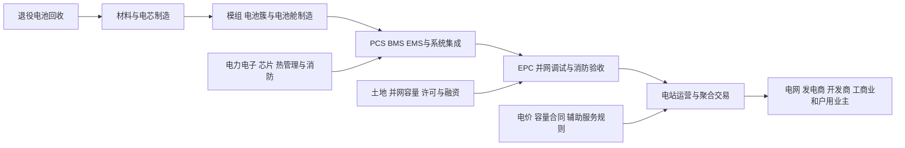

# 储能行业供需周期分析

分析日期：2026-07-18 01:19:40 +08:00
地理范围：全球电化学储能，重点覆盖中国、美国、欧洲、澳大利亚与中东的大型电站储能；兼顾工商业和户用侧，但不把抽水蓄能、UPS或电动车电池简单并入同一装机口径。
数据时效：全球部署以IEA发布的2025年估算为最新完整年度；中国新型储能为2025年累计与新增统计；公司数据为特斯拉2026年一季度、Fluence截至2026年3月31日与宁德时代2025年年报，实际、订单与管线已分开。
行业边界：纳入储能电芯、直流电池舱/集装箱、PCS、BMS/EMS、系统集成、EPC、并网与运营服务；不将风光发电设备、抽水蓄能本体或数据中心短时UPS视为同一产品市场。
研究模式：完整深研

> 阅读路线——初学者先读0、1、2、3、5、7、9；熟悉项目投资和电力市场的读者可直接阅读4、5、6、8，并在附录A核验口径。

## 0. 一页看懂

**这个行业是做什么的**：储能把低价或富余时段的电存进电池，在晚高峰、限电、调频或电网故障时放出来。它卖给电网、发电商、能源开发商、工商业业主和家庭；最终付款来自这些主体的电费、容量合同、辅助服务收入或避免停电和扩容的预算。

**一句话判断**：部署量和系统时长持续上行，但供给已从“有没有电芯”转为“能否并网、拿到可预测收益并长期安全运行”；行业处在规模扩张、项目收益与系统集成利润分化的暂定阶段。

- 周期阶段：规模扩张中的收益模型筛选期
- 结论状态：暂定
- 置信度：中
- 最大缺口：各区域项目的实际度电收益、容量补偿与弃置率无法用同一公开口径汇总。

**三个最重要的数字**：

| 数字 | 含义 | 为什么它最重要 | 证据 |
|---|---|---|---|
| 108GW | 2025年全球新增电池储能功率 | 比2024年高40%，说明需求已从试点进入规模建设 | E1 |
| 3小时 | 2025年投运项目平均时长 | 时长上升反映收益重心由短时调频转向跨时段能量搬移 | E2 |
| 145GW | 2025年末中国新型储能累计功率 | 中国是最大单一市场，影响电芯、系统和价格竞争 | E3 |

## 1. 产业链地图

### 1.1 全景图



电芯和设备只是物理供给，项目能否转为有效储能取决于并网、消防、控制系统、市场规则与融资。货物顺向经过系统集成与施工；项目预算和电力市场收入反向决定设备订单。当前最难替代的环节常不是电池箱，而是能把设备接入电网并持续获得可验证收益的项目权利与运营能力。

### 1.2 环节详解

### 1.2.1 电芯与电池舱制造

**它是干什么的**：将正负极、隔膜和电解液装配成适合频繁充放电的储能电芯，再封装为电池簇、液冷电池舱或大容量集装箱系统。

**向谁采购**：购买锂、磷酸铁、石墨、隔膜、热管理与结构件

**卖给谁**：向系统集成商、EPC和大型项目开发商交付电芯或电池舱。

**代表企业**：

| 公司 | 上市地/代码 | 在该环节的地位 | 为什么能代表该环节 | 证据 |
|---|---|---|---|---|
| 宁德时代 | 深交所：300750 | 储能电池与系统解决方案供应商 | 2025年储能电池销售121GWh，同比增29.13%，并保持全球储能电池出货第一 | E5 |
| Tesla | 纳斯达克：TSLA | Megapack和户用储能产品提供者 | Q1 2026部署8.8GWh，展示大型储能制造商的季度交付波动 | E4、E6 |

**怎么赚钱、议价能力**：收入主要来自按Wh或整舱销售；当电芯供给充足时，标准电池舱议价能力趋弱，安全、循环寿命、质保与海外认证才形成溢价。大单不等于利润，因为金属价格、质保准备金和运输安装成本可吞噬价差。

**为什么会卡住**：LFP约占2025年储能部署的90%，这降低了对高镍体系的依赖，却提高了大宗、标准化供给的价格竞争。

**进阶视角**：LFP约占2025年储能部署的90%，这降低了对高镍体系的依赖，却提高了大宗、标准化供给的价格竞争；宁德时代的规模交付和系统设计能力比单纯电芯名义产能更值得观察（E1、E5）。

### 1.2.2 电力电子、控制与系统集成

**它是干什么的**：PCS把电池直流电变成电网可用的交流电，BMS管理电池状态，EMS决定何时充放电并参与市场交易；系统集成把这些设备、热管理和消防方案做成可验收电站。

**向谁采购**：采购电池舱、逆变器、变压器、软件、消防和通信设备

**卖给谁**：向电站开发商、电网和工商业业主交付整套系统。

**代表企业**：

| 公司 | 上市地/代码 | 在该环节的地位 | 为什么能代表该环节 | 证据 |
|---|---|---|---|---|
| Fluence | 纳斯达克：FLNC | 全球储能系统、服务与数字化运营商 | 截至2026年3月末累计部署19.2GWh、合同积压10.1GW | E7 |
| 宁德时代 | 深交所：300750 | 从电芯延伸至系统集成 | 2025年交付70多个系统集成项目，海外系统交付增长超过160% | E5 |

**怎么赚钱、议价能力**：系统集成商以设备+软件+交付服务报价。具备并网控制、火灾安全验证、性能保证和运维能力的集成商更有机会保住毛利；但项目延期和客户取消会让“管线”不能及时变现。

**为什么会卡住**：Fluence把“已部署”“合同积压”“管线”分开披露，分别为19.2GWh、10.1GW和147GWh。

**进阶视角**：Fluence把“已部署”“合同积压”“管线”分开披露，分别为19.2GWh、10.1GW和147GWh；市场若把管线当成交付，将高估近期收入确定性（E7）。

### 1.2.3 项目开发、并网与运营

**它是干什么的**：开发商取得土地和并网容量，完成EPC、验收和调度接入；运营商在峰谷价差、容量合同、调频与拥塞管理之间优化充放电。

**向谁采购**：购买系统设备、工程、保险、土地和融资

**卖给谁**：向电网、零售电客户或市场交易平台出售容量、能量和灵活性服务。

**代表企业**：

| 公司 | 上市地/代码 | 在该环节的地位 | 为什么能代表该环节 | 证据 |
|---|---|---|---|---|
| LEAG | 未上市 | 欧洲大型电力与项目开发商 | 与Fluence在德国建设1,000MW/4,000MWh项目，体现长时配置与并网项目复杂度 | E3 |
| Fluence | 纳斯达克：FLNC | 项目交付与长期服务商 | 已部署、服务管理资产和合同积压并列，体现工程转运营的过程 | E7 |

**怎么赚钱、议价能力**：项目收益来自电价差、容量可用性、辅助服务、合同费用以及避免电网扩容的价值。最有议价力的不是单个设备商，而是拥有优质接入点、可融资合同和可靠调度记录的项目主体。

**为什么会卡住**：大型项目建设并不必然快。。

**进阶视角**：大型项目建设并不必然快。IEA指出项目管线虽大，但并网、许可、消防安全和收入波动常造成多年延迟；这使“已签约”与“可投运”之间成为行业有效供给的主要折损处（E2、E3）。

### 1.2.4 聚合调度、交易与长期运维

**它是干什么的**：聚合商和运营软件把分散储能编成可调度资源，参与能量、容量和辅助服务市场，并持续管理衰减、可用率与保修。

**向谁采购**：向项目业主采购可调容量或签运营分成协议，同时采购预测软件、通信、保险和现场维护服务。

**卖给谁**：向电网运营商、售电公司、容量市场和工商业用户出售削峰、调频、备用及电费优化服务。

**代表企业**：

| 企业/机构 | 上市地/代码或属性 | 角色 | 代表性依据 | 证据 |
|---|---|---|---|---|
| Fluence | 纳斯达克 / FLNC | 储能集成、软件与服务商 | 将已部署、积压和管线分开披露 | E7 |
| Tesla | 纳斯达克 / TSLA | 大型储能设备与运营生态参与者 | 部署口径可与制造能力和项目进度对照 | E6 |

**怎么赚钱、议价能力**：运营者通过固定服务费、收益分成和可用率合同获利；具备跨市场优化、数据积累和性能担保能力的主体比单纯设备转售更有黏性。

**为什么会卡住**：市场准入、计量结算、循环衰减和网络安全会使已安装设备无法按计划参与交易，收益规则变化还会缩短合同可见度。

**进阶视角**：当硬件价格下行时，价值可能从电芯转向调度与全生命周期责任；但只有真实结算收益而非“可参与市场”的资格，才能证明软件形成利润池（E6、E7）。

### 1.3 钱怎么流：利益传导

| 问题 | 回答 | 证据 | 缺口 |
|---|---|---|---|
| 谁最终付款？ | 电网公司、发电商、工商业业主、户主和电力市场的容量/辅助服务购买方。 | E2、E3 | 各国容量补偿机制不同。 |
| 利润当前集中在哪里，为什么？ | 能取得并网和稳定合同的开发运营端更容易锁定收益；电芯与标准设备端竞争更强。 | E2、E7 | 缺少全球统一项目IRR实际。 |
| 谁承担资本开支和库存风险？ | 开发商承担土地、EPC和融资；集成商承担设备采购、性能保证与项目延期风险。 | E7 | 逐项目融资条款大多不公开。 |
| 谁有定价权，凭什么？ | 接网容量、项目许可和可靠运行记录决定更强议价；PCS/软件在复杂项目中也有技术壁垒。 | E2、E3 | 各地区电力市场规则差异大。 |
| 谁重要但赚不到钱？ | 仅卖标准电池舱、没有长期服务或项目权利的供应商，可能出货增长但被价格竞争压缩。 | E1、E5 | 需要公司分部毛利验证。 |

订单与预算流：

```text
[电网灵活性和业主用电预算] -> [开发商容量/电价合同] -> [EPC与系统订单] -> [电池舱 PCS 软件采购] -> [电芯 材料 设备订单]
```

## 2. 需求：谁在买、为什么买

事实：

- 2025年全球新增电池储能108GW，同比增长约40%，其中约87GW为电站级，约80%的新增容量属于电站级（E1、E2）。
- 2025年能量搬移类项目在新项目中的占比已超过90%，而以辅助服务为主的占比约7%，表明买方更重视跨时段供电和容量价值（E2）。
- 中国2025年新增新型储能约66GW/189GWh，年末累计约145GW，独立储能占累计装机约58%（E3）。
- Tesla Q1 2026部署8.8GWh储能产品，较2025年Q1的10.4GWh下降，说明单一厂商季度交付并不等于行业总需求趋势（E4、E6）。

| 终端用途 | 买方/预算所有者 | 购买动因 | 已兑现还是预期 | 可观察指标 | 证据 |
|---|---|---|---|---|---|
| 电网侧削峰填谷 | 电网、独立开发商 | 消纳光伏风电、满足晚高峰容量 | 大量项目已投运 | 新增MW、平均时长、并网进度 | E1、E2 |
| 辅助服务与拥塞管理 | 电网、市场运营主体 | 调频、备用、局部网络约束 | 仍存在但份额下降 | 服务市场价格和中标规则 | E2 |
| 工商业侧 | 工厂、园区、商业业主 | 降需量电费、备电、优化电价 | 区域性兑现 | 电价峰谷差、合同电费 | E1 | 
| 户用侧 | 家庭和零售能源商 | 备用电、屋顶光伏自用 | 受补贴和零售电价影响 | 户储装机与零售电价 | E1、E2 |

推断与假设：

- 推断：储能需求的主导变量正在从“是否要求新能源配储”转向“系统是否需要3小时以上的能量搬移”，因此只看MW会低估对电芯和系统时长的需求（E2、E3）。
- 假设：若容量机制或峰谷价差被压缩，已经建成的系统仍能调度，但新项目融资会明显放慢；反证是招标量和并网量在收益下降时仍持续上升。

**进阶视角**：新增MW不是收益的同义词。2025年平均项目时长从2023年约2小时升到3小时，项目需要更多Wh才能提供同一MW的更长持续能力；需求增长应同时看功率、时长与实际结算规则（E2）。

## 3. 供给：现在有多少、真能用的有多少

| 环节/项目 | 公告产能 | 已安装 | 已验证/爬坡达标 | 有客户订单支撑 | 释放窗口 | 证据 | 缺口 |
|---|---:|---:|---:|---:|---|---|---|
| 全球电池储能 | 不适用 | 2025新增108GW | 大量为已部署估算 | 电站级约87GW | 2025全年实际 | E1、E2 | 未给出统一GWh总量 |
| 中国新型储能 | 不适用 | 2025新增66GW/189GWh | 年末累计145GW | 独立储能占58%累计 | 2025全年实际 | E3 | 口径不等同全球电池储能 |
| Fluence系统 | 不适用 | 19.2GWh已部署 | substantial completion定义 | 10.1GW合同积压 | 截至2026-03-31 | E7 | 合同可能延期或取消 |
| Tesla Megapack | 60GWh/年 | 加州40GWh生产、上海20GWh生产 | 生产状态已披露 | 未披露全部客户订单 | Q1 2026 | E6 | 年化产能非实际出货 |

事实：

- IEA称电池项目中位建设时间约275天，模块化特性支持快速部署，但网接和许可仍会延迟项目（E2）。
- 2025年中国新型储能新增66GW/189GWh，平均时长约2.9小时；累计安装平均时长由2021年约2.1小时提升至2025年约2.6小时（E3）。
- 宁德时代2025年储能电池销售121GWh，系统集成项目超过70个；其9MWh系统和高温产品均属于产品发布或交付信息，而非全行业有效产能（E5）。
- Fluence明确提示合同积压和管线不能保证在原定期间甚至不能保证最终转化为收入（E7）。

推断与假设：

- 推断：电芯供应和系统装配并非当前主要物理瓶颈；更稀缺的是可并网的项目、满足安全要求的系统设计和可预测的运营合同（E2、E3、E7）。
- 假设：若项目许可、接网排队和消防验收改善，既有设备产能可较快转成投运量；反证是设备出货上升但并网项目与已部署GWh停滞。

**进阶视角**：名义制造产能、合同积压、EPC开工和“substantial completion”是四种不同状态。Fluence的定义与Tesla的制造产能披露表明，最容易被高估的是从订单到可调用资产的转化率（E6、E7）。

## 4. 供需矛盾与高频信号

核心矛盾：电池与系统的物理供给扩张很快，但电网连接、许可和收益模型决定了项目能否成为可调度资产；因此会出现设备价格竞争与优质项目仍稀缺并存。

| 信号 | 最新值/方向 | 数据期间 | 证据 | 解读 | 缺口 |
|---|---|---|---|---|---|
| 全球新增储能功率 | 108GW，+40% | 2025全年 | E1 | 部署仍快，但MW未体现时长和运营收益 | 缺少统一GWh数据 |
| 项目平均时长 | 3小时，高于2023年约2小时 | 2025投运项目 | E2 | 买方从短时服务转向能量搬移 | 区域差异大 |
| 中国新增/累计 | 66GW/189GWh；累计145GW | 2025全年 | E3 | 最大市场继续增加规模与时长 | 新型储能含多技术路线 |
| 系统集成合同积压 | Fluence 10.1GW，较FY2025末+11% | 2026-03-31 | E7 | 已签约需求有可见度，但不是收入确认 | 可能取消或延迟 |
| Tesla部署 | 8.8GWh，季度环比低于14.2GWh | Q1 2026 | E6 | 单厂商交付有季节性和项目节奏波动 | 不能代表全市场 |

## 5. 周期位置与传导

传导链：

```text
[风光波动与峰荷缺口] -> [电网/业主容量需求] -> [项目合同与并网指标] -> [系统集成订单] -> [电池舱与PCS出货] -> [投运后电力市场收入] -> [下一轮项目融资]
```

| 阶段/日期 | 信号 | 利润池往哪移 | 关键时滞 | 证据 | 下一步验证 |
|---|---|---|---|---|---|
| 2023—2025部署加速 | 全球新增由较低基数升至108GW | 从短时辅助服务转向项目开发、长时系统与运营 | 项目建设中位约275天，并网许可可更长 | E1、E2 | 接网和投运GWh |
| 2025时长上移 | 平均时长约3小时 | 向电芯容量、热管理、PCS和收益优化软件迁移 | 设计改变先于收入确认 | E2、E3 | 4小时以上项目占比 |
| 2026订单兑现检验 | Fluence合同积压10.1GW、Tesla Q1部署8.8GWh | 向有交付和服务能力的集成商分化 | 合同到完工取决于融资、设备和并网 | E6、E7 | 合同转部署率与项目延期 |

当前阶段：

- 阶段：规模扩张中的收益模型筛选期
- 进入时间/锚点：2025年全球新增108GW、能量搬移占新项目超过90%，项目平均时长升至3小时。
- 预期切换条件：若并网排队缩短、容量/电价合同使项目现金流稳定且已部署量持续高于合同取消量，进入更明确的运营兑现；若合同积压上升而投运和收益走弱，转向供给竞争加剧。
- 置信度：中
- 什么会证明这个判断错了：2026年后续季度大规模项目按期并网、收益稳定且标准化设备价格不再下压，或相反出现持续的并网延期与项目取消。

**进阶视角：与上一轮周期的对照**：2019—2022年许多电池项目优先追逐容量较小、收益较高的辅助服务；到2025年，能量搬移在新增项目中占比超过90%，平均时长提高约1小时。相同点是仍依赖市场规则；不同点是本轮系统规模更大，接网、消防和跨时段收益的重要性超过了单纯的响应速度（E2）。

## 6. 资金动向

### 6.1 尝试的来源类型

| 尝试的来源类型 | 具体来源 | 结果 |
|---|---|---|
| 行业指数估值分位 | 中证新能源与电力设备指数公开资料 | 覆盖电池、光伏和整车，不能拆分储能链条，未用于定价结论。 |
| 行业ETF份额/资金流 | 储能、新能源主题ETF基金公告 | 可观察产品级份额，但主题边界混合，未形成全球系统集成可比数据。 |
| 北向/两融或同类资金流指标 | 交易所公开统计 | 无法按电芯、PCS、项目运营分拆，记录为口径缺口。 |
| 龙头股价与盈利的剪刀差 | Tesla、Fluence投资者关系页 | 获得公司业绩与部署数据；未建立同日股价—盈利时间序列，不能量化估值。 |

**已定价（推断）：**市场大致已认识到电池储能部署扩张、LFP主导和大型电站化，依据是IEA连续披露的高增速、时长上移以及头部厂商产品与项目扩容（E1、E2、E5）。

**未定价（推断）：**尚难确认市场是否充分计入并网许可、合同取消、容量合同变动和长期运维成本对项目回报的影响；Fluence对积压和管线转化的不保证提示这些不确定性不能忽略（E7）。

判断依据与不确定性：以上为基于产业证据的推断，不是估值测量；不同国家的电价、容量市场与补贴机制不能互相替代。

## 7. 未来资金可能流向

> 本节是周期传导的情景推演，不构成任何买卖建议、目标价或个股推荐。

| 情景 | 触发条件 | 利润池往哪个环节移动 | 先受益的环节 | 后受益/受损的环节 | 需要盯的证据 |
|---|---|---|---|---|---|
| 基准 | 全球部署维持扩张、时长继续上行，项目收益无显著恶化 | 向有并网能力的开发商、系统集成和长期运维移动 | 已获得接网和合同的项目开发/集成商 | 标准电池舱供应商仍受价格竞争 | 已部署量、合同转化率、时长 |
| 上行 | 容量市场改善、弃电与峰荷需求提高、并网许可加快 | 向4小时以上系统、PCS/EMS和优质项目权利移动 | 具备控制软件与长期服务能力的集成商 | 低规格短时系统相对受限 | 中标容量、接网时长、合同价格 |
| 下行 | 峰谷价差或容量补偿下降，项目延迟/取消增加 | 从设备扩张转向现金流和售后服务，新增设备订单走弱 | 有存量服务合同和低成本交付能力的企业 | 高固定成本的设备与EPC供应商 | Fluence积压、项目取消、储能收益 |

推演逻辑：电芯与设备可在数月内制造，项目权利、并网和融资需要更长时间；因此需求上行最先改善已拿到接网与合同的项目，后续才传给电池和材料。收益下行则先压开发商融资，再传导至新订单和设备利用率。

## 8. 分歧与反证

主流叙事 vs 本报告：

| 市场主流叙事 | 本报告判断 | 分歧在哪 | 谁的证据更硬 | 证据 |
|---|---|---|---|---|
| “装机高增就意味着全链高利润” | 装机确实高增，但标准设备供给和项目收益不是同一件事 | 项目收入受并网、规则和合同制约 | IEA项目障碍与Fluence合同风险披露更直接 | E2、E7 |
| “储能就是新能源配储” | 配储仍重要，但能量搬移已成为新项目主要应用 | 买方从合规配置转向跨时段容量价值 | IEA应用结构数据更硬 | E2 |
| “合同积压就是即将确认的收入” | 积压提升有可见度，不能替代已部署资产 | 合同、管线、完工和运维是不同状态 | Fluence对定义和取消风险的原始披露更硬 | E7 |

冲突证据：

| 议题 | 支持证据 | 反对证据 | 口径差异 | 处理 |
|---|---|---|---|---|
| 储能是否仍快速扩张 | 全球新增108GW、+40% | Tesla Q1部署同比下降15% | 全球年度部署与单厂商季度交付不同 | 未解决；以全球和区域装机为主跟踪 |
| 订单是否会变现 | Fluence合同积压增长11% | 公司披露项目可能延期或取消 | 合同不等于收入或利润 | 未解决；跟踪部署与收入确认 |

## 9. 观察哨与跟踪

| 指标 | 基线 | 来源 | 频率 | 正向触发 | 反证触发 | 含义 |
|---|---|---|---|---|---|---|
| 全球电池储能新增功率 | 2025年108GW | IEA E1 | 年度 | 2026年新增高于108GW | 新增低于2025年且项目时长缩短 | 判断总需求延续 |
| 电站项目平均时长 | 2025年3小时 | IEA E2 | 年度 | 4小时以上占比继续增加 | 时长回落至2小时附近 | 判断能量搬移需求 |
| 中国新型储能新增能量 | 2025年189GWh | IEA E3 | 年度 | 新增GWh增速快于新增GW | GWh/GW显著下降 | 判断大时长配置 |
| Fluence已部署储能 | 2026-03-31为19.2GWh | Fluence E7 | 季度 | 已部署增速高于积压增长 | 积压增加而部署停滞 | 验证订单兑现 |
| Tesla储能部署 | Q1 2026为8.8GWh | Tesla E6 | 季度 | 后续季度恢复至10GWh以上 | 连续两季低于8.8GWh | 观察头部厂商交付节奏 |

### 9.1 可比时间序列

| 日期 | 指标 | 数值 | 单位 | 来源 | 含义 |
|---|---|---:|---|---|---|
| Q1 2025 | Tesla储能部署 | 10.4 | GWh | E6 | 同一公司披露的季度部署。 |
| Q1 2026 | Tesla储能部署 | 8.8 | GWh | E6 | 同口径同比下降15%，不能外推为全球需求。 |

跟踪数据底稿：

| 日期 | 指标 | 环节 | 数值 | 同比/环比 | 方向 | 来源 | 对判断的影响 | 备注 |
|---|---|---|---:|---:|---|---|---|---|
| 2025全年 | 全球新增储能 | 项目部署 | 108 | +40% | 上升 | E1 | 支持规模扩张 | 单位GW |
| 2025全年 | 中国新型储能新增 | 项目部署 | 189 | 不适用 | 上升 | E3 | 支持时长和规模扩大 | 单位GWh |
| 2026-03-31 | Fluence已部署 | 系统集成 | 19.2 | +8%（较FY2025末） | 上升 | E7 | 观察订单兑现 | 累计GWh |

### 9.2 观察框架

| 指标 | 基线 | 来源 | 频率 | 正向触发 | 反证触发 |
|---|---|---|---|---|---|
| 全球新增电池储能 | 108GW | IEA E1 | 年度 | 高于108GW | 低于2025年108GW |
| 全球项目平均时长 | 3小时 | IEA E2 | 年度 | 超过3小时 | 回落至2.5小时以下 |
| Fluence合同积压 | 10.1GW | Fluence E7 | 季度 | 已部署同步增加 | 积压增长但部署不增 |

## 10. 术语表

| 术语 | 人话解释 |
|---|---|
| LFP | 磷酸铁锂电池，能量密度不如部分车用电池，但成本和循环特性更适合频繁充放电的储能场景。 |
| PCS | 储能变流器，把电池的直流电与电网的交流电互相转换。 |
| BMS | 电池管理系统，监控电芯温度、电压和状态，避免过充、过放或热失控。 |
| EMS | 能量管理系统，根据电价、负荷和电网指令决定充放电策略。 |
| 能量搬移 | 把某一时段的电搬到另一个时段出售或使用，典型用途是把中午光伏电移到晚高峰。 |
| 合同积压 | 已签约但尚未完成交付或收入确认的订单，不等于已经形成收入。 |

## 附录A 证据台账

| 证据ID | 结论 | 类型 | 发布方 | 发布日期 | 访问日期 | 数据期间 | 地域/单位 | 原文链接/定位 | 已打开 | 时效 | 局限 |
|---|---|---|---|---|---|---|---|---|---|---|---|
| E1 | 2025年全球新增电池储能108GW、同比+40%、LFP约占90% | 事实/估算 | IEA | 2026-04-20 | 2026-07-18 | 2025全年 | 全球/GW | https://www.iea.org/reports/global-energy-review-2026/technology-battery-storage 第236—258行 | 是 | 当前 | 部分2025值基于Benchmark估算。 |
| E2 | 2025年电站级约87GW、平均时长3小时、能量搬移占比超90% | 事实/分析 | IEA | 2026-05-29 | 2026-07-18 | 2015—2025 | 全球/GW、小时 | https://www.iea.org/commentaries/battery-storage-is-scaling-up-and-taking-on-a-larger-system-role 第210—259行 | 是 | 当前 | 全球均值掩盖各国电力市场差异。 |
| E3 | 中国2025年新增66GW/189GWh、累计145GW | 事实/汇总 | IEA | 2026-02 | 2026-07-18 | 2024—2025 | 中国/GW、GWh | https://www.iea.org/reports/electricity-2026/flexibility 第306—314行 | 是 | 当前 | 新型储能技术口径不完全等同锂电。 |
| E4 | Tesla Q1 2026储能产品部署8.8GWh | 事实 | Tesla | 2026-04-02 | 2026-07-18 | Q1 2026 | 全球/GWh | https://ir.tesla.com/press-release/tesla-first-quarter-2026-production-deliveries-and-deployments 第8—15行 | 是 | 当前 | 仅为一家公司的产品部署。 |
| E5 | 宁德时代2025年储能电池销售121GWh、系统集成项目逾70个 | 事实 | 宁德时代 | 2026-03 | 2026-07-18 | 2025全年 | 全球/GWh与项目数 | https://www.catl.com/en/uploads/1/file/public/202603/20260310105310_46xjbwckvn.pdf 第17、27—28页 | 是 | 当前 | 公司披露不能代表全行业价格和利润。 |
| E6 | Tesla Q1 2025至Q1 2026储能部署可比序列与制造年化能力 | 事实 | Tesla | 2026-04-22 | 2026-07-18 | Q1 2025—Q1 2026 | 全球/GWh、GWh每年 | https://ir.tesla.com/_flysystem/s3/sec/000162828026026551/tsla-20260422-gen.pdf 第7—9页 | 是 | 当前 | 部署定义含安装客户单元和设备交付。 |
| E7 | Fluence部署19.2GWh、合同积压10.1GW且存在取消/延期风险 | 事实 | Fluence | 2026-05 | 2026-07-18 | 截至2026-03-31 | 全球/GW、GWh | https://ir.fluenceenergy.com/node/10861/pdf 第5—6页 | 是 | 当前 | 公司明示合同积压不保证收入或利润。 |
| E8 | 电池储能供应链风险与缓解框架 | 电池储能供应链风险与缓解框架 | US Department of Energy | 2025-01 | 2026-07-18 | 电池储能供应链风险与缓解框架 | 电池储能供应链风险与缓解框架 | https://www.energy.gov/ceser/articles/new-ceser-report-offers-supply-chain-mitigation-strategies-battery-storage-systems | 是 | 2025-01 | 美国安全与供应链框架不是全球部署量。 |

## 附录B 数据时效与证据覆盖

| 指标 | 期间 | 状态 | 发布日期 | 访问日期 | 时效 | 来源 | 定位 | 局限 |
|---|---|---|---|---|---|---|---|---|
| 全球储能新增 | 2025全年 | 估算 | 2026-04-20 | 2026-07-18 | 当前 | E1 | 技术章节 | 使用第三方市场估算。 |
| 项目时长与用途 | 2025全年 | 事实/分析 | 2026-05-29 | 2026-07-18 | 当前 | E2 | IEA评论 | 非逐国完整实际清单。 |
| 中国新型储能 | 2025全年 | 汇总实际 | 2026-02 | 2026-07-18 | 当前 | E3 | 灵活性章节 | 与全球电池储能口径不同。 |
| Tesla部署 | Q1 2026 | 实际 | 2026-04-22 | 2026-07-18 | 当前 | E6 | 季度更新 | 单一制造商。 |
| Fluence部署与积压 | 截至2026-03-31 | 实际/合同 | 2026-05 | 2026-07-18 | 当前 | E7 | Q2 FY2026披露 | 合同与管线可能不兑现。 |

发布状态说明：

- 已发布：IEA 2025年全球与区域部署、Tesla Q1 2026、Fluence截至2026年3月末、宁德时代2025年年报。
- 尚未发布：2026年全球完整新增GW/GWh、统一的项目实际收益和取消率。
- 更新关系：E6覆盖E4的同口径Q1部署并补充比较序列；E4保留作简明新闻披露来源。

## 附录C 证据就绪度与研究执行记录

| 证据车道 | 状态 | 已打开可靠来源数 | 最低要求 | 证据/缺口 |
|---|---:|---:|---:|---|
| 产业链 | Ready | 4 | 2 | IEA、宁德时代、Tesla、Fluence覆盖设备到项目运营。 |
| 需求 | Ready | 4 | 3 | IEA全球部署、应用迁移、中国新增、Tesla实际交付。 |
| 供给与有效产能 | Ready | 4 | 3 | 宁德时代系统、电站部署、Tesla产能、Fluence已部署。 |
| 价格/订单/库存/利润 | Ready | 3 | 3 | IEA项目收益障碍、Fluence积压及取消风险、Tesla季度部署。 |
| 资本市场预期 | Gap | 2 | 2 | 已记录指数、ETF、交易所和龙头IR尝试，缺少跨链可比估值数据。 |

| 子任务 | 检索轮次 | 实际使用的路径 | 证据 | 状态 | 缺口/回退 |
|---|---:|---|---|---|---|
| 行业边界与链条 | 1 | IEA原始页面 | E1、E2、E3 | 完成 | 抽水蓄能和UPS未纳入同口径。 |
| 部署与需求 | 2 | IEA、Tesla原始披露 | E1、E2、E3、E4 | 完成 | 缺少2026全球完整实际。 |
| 供给、订单和交付 | 2 | 宁德时代、Tesla、Fluence原始披露 | E5、E6、E7 | 完成 | 项目逐笔毛利未公开。 |
| 反证与有效供给 | 1 | IEA灵活性、Fluence风险披露 | E2、E3、E7 | 完成 | 无统一项目取消率。 |
| 资本市场映射 | 1 | 指数、ETF、交易所与IR公开入口 | 第6节记录 | 缺口 | 无全球全链同口径的资金和估值序列。 |

事实、推断、假设分层：

- 事实：E1—E7为本轮已打开的IEA与公司原始来源，其中订单、部署与制造产能分列。
- 推断：收益模型和接网权限比设备名义产能更影响有效供给，由E2、E3、E7共同支持。
- 假设：容量补偿、峰谷价差和许可进度将决定下一阶段订单兑现；反证条件见第5与第9节。

## 尾注

- 供需缺口 ≠ 股价上涨。
- 方向正确 ≠ 时点正确。
- 盈利兑现 ≠ 股价继续上涨。
- AI 回答和搜索摘要不是事实。
- 过期数据不是当前事实。
