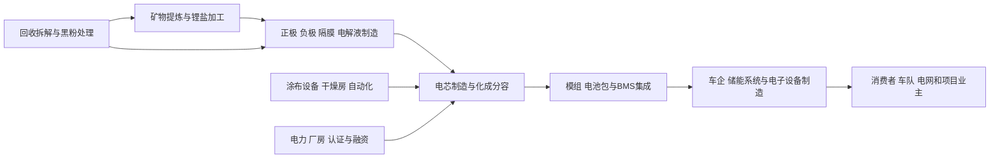

# 锂电池行业供需周期分析

分析日期：2026-07-18 01:23:47 +08:00
地理范围：全球锂离子电池产业链，重点覆盖中国电芯与材料制造、欧美本地化电池生产，以及电动车和固定式储能两类需求。
数据时效：最新完整行业实际以IEA的2025年部署、产能和价格分析为准；公司实际使用宁德时代2025年年报与LG新能源2026年一季度业绩；2030年后预测单列为情景。
行业边界：纳入锂盐、正负极材料、隔膜、电解液、电芯、模组/电池包、BMS与回收；不把电动车整车、充换电设施或储能电站EPC整体视作电池制造产能。
研究模式：完整深研

> 阅读路线——第一次阅读请从0、1、2、3、5、7、9开始；若已熟悉电池制造，可优先读第4、5、6、8节和附录A。

## 0. 一页看懂

**这个行业是做什么的**：锂电池把锂离子在正极和负极之间反复移动，用来给电动车、储能系统和小型设备供电。它卖给车企、储能集成商和电子产品厂商；最终付款来自买车者、电网项目业主和使用电池设备的企业与消费者。

**一句话判断**：需求仍快速增长，但制造能力扩张更快、化学体系转向LFP且区域供给高度集中，使中游材料与新建海外产能承受利润压力；行业处于“需求增长、产能与利润出清尚未完成”的暂定阶段。

- 周期阶段：产能竞争后的结构性出清期
- 结论状态：暂定
- 置信度：中
- 最大缺口：缺少全球统一、按化学体系拆分的电芯实际开工率和逐季库存天数。

**三个最重要的数字**：

| 数字 | 含义 | 为什么它最重要 | 证据 |
|---|---|---|---|
| 1.2TWh | 2025年全球电动车电池部署 | 电动车仍占全部电池部署七成以上，是需求的首要锚点 | E1 |
| 超过4TWh | 2025年末全球锂离子电池名义制造产能 | 产能大于当年主要终端需求，解释价格与利润压力 | E1 |
| 55%以上 | LFP在2025年全球电动车电池部署占比 | 化学体系切换重写正极材料、矿物和设备的受益结构 | E1 |

## 1. 产业链地图

### 1.1 全景图



材料决定成本和性能边界，电芯制造决定良率和一致性，电池包与BMS决定能否安全接入车辆或储能系统。资金从终端车型、储能项目和消费电子预算逆向形成采购；高利用率、长期客户认证和本地供应链比单纯“宣布GWh”更接近有效产能。

### 1.2 环节详解

### 1.2.1 材料与锂盐加工

**它是干什么的**：把锂、镍、钴、锰、磷、石墨等原料加工成可涂布在电极上的正极材料、负极材料和电解液等关键投入。

**向谁采购**：购买矿产、化工原料、能源和加工设备

**卖给谁**：向电芯厂销售符合电化学和杂质规格的材料。

**代表企业**：

| 公司 | 上市地/代码 | 在该环节的地位 | 为什么能代表该环节 | 证据 |
|---|---|---|---|---|
| 湖南裕能 | 深交所：301358 | LFP正极材料供应商 | IEA将其列为LFP材料行业少数仍保持盈利的例外，反映材料端的出清差异 | E1 |
| 当升科技 | 深圳证券交易所创业板 / 300073 | 多元正极材料供应商 | 代表仍受高镍和多化学体系需求变化影响的正极材料环节 | E1 |

**怎么赚钱、议价能力**：材料厂通常按金属价格加加工费向电芯厂报价。材料占NMC电芯成本约40—50%、LFP电芯约25—30%，但当行业扩产过快时，加工费和开工率比金属价格更影响利润（E1）。

**为什么会卡住**：低电池价并不意味着材料端成本同步改善。。

**进阶视角**：低电池价并不意味着材料端成本同步改善。IEA指出许多正极材料厂自2023年以来亏损，LFP材料厂同样面临持续亏损；若低价导致退出或合并，未来电池价格反而可能上行（E1）。

### 1.2.2 电芯制造与化学体系选择

**它是干什么的**：把涂好材料的极片、隔膜和电解液装进方形、圆柱或软包外壳，经过注液、封装、化成和分容，筛出性能一致的电芯。

**向谁采购**：购买四大材料、铜铝箔、设备、洁净厂房和电力

**卖给谁**：向车企、储能系统厂和电池包厂交付经过认证的电芯。

**代表企业**：

| 公司 | 上市地/代码 | 在该环节的地位 | 为什么能代表该环节 | 证据 |
|---|---|---|---|---|
| 宁德时代 | 深交所：300750；港交所：3750 | 全球动力与储能电池龙头 | 2025年锂电池销售661GWh、全球动力电池份额39.2%，产能772GWh | E3 |
| LG新能源 | 韩国交易所：373220 | 北美与全球动力/储能电池制造商 | Q1 2026软包EV电池受客户去库存影响，而圆柱与ESS需求支撑收入，体现产品结构分化 | E4 |

**怎么赚钱、议价能力**：电芯厂以Wh价格、研发服务、质保和长期供货合同收费。车企认证、良率、配方和安全记录构成壁垒；但客户库存调整、利用率下降和新厂爬坡会迅速压低毛利。

**为什么会卡住**：截至2025年末全球名义产能超过4TWh，中国占八成以上。

**进阶视角**：截至2025年末全球名义产能超过4TWh，中国占八成以上；因此电芯行业的有效供给不该用名义GWh衡量，而要看被客户认证、良率达标并有订单支撑的利用率（E1、E4）。

### 1.2.3 模组、电池包、BMS与回收

**它是干什么的**：将电芯按串并联装进模组和电池包，配置冷却、高压连接和BMS；退役后拆解电池并回收黑粉和锂盐，重新进入材料链。

**向谁采购**：采购电芯、结构件、热管理、功率电子和软件

**卖给谁**：向车企、储能系统商与回收企业交付电池包或再生材料。

**代表企业**：

| 公司 | 上市地/代码 | 在该环节的地位 | 为什么能代表该环节 | 证据 |
|---|---|---|---|---|
| BYD | 港交所：1211；深交所：002594 | 刀片电池与整车垂直整合者 | Blade Battery 2.0以LFP实现快充和能量密度改进，显示包级设计与整车集成的价值 | E5 |
| 宁德时代 | 深交所：300750；港交所：3750 | 电池回收和系统集成参与者 | 2025年回收废电池21万吨、再生锂盐2.4万吨 | E3 |

**怎么赚钱、议价能力**：包厂通过集成、热管理、安全验证和系统适配取得附加值。回收盈利取决于退役电池来源、金属价格和处理技术；当前可回收的规模仍受电池寿命和二手车流转影响。

**为什么会卡住**：CTP/CTC等包级集成可以提升能量密度，却可能增加维修与回收拆解复杂度。。

**进阶视角**：CTP/CTC等包级集成可以提升能量密度，却可能增加维修与回收拆解复杂度。BYD的快充与能量密度升级说明技术能改善产品，但不自动解决全行业原料集中和价格竞争（E1、E5）。

### 1.2.4 锂矿、盐湖与电池级锂盐

**它是干什么的**：上游从硬岩矿或盐湖卤水提取锂，经焙烧、浸出和纯化制成满足正极材料杂质要求的碳酸锂或氢氧化锂。

**向谁采购**：向矿权所有者、采矿承包商、化学品和能源供应商采购资源、工程、试剂、电力与运输服务。

**卖给谁**：向正极材料厂、电解液企业及具备长期采购协议的电芯制造商销售电池级锂盐和中间产品。

**代表企业**：

| 企业/机构 | 上市地/代码或属性 | 角色 | 代表性依据 | 证据 |
|---|---|---|---|---|
| IEA | 未上市/机构 | 关键矿物供需研究机构 | 对矿物集中、价格和供应风险给出统一口径 | E1 |
| 宁德时代 | 深圳证券交易所 / 300750 | 大型电芯采购与制造企业 | 交付规模可验证材料需求是否进入产品收入 | E3 |

**怎么赚钱、议价能力**：矿商靠资源品位、回收率和现金成本取得周期利润，锂盐厂还赚取转化加工费；高价格会刺激供给，但高成本项目在价格回落时首先减产。

**为什么会卡住**：矿山许可、盐湖提锂周期、杂质控制和物流使资源量不能直接成为电池级供给，新项目的爬坡往往跨越多个年度。

**进阶视角**：锂价反弹与电芯价格继续下降可以短期并存，因为合同、库存和加工环节存在时滞；矿端是否真正收紧要由库存、产量和材料加工费共同确认（E1、E6）。

### 1.3 钱怎么流：利益传导

| 问题 | 回答 | 证据 | 缺口 |
|---|---|---|---|
| 谁最终付款？ | 买电动车的消费者和车队、储能项目业主以及使用电池设备的企业。 | E1、E2 | 电池成本向终端售价的转嫁率未统一披露。 |
| 利润当前集中在哪里，为什么？ | 有规模、客户认证和产品组合优势的头部电芯厂更易维持现金流；材料与新建海外产线利润更受压。 | E1、E3、E4 | 各企业分部毛利口径不同。 |
| 谁承担资本开支和库存风险？ | 电芯厂承担厂房、设备和良率爬坡；车企承担车型需求与库存；材料厂承担原料和客户议价风险。 | E1、E4 | 长协中的价格调整条款多不公开。 |
| 谁有定价权，凭什么？ | 被平台车型长期认证、能够保证供货和安全性能的电芯/电池包厂有更高议价；标准化材料则弱。 | E3、E4 | 需逐个客户合同核验。 |
| 谁重要但赚不到钱？ | 扩产快但产品同质化的正极材料和未爬坡的新建电芯产线，可能有产能却没有正利润。 | E1、E4 | 缺全球开工率实际序列。 |

订单与预算流：

```text
[购车 车队和储能项目预算] -> [车企/系统商电池订单] -> [电芯长期供货与认证] -> [材料采购与产线排产] -> [矿物提炼和回收投入]
```

## 2. 需求：谁在买、为什么买

事实：

- 2025年全球EV电池部署达到1.2TWh，同比增长近30%；轻型车占其中85%以上，电动卡车电池需求增长超过一倍（E1）。
- 电动车占2025年全部电池部署的七成以上；固定式储能拉动电池需求增速，并推动LFP和本地化供给（E1、E4）。
- 2025年全球电动车电池中LFP占比超过55%，高于2024年的近50%；LFP储能部署占比超过90%（E1）。
- LG新能源Q1 2026称北美大客户的软包EV电池出货因库存调整下滑，但圆柱EV和ESS电池需求较稳定，ESS约占其总收入的中二成区间（E4）。

| 终端用途 | 买方/预算所有者 | 购买动因 | 已兑现还是预期 | 可观察指标 | 证据 |
|---|---|---|---|---|---|
| 乘用电动车 | 车企、消费者、融资租赁公司 | 降低整车成本、续航和充电体验 | 2025年实际部署增长 | EV销量、车型电池容量、LFP份额 | E1、E5 |
| 电动卡车和车队 | 物流车队、车企、运营商 | 油耗替代与运营成本 | 快速增长但占比仍小 | 卡车销量、车队订单、充电设施 | E1 |
| 固定式储能 | 电网、开发商、工商业业主 | 削峰、并网和电力灵活性 | 快速增长并提高LFP需求 | 储能新增GWh、项目时长 | E1、E4 |
| 消费电子与新用途 | 设备厂和消费者 | 轻薄化、性能与备电 | 稳定但非本报告主要增量 | 电子出货与电芯规格 | E3 | 

推断与假设：

- 推断：需求总量增长并不能平均传导至NMC、LFP、圆柱和软包，因为LFP份额扩大和客户库存调整会改变每种材料/封装的利用率（E1、E4）。
- 假设：若电动车终端需求放缓但储能持续强劲，LFP电芯的结构性需求仍可提高，而高镍正极与部分软包产线的去库存可能更长；反证是欧美EV销量、软包出货和高镍订单同步恢复。

**进阶视角**：最容易误读的是把“电池部署”当成“电池厂出货”或“材料消耗”。IEA的部署按新车注册电池容量计算并排除库存，LG的财报则受客户去库存影响；两者都重要，但不能直接相除得到开工率（E1、E4）。

## 3. 供给：现在有多少、真能用的有多少

| 环节/项目 | 公告产能 | 已安装 | 已验证/爬坡达标 | 有客户订单支撑 | 释放窗口 | 证据 | 缺口 |
|---|---:|---:|---:|---:|---|---|---|
| 全球锂离子电芯 | 2025年末名义产能>4TWh | 不适用 | 利用率未统一披露 | 需求由EV/储能分别决定 | 2025年末 | E1 | 名义产能非可交付量 |
| 宁德时代 | 772GWh | 运营产能 | 2025销售661GWh | 多车企与储能项目支撑 | 2025实际 | E3 | 销售未等同每座工厂利用率 |
| LG新能源北美ESS | 年末目标>50GWh | 五个生产基地网络已建立 | 仍有新产线爬坡成本 | ESS客户合同和需求支撑 | 2026年末目标 | E4 | 目标非实际产量 |
| 46系列圆柱电芯 | 不适用 | 韩国已量产、亚利桑那计划年末量产 | Ochang 4695已量产 | Q1新增订单>100GWh、积压>440GWh | 2026年末 | E4 | 订单不等于全部收入 |

事实：

- 2025年全球电池名义制造产能较2024年增长约30%至4TWh以上，中国占超过80%，欧盟和美国各占约6—7%（E1）。
- 2025年全球平均电池价格下降8%，LFP电池包每kWh平均比NMC低40%以上；但2026年初锂价同比已超过翻倍（E1）。
- 宁德时代2025年产能772GWh、在建321GWh、销售661GWh；该销售规模显示头部厂商有真实交付，但仍不能代表行业平均利用率（E3）。
- LG新能源Q1 2026虽有圆柱和ESS出货增长，仍因北美ESS新线爬坡与产品结构变差出现2078亿韩元营业亏损（E4）。

推断与假设：

- 推断：有效供给的折损点在客户认证、化成良率、区域材料来源和订单结构，而不是单一的工厂铭牌GWh（E1、E4）。
- 假设：若锂价持续上涨且材料厂退出加速，电池价格下行将先放缓；反证是材料供给继续扩张、LFP/NMC价格仍下降且龙头库存增加。

**进阶视角**：2025年电池价格继续下降与2026年锂价反弹同时出现，并不冲突：库存低价原料、激烈竞争和产能过剩可延后成本传导。应同时观察材料加工费、矿物库存和电芯合同调价周期（E1）。

## 4. 供需矛盾与高频信号

核心矛盾：终端部署仍增长，但电芯名义产能、材料扩产和化学体系切换使供给竞争更快地压缩价格；盈利的关键从“产能规模”转向“客户绑定、产品组合和有效利用率”。

| 信号 | 最新值/方向 | 数据期间 | 证据 | 解读 | 缺口 |
|---|---|---|---|---|---|
| EV电池部署 | 1.2TWh，近+30% | 2025全年 | E1 | 总需求仍强 | 不含全部固定储能电池 |
| 名义制造产能 | 超4TWh，约+30% | 2025年末 | E1 | 供给扩张快，不能推断满产 | 全球利用率不公开 |
| 平均电池价格 | -8% | 2025全年 | E1 | 成本下降与价格竞争仍在 | 各地区、化学体系差异大 |
| LFP占EV部署 | 超55% | 2025全年 | E1 | 结构性压低材料成本并改变需求 | 各地车型差异大 |
| LG新能源经营利润 | -2078亿韩元 | Q1 2026 | E4 | 出货与订单不保证当期盈利 | 单一公司口径 |

## 5. 周期位置与传导

传导链：

```text
[电动车和储能终端需求] -> [车企/系统商采购] -> [电芯认证与排产] -> [材料订单和加工费] -> [利用率与单位成本] -> [新产线资本开支] -> [价格与利润再平衡]
```

| 阶段/日期 | 信号 | 利润池往哪移 | 关键时滞 | 证据 | 下一步验证 |
|---|---|---|---|---|---|
| 2023—2024价格快速下行 | 2024包价格下降20%、材料利润被压缩 | 向低成本材料、电芯龙头和整车降本转移 | 新产线建设和客户认证常跨年度 | E6 | 材料开工和退出 |
| 2025需求增长但产能更大 | EV部署1.2TWh、名义产能超4TWh | 向高利用率、LFP和储能适配产线分化 | 化学体系转换先改订单、后改产线 | E1、E3 | LFP份额、利用率、价格 |
| 2026区域化爬坡检验 | LG ESS扩能、圆柱订单增加但Q1亏损 | 向有本地客户和成熟产线的供货商集中 | 新厂量产、产品组合和补贴确认影响季度 | E4 | 北美产能实际出货与毛利 |

当前阶段：

- 阶段：产能竞争后的结构性出清期
- 进入时间/锚点：2024年电池包价格下降20%，2025年名义产能增至4TWh以上且材料厂持续亏损。
- 预期切换条件：若材料产能退出、价格止跌、行业利用率上升且电芯厂盈利同步修复，进入出清后盈利改善；若产能继续扩张、需求不及预期且材料加工费再降，则竞争期延长。
- 置信度：中
- 什么会证明这个判断错了：全球利用率在未出现明显产能退出的情况下快速上升、材料厂普遍恢复利润，或主要市场需求突然明显下修。

**进阶视角：与上一轮周期的对照**：2021—2022年锂价和材料紧张时，电池厂更受原料保障约束；2023—2025年则转为价格下行、材料亏损与高产能竞争。相同点是终端需求决定长期规模；不同点是LFP占比扩大和中国主导供应，使这轮出清更可能首先发生在材料加工费和低利用率产线，而不是所有电芯同步减产（E1、E6）。

## 6. 资金动向

### 6.1 尝试的来源类型

| 尝试的来源类型 | 具体来源 | 结果 |
|---|---|---|
| 行业指数估值分位 | 中证新能源车与电力设备指数公开资料 | 指数同时覆盖整车、光伏和设备，不能代表锂电单独估值。 |
| 行业ETF份额/资金流 | 锂电池、新能源车主题ETF基金公告 | 产品主题交叉较多，未取得全球材料—电芯—回收链可比资金流。 |
| 北向/两融或同类资金流指标 | 交易所披露与公司股东信息 | 无法按电池材料和电芯环节直接拆分，记录为缺口。 |
| 龙头股价与盈利的剪刀差 | 宁德时代、LG新能源、Tesla投资者关系和业绩公告 | 获得经营数据，但本轮未建立同日价格—盈利可比序列。 |

**已定价（推断）：**市场大致已将LFP渗透、全球产能扩张和价格竞争作为行业共识；依据是IEA对2025年价格、化学体系与产能的集中描述，以及宁德时代的大规模交付（E1、E3）。

**未定价（推断）：**难以确定市场是否充分计入材料端出清、区域供应链重建成本、北美新厂爬坡及锂价回升对合同的滞后影响（E1、E4）。

判断依据与不确定性：上述为产业证据的定性推断，不是估值或投资建议；股票价格还受汇率、政策和整车需求预期影响。

## 7. 未来资金可能流向

> 本节是周期传导的情景推演，不构成任何买卖建议、目标价或个股推荐。

| 情景 | 触发条件 | 利润池往哪个环节移动 | 先受益的环节 | 后受益/受损的环节 | 需要盯的证据 |
|---|---|---|---|---|---|
| 基准 | EV与储能部署继续增长，价格降幅收窄 | 向高利用率LFP电芯、客户认证和回收能力移动 | 头部电芯厂与有稳定订单的材料商 | 低利用率和同质化产线 | 部署、价格、材料利润 |
| 上行 | 材料出清、锂价稳定、区域产线爬坡成功 | 从低价抢量转向高质量产能和本地供应保障 | 已认证的区域电芯与关键材料供应商 | 仅依赖现货低价的买方成本上升 | 利用率、订单、加工费 |
| 下行 | 终端需求下修或产能继续加速投放 | 向现金流、回收和成本控制集中 | 现金充裕且能切换储能/车型客户的龙头 | 高固定成本新产线、亏损材料厂 | 库存、价格、减产与延期 |

推演逻辑：材料到电芯的排产传导通常快于新工厂认证和爬坡。需求改善先抬升现有高利用率产线，材料加工费和新资本开支随后才改善；需求下行则先通过车企库存和价格谈判压向材料与低利用率产线。

## 8. 分歧与反证

主流叙事 vs 本报告：

| 市场主流叙事 | 本报告判断 | 分歧在哪 | 谁的证据更硬 | 证据 |
|---|---|---|---|---|
| “电池需求增长就代表全链盈利改善” | 需求增长真实，但材料亏损和LG新线爬坡亏损显示利润并未同步改善 | 需求、产能、利用率和毛利不是同一指标 | IEA材料利润与LG实际业绩更直接 | E1、E4 |
| “LFP低价只利好电池厂” | LFP扩大也可能挤压材料加工费，并提高对中国供应链的依赖 | 化学体系切换改变上下游利润分配 | IEA对成本、集中度和材料亏损的证据更硬 | E1、E2 |
| “海外建厂即可实现供应链多元化” | 产线、材料和客户认证须一起到位，仍有爬坡与成本风险 | 产能目标不等于有效供给 | LG实际亏损和产能目标的并存更硬 | E4 |

冲突证据：

| 议题 | 支持证据 | 反对证据 | 口径差异 | 处理 |
|---|---|---|---|---|
| 行业是否已出清 | 头部宁德时代销售661GWh、利润增长 | 材料厂亏损、LG Q1亏损 | 头部规模与行业平均不同 | 未解决；结论保持暂定 |
| 低价是否持续 | 2025平均电池价-8% | 2026年初锂价同比超一倍 | 原料现货和电池合同存在滞后 | 未解决；跟踪价格和库存 |

## 9. 观察哨与跟踪

| 指标 | 基线 | 来源 | 频率 | 正向触发 | 反证触发 | 含义 |
|---|---|---|---|---|---|---|
| 全球EV电池部署 | 2025年1.2TWh | IEA E1 | 年度 | 2026年高于1.2TWh | 增速明显低于2025年 | 判断主需求 |
| 全球锂电名义产能 | 2025年末超4TWh | IEA E1 | 年度 | 利用率提高且产能增速放缓 | 产能继续高增、价格下跌 | 判断供给压力 |
| LFP在EV部署占比 | 2025年超55% | IEA E1 | 年度 | 继续上升 | 回落并转向高镍 | 判断体系迁移 |
| 宁德时代锂电销售 | 2025年661GWh | CATL E3 | 年度 | 销售增长且产能利用改善 | 销售停滞、在建项目延后 | 观察龙头实际交付 |
| LG新能源盈利与ESS占比 | Q1 2026营业亏损2078亿韩元、ESS约中二成收入 | LGES E4 | 季度 | 毛利/利润修复且ESS订单兑现 | 亏损扩大或客户去库存延长 | 观察海外产线有效供给 |

可比时间序列缺口：全球“EV+储能”同一口径2025年度实际在本轮公开来源中不可得；2024年的1TWh能源部门需求与2025年的1.2TWh EV部署不能拼接为同比序列。后续监测IEA Global Energy Review及Global EV Outlook的年度更新。 

跟踪数据底稿：

| 日期 | 指标 | 环节 | 数值 | 同比/环比 | 方向 | 来源 | 对判断的影响 | 备注 |
|---|---|---|---:|---:|---|---|---|---|
| 2025全年 | EV电池部署 | 终端需求 | 1.2 | 近+30% | 上升 | E1 | 支持需求扩张 | 单位TWh |
| 2025年末 | 锂电名义产能 | 电芯供给 | 4.0 | 约+30% | 上升 | E1 | 支持供给竞争 | 超过4TWh |
| Q1 2026 | LG新能源营业利润 | 电芯制造 | -207.8 | 不适用 | 亏损 | E4 | 提醒利润未全面修复 | 单位十亿韩元 |

### 9.2 观察框架

| 指标 | 基线 | 来源 | 频率 | 正向触发 | 反证触发 |
|---|---|---|---|---|---|
| EV电池部署 | 1.2TWh | IEA E1 | 年度 | 高于1.2TWh | 增速显著下滑 |
| LFP份额 | 超55% | IEA E1 | 年度 | 高于55% | 低于50% |
| 电池价格 | 2025年-8% | IEA E1 | 年度 | 价格止跌且材料利润改善 | 价格继续下降且锂价上升 |
| LG新能源营业利润 | -2078亿韩元 | LGES E4 | 季度 | 转正并维持 | 连续亏损扩大 |

## 10. 术语表

| 术语 | 人话解释 |
|---|---|
| LFP | 磷酸铁锂电池，成本和循环性能好，广泛用于中国电动车和储能。 |
| NMC | 镍锰钴三元电池，能量密度较高，但材料成本和镍钴供应风险更大。 |
| CAM | 正极活性材料，决定电池能量密度和成本的核心材料之一。 |
| 化成分容 | 电芯制造后的首次充放电和筛选过程，用来形成性能并挑出不一致的电芯。 |
| BMS | 电池管理系统，监控电芯状态并控制充放电，保障安全与寿命。 |
| 黑粉 | 退役电池拆解后得到的含锂、镍、钴等金属的混合粉料，可进一步回收。 |

## 附录A 证据台账

| 证据ID | 结论 | 类型 | 发布方 | 发布日期 | 访问日期 | 数据期间 | 地域/单位 | 原文链接/定位 | 已打开 | 时效 | 局限 |
|---|---|---|---|---|---|---|---|---|---|---|---|
| E1 | 2025年EV部署1.2TWh、LFP超55%、产能超4TWh及材料利润压力 | 事实/估算 | IEA | 2026-05-20 | 2026-07-18 | 2025全年 | 全球/TWh、GWh | https://www.iea.org/reports/global-ev-outlook-2026/electric-vehicle-batteries 第261—340行 | 是 | 当前 | 部分价格和产能数据来自第三方数据库。 |
| E2 | 中国占2025年全球电池电芯产量超80%、CAM约85%、AAM超90% | 事实/模型 | IEA | 2026-05-20 | 2026-07-18 | 2025全年 | 全球/产量份额 | https://www.iea.org/reports/global-ev-outlook-2026/manufacturing-and-trade 第354—362行 | 是 | 当前 | 产量份额不等于销售或利润份额。 |
| E3 | 宁德时代2025销售661GWh、产能772GWh、在建321GWh、回收21万吨 | 事实 | 宁德时代 | 2026-03-10 | 2026-07-18 | 2025全年 | 全球/GWh、吨 | https://www.catl.com/en/news/6773.html 第164—187行 | 是 | 当前 | 公司经营数据不能代表行业平均。 |
| E4 | LG新能源Q1 2026营收6.6万亿韩元、营业亏损2078亿、ESS扩产目标>50GWh | 事实/计划 | LG新能源 | 2026-04-30 | 2026-07-18 | Q1 2026与2026年末目标 | 北美及全球/韩元、GWh | https://inside.lgensol.com/en/2026/04/lg-energy-solution-releases-2026-first-quarter-financial-results/ 第28—49行 | 是 | 当前 | 产能目标和订单不代表实际交付。 |
| E5 | BYD Blade Battery 2.0能量密度提升5%、快充技术发布 | 产品发布 | BYD | 2026-03-05 | 2026-07-18 | 2026年产品 | 中国/技术参数 | https://media.byd.com/byd-breaksdown-finalbarriers-toelectrification-withblade-battery20-andflash-charging/?lang=eng 第113—142行 | 是 | 当前 | 企业性能主张需后续量产和第三方验证。 |
| E6 | 2024年能源部门电池需求达1TWh、价格下降20% | 事实 | IEA | 2025-05 | 2026-07-18 | 2024全年 | 全球/TWh、% | https://www.iea.org/reports/global-ev-outlook-2025/electric-vehicle-batteries 第258—297行 | 是 | 被更新 | 旧年度用于周期对照，非最新行业实际。 |
| E7 | 2026锂矿产量、储量与价格统计 | 2026锂矿产量、储量与价格统计 | USGS | 2025实际 | 2026-07-18 | 2026锂矿产量、储量与价格统计 | 2026锂矿产量、储量与价格统计 | https://pubs.usgs.gov/periodicals/mcs2026/mcs2026-lithium.pdf | 是 | 2025实际 | 年度矿物统计不反映季度合同价和库存。 |
| E8 | 2026Q1储能部署和汽车交付 | 2026Q1储能部署和汽车交付 | Tesla | 2026Q1 | 2026-07-18 | 2026Q1储能部署和汽车交付 | 2026Q1储能部署和汽车交付 | https://ir.tesla.com/press-release/tesla-first-quarter-2026-production-deliveries-and-deployments | 是 | 2026Q1 | 单一客户的部署不能代表全行业电芯利用率。 |

## 附录B 数据时效与证据覆盖

| 指标 | 期间 | 状态 | 发布日期 | 访问日期 | 时效 | 来源 | 定位 | 局限 |
|---|---|---|---|---|---|---|---|---|
| EV电池部署与化学体系 | 2025全年 | 估算 | 2026-05-20 | 2026-07-18 | 当前 | E1 | EV Outlook 2026 | 只覆盖EV部署。 |
| 全球电池产能与区域份额 | 2025年末 | 估算 | 2026-05-20 | 2026-07-18 | 当前 | E1、E2 | 产业趋势与制造章节 | 不含实际利用率。 |
| 宁德时代销售和产能 | 2025全年 | 实际 | 2026-03-10 | 2026-07-18 | 当前 | E3 | 年报新闻 | 公司口径。 |
| LG新能源业绩 | Q1 2026 | 实际 | 2026-04-30 | 2026-07-18 | 当前 | E4 | 季报新闻 | 一季度受产品结构影响。 |
| 电池价格周期对照 | 2024全年 | 实际/估算 | 2025-05 | 2026-07-18 | 被更新 | E6 | 旧版IEA | 仅用于历史比较。 |

发布状态说明：

- 已发布：IEA 2025部署、产能及制造贸易分析；宁德时代2025年年报；LG新能源Q1 2026业绩。
- 尚未发布：2026年全球电芯实际开工率、统一库存和全年部署实际。
- 更新关系：E1以2025年数据取代E6对当前判断的作用；E6仅用于2024年周期对照。

## 附录C 证据就绪度与研究执行记录

| 证据车道 | 状态 | 已打开可靠来源数 | 最低要求 | 证据/缺口 |
|---|---:|---:|---:|---|
| 产业链 | Ready | 4 | 2 | IEA、CATL、LG新能源和BYD覆盖材料到电池包。 |
| 需求 | Ready | 3 | 3 | IEA EV部署、化学体系、LG产品需求。 |
| 供给与有效产能 | Ready | 4 | 3 | IEA产能份额、CATL实际销售、LG产线与订单。 |
| 价格/订单/库存/利润 | Ready | 3 | 3 | IEA价格/材料利润、CATL经营、LG亏损和订单。 |
| 资本市场预期 | Gap | 2 | 2 | 已记录指数、ETF、交易所与龙头IR尝试，无法形成全链同口径估值序列。 |

| 子任务 | 检索轮次 | 实际使用的路径 | 证据 | 状态 | 缺口/回退 |
|---|---:|---|---|---|---|
| 需求与化学体系 | 1 | IEA原始网页 | E1、E6 | 完成 | 2026全年尚未发布。 |
| 区域制造集中度 | 1 | IEA制造贸易章节 | E2 | 完成 | 未获全球实际开工率。 |
| 龙头交付与产能 | 2 | 宁德时代、LG新能源原始公告 | E3、E4 | 完成 | 企业口径不可直接加总。 |
| 技术和反证 | 1 | BYD发布、IEA价格及材料数据 | E1、E5 | 完成 | 技术性能未做独立测试。 |
| 资本市场映射 | 1 | 指数、ETF、交易所与IR公开入口 | 第6节记录 | 缺口 | 无可比全链估值与资金流。 |

事实、推断、假设分层：

- 事实：E1—E6均为本轮已打开的IEA或公司原始来源，实际、计划和产品发布分开记录。
- 推断：行业处于结构性出清，来自高产能、低价格、材料亏损与头部实际交付并存的证据。
- 假设：材料退出、利用率提升或终端需求变化将改变利润阶段；反证条件见第5与第9节。

## 尾注

- 供需缺口 ≠ 股价上涨。
- 方向正确 ≠ 时点正确。
- 盈利兑现 ≠ 股价继续上涨。
- AI 回答和搜索摘要不是事实。
- 过期数据不是当前事实。
