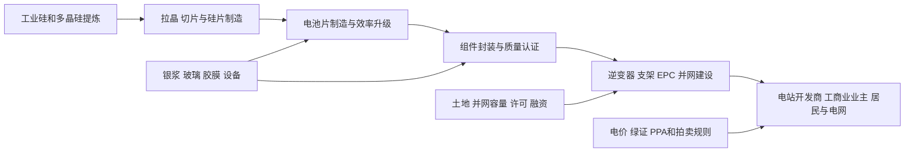

# 光伏行业供需周期分析

分析日期：2026-07-18 01:27:56 +08:00
地理范围：全球晶硅光伏产业链与电站装机，重点跟踪中国制造、中国及海外装机、欧洲、印度和美国市场；不纳入风电、储能电站或非光伏发电设备。
数据时效：全球装机采用IEA 2025年实际/估算；制造与供给为IEA 2025—2026研究；公司经营采用晶科Q1 2026和隆基Q1 2026实际。
行业边界：纳入多晶硅、硅片、电池片、组件、逆变器、支架、EPC和光伏电站运营；不将电网输配电、储能电池和终端售电公司计入制造产能。
研究模式：完整深研

> 阅读路线——入门读者按0→1→2→3→5→7→9阅读；熟悉行业的读者可先阅读4、5、6、8，并在附录A查看证据口径。

## 0. 一页看懂

**这个行业是做什么的**：光伏行业把硅料做成硅片、电池片和组件，把阳光变成电，再由逆变器、支架、施工和并网系统交付给电站、工商业屋顶和家庭。最终付款者是电力系统、项目开发商、企业业主和居民，通过电费、购电协议或资产投资回收成本。

**一句话判断**：全球装机继续创纪录，但组件和上游制造在低价、过剩与贸易摩擦下仍在出清；行业处于“终端建设扩张、制造环节利润修复尚不稳固”的暂定阶段。

- 周期阶段：需求高增下的制造出清与技术替代期
- 结论状态：暂定
- 置信度：中
- 最大缺口：缺少覆盖全球、可按硅料—硅片—电池—组件一致对齐的实际开工率、库存和现货价格序列。

**三个最重要的数字**：

| 数字 | 含义 | 为什么它最重要 | 证据 |
|---|---|---|---|
| 超600GW | 2025年全球新增光伏装机 | 终端需求仍在扩张，且首次越过600GW | E1 |
| 近370GW | 中国2025年新增光伏装机 | 单一市场贡献巨大，决定全球组件出货节奏 | E1 |
| 8.3% | 晶科Q1 2026毛利率 | 龙头毛利从低位修复，但仍伴随营收下滑与净亏损 | E4 |

## 1. 产业链地图

### 1.1 全景图



制造链的货物从硅料到组件，项目链把组件变成能发电、能结算的资产。资金从电站投资、屋顶业主和电网购电安排反向形成EPC与组件订单。当前瓶颈更多在并网、融资和项目收益，不等于组件制造没有过剩。

### 1.2 环节详解

### 1.2.1 硅料、硅片与电池片制造

**它是干什么的**：用高纯多晶硅拉制硅锭、切成薄硅片，再在硅片上形成能把光能变为电能的电池片。

**上游买什么 / 下游卖给谁**：购买工业硅、电力、石英坩埚、银浆、化学品和制造设备；向组件厂销售硅片和电池片。

**代表企业**：

| 公司 | 上市地/代码 | 在该环节的地位 | 为什么能代表该环节 | 证据 |
|---|---|---|---|---|
| 隆基绿能 | 上交所：601012 | 硅片与高效组件制造商 | Q1 2026硅片出货20.49GW，显示一体化厂的实际产出与外销比例 | E5 |
| 通威股份 | 上交所：600438 | 多晶硅、电池片与组件参与者 | 代表上游硅料和电池片同时受供需与技术路线影响的环节 | E2、E6 |

**怎么赚钱、议价能力**：盈利来自硅料价差、硅片加工费和电池转换效率带来的售价溢价。标准产品的产能容易复制；良率、低耗电、转换效率和客户认证才是有效供给的筛选条件。

**进阶视角**：制造环节最容易把“产能”误读成“可盈利供给”。IEA指出中国的产能过剩、低价格和监管/贸易变化已放慢国内新投资；没有低成本电力、技术迭代和稳定订单的新增线会先承压（E2、E6）。

### 1.2.2 组件封装与产品交付

**它是干什么的**：将电池片、玻璃、胶膜、边框和接线盒封装成可在户外运行数十年的组件，并完成功率、可靠性和认证测试。

**上游买什么 / 下游卖给谁**：购买电池片、玻璃、胶膜、铝框、接线盒和自动化设备；向EPC、分销商、开发商和屋顶安装商销售组件。

**代表企业**：

| 公司 | 上市地/代码 | 在该环节的地位 | 为什么能代表该环节 | 证据 |
|---|---|---|---|---|
| 晶科能源 | 科创板：688223；纽交所：JKS | 全球组件出货商 | 截至Q1 2026累计组件交付超400GW，Tiger Neo系列约240GW | E4 |
| 隆基绿能 | 上交所：601012 | BC组件与硅片一体化厂 | Q1 2026组件出货12.62GW，其中BC组件8.34GW | E5 |

**怎么赚钱、议价能力**：组件按W报价，项目交期、认证、功率衰减保证和海外交付能力决定差异化。低价出货可提高份额，但若不能覆盖折旧、保修和销售费用，不代表利润修复。

**进阶视角**：晶科Q1 2026毛利率从Q1 2025的-2.5%升至8.3%，主要来自组件平均售价改善；但收入同比下降11.5%、仍录得归母净亏损，说明价格回升尚未等于行业全面盈利（E4）。

### 1.2.3 EPC、并网与电站运营

**它是干什么的**：开发商获得土地、屋顶和并网指标，EPC安装组件、逆变器和支架，完成并网后由电站运营商出售电能、绿证或长期购电合同电量。

**上游买什么 / 下游卖给谁**：采购组件、逆变器、支架、施工、接网服务和融资；向电网、企业PPA买方和电力市场出售电力与环境属性。

**代表企业**：

| 公司 | 上市地/代码 | 在该环节的地位 | 为什么能代表该环节 | 证据 |
|---|---|---|---|---|
| 中国能建 | 上交所：601868 | 大型新能源EPC与工程服务商 | 代表集中式电站从设备采购到并网建设的工程链条 | E1、E3 |
| NextEra Energy | 纽交所：NEE | 美国可再生能源开发和运营商 | 代表成熟电力市场中项目收益、并网和长期合同的约束 | E1、E3 |

**怎么赚钱、议价能力**：开发商靠售电、容量/绿证和资产回报收回投资；EPC靠工程合同和采购管理获利。拥有接网容量、融资能力和低成本组件采购权的项目方更有议价力。

**进阶视角**：组件低价会提高项目经济性，却不能自动变成装机，因为网接延迟、政策变动和融资压力仍是IEA列出的约束。制造过剩与优质并网项目稀缺可同时存在（E1、E3）。

### 1.3 钱怎么流：利益传导

| 问题 | 回答 | 证据 | 缺口 |
|---|---|---|---|
| 谁最终付款？ | 电网、PPA购电企业、工商业屋顶业主、居民和电力市场终端用户。 | E1、E3 | 各国电价和补贴机制不可简单加总。 |
| 利润当前集中在哪里，为什么？ | 拥有并网和稳定售电合同的项目端更可能锁定回报；制造端仍受低价竞争影响。 | E1、E2、E4 | 缺少全球项目IRR统一口径。 |
| 谁承担资本开支和库存风险？ | 制造商承担产线折旧和组件库存，开发商承担土地、接网、EPC和融资风险。 | E2、E4 | 逐项目融资条款并不公开。 |
| 谁有定价权，凭什么？ | 优质电站接网与长期合同、以及技术领先和海外认证的组件有更强议价。 | E3、E4、E5 | 组件现货价格区域分化。 |
| 谁重要但赚不到钱？ | 低效或同质化产线即便持续出货，也可能被低售价和固定成本挤压。 | E2、E4 | 无行业统一现金成本曲线。 |

订单与预算流：

```text
[电力需求 PPA和项目融资] -> [开发商EPC合同] -> [组件 逆变器 支架订单] -> [电池片与硅片排产] -> [多晶硅和辅材采购]
```

## 2. 需求：谁在买、为什么买

事实：

- 2025年全球光伏新增装机超过600GW，同比增长约12%，累计容量约2,800GW（E1）。
- 中国2025年新增近370GW，约占全球新增的六成以上；欧盟新增近70GW，印度新增近50GW（E1）。
- 2026—2030年全球净新增可再生容量中太阳能约占70%，太阳能发电量预计每年增加约320—360TWh（E3）。
- IEA预计2025—2030年全球可再生容量增加约4,600GW，低组件成本、较快许可和社会接受度推动光伏成为近八成增量（E3）。

| 终端用途 | 买方/预算所有者 | 购买动因 | 已兑现还是预期 | 可观察指标 | 证据 |
|---|---|---|---|---|---|
| 集中式电站 | 开发商、电网、基础设施基金 | 低成本发电、容量规划与长期合同 | 2025年大量实际投运 | 新增GW、招标/PPA、并网进度 | E1、E3 |
| 工商业屋顶 | 工厂、园区、商业业主 | 降低购电成本、稳定用能 | 多国持续部署 | 分布式装机、零售电价 | E1 |
| 户用光伏 | 居民、零售能源商 | 自发自用与电费节省 | 区域性兑现 | 户用新增、补贴与贷款 | E3 |
| 光储一体化 | 开发商与电网 | 提高光伏出力价值、减轻限电 | 快速增长但项目口径不统一 | 储能配套时长与弃电率 | E1、E3 |

推断与假设：

- 推断：全球光伏需求已不再只依赖中国，30个国家在2025年新增超过1GW；但中国的近370GW仍能显著改变组件出货和价格周期（E1）。
- 假设：若网接、融资或电力市场价格恶化，组件低价无法继续带来同等规模装机；反证是项目招标和并网在收益下行时仍上修。

**进阶视角**：装机数据并不等于组件制造当期收入。中国在2025年上半年竞价制度切换前出现抢装、下半年放缓，说明政策时间点会把全年需求提前或延后确认（E1）。

## 3. 供给：现在有多少、真能用的有多少

| 环节/项目 | 公告产能 | 已安装 | 已验证/爬坡达标 | 有客户订单支撑 | 释放窗口 | 证据 | 缺口 |
|---|---:|---:|---:|---:|---|---|---|
| 中国光伏制造链 | 不适用 | 全球集中度高 | 供应链主要环节集中度2030年仍预计超90% | 不等于已签约组件订单 | 2025—2030预测 | E2 | 各环节实际开工率不公开 |
| 晶科组件 | 不适用 | 累计交付>400GW | Tiger Neo累计约240GW | 海外高价值市场占比提升 | 截至Q1 2026 | E4 | 未披露全部订单积压 |
| 隆基硅片/组件 | 不适用 | Q1硅片20.49GW、组件12.62GW出货 | BC组件8.34GW实际出货 | 由客户采购确认 | Q1 2026 | E5 | 单季度不代表全年利用率 |
| 海外制造扩张 | 不适用 | 新项目在建 | 受产业政策支持 | 取决于本地需求和成本 | 2030—2035情景 | E6 | 预测不是已投产产能 |

事实：

- IEA指出过剩、低价、贸易壁垒和政策调整已放慢中国光伏供应链新增投资；关键环节的单一国家集中度在2030年仍将高于90%（E2）。
- 晶科Q1 2026营收122.5亿元，同比降11.5%，主因组件出货量下降；毛利率升至8.3%，但归母净亏损4.635亿元（E4）。
- 隆基Q1 2026硅片出货20.49GW、组件12.62GW，其中BC组件8.34GW；实际出货与技术路线比例可作为高效产品交付观察点（E5）。
- IEA预计印度在STEPS下到2035年制造份额由2024年的3%升至10%以上，并于2030年成为组件净出口国，但这属于政策情景而非当前实际（E6）。

推断与假设：

- 推断：制造端有效供给的折损主要来自低成本竞争、技术代际和贸易准入，而非单纯的组件产能；晶科和隆基的实际出货显示龙头也需靠产品结构区分（E2、E4、E5）。
- 假设：若低效产线退出、组件售价稳定且海外需求持续，毛利会先在技术领先和海外认证产品修复；反证是出口限制增加、需求放缓或组件价格重启下跌。

**进阶视角**：名义“全球制造多元化”并未立即降低供应链集中。IEA仍预计关键环节2030年集中度超过90%，海外产能是否能形成有效供给取决于材料、设备、成本和政策的整链配套（E2、E6）。

## 4. 供需矛盾与高频信号

核心矛盾：电站装机需求强劲，但制造端低价与供给集中导致利润和投资承压；当下缺的不是全行业组件，而是可并网、可融资且能在低价下盈利的项目与制造能力。

| 信号 | 最新值/方向 | 数据期间 | 证据 | 解读 | 缺口 |
|---|---|---|---|---|---|
| 全球新增光伏 | 超600GW，+约12% | 2025全年 | E1 | 终端建设仍扩张 | 部分地区为估算值 |
| 中国新增光伏 | 近370GW，+13% | 2025全年 | E1 | 最大市场支撑出货，但存在抢装扰动 | 下半年增速放缓 |
| 晶科毛利率 | 8.3% | Q1 2026 | E4 | 较2025低点修复 | 公司非行业均值 |
| 晶科营收 | 122.5亿元，-11.5%同比 | Q1 2026 | E4 | 出货下降仍压收入 | 无全球订单序列 |
| 隆基BC组件出货 | 8.34GW | Q1 2026 | E5 | 技术产品有实际交付 | 未披露同类行业占比 |

## 5. 周期位置与传导

传导链：

```text
[电力需求和项目收益] -> [开发商投资与PPA] -> [EPC和组件订单] -> [电池片/硅片排产] -> [硅料与辅材采购] -> [制造现金流] -> [产线退出或升级] -> [组件价格和毛利再平衡]
```

| 阶段/日期 | 信号 | 利润池往哪移 | 关键时滞 | 证据 | 下一步验证 |
|---|---|---|---|---|---|
| 2023—2025低价扩张 | 全球装机持续创高，制造低价竞争 | 向项目端和低成本采购方移动 | 产线退出比组件降价慢 | E1、E2 | 组件价格与停产公告 |
| 2025政策/项目分化 | 中国上半年抢装、下半年放缓 | 向已拿到并网和项目资源的开发商移动 | 制度切换影响月度装机 | E1 | 招标和并网节奏 |
| Q1 2026利润低位修复 | 晶科毛利改善但仍亏损，隆基BC有交付 | 向高效组件和海外认证产品倾斜 | 产品升级先于全行业供给退出 | E4、E5 | 龙头ASP、毛利和订单 |

当前阶段：

- 阶段：需求高增下的制造出清与技术替代期
- 进入时间/锚点：2025年光伏装机超600GW，但IEA仍记录产能过剩和低价抑制制造投资；Q1 2026头部毛利修复却仍亏损。
- 预期切换条件：若低效产能退出、组件价格稳定、龙头毛利与现金流持续修复，进入盈利修复；若新增投资和价格战再度扩大，出清延长。
- 置信度：中
- 什么会证明这个判断错了：全球组件价格持续上涨且多数制造商恢复利润，或全球装机在低价条件下明显掉头下滑。

**进阶视角：与上一轮周期的对照**：2020—2022年硅料紧缺曾使上游议价强、组件价格上升；2023—2025年则转为制造过剩和低价，利润压力从下游回传至硅片、电池片和组件。本轮不同在于全球装机仍高增且BC等效率路线在改写产品结构，不能仅按旧周期的硅料价格判断（E1、E2、E5）。

## 6. 资金动向

### 6.1 尝试的来源类型

| 尝试的来源类型 | 具体来源 | 结果 |
|---|---|---|
| 行业指数估值分位 | 中证光伏产业指数公开资料 | 得到行业指数入口，但未取得与全球制造边界一致的连续估值分位。 |
| 行业ETF份额/资金流 | 华泰柏瑞中证光伏产业ETF及基金公告 | 可看到产品级持有人信息，但无法分拆硅料、电池片、组件和电站环节。 |
| 北向/两融或同类资金流指标 | 沪深交易所公开统计 | 公司层面可查，不能形成全球光伏制造资金流口径。 |
| 龙头股价与盈利的剪刀差 | 晶科和隆基业绩公告 | 获得运营和盈利实际；本轮未构建同日价格与盈利序列。 |

**已定价（推断）：**市场大致已认识到装机高增、制造过剩、低组件价格和贸易摩擦；这些主题已在IEA年度展望与龙头亏损/毛利修复中反复出现（E1、E2、E4）。

**未定价（推断）：**尚难判断市场是否已充分计入低效产线退出速度、BC等高效产品的溢价持续性，以及并网约束对全球装机的实际影响（E3、E5）。

判断依据与不确定性：这是产业叙事推断，并非指数估值测量；项目收益还取决于利率、汇率、电价和政策。

## 7. 未来资金可能流向

> 本节是周期传导的情景推演，不构成任何买卖建议、目标价或个股推荐。

| 情景 | 触发条件 | 利润池往哪个环节移动 | 先受益的环节 | 后受益/受损的环节 | 需要盯的证据 |
|---|---|---|---|---|---|
| 基准 | 装机维持增长、组件低价逐步止跌 | 向高效组件、项目并网资源和低成本制造转移 | 有订单和技术差异的组件厂、已获接网项目 | 低效同质化产线 | 装机、组件ASP、毛利 |
| 上行 | 低效产能退出、出口需求增强、项目收益稳定 | 向硅片/电池升级、海外认证和EPC交付能力移动 | 技术领先与海外渠道厂商 | 仅靠低价抢量的制造商 | 停产、订单、价格修复 |
| 下行 | 并网/融资受阻、贸易壁垒上升或价格再跌 | 向现金流和已运营电站集中 | 长约电站和低负债运营方 | 高库存组件、扩产项目和高成本产线 | 招标、库存、贸易政策 |

推演逻辑：组件可以较快排产和降价，项目接网与融资却往往跨季度甚至跨年度；因此项目需求上行先改善拥有并网资源的EPC/开发商，制造利润需等待订单稳定与产能退出。需求下行则先压项目投资和组件订单，再压硅片、电池片与硅料。

## 8. 分歧与反证

主流叙事 vs 本报告：

| 市场主流叙事 | 本报告判断 | 分歧在哪 | 谁的证据更硬 | 证据 |
|---|---|---|---|---|
| “装机创新高，组件厂应全面盈利” | 装机高增真实，但晶科Q1仍亏损，制造利润未同步 | 终端建设与制造议价不同 | 公司财报和IEA供给分析更直接 | E1、E2、E4 |
| “低组件价必然带来同等规模装机” | 低价改善经济性，但并网、融资和政策仍能限制落地 | 设备价格与项目可投运不同 | IEA对网接/政策约束的说明更硬 | E1、E3 |
| “海外产能会快速化解集中度” | 海外制造在扩张，但关键环节集中度2030年仍可能超90% | 下游组装与全链材料能力不同 | IEA情景研究更硬 | E2、E6 |

冲突证据：

| 议题 | 支持证据 | 反对证据 | 口径差异 | 处理 |
|---|---|---|---|---|
| 制造利润是否回升 | 晶科毛利率升至8.3% | 晶科仍净亏损、低价与过剩未消失 | 毛利率与净利润不同 | 未解决；跟踪连续季度 |
| 全球需求是否均衡 | 中国近370GW、欧盟/印度也创高 | 中国政策切换造成先抢后缓 | 年度新增掩盖月度波动 | 未解决；监测并网与招标 |

## 9. 观察哨与跟踪

| 指标 | 基线 | 来源 | 频率 | 正向触发 | 反证触发 | 含义 |
|---|---|---|---|---|---|---|
| 全球光伏新增 | 2025年超600GW | IEA E1 | 年度 | 2026年高于600GW | 新增明显低于600GW | 验证终端需求 |
| 中国光伏新增 | 2025年近370GW | IEA E1 | 月度/年度 | 并网维持高位 | 政策切换后连续下滑 | 验证最大市场节奏 |
| 晶科毛利率 | Q1 2026为8.3% | 晶科 E4 | 季度 | 持续高于8.3%且净利改善 | 毛利回落或亏损扩大 | 验证价格与产品结构 |
| 隆基BC组件出货 | Q1 2026为8.34GW | 隆基 E5 | 季度 | BC占比与总出货提升 | BC出货下降或占比下滑 | 验证效率路线兑现 |
| 太阳能发电增量 | 2025年全球+620TWh | IEA E3 | 年度 | 每年维持320TWh以上增长 | 增量明显低于320TWh | 验证并网后实际发电 |

### 9.1 可比时间序列

| 日期 | 指标 | 数值 | 单位 | 来源 | 含义 |
|---|---|---:|---|---|---|
| Q1 2025 | 晶科毛利率 | -2.5 | % | E4 | 公司披露的同口径毛利亏损率。 |
| Q1 2026 | 晶科毛利率 | 8.3 | % | E4 | 毛利修复，但不能代表行业全部企业。 |

跟踪数据底稿：

| 日期 | 指标 | 环节 | 数值 | 同比/环比 | 方向 | 来源 | 对判断的影响 | 备注 |
|---|---|---|---:|---:|---|---|---|---|
| 2025全年 | 全球新增光伏 | 项目需求 | 600 | +12% | 上升 | E1 | 支持需求高增 | 单位GW，超过600 |
| 2025全年 | 中国新增光伏 | 项目需求 | 370 | +13% | 上升 | E1 | 支持最大市场 | 单位GW，近似值 |
| Q1 2026 | 隆基组件出货 | 制造交付 | 12.62 | 不适用 | 交付 | E5 | 观察龙头实际排产 | 单位GW |

### 9.2 观察框架

| 指标 | 基线 | 来源 | 频率 | 正向触发 | 反证触发 |
|---|---|---|---|---|---|
| 全球光伏新增 | 超600GW | IEA E1 | 年度 | 高于600GW | 明显低于600GW |
| 晶科毛利率 | 8.3% | 晶科 E4 | 季度 | 高于8.3%并转盈 | 低于0% |
| 隆基BC组件出货 | 8.34GW | 隆基 E5 | 季度 | 高于8.34GW | 连续下降 |

## 10. 术语表

| 术语 | 人话解释 |
|---|---|
| 多晶硅 | 经过高纯化处理的硅材料，是晶硅光伏电池的原料。 |
| 硅片 | 将硅锭切成极薄片后得到的片材，是电池片的基底。 |
| 电池片 | 接收光照并产生直流电的半成品，需要封装成组件才能户外使用。 |
| 组件 | 将电池片封装成可长期户外发电的光伏板。 |
| BC组件 | 背接触组件，把主要电极布置在电池背面以减少正面遮光并提升效率。 |
| PPA | 购电协议，约定电站向企业或售电方长期出售电力的合同。 |

## 附录A 证据台账

| 证据ID | 结论 | 类型 | 发布方 | 发布日期 | 访问日期 | 数据期间 | 地域/单位 | 原文链接/定位 | 已打开 | 时效 | 局限 |
|---|---|---|---|---|---|---|---|---|---|---|---|
| E1 | 2025全球新增光伏超600GW、中国近370GW | 事实/估算 | IEA | 2026-04-20 | 2026-07-18 | 2025全年 | 全球、中国/GW | https://www.iea.org/reports/global-energy-review-2026/technology-solar-pv-and-wind 第237—261行 | 是 | 当前 | 部分地区年末数据为估算。 |
| E2 | 供应链集中、过剩和低价放慢中国制造投资，2030集中度仍超90% | 预测/分析 | IEA | 2025-10 | 2026-07-18 | 2025—2030 | 全球/供应链份额 | https://www.iea.org/reports/renewables-2025/executive-summary 第259、305行 | 是 | 当前 | 集中度为预测且未拆分每一道工序。 |
| E3 | 2026—2030太阳能占净可再生新增约70%，2025发电增量620TWh | 事实/预测 | IEA | 2026-02 | 2026-07-18 | 2025—2030 | 全球/TWh、GW | https://www.iea.org/reports/electricity-2026/supply 第236、295行 | 是 | 当前 | 含模型预测，地区差异显著。 |
| E4 | 晶科Q1 2026营收、毛利率、亏损及累计组件交付 | 事实 | 晶科能源 | 2026-05 | 2026-07-18 | Q1 2025—Q1 2026 | 全球/人民币、% | https://ir.jinkosolar.com/news-releases/news-release-details/jinkosolar-announces-first-quarter-2026-financial-results 第70—120行 | 是 | 当前 | 单一公司、汇率与补贴影响利润。 |
| E5 | 隆基Q1 2026硅片20.49GW、组件12.62GW、BC组件8.34GW | 事实 | 隆基绿能 | 2026-06 | 2026-07-18 | Q1 2026 | 中国及全球/GW | https://static.longi.com/LON_Gi_First_Quarter_Report_2026_feb3400489.pdf 第7页 | 是 | 当前 | 公司季度出货不能外推行业份额。 |
| E6 | 印度等海外制造份额在情景下上升但中国仍最大来源 | 预测/分析 | IEA | 2026-03-26 | 2026-07-18 | 2024—2035 | 全球/制造份额 | https://www.iea.org/reports/energy-technology-perspectives-2026/executive-summary 第350、384行 | 是 | 当前 | 情景依赖政策和投资兑现。 |

## 附录B 数据时效与证据覆盖

| 指标 | 期间 | 状态 | 发布日期 | 访问日期 | 时效 | 来源 | 定位 | 局限 |
|---|---|---|---|---|---|---|---|---|
| 全球与区域光伏新增 | 2025全年 | 实际/估算 | 2026-04-20 | 2026-07-18 | 当前 | E1 | 技术章节 | 部分数据为估算。 |
| 光伏制造集中与过剩 | 2025—2030 | 分析/预测 | 2025-10 | 2026-07-18 | 当前 | E2 | 可再生能源展望 | 非逐厂利用率。 |
| 太阳能发电与新增预测 | 2025—2030 | 实际/预测 | 2026-02 | 2026-07-18 | 当前 | E3 | 电力供给章节 | 未来年度非实际。 |
| 晶科财务与组件交付 | Q1 2026 | 实际 | 2026-05 | 2026-07-18 | 当前 | E4 | Q1业绩 | 公司层面。 |
| 隆基出货 | Q1 2026 | 实际 | 2026-06 | 2026-07-18 | 当前 | E5 | Q1报告 | 未披露行业总体。 |

发布状态说明：

- 已发布：2025年全球装机、Q1 2026晶科和隆基业绩、IEA年度与中期研究。
- 尚未发布：2026年全球全年装机、全产业链统一开工率和库存实际。
- 更新关系：E1提供最新年度装机；E2、E3和E6用于中期供给与并网情景，不替代实际。

## 附录C 证据就绪度与研究执行记录

| 证据车道 | 状态 | 已打开可靠来源数 | 最低要求 | 证据/缺口 |
|---|---:|---:|---:|---|
| 产业链 | Ready | 4 | 2 | IEA、晶科和隆基覆盖制造到项目。 |
| 需求 | Ready | 3 | 3 | 全球装机、区域装机与发电预测。 |
| 供给与有效产能 | Ready | 4 | 3 | 供应链集中、龙头实际出货、海外情景。 |
| 价格/订单/库存/利润 | Ready | 3 | 3 | 低价过剩、晶科毛利与亏损、隆基出货。 |
| 资本市场预期 | Gap | 2 | 2 | 已记录指数、ETF、交易所和龙头IR尝试，缺少全链可比定价序列。 |

| 子任务 | 检索轮次 | 实际使用的路径 | 证据 | 状态 | 缺口/回退 |
|---|---:|---|---|---|---|
| 全球需求与项目 | 1 | IEA原始网页 | E1、E3 | 完成 | 2026全年实际未发布。 |
| 制造供给与集中 | 2 | IEA年度与技术展望 | E2、E6 | 完成 | 无统一实际开工率。 |
| 龙头经营与技术 | 2 | 晶科、隆基原始披露 | E4、E5 | 完成 | 订单积压未完整公开。 |
| 反证与并网 | 1 | IEA供给与装机分析 | E1、E3 | 完成 | 逐项目收益未公开。 |
| 资本市场映射 | 1 | 指数、ETF、交易所与IR公开入口 | 第6节记录 | 缺口 | 无全球全链估值/资金流序列。 |

事实、推断、假设分层：

- 事实：E1、E4、E5提供年度装机与公司实际；E2、E3、E6明确标注预测或分析。
- 推断：需求强而制造利润弱来自装机、过剩与公司财务的共同观察。
- 假设：产能退出、并网进度和组件价格决定后续阶段；对应反证见第5与第9节。

## 尾注

- 供需缺口 ≠ 股价上涨。
- 方向正确 ≠ 时点正确。
- 盈利兑现 ≠ 股价继续上涨。
- AI 回答和搜索摘要不是事实。
- 过期数据不是当前事实。
