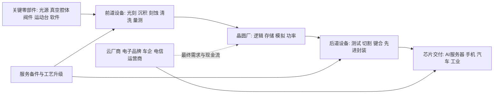

# 半导体设备行业供需周期分析

分析日期：2026-07-18 01:39:24 +08:00
地理范围：全球半导体制造设备市场，重点覆盖中国台湾、美国、韩国、中国大陆及欧洲；不将芯片设计、晶圆代工本身或电子整机销售额计为设备需求。
数据时效：行业预测采用 SEMI 于 2026-07-14 发布的中期预测；公司经营采用 ASML Q1 2026、Applied Materials FY2026 Q2、Lam 2026 年 3 月季度及 TSMC 2026Q2 已披露结果。
行业边界：包括晶圆制造前道设备（光刻、沉积、刻蚀、清洗、量测/检测、离子注入等）、后道测试与先进封装设备、安装服务及备件；不把硅片、光罩、化学品和芯片成品计入本行业产出。
研究模式：完整深研

## 0. 一页看懂

**这个行业是做什么的**：半导体设备商把光、真空、等离子体、精密运动、量测和软件整合为产线工具，交付给晶圆厂和封测厂；客户用这些工具把硅片做成逻辑、存储和功率芯片。最终付款者是云厂商、终端电子品牌、车企和通信运营商，但直接签采购单、承担资本开支的是晶圆代工厂、IDM、存储厂及封测厂。

**一句话判断**：AI 基础设施、先进逻辑、HBM 和先进封装正在把设备景气推向扩张段，但并非“所有设备同时短缺”：前道先进制程设备与部分后道环节更强，成熟制程及受出口许可约束的区域需求更分化。

- 周期阶段：AI 驱动的资本开支扩张期，伴随区域与制程分化
- 结论状态：暂定
- 置信度：中
- 最大缺口：缺少按设备品类、地区、最终装机和取消订单统一口径的月度订单/交期序列。

**三个最重要的数字**：

| 数字 | 含义 | 为什么它最重要 | 证据 |
|---|---|---|---|
| 1,659 亿美元 | SEMI 对 2026 年全球半导体制造设备 OEM 销售额预测 | 是行业总需求与资本开支强度的顶层量纲 | E1 |
| 1,439 亿美元 | 其中 2026 年晶圆厂设备（WFE）预测额 | 前道设备是设备行业最主要的价值池 | E1 |
| 40.20 亿美元 | TSMC 2026Q2 净营收 | 最大先进制程客户的实际产出与后续采购预算锚点 | E5 |

## 1. 产业链地图

### 1.1 全景图



设备收入确认通常早于晶圆厂用设备生产出芯片的收入；因此设备订单是资本开支的领先信号，却不是终端芯片销量的同步替代品。有效供给的门槛也高于“机器已出厂”：设备须完成客户验收、工艺导入、良率爬坡和持续服务。

### 1.2 环节详解

#### 1.2.1 前道核心设备

**它是干什么的**：光刻定义图形，沉积与刻蚀形成晶体管和互连结构，清洗、量测与检测保证缺陷、线宽和叠层处于工艺窗口。

**上游买什么 / 下游卖给谁**：采购光学、精密机械、真空、射频电源、控制软件与耗材；销售给晶圆代工、存储 IDM 和特色工艺晶圆厂。

**代表企业**：

| 公司 | 上市地/代码 | 在该环节的地位 | 为什么能代表该环节 | 证据 |
|---|---|---|---|---|
| ASML | 阿姆斯特丹/ASML | 光刻龙头 | Q1 2026 销售 67 台新光刻系统，且服务收入 24.88 亿欧元 | E2 |
| Applied Materials | 纳斯达克/AMAT | 沉积、材料工程与部分检测设备商 | FY2026 Q2 营收创 79.10 亿美元纪录 | E3 |
| Lam Research | 纳斯达克/LRCX | 刻蚀与薄膜沉积设备商 | 2026 年 3 月季度收入 58.41 亿美元、环比增长 9% | E4 |

**怎么赚钱、议价能力**：设备售价来自工具性能、产能、安装与认证，随后由备件、服务和升级形成较长尾收入。光刻等不可替代工艺节点议价力最强；刻蚀、沉积也会因晶体管结构和存储层数增加而提升“每片晶圆的设备强度”。

**进阶视角**：名义设备产能不等于可卖的设备供给。对于先进节点，客户认可的工艺配方、现场服务和备件响应才决定设备能否及时转为晶圆产能；ASML 的 Installed Base Management 收入可作为装机后服务需求的观察代理（E2）。

#### 1.2.2 后道测试与先进封装设备

**它是干什么的**：测试设备验证芯片功能与性能；先进封装设备完成键合、重布线、扇出或面板级工艺，使多颗逻辑、HBM 和 I/O 芯片以更高密度组合。

**上游买什么 / 下游卖给谁**：采购精密运动、热控制、视觉/量测、自动化与工艺材料；销售给 OSAT、IDM 的后段厂及先进封装产线。

**代表企业**：

| 公司 | 上市地/代码 | 在该环节的地位 | 为什么能代表该环节 | 证据 |
|---|---|---|---|---|
| Applied Materials | 纳斯达克/AMAT | 先进封装沉积与材料工程 | 已宣布收购 NEXX 以扩展面板级先进封装沉积组合 | E3 |
| ASMPT | 香港/0522 | 封装与贴装设备商 | 代表先进封装设备中独立的后道工具供给 | E3 |
| Advantest | 东京/6857 | 半导体测试设备商 | 代表测试端对高性能计算芯片验证的资本开支 | E1 |

**怎么赚钱、议价能力**：先进封装工具由工艺良率、吞吐量、兼容封装路线和客户验证决定溢价；常规后道设备更易受封测厂扩产节奏及价格竞争影响。

**进阶视角**：AI 设备需求不只落在“晶圆前道”。SEMI 将先进逻辑、先进存储、测试和封装同时列为上修预测的驱动，意味着观察 AI 投资不能只盯 EUV 出货（E1）。

#### 1.2.3 安装、服务与合规

**它是干什么的**：把工具安装到洁净室、调通工艺，并在生命周期内供应备件、保养、软件升级和合规文件。

**上游买什么 / 下游卖给谁**：采购本地工程人员、备件库存、远程诊断与合规服务；面向已安装设备客户收费。

**代表企业**：

| 公司 | 上市地/代码 | 在该环节的地位 | 为什么能代表该环节 | 证据 |
|---|---|---|---|---|
| ASML | 阿姆斯特丹/ASML | 装机服务和性能升级 | Q1 2026 Installed Base Management 销售额为 24.88 亿欧元 | E2 |
| Lam Research | 纳斯达克/LRCX | 装机基础上的服务与技术支持 | 季报披露经营结果，反映成熟装机基础的持续收入属性 | E4 |
| Applied Materials | 纳斯达克/AMAT | 全球化客户支持与材料工程服务 | 财报将交付、支持客户需求和许可证列为经营风险 | E3 |

**怎么赚钱、议价能力**：装机越多，备件与服务越具黏性；但出口管制、许可证和最终用途核查会延长交付节奏并改变地区收入确认。

**进阶视角**：BIS 的规则并非抽象政治变量。其 EAR 条款对部分半导体制造设备及部件规定许可证要求，令“可出口、可安装、可继续服务”成为有效供给的一部分（E7）。

### 1.3 钱怎么流：利益传导

| 问题 | 回答 | 证据 | 缺口 |
|---|---|---|---|
| 谁最终付款？ | 云厂商、电子品牌、车企和通信运营商以服务器、终端和车载电子需求付款；晶圆厂/封测厂将其转成设备预算。 | E1、E5 | 无法将每台设备直接归属到单一终端客户。 |
| 利润当前集中在哪里，为什么？ | 先进光刻、关键前道工艺与高黏性服务更容易留存利润，常规成熟设备则更依赖客户扩产和竞争格局。 | E2、E3、E4 | 缺乏统一的分品类毛利率。 |
| 谁承担资本开支和库存风险？ | 晶圆厂和封测厂承担设备购置、安装、折旧与利用率风险；设备商承担供应链、交付与备件库存风险。 | E1、E5 | 客户逐厂资本开支合同不公开。 |
| 谁拥有定价权？ | 掌握关键工艺、认证、服务网络和稀缺产能的设备商议价较强，但仍受客户集中度及出口许可约束。 | E2、E7 | 无公开的设备 ASP 长期序列。 |

谁最终付款：终端算力与电子需求经由芯片采购、晶圆厂产能规划，再反向传导为设备订单；不能把设备商收入直接当作终端 AI 收入。

## 2. 需求：谁在买、为什么买

事实：

- SEMI 预计 2026 年全球半导体制造设备 OEM 销售额达到 1,659 亿美元，同比增 23.2%；WFE 预计达到 1,439 亿美元，同比增 23.1%（E1）。
- SEMI 预计全球 300mm 晶圆厂设备支出 2026 年增 18%至 1,330 亿美元，2027 年再增 14%至 1,510 亿美元（E6）。
- TSMC 2026Q2 实际净营收为 402.0 亿美元，给出 2026Q3 指引为 446 亿至 458 亿美元；这是先进逻辑与先进封装需求传导到最大代工客户的直接经营信号（E5）。
- ASML 表示 AI 基础设施投资带动芯片需求超过供给，客户正加快 2026 年及以后扩产计划；这属于公司景气判断，而不是全行业已实现订单的普查（E2）。

| 终端用途 | 买方/预算所有者 | 购买动因 | 已兑现还是预期 | 可观察指标 | 证据 |
|---|---|---|---|---|---|
| AI 训练和推理 | 云厂商、GPU/ASIC 设计商、代工厂 | 先进逻辑、HBM、互连和封装密度 | 部分已体现为设备预测与代工营收 | WFE、300mm 支出、代工指引 | E1、E5、E6 |
| 存储扩产 | HBM/DRAM/NAND 厂商 | 容量、层数和性能升级 | 受价格与客户认证影响 | 存储设备支出、厂商资本开支 | E1、E6 |
| 汽车和工业 | IDM、特色工艺厂 | 功率、模拟、MCU 的供货稳定 | 更偏成熟制程、节奏差异大 | 成熟节点利用率、项目投产 | E1 | 
| 先进封装 | 代工厂、OSAT、IDM | 提高算力密度、缓解单芯片尺寸限制 | 设备商产品布局已落地，行业量仍需跟踪 | 封装设备订单、稼动率 | E1、E3 |

推断与假设：

- 推断：2026 年设备需求并不是单纯的“全面补库存”，而是 AI 驱动的先进逻辑、先进存储和后道封装技术转换与扩产共同叠加；SEMI 的上修与 TSMC 的收入指引相互支持，但无法证明每个设备子类均同样景气（E1、E5）。
- 假设：若云资本开支放缓、HBM 供需转松或先进制程客户延后投产，设备订单会先在新增项目和交期上出现变化；反证是主要客户继续上调中期设备预算。

**进阶视角**：晶圆厂的“预算”不是一次性需求。设备从接单、制造、出货、安装到验收跨越多个季度，先进设备还可能被客户通过服务升级延长有效产能，因此收入确认、订单与晶圆开工会错位。

## 3. 供给：现在有多少、真能用的有多少

| 环节/项目 | 公告产能 | 已安装 | 已验证/良率达标 | 有客户订单支撑 | 释放窗口 | 证据 | 缺口 |
|---|---:|---:|---:|---:|---|---|---|
| 全球设备销售 | 2026 预测 1,659 亿美元 | 不适用 | 取决于客户认证 | 预测反映 OEM 需求判断 | 2026 全年 | E1 | 不是逐品类交期与订单积压。 |
| 300mm 晶圆厂设备支出 | 2026 预测 1,330 亿美元 | 不适用 | 对应新厂及扩产导入 | 预测口径 | 2026—2027 | E6 | 未给出逐厂取消/递延。 |
| ASML 光刻系统 | Q1 新系统销售 67 台 | 已形成大装机基础 | 客户现场工艺认证后才形成产能 | 强订单动能为公司表述 | Q1 2026 及后续交付 | E2 | 未披露全部客户排产。 |
| Applied Materials | Q2 实现收入 79.10 亿美元 | 已交付工具需客户验收 | 由客户技术节点决定利用率 | Q3 收入指引 89.50±5 亿美元 | FY2026 Q3 | E3 | 指引含宏观与许可不确定性。 |
| Lam Research | 2026 年 3 月季度收入 58.41 亿美元 | 设备已进入客户与服务网络 | 实际产能取决于客户开工 | 当季经营结果已兑现 | 已披露季度 | E4 | 没有行业统一订单库存表。 |

事实：ASML Q1 2026 实现总销售 87.67 亿欧元、毛利率 53.0%，并售出 67 台新光刻系统；Applied FY2026 Q2 实现 79.10 亿美元收入，给出下一季度 89.50±5 亿美元收入展望；Lam 2026 年 3 月季度收入 58.41 亿美元、环比增长 9%（E2、E3、E4）。

推断与假设：

- 推断：行业有效供给较名义出货更紧，因为先进设备需嵌入客户工艺流程，安装、良率、备件和现场工程师会共同限制“立即可用”的产能；但这不代表成熟节点全品类都短缺。
- 假设：若设备交付继续增长而客户开工、芯片价格或设备验收放缓，设备商的收入与服务强度会先后承压；反证是客户持续提高 300mm 与先进封装设备投入。

**进阶视角**：设备供给周期与芯片产能周期不同。设备商可能先扩自身制造和供应链，晶圆厂则要在厂房、公用工程、客户认证与人才到位后才形成可售芯片，因此不能用某一季度设备收入直接外推同季度晶圆供给。

## 4. 供需矛盾与高频信号

核心矛盾：全球总设备需求被 AI 明显抬升，但供需紧张集中在先进制程、先进存储和封装技术路径；成熟制程、地区限制和客户集中度会使不同设备商的订单质量显著不同。

| 信号 | 最新值/方向 | 数据期间 | 证据 | 解读 | 缺口 |
|---|---|---|---|---|---|
| 全球设备 OEM 销售预测 | 1,659 亿美元，+23.2% | 2026 预测 | E1 | 设备大盘进入高增长年度 | 预测非实际结算。 |
| WFE 销售预测 | 1,439 亿美元，+23.1% | 2026 预测 | E1 | 前道仍是核心价值池 | 未拆光刻/刻蚀/沉积。 |
| 300mm 设备支出 | 1,330 亿美元，+18% | 2026 预测 | E6 | 先进节点与大型晶圆厂支出强 | 不含所有后道设备。 |
| ASML 总销售 | 87.67 亿欧元 | Q1 2026 | E2 | 高端光刻交付和服务已兑现 | 单季有交付节奏影响。 |
| Lam 收入 | 58.41 亿美元，环比 +9% | 2026年3月季度 | E4 | 刻蚀/沉积需求改善的公司级佐证 | 不代表同业平均。 |

## 5. 周期位置与传导

传导链：

```text
[终端AI与电子需求] -> [芯片设计订单] -> [晶圆厂/封测厂资本开支] -> [设备订购与交付] -> [安装验收和工艺爬坡] -> [晶圆产出] -> [芯片价格与下一轮预算]
```

| 阶段/日期 | 信号 | 利润池往哪移 | 关键时滞 | 证据 | 下一步验证 |
|---|---|---|---|---|---|
| 2024—2025 技术投资恢复 | AI、HBM、先进逻辑成为投资重点 | 向关键前道与先进封装设备倾斜 | 订单至验收跨季 | E1、E6 | 订单取消与客户资本开支。 |
| 2026 预测上修 | 设备与 WFE 增速均在两成以上 | 向有技术壁垒和装机服务的设备商倾斜 | 新厂建设和交付节奏 | E1、E2 | 300mm 支出与龙头指引。 |
| 2026Q2 客户兑现 | TSMC 营收 402 亿美元并上调下季指引区间 | 代工产能利用和供应链订单改善 | 晶圆收入滞后设备订单 | E5 | 客户资本开支及设备验收。 |

当前阶段：

- 阶段：AI 驱动的资本开支扩张期，存在成熟/先进、地区/许可证的双重分化。
- 进入时间/锚点：SEMI 在 2026 年 7 月将总设备销售预测上修至 1,659 亿美元，并预计连续五年增长；TSMC 2026Q2 的实际收入为需求侧提供了兑现样本（E1、E5）。
- 预期切换条件：若 300mm 投资增速、龙头指引及服务收入维持上行，扩张判断加强；若客户削减资本开支、交期缩短且设备收入低于指引，则转向去库存/延后投资。
- 置信度：中
- 什么会证明这个判断错了：2026 年先进逻辑、存储与封装的实际资本开支显著低于 SEMI 预测，且龙头公司连续下修收入展望或披露订单取消。

**进阶视角**：本轮周期的特殊处在于“单位晶圆的设备强度”提高：更复杂的晶体管、HBM 堆叠和异构封装可能使设备支出快于晶圆面积增长；但若 AI 终端变现不及预期，设备强度高也会放大新增产线延期的波动。

## 6. 资金动向

### 6.1 尝试的来源类型

| 尝试的来源类型 | 具体来源 | 结果 |
|---|---|---|
| 行业指数估值分位 | SOX/全球设备指数公开入口 | 无法获得与本报告行业边界、同一时点对应的可审计估值分位。 |
| 行业 ETF 份额/资金流 | 半导体 ETF 基金公告 | 可见产品信息，但无法按前道、后道、服务及地区拆分资金。 |
| 北向/两融或同类资金流 | 交易所和券商公开统计入口 | 仅能得到个股或市场口径，不能构成全球设备全链资金流。 |
| 龙头股价与盈利的剪刀差 | ASML、AMAT、LRCX 季报 | 已取得经营结果，未构建同日股价和盈利的统一时间序列。 |

**已定价（推断）：**市场已广泛讨论 AI、先进逻辑、HBM 和先进封装对设备资本开支的拉动；SEMI 的公开上修以及 ASML、Applied、Lam 的强经营数据使“景气改善”不再是单一事件（E1—E4）。

**未定价（推断）：**市场是否已充分计入 2027 年继续扩产、技术路线对不同设备品类的重新分配，以及出口许可对具体区域收入与服务的影响，缺少可比的估值、订单和资金流时间序列，不能下定论。

判断依据与不确定性：本节是产业叙事映射，不是指数估值测量；公司收入增长与股价表现也可能受估值、汇率、并购及市场风险偏好影响。

## 7. 未来资金可能流向

> 本节为周期传导的情景推演，不构成任何买卖建议、目标价或个股推荐。

| 情景 | 触发条件 | 利润池往哪个环节移动 | 先受益的环节 | 后受益/受损的环节 | 需要盯的证据 |
|---|---|---|---|---|---|
| 基准 | SEMI 预测兑现、先进节点投资维持 | 向前道关键设备、服务和先进封装转移 | 已验证工具与装机服务 | 同质化成熟设备分化 | WFE、300mm 支出、公司指引。 |
| 上行 | 云资本开支继续上修、HBM与先进封装扩产加速 | 向光刻、沉积、刻蚀、测试封装设备扩散 | 技术壁垒高、交付能力强的环节 | 产能准备不足的零部件供应 | 新订单、交期、资本开支上修。 |
| 下行 | AI 需求变现放缓或客户延期建厂 | 向存量服务和现金流较稳环节收缩 | 备件、维护及已安装设备升级 | 新建厂相关前道/后道设备订单 | 取消订单、交期、厂房投产延后。 |

推演逻辑：先进设备采购的前置性较强，最先受影响的是新增交付和新厂设备预算；服务收入因已安装设备和工艺维护通常滞后。地区出口许可变化可能使总需求不变但订单在供应商、区域和品类之间重新分配。

## 8. 分歧与反证

主流叙事 vs 本报告：

| 市场主流叙事 | 本报告判断 | 分歧在哪 | 谁的证据更硬 | 证据 |
|---|---|---|---|---|
| “AI 会让所有半导体设备同样紧缺” | AI 强化总需求，但景气按技术节点、设备品类和地区分化 | 总量预测不能替代子类订单 | SEMI 分项描述与公司实际经营更直接 | E1、E2、E3 |
| “设备收入增长就等于芯片终端需求无风险” | 设备交付领先且存在验收时滞，终端兑现仍决定下一轮预算 | 订单、收入、晶圆开工不完全同步 | TSMC 实际收入和后续指引需持续确认 | E5 |
| “出口管制只影响一次性出货” | 许可、安装、服务和最终用途核查都可能影响有效交付 | 合规约束覆盖生命周期 | EAR 的设备控制条款更直接 | E7 |

冲突证据：

| 议题 | 支持证据 | 反对证据 | 口径差异 | 处理 |
|---|---|---|---|---|
| 行业是否全面高景气 | 2026 总设备预测 +23.2% | 总量不能证明成熟设备同样强 | OEM 总额与子类订单不同 | 维持“分化扩张”表述。 |
| 客户扩产能否持续 | TSMC 2026Q2 实绩与Q3指引较强 | 未来建厂和设备验收仍可延后 | 代工收入与设备订单不同步 | 用后续资本开支和交期验证。 |
| 出口限制影响 | EAR 规定特定设备和用途需许可 | 不是所有设备或地区均被禁止 | 设备分类、目的地和最终用途不同 | 不外推为全行业需求消失。 |

## 9. 观察哨与跟踪

### 9.1 可比时间序列

| 日期 | 指标 | 数值 | 单位 | 来源 | 含义 |
|---|---|---:|---|---|---|
| 2025 年 12 月 | Lam 季度收入 | 5.345 | 十亿美元 | E4 | 上一季度披露的同口径收入。 |
| 2026 年 3 月 | Lam 季度收入 | 5.841 | 十亿美元 | E4 | 环比改善，反映公司级交付强度。 |

### 9.2 观察框架

| 指标 | 基线 | 来源 | 频率 | 正向触发 | 反证触发 |
|---|---|---|---|---|---|
| 全球设备 OEM 销售 | SEMI 2026 预测 | SEMI E1 | 半年/年度 | 预测继续上修 | 预测被显著下修。 |
| 300mm 设备支出 | SEMI 2026 预测 | SEMI E6 | 季度/年度 | 后续年度继续增长 | 新厂或扩产延期。 |
| ASML 装机服务收入 | Q1 2026 已披露 | ASML E2 | 季度 | 服务和升级继续增长 | 服务收入连续走弱。 |
| TSMC 净营收指引 | Q3 2026 已披露 | TSMC E5 | 季度 | 指引兑现或上修 | 指引下修并伴随资本开支削减。 |
| 出口许可与合规 | 现行 EAR 规则 | BIS E7 | 事件驱动 | 许可确定性改善 | 范围或执法趋严。 |

## 10. 术语表

| 术语 | 人话解释 |
|---|---|
| WFE | Wafer Fab Equipment，晶圆厂前道制造设备，含晶圆处理、光罩/光刻及厂务相关设备等口径。 |
| EUV | 极紫外光刻，先进制程图形化所用的高端光刻技术。 |
| HBM | 高带宽存储器，通过堆叠提高带宽，常与 AI 加速器配套。 |
| IDM | 垂直整合制造商，自行设计、制造并销售芯片的企业。 |
| OSAT | 外包半导体封装测试厂，承接芯片后段封装与测试。 |
| 设备验收 | 客户确认设备性能、工艺和交付条件满足约定的过程，影响收入与有效产能。 |

## 附录A 证据台账

| 证据ID | 结论 | 类型 | 发布方 | 发布日期 | 访问日期 | 数据期间 | 地域/单位 | 原文链接/定位 | 已打开 | 时效 | 局限 |
|---|---|---|---|---|---|---|---|---|---|---|---|
| E1 | 2026 全球设备销售预测 1,659 亿美元、WFE 1,439 亿美元 | 预测 | SEMI | 2026-07-14 | 2026-07-18 | 2026—2028 | 全球/美元 | https://www.semi.org/en/semi-press-release/global-semiconductor-equipment-sales-forecast-to-reach-a-record-229-billion-dollars-in-2028-semi-reports | 是 | 当前 | OEM预测并非逐厂实际订单或收入。 |
| E2 | ASML Q1 销售、系统出货、服务收入及全年展望 | 事实/指引 | ASML | 2026-04-15 | 2026-07-18 | Q1 2026及全年指引 | 全球/欧元 | https://www.asml.com/en/news/press-releases/2026/q1-2026-financial-results | 是 | 当前 | 单一公司且订单地理分布未完全披露。 |
| E3 | Applied FY2026 Q2 收入、利润与Q3指引 | 事实/指引 | Applied Materials | 2026-05-14 | 2026-07-18 | FY2026 Q2/Q3指引 | 全球/美元 | https://ir.appliedmaterials.com/news-releases/news-release-details/applied-materials-announces-second-quarter-2026-results | 是 | 当前 | 公司指引包含宏观、许可和交付不确定性。 |
| E4 | Lam 2026年3月季度收入及环比变化 | 事实 | Lam Research | 2026-04-22 | 2026-07-18 | 2025年12月与2026年3月季度 | 全球/美元 | https://investor.lamresearch.com/2026-04-22-Lam-Research-Corporation-Reports-Financial-Results-for-the-Quarter-Ended-March-29%2C-2026?asPDF= | 是 | 当前 | 公司口径不能外推全部设备细分市场。 |
| E5 | TSMC 2026Q2 实际收入与Q3指引 | 事实/指引 | TSMC | 2026-07 | 2026-07-18 | 2026Q2/Q3 | 全球/美元 | https://investor.tsmc.com/english/quarterly-results/2026/q2 | 是 | 当前 | 代工营收不是设备采购金额的直接替代。 |
| E6 | 300mm 晶圆厂设备支出 2026/2027 预测 | 预测 | SEMI | 2026-04-01 | 2026-07-18 | 2026—2027 | 全球/美元 | https://www.semi.org/en/semi-press-release/semi-projects-double-digit-growth-in-global-300mm-fab-equipment-spending-for-2026-and-2027 | 是 | 当前 | 不覆盖所有后道设备及项目取消细节。 |
| E7 | 半导体制造设备相关最终用途控制与许可证要求 | 规则 | 美国商务部 BIS | 当前页 | 2026-07-18 | 现行 | 美国出口管制 | https://www.bis.gov/regulations/ear/744 | 是 | 当前 | 实际适用取决于ECCN、目的地和最终用途。 |

## 附录B 数据时效与证据覆盖

| 指标 | 期间 | 状态 | 发布日期 | 访问日期 | 时效 | 来源 | 定位 | 局限 |
|---|---|---|---|---|---|---|---|---|
| 全球设备销售预测 | 2026—2028 | 预测 | 2026-07-14 | 2026-07-18 | 当前 | E1 | SEMI中期预测 | 预测会被后续资本开支改变。 |
| 龙头设备商经营 | Q1/Q2 FY2026 | 实际/指引 | 2026-04至05 | 2026-07-18 | 当前 | E2、E3、E4 | 公司季报 | 公司样本不是行业普查。 |
| 最大代工客户经营 | 2026Q2/Q3 | 实际/指引 | 2026-07 | 2026-07-18 | 当前 | E5 | TSMC季度页 | 不能分配到具体设备厂商。 |
| 300mm 晶圆厂支出 | 2026—2027 | 预测 | 2026-04-01 | 2026-07-18 | 当前 | E6 | SEMI 300mm 展望 | 项目可能调整或递延。 |
| 设备出口合规 | 现行 | 规则 | 当前页 | 2026-07-18 | 当前 | E7 | EAR 744.23 | 需逐项法律与合规判断。 |

发布状态说明：已发布的是公司季度实际、SEMI 预测和现行规则；尚未发布的是 2026 全年各品类实际订单、交期、安装验收和客户取消率。规则来源只说明约束，不将其自动解释为公司收入损失。

## 附录C 证据就绪度与研究执行记录

| 证据轨道 | 状态 | 已打开可靠来源数 | 最低要求 | 证据/缺口 |
|---|---:|---:|---:|---|
| 产业链 | Ready | 4 | 2 | ASML、Applied、Lam与SEMI覆盖前道、后道和服务。 |
| 需求 | Ready | 3 | 3 | SEMI总设备、300mm预测与TSMC实际收入。 |
| 供给与有效产能 | Ready | 4 | 3 | 设备商交付、装机服务和客户验收口径。 |
| 价格/订单/库存/利润 | Ready | 3 | 3 | 龙头收入、毛利、指引和环比数据。 |
| 资本市场预期 | Gap | 2 | 2 | 已尝试指数、ETF、资金流与龙头IR，缺少统一估值序列。 |

| 子任务 | 检索轮次 | 实际使用的路径 | 证据 | 状态 | 缺口/回退 |
|---|---:|---|---|---|---|
| 行业总量与设备类型 | 1 | SEMI 官方预测页 | E1、E6 | 完成 | 无逐厂订单表。 |
| 龙头设备商经营 | 2 | ASML、AMAT、Lam 原始业绩页 | E2—E4 | 完成 | 未取得全部竞争者可比订单。 |
| 下游客户兑现 | 1 | TSMC 季度结果页 | E5 | 完成 | 代工收入不等同设备采购。 |
| 合规反证 | 1 | BIS EAR 原始规则页 | E7 | 完成 | 需要逐项许可证专业判断。 |
| 资本市场映射 | 1 | 指数、ETF、交易所与IR入口 | 第6节 | 缺口 | 没有统一的全链估值与资金流序列。 |

事实、推断、假设分层：

- 事实：E2—E5 为公司披露的实际经营或指引，E1、E6 为 SEMI 预测，E7 为公开规则。
- 推断：AI 令设备处于分化扩张期，来自行业预测、龙头经营与下游代工兑现的交叉观察。
- 假设：未来扩张能否延续，取决于云资本开支、晶圆厂项目推进、设备验收与出口许可；反证见第 5 与第 9 节。

## 尾注

- 供需缺口 ≠ 股价上涨。
- 方向正确 ≠ 时点正确。
- 盈利兑现 ≠ 股价继续上涨。
- AI 回答和搜索摘要不是事实。
- 过期数据不是当前事实。
