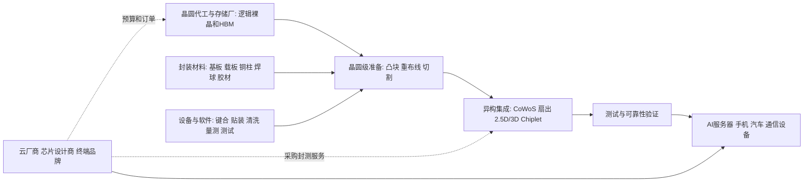

# 先进封装行业供需周期分析

分析日期：2026-07-18 01:44:32 +08:00
地理范围：全球先进封装与测试产业链，重点跟踪中国台湾、韩国、中国大陆、美国和东南亚；不把普通引线框架封装、芯片设计收入或整机销售额计作先进封装产出。
数据时效：行业设备预测采用 SEMI 2026-07-14 发布数据；公司经营采用 Amkor 2026Q1、TSMC 2026Q2 实际及公开技术/扩产资料；项目建设均明确为计划而非已投产能力。
行业边界：包括晶圆级封装、倒装、2.5D/3D 集成、CoWoS、扇出、Chiplet、HBM 组装、基板互连、测试、可靠性验证和封装服务；不包括裸晶圆制造、PCB 整机组装及终端服务器销售。
研究模式：完整深研

## 0. 一页看懂

**这个行业是做什么的**：先进封装把已经制造好的逻辑芯片、HBM 等存储芯片和高密度基板放到同一个封装内，以更短、更密的互连完成系统级功能；客户买到的不是“一个外壳”，而是通过测试、可靠性验证后可装进 AI 服务器、手机或汽车电子的芯片组件。云厂商、芯片设计商和终端品牌最终付费，直接购买服务并承担订单风险的是晶圆代工厂、IDM 与 OSAT 客户。

**一句话判断**：AI 加速器与 HBM 令先进封装成为前道晶圆制造与系统交付之间的关键瓶颈，行业正处于技术升级带动的扩产段；但产能公告到量产之间仍要跨越设备、材料、良率、客户认证和区域供应链五道门槛。

- 周期阶段：AI/HBM 驱动的有效产能扩张期
- 结论状态：暂定
- 置信度：中
- 最大缺口：缺少跨厂商、同口径的 CoWoS/面板级封装实际产能、稼动率、订单积压和单位价格月度序列。

**三个最重要的数字**：

| 数字 | 含义 | 为什么它最重要 | 证据 |
|---|---|---|---|
| 67 亿美元 | SEMI 对 2026 年组装与封装设备销售额预测 | 给出后道设备扩张的行业总量锚点 | E1 |
| 13.72 亿美元 | Amkor 2026Q1 先进产品净销售额 | 已兑现的封装服务收入，而非概念性技术路线 | E2 |
| 7.0 十亿美元 | Amkor 亚利桑那两期先进封装测试园区计划投资 | 显示区域化供应链的资本开支规模，但尚未量产 | E8 |

## 1. 产业链地图

### 1.1 全景图



裸晶、HBM、基板和设备是并行投入，不是线性替代关系。钱先由终端算力和电子产品预算形成芯片及封装订单，再沿晶圆厂、封测厂向材料和设备端传递；当前最容易卡住的是大尺寸互连、堆叠良率、热管理和客户认证的组合，而非单一“封装产能”。

### 1.2 环节详解

#### 1.2.1 晶圆级准备与互连基础

**它是干什么的**：在晶圆尚未切成单颗芯片时，做凸块、重布线和再布线层，把原本只能在芯片边缘连接的电路改造成能与 HBM、基板或其他 Chiplet 高密度对接的接口。

**向谁采购**：采购光刻胶、电镀化学品、铜、介电材料、晶圆级设备和量测服务

**卖给谁**：下游是晶圆代工厂、IDM 及封测厂的集成线。

**代表企业**：

| 公司 | 上市地/代码 | 在该环节的地位 | 为什么能代表该环节 | 证据 |
|---|---|---|---|---|
| TSMC | 纽交所/TSM；台交所/2330 | 代工与先进封装一体化服务商 | 年报列示 CoWoS、InFO、SoIC 与 COUPE 等技术组合 | E6 |
| ASE Technology Holding | 纽交所/ASX；台交所/3711 | 大型封测与异构集成服务商 | 310mm 面板级自动化线将覆盖 FOCoS、FOCoS-Bridge 路线 | E4 |
| Amkor | 纳斯达克/AMKR | 全球 OSAT 代表 | 先进产品收入占其 2026Q1 总营收的大头 | E2 |

**怎么赚钱、议价能力**：晶圆级工序按工艺复杂度、良率、面积和客户认证收费。可量产的细线宽重布线、翘曲控制和大尺寸基板协同具有更高转换成本；标准封装工序则更容易承受报价竞争。

**为什么会卡住**：先进封装的“产能”常被误读为厂房面积或设备台数。。

**进阶视角**：先进封装的“产能”常被误读为厂房面积或设备台数。面板更大并不自动等于可销售面积更多，真正决定有效产出的，是大面板翘曲、细线路一致性、载板匹配和客户芯片设计能否同时通过验证；ASE 的 310mm 线仍预计在 2027 年上半年进入生产，说明技术展示与量产收入之间存在明确时滞（E4）。

#### 1.2.2 2.5D/3D 集成与系统封装

**它是干什么的**：把 GPU/CPU、HBM、I/O 芯粒等多颗裸晶按二维或垂直方式连接，使它们像一个更大的系统协同工作，同时控制带宽、功耗、散热和信号完整性。

**向谁采购**：采购经过准备的裸晶、HBM、硅中介层/重构中介层、先进基板、键合设备和热材料

**卖给谁**：面向 AI 加速器、HPC、网络与高端移动芯片的设计公司、代工厂和系统厂交付封装后的器件。

**代表企业**：

| 公司 | 上市地/代码 | 在该环节的地位 | 为什么能代表该环节 | 证据 |
|---|---|---|---|---|
| TSMC | 纽交所/TSM；台交所/2330 | CoWoS、InFO 与 SoIC 的一体化平台 | 2025 年完成 5.5 倍光罩尺寸 CoWoS 方案认证，并计划在 2026 年量产 | E6 |
| ASE Technology Holding | 纽交所/ASX；台交所/3711 | FOCoS/Chiplet 与面板级封装路线参与者 | 新产线目标兼容 FOCoS 与 FOCoS-Bridge | E4 |
| Amkor | 纳斯达克/AMKR | OSAT 先进封装与系统级封装服务商 | 与 TSMC 签订十年合作框架，覆盖美国先进封装和测试能力 | E3 |

**怎么赚钱、议价能力**：价值来自系统设计协同、良率、工艺组合、交付节奏和测试可靠性。大客户在产品定义期就参与技术选择，认证完成后更换封装厂会牵涉裸晶、基板和测试重验证，因而高端服务的转换成本高于普通封装。

**为什么会卡住**：HBM 堆叠和 Chiplet 数量上升并非线性增加收入。。

**进阶视角**：HBM 堆叠和 Chiplet 数量上升并非线性增加收入。每多一层芯片和一条高密度互连，都提高了缺陷传播与热管理难度；因此“封装面积扩张”若没有良率改善，可能先放大报废与交期，而不是放大利润。SEMI 将更高器件复杂度、异构封装和可靠性要求列为后道设备持续增长的基础（E1）。

#### 1.2.3 测试、可靠性与区域化交付

**它是干什么的**：在封装前后执行晶圆探针、功能测试、老化、失效筛选和可靠性验证，确保复杂封装的每个芯粒及最终模块能在服务器、车载或通信场景中工作。

**向谁采购**：采购测试机、探针卡、自动化、热控与失效分析能力

**卖给谁**：向晶圆厂、设计公司和系统厂交付已测、已验证的封装器件。

**代表企业**：

| 公司 | 上市地/代码 | 在该环节的地位 | 为什么能代表该环节 | 证据 |
|---|---|---|---|---|
| Amkor | 纳斯达克/AMKR | 先进封装与测试 OSAT | 2026Q1 包装服务占净销售额 89%，测试服务占 11% | E2 |
| ASE Technology Holding | 纽交所/ASX；台交所/3711 | 封测与高阶测试基地扩张者 | 高雄新设施投资 178 亿新台币，目标补强先进封装与测试能力 | E5 |
| TSMC | 纽交所/TSM；台交所/2330 | 先进芯片制造与封装协同方 | 与 Amkor 的长期合作框架旨在形成从先进硅制造到测试封装的美国供应链 | E3 |

**怎么赚钱、议价能力**：测试按复杂度、测试时间、设备利用率和质量责任定价。AI/HBM 封装若失效，损失不只是单一裸晶，还会报废已集成的高价值组件；故稳定的测试覆盖与失效追溯能提高服务价值。

**为什么会卡住**：区域化项目是供应链韧性投资，不应直接读成短期供给释放。。

**进阶视角**：区域化项目是供应链韧性投资，不应直接读成短期供给释放。Amkor 的亚利桑那园区第一座制造设施计划 2027 年中完工、2028 年初生产，建设承诺与实际可交付封装服务至少相隔多个季度（E8）。

#### 1.2.4 基板、热界面材料与系统散热

**它是干什么的**：先进基板和热材料为多颗高价值裸晶提供电气连接、机械支撑与热传导，使封装后的器件能装入加速卡和服务器长期运行。

**向谁采购**：向树脂、铜箔、玻纤、陶瓷、散热金属和精密加工设备商采购低缺陷材料与制造能力。

**卖给谁**：向晶圆代工厂、OSAT、IDM、加速器设计商和服务器板卡厂交付经翘曲、可靠性与热循环验证的基板及热材料。

**代表企业**：

| 企业/机构 | 上市地/代码或属性 | 角色 | 代表性依据 | 证据 |
|---|---|---|---|---|
| ASE Technology | 台湾证券交易所 / 3711 | 异构集成和材料协同服务商 | 面板级路线披露了技术展示到量产的时滞 | E4 |
| Amkor | 纳斯达克 / AMKR | 全球OSAT与区域化封装投资者 | 先进产品收入和项目时间表均有原始披露 | E2 |

**怎么赚钱、议价能力**：基板与热材料按层数、线宽、尺寸、可靠性和供货一致性定价；进入客户封装设计后更换材料需重做验证，转换成本高于普通耗材。

**为什么会卡住**：大尺寸基板翘曲、细线一致性、热循环寿命和材料产能必须匹配封装良率，任何一项失配都会报废已经投入的高价值裸晶。

**进阶视角**：先进封装扩产不是只增加键合设备；若基板、散热和测试未同步，面积增长会放大报废而非收入，利润更可能集中于能共同设计并稳定交付的供应链组合（E1、E4）。

### 1.3 钱怎么流：利益传导

| 问题 | 回答 | 证据 | 缺口 |
|---|---|---|---|
| 谁最终付款？ | 云厂商、服务器和终端品牌通过采购 AI 芯片、系统与电子产品最终支付；设计公司、晶圆代工厂和 IDM 将预算转为封装/测试订单。 | E1、E3、E7 | 单个 AI 封装对应的最终客户和价格通常不公开。 |
| 利润当前集中在哪里，为什么？ | 可把 HBM、逻辑裸晶和高密度基板一起通过验证的 2.5D/3D 集成、关键互连及可靠性服务更可能留存利润，因为认证和良率门槛高。 | E1、E4、E6 | 无统一的各技术路线毛利率披露。 |
| 谁承担资本开支和库存风险？ | OSAT、代工厂和 IDM 承担工厂、设备、材料备货与稼动率风险；客户承担设计定版、需求变化及认证延期风险。 | E2、E5、E8 | 客户长期最低采购量与价格条款未披露。 |
| 谁有定价权，凭什么？ | 掌握已认证工艺、客户协同设计、良率数据库和区域交付网络的供应商更有议价能力；普通后段工序的议价更弱。 | E3、E4、E6 | 缺少公开 ASP 分品类时间序列。 |
| 谁重要但赚不到钱？ | 只拥有名义厂房或常规封装产能、却未形成先进工艺认证和客户订单的扩产项目，可能先承担折旧和爬坡成本。 | E4、E5、E8 | 项目级盈亏与客户利用率不公开。 |

谁最终付款：终端算力预算经芯片设计、代工与封装采购变成服务订单；AI 服务器的系统需求会影响封装量，但与某家 OSAT 当季收入之间存在设计定版、排产和验收时滞。

## 2. 需求：谁在买、为什么买

事实：

- SEMI 预计 2026 年组装与封装设备销售额为 67 亿美元、同比增 9.6%，2025 年该分项已增 20.8%；测试设备 2026 年预计增 31.0%至 153 亿美元（E1）。
- Amkor 2026Q1 录得净销售 16.85 亿美元、同比增 27%，其中先进产品销售 13.72 亿美元；管理层表示推进先进封装客户项目并改善工厂网络利用率（E2）。
- TSMC 2026Q2 实际净营收 402.0 亿美元，2026Q3 指引为 446 亿至 458 亿美元，提供先进逻辑及其配套封装的下游景气锚点，但不是先进封装收入本身（E7）。
- TSMC 与 Amkor 在 2026 年 6 月宣布十年合作框架，由 TSMC 采购 Amkor 的先进封装与测试服务以扩展美国能力；该协议说明需求及供应链协同方向，不披露金额或最低采购量（E3）。

| 终端用途 | 买方/预算所有者 | 购买动因 | 已兑现还是预期 | 可观察指标 | 证据 |
|---|---|---|---|---|---|
| AI训练与推理 | 云厂商、GPU/ASIC 设计商、代工厂 | HBM 带宽、芯粒互连、功耗和系统密度 | 部分兑现为设备预测与封测收入 | 测试/封装设备、先进产品收入、AI芯片投产 | E1、E2、E6 |
| 高性能计算与网络 | CPU、交换芯片及系统厂 | 大尺寸封装、信号完整性和散热 | 技术路线和项目扩产并存 | CoWoS/面板级产线进度、客户认证 | E4、E6 |
| 智能手机与消费电子 | 设计公司、终端品牌 | 小型化、功耗和集成度 | Amkor 通信终端占其2026Q1收入44% | 通信类封测收入、产品周期 | E2 |
| 汽车与工业 | IDM、Tier 1 和车企供应链 | 可靠性、封装体积和功能整合 | 相对平稳、认证时间更长 | 汽车/工业封测收入与可靠性要求 | E2 |

推断与假设：

- 推断：先进封装需求的增量主要来自 AI/HBM 所需的高密度集成和可靠性，而不是普通封装件数的简单复苏；SEMI 的后道设备预测、TSMC 的技术路线和 Amkor 的先进产品收入可相互支持该判断（E1、E2、E6）。
- 假设：若 AI 加速器和 HBM 的终端采购放慢，最先受影响的将是新增大尺寸/高端项目的排产和设备采购；反证是封装设备预测、长期合作和先进产品收入继续上修。

**进阶视角**：封测收入增长不等于所有先进封装路线都同样紧张。Amkor 的“先进产品”仍包含多种终端市场，且 Q1 通信收入占比高；把其公司级收入直接等同于 CoWoS 或 AI 封装需求会高估单一路线的景气（E2）。

## 3. 供给：现在有多少、真能用的有多少

| 环节/项目 | 公告产能 | 已安装 | 已验证/良率达标 | 有客户订单支撑 | 释放窗口 | 证据 | 缺口 |
|---|---:|---:|---:|---:|---|---|---|
| ASE 310mm 面板级线 | 未披露面积产能 | 自动化线已开发 | 需完成量产导入 | 面向 FOCoS/Bridge 平台 | 2027年上半年计划生产 | E4 | 未披露客户订单和良率。 |
| ASE 高雄新设施 | 投资178亿新台币 | 2026年开工 | 尚未投产 | 用于先进封装与测试能力 | 预计2028Q2完成 | E5 | 无公开产品结构和利用率。 |
| Amkor 亚利桑那园区 | 两期计划投资70亿美元 | 在建 | 尚未形成量产服务 | 支持Apple、NVIDIA等客户的项目表述 | 首座设施2027年中完工，2028年初生产 | E8 | 建设与订单兑现均有执行风险。 |
| TSMC 5.5倍光罩 CoWoS | 方案已认证 | 以公司内部产线推进 | 2025完成认证 | 为AI/HPC目标 | 2026年计划量产 | E6 | 未披露实际月产能与良率。 |
| Amkor 现有网络 | Q1先进产品销售13.72亿美元 | 多地工厂运营中 | 已形成客户项目交付 | 已确认季度收入 | 2026Q1已兑现 | E2 | 公司合并口径未拆具体封装平台。 |

事实：ASE 的 310mm×310mm 面板级自动化产线预计 2027 年上半年投入生产；其另一高雄扩建项目于 2026 年 3 月动工、预计 2028Q2 完成。Amkor 2026Q1 全年资本开支指引为约 25 亿至 30 亿美元，且亚利桑那先进封装园区仍处建设阶段（E2、E4、E5、E8）。

推断与假设：

- 推断：先进封装的有效供给受“认证/良率/材料/测试”串联限制，最先缺的往往是能与指定逻辑裸晶、HBM、基板同时匹配并稳定交付的工艺窗口，而非空置厂房。
- 假设：如果新增项目在设备装机后未能按计划完成翘曲、热循环和量产良率验证，名义扩产会滞后转化为收入；反证是项目投产后连续披露客户认证、利用率和先进产品收入上升。

**进阶视角**：区域化封装不是短期替代现有亚洲产能的开关。美国在建项目提高供应链弹性，但其建设期跨越 2027—2028，期间材料、人才、客户导入和前道晶圆配套都可能成为新的瓶颈；因此它更像中期供给选择权，而非当期供给（E3、E8）。

## 4. 供需矛盾与高频信号

核心矛盾：AI 系统需要更高密度的逻辑—HBM 集成，推动先进封装和测试投资；但大尺寸封装的良率、热管理、基板/材料协同与客户认证使供应释放慢于厂房公告，且普通封测与高阶封装不能互相替代。

| 信号 | 最新值/方向 | 数据期间 | 证据 | 解读 | 缺口 |
|---|---|---|---|---|---|
| 组装与封装设备销售 | 67亿美元，+9.6%预测 | 2026全年 | E1 | 后道设备仍扩张但增速低于测试设备 | 是预测，不是封装服务收入。 |
| 测试设备销售 | 153亿美元，+31.0%预测 | 2026全年 | E1 | 复杂AI/HBM器件提高测试投入 | 不等于每家OSAT订单。 |
| Amkor先进产品收入 | 13.72亿美元，较2025Q1增长 | 2026Q1 | E2 | 高阶封测收入已兑现 | 覆盖多终端和多技术。 |
| Amkor毛利率 | 14.2% | 2026Q1 | E2 | 收入增长并不自动对应毛利峰值 | 不能拆先进产品毛利。 |
| 面板级产线进度 | 计划进入生产 | 2027年上半年 | E4 | 新技术供给仍处导入窗口 | 未披露实际良率。 |

## 5. 周期位置与传导

传导链：

```text
[云算力与终端预算] -> [AI芯片和HBM订单] -> [晶圆制造与封装协同设计] -> [先进封装/测试排产] -> [良率和可靠性验证] -> [封测服务收入与毛利] -> [扩产与区域化项目] -> [有效产能释放]
```

| 阶段/日期 | 信号 | 利润池往哪移 | 关键时滞 | 证据 | 下一步验证 |
|---|---|---|---|---|---|
| 2023—2025 AI封装加速 | CoWoS、HBM和Chiplet成为重点技术 | 向高密度互连、先进基板与测试能力移动 | 产品定版至量产跨多个季度 | E1、E6 | 各平台的客户认证和量产。 |
| 2026 收入与设备兑现 | Amkor Q1收入和先进产品较强，后道设备继续预测增长 | 向已验证的集成与测试服务倾斜 | 订单到验收及收入确认 | E1、E2 | Q2结果、利用率和毛利。 |
| 2027—2028 新产能导入 | ASE、Amkor项目设定生产或完工窗口 | 可能从稀缺工艺向新增合格产能扩散 | 建设、装机和爬坡约1—2年或更长 | E4、E5、E8 | 量产、良率和客户订单。 |

当前阶段：

- 阶段：AI/HBM 驱动的有效产能扩张期。
- 进入时间/锚点：2025 年封装设备销售增长 20.8%，2026 年仍预计增长；2026Q1 Amkor 先进产品销售为 13.72 亿美元，构成需求兑现样本（E1、E2）。
- 预期切换条件：若先进产品收入、测试设备支出和已认证新线量产同步改善，扩张延续；若 AI 芯片订单递延、毛利率受利用率拖累且新线推迟，则进入项目消化阶段。
- 置信度：中
- 什么会证明这个判断错了：2026 年后道设备预测被显著下修，同时主要 OSAT 的先进产品收入、利用率和资本开支连续下降，或关键项目无法通过量产验证。

**进阶视角：与上一轮周期的对照**：2019—2022 年封测景气更多受手机、消费电子和库存周期影响，普通封装可较快扩产；2023—2026 年的差异在于 AI 封装把逻辑、HBM、基板和热管理绑定，质量问题可能在最后集成阶段暴露。因而本轮从设备安装到稳定量产的时滞更取决于认证和良率，不宜用旧周期的封测稼动率单独判断（E1、E4、E6）。

## 6. 资金动向

### 6.1 尝试的来源类型

| 尝试的来源类型 | 具体来源 | 结果 |
|---|---|---|
| 行业指数估值分位 | 费城半导体指数与封测相关指数公开入口 | 无法获得与“先进封装服务”边界一致、可审计的估值分位。 |
| 行业ETF份额/资金流 | 半导体 ETF 发行方的公开份额资料 | 覆盖设计、设备、代工等多个子行业，不能拆出先进封装净流。 |
| 北向/两融或同类资金流 | 交易所公开的个股与市场统计 | 口径为证券交易，不可形成全球封装服务的同口径资金流。 |
| 龙头股价与盈利的剪刀差 | Amkor IR 历史股价入口和 2026Q1 业绩 | 已取得盈利与营收，未建立同日可审计股价—盈利序列。 |

**已定价（推断）：**AI、HBM、Chiplet 与先进封装是广泛可见的产业叙事；SEMI 的后道设备预测、TSMC 的技术路线和 Amkor 的资本开支/合作公告均使“先进封装要扩产”成为公开共识（E1、E3、E6、E8）。

**未定价（推断）：**各技术路线的实际良率、面板级量产速度、区域化项目的客户爬坡与合同兑现，以及新增产能会否压低服务利润，缺少公开的统一订单与估值序列，不能判断是否已充分反映。

判断依据与不确定性：以上是产业事实与叙事密度的映射，不是估值测量；证券价格还受市场风险偏好、汇率、利率与公司资本结构影响。

## 7. 未来资金可能流向

> 本节为周期传导的情景推演，不构成任何买卖建议、目标价或个股推荐。

| 情景 | 触发条件 | 利润池往哪个环节移动 | 先受益的环节 | 后受益/受损的环节 | 需要盯的证据 |
|---|---|---|---|---|---|
| 基准 | AI芯片需求与后道设备预测按当前轨迹兑现 | 向已认证的2.5D/3D集成、HBM互连和测试服务集中 | 现有量产平台与关键材料/测试服务 | 新建厂在爬坡后才受益 | Amkor先进产品收入、SEMI预测、新线进度。 |
| 上行 | HBM和大尺寸AI加速器需求继续上修，良率改善 | 向高密度互连、面板级工艺和区域化测试扩散 | 通过客户认证的CoWoS/Chiplet与高端测试 | 基板、设备和新线随后受益 | 客户项目、设备交付、利用率和扩产指引。 |
| 下行 | AI系统采购延后或新线良率爬坡慢 | 向已安装产线维护和常规高可靠性服务收缩 | 有稳定客户与低新增资本开支的服务 | 重资本新建项目、未认证产线受压 | 资本开支下修、延迟投产、毛利率和订单变化。 |

推演逻辑：认证通过的高端封装线先承接订单，因为客户不愿在产品量产期切换工艺；新厂、设备和材料则要等设计导入、良率稳定与稼动率提升后才转化为利润。需求下行时，最先消失的是尚未验证的新项目，而存量测试和维护的下降往往更慢。

## 8. 分歧与反证

主流叙事 vs 本报告：

| 市场主流叙事 | 本报告判断 | 分歧在哪 | 谁的证据更硬 | 证据 |
|---|---|---|---|---|
| “AI需求强，所有封测厂都会同幅受益” | 高端异构集成更强，但普通封测与不同平台分化明显 | 公司总收入不能代替单一先进平台订单 | Amkor分产品、SEMI设备分项和项目时点更直接 | E1、E2、E4 |
| “宣布扩产就表示短缺很快缓解” | 建设、设备、认证和良率决定真实释放速度 | 名义投资与可交付服务不同 | ASE/Amkor公开投产窗口更硬 | E4、E5、E8 |
| “先进封装只是前道产能的附属品” | 封装同时决定系统互连、热、可靠性和可交付性，可独立成为瓶颈 | 晶圆制造完成不等于系统可交付 | TSMC技术路线与合作框架直接体现协同 | E3、E6 |

冲突证据：

| 议题 | 支持证据 | 反对证据 | 口径差异 | 处理 |
|---|---|---|---|---|
| 行业收入是否已全面改善 | Amkor Q1 总营收同比+27%、先进产品13.72亿美元 | Q1毛利率14.2%低于Q4的16.7% | 季节性、终端组合和产品复杂度不同 | 不把收入增长外推为利润已全面改善。 |
| 新产能能否很快缓解瓶颈 | 多个项目已公布建设和生产时间 | 多数项目仍处建设或导入，不披露良率 | 厂房完工、设备安装与量产不同 | 只按已投产/已认证能力判断。 |
| 美国区域化供应链是否已形成 | TSMC—Amkor十年合作框架已签订 | 园区尚未量产，金额和最低量未披露 | 协议与实际服务收入不同 | 标为中期选项，不计入当前供给。 |

## 9. 观察哨与跟踪

### 9.1 可比时间序列

| 日期 | 指标 | 数值 | 单位 | 来源 | 含义 |
|---|---|---:|---|---|---|
| 2025Q1 | Amkor先进产品净销售额 | 1.064 | 十亿美元 | E2 | 同口径先进产品收入基线。 |
| 2026Q1 | Amkor先进产品净销售额 | 1.372 | 十亿美元 | E2 | 先进产品收入同比上升，但仍含多类先进封测终端。 |

### 9.2 观察框架

| 指标 | 基线 | 来源 | 频率 | 正向触发 | 反证触发 |
|---|---|---|---|---|---|
| 组装与封装设备销售预测 | SEMI 2026预测 | SEMI E1 | 半年/年度 | 预测继续上调 | 预测下修或增长转负。 |
| Amkor先进产品净销售额 | 2026Q1已披露 | Amkor E2 | 季度 | 同口径收入持续增长 | 收入连续下滑。 |
| Amkor毛利率 | 2026Q1已披露 | Amkor E2 | 季度 | 毛利与利用率同步改善 | 收入增长但毛利继续走弱。 |
| 面板级封装量产进度 | ASE计划于2027年上半年生产 | ASE E4 | 事件驱动 | 完成客户验证并进入量产 | 计划延后或良率问题披露。 |
| 亚利桑那封装园区进度 | 首座设施计划2027年中完工 | Amkor E8 | 事件驱动 | 按期完成并披露客户导入 | 延期、成本上升或订单不足。 |

## 10. 术语表

| 术语 | 人话解释 |
|---|---|
| OSAT | 外包半导体封装测试厂，为芯片公司提供封装、测试和可靠性服务。 |
| HBM | 高带宽存储器，把多层存储芯片堆叠，给 AI 加速器提供很高的数据带宽。 |
| Chiplet | 芯粒，把大芯片拆成多个功能小芯片，再通过先进封装组合。 |
| CoWoS | Chip-on-Wafer-on-Substrate，先在晶圆级把多颗芯片集成，再装到基板上的 2.5D 封装方案。 |
| FOCoS | Fan-Out Chip-on-Substrate，扇出型芯片到基板封装技术。 |
| RDL | 重布线层，用额外金属连线把芯片连接点重新引到更适合封装的位置。 |
| 翘曲 | 封装在受热或受力后发生弯曲，过大时会导致对位和可靠性问题。 |

## 附录A 证据台账

| 证据ID | 结论 | 类型 | 发布方 | 发布日期 | 访问日期 | 数据期间 | 地域/单位 | 原文链接/定位 | 已打开 | 时效 | 局限 |
|---|---|---|---|---|---|---|---|---|---|---|---|
| E1 | 后道测试与封装设备的2025实际和2026—2028预测 | 预测/事实 | SEMI | 2026-07-14 | 2026-07-18 | 2025—2028 | 全球/美元 | https://www.semi.org/en/semi-press-release/global-semiconductor-equipment-sales-forecast-to-reach-a-record-229-billion-dollars-in-2028-semi-reports | 是 | 当前 | 设备销售并非封装服务收入或产能利用率。 |
| E2 | Amkor Q1 2026收入、先进产品、毛利率、指引和资本开支 | 事实/指引 | Amkor | 2026-04-27 | 2026-07-18 | 2025Q1—2026Q2指引 | 全球/美元 | https://ir.amkor.com/news-releases/news-release-details/amkor-technology-reports-financial-results-first-quarter-2026 | 是 | 当前 | 公司先进产品口径包含多终端和多种封测技术。 |
| E3 | TSMC与Amkor十年美国先进封装测试合作框架 | 协议/计划 | TSMC与Amkor | 2026-06-16 | 2026-07-18 | 长期 | 美国/服务能力 | https://ir.amkor.com/news-releases/news-release-details/tsmc-and-amkor-technology-announce-long-term-partnership | 是 | 当前 | 未披露交易金额、最低采购量和实际产能。 |
| E4 | ASE 310mm自动化面板级线及预计投产时间 | 计划/技术 | ASE | 2026-05-26 | 2026-07-18 | 2026—2027 | 中国台湾/生产线 | https://www.aseglobal.com/press-room/310x310/ | 是 | 当前 | 产线开发不等于客户认证后的量产收入。 |
| E5 | ASE高雄新设施投资、开工及预计完工时间 | 计划 | ASE | 2026-03-11 | 2026-07-18 | 2026—2028 | 中国台湾/新台币 | https://www.aseglobal.com/press-room/ase-breaks-ground-on-new-high-tech-facility-in-kaohsiung/ | 是 | 当前 | 未给出按封装路线拆分的实际月产能。 |
| E6 | TSMC先进封装技术和5.5倍光罩CoWoS认证/量产计划 | 事实/计划 | TSMC | 2026-05 | 2026-07-18 | 2025—2026 | 全球/技术路线 | https://investor.tsmc.com/static/annualReports/2025/english/index.html | 是 | 当前 | 年报路线图不披露CoWoS实际稼动和价格。 |
| E7 | TSMC 2026Q2实际营收和Q3指引 | 事实/指引 | TSMC | 2026-07 | 2026-07-18 | 2026Q2/Q3 | 全球/美元 | https://investor.tsmc.com/english/quarterly-results/2026/q2 | 是 | 当前 | 代工收入不能直接拆为先进封装需求。 |
| E8 | Amkor亚利桑那先进封装测试园区投资和生产窗口 | 计划 | Amkor | 2025-10-06 | 2026-07-18 | 2027—2028计划 | 美国/美元 | https://ir.amkor.com/news-releases/news-release-details/amkor-technology-breaks-ground-new-semiconductor-advanced | 是 | 当前 | 项目建设、成本与客户导入均有不确定性。 |

## 附录B 数据时效与证据覆盖

| 指标 | 期间 | 状态 | 发布日期 | 访问日期 | 时效 | 来源 | 定位 | 局限 |
|---|---|---|---|---|---|---|---|---|
| 后道设备销售 | 2025—2028 | 实际/预测 | 2026-07-14 | 2026-07-18 | 当前 | E1 | SEMI设备预测 | 不能替代服务端订单。 |
| Amkor经营与资本开支 | 2026Q1/Q2指引 | 实际/指引 | 2026-04-27 | 2026-07-18 | 当前 | E2 | 公司季报 | 不拆全部技术路线。 |
| TSMC先进封装路线 | 2025—2026 | 事实/计划 | 2026-05 | 2026-07-18 | 当前 | E6 | 2025年报 | 实际产能和良率不披露。 |
| TSMC客户景气 | 2026Q2/Q3 | 实际/指引 | 2026-07 | 2026-07-18 | 当前 | E7 | 季度结果 | 非封装单独财务口径。 |
| 区域化扩产 | 2026—2028 | 计划 | 2025-10至2026-06 | 2026-07-18 | 当前 | E3、E4、E5、E8 | 公司项目公告 | 多数尚未进入量产。 |

发布状态说明：已发布的是 SEMI 行业设备预测、Amkor 2026Q1 经营、TSMC 2026Q2 结果及项目公告；尚未发布的是 2026 年各先进封装平台的统一实际产能、价格、良率、订单积压和全年服务收入。建设与认证计划不视为已释放供给。

## 附录C 证据就绪度与研究执行记录

| 证据轨道 | 状态 | 已打开可靠来源数 | 最低要求 | 证据/缺口 |
|---|---:|---:|---:|---|
| 产业链 | Ready | 4 | 2 | TSMC、ASE、Amkor与SEMI覆盖集成、材料/设备和测试。 |
| 需求 | Ready | 3 | 3 | 后道设备预测、Amkor实绩和TSMC下游经营。 |
| 供给与有效产能 | Ready | 4 | 3 | ASE/Amkor项目、TSMC认证和现有网络。 |
| 价格/订单/库存/利润 | Ready | 3 | 3 | Amkor收入、毛利、资本开支和长期合作资料。 |
| 资本市场预期 | Gap | 2 | 2 | 已尝试指数、ETF、交易统计和龙头IR，缺少可比估值/资金流序列。 |

| 子任务 | 检索轮次 | 实际使用的路径 | 证据 | 状态 | 缺口/回退 |
|---|---:|---|---|---|---|
| 行业总量与后道设备 | 1 | SEMI原始新闻稿 | E1 | 完成 | 无分平台服务价格。 |
| 封测经营与利润 | 1 | Amkor原始季报页 | E2 | 完成 | 无全行业可比毛利率。 |
| 工艺/量产与技术分歧 | 2 | TSMC年报、ASE原始公告 | E4、E5、E6 | 完成 | 未取得逐厂良率。 |
| 区域供应链与客户协同 | 1 | TSMC—Amkor联合公告、项目公告 | E3、E8 | 完成 | 合同金额和最低量未公开。 |
| 资本市场映射 | 1 | 指数、ETF、交易统计及公司IR入口 | 第6节 | 缺口 | 无行业边界一致的估值与资金流。 |

事实、推断、假设分层：

- 事实：E1 为协会预测/历史，E2 和 E7 为公司实际及指引，E3—E6、E8 为已公开协议、技术认证或项目计划。
- 推断：有效产能仍受良率和认证制约，来自后道设备投资、已兑现服务收入与项目时点的共同观察。
- 假设：AI/HBM 订单、材料协同和良率决定下一阶段；若资本开支或先进产品收入下修，当前阶段判断需要重估。

## 尾注

- 供需缺口 ≠ 股价上涨。
- 方向正确 ≠ 时点正确。
- 盈利兑现 ≠ 股价继续上涨。
- AI 回答和搜索摘要不是事实。
- 过期数据不是当前事实。
